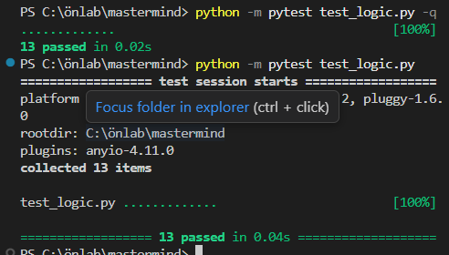

# Mastermind Esettanulmány

## Bevezetés
Ebben a projektben egy klasszikus Mastermind játék motorját készítettem el. A célom az volt, hogy megtanuljam a **TDD (Test-Driven Development)** folyamatát AI (GitHub Copilot) támogatással.

## Fejlesztési módszertan
A fejlesztés során nem a kódot írtam meg először, hanem a teszteseteket a `pytest` keretrendszerben.

### Tesztek típusai:
* **Hibaágak:** Érvénytelen színek és rossz tipp-hossz kezelése.
* **Logikai ágak:** Fekete és fehér tüskék számolása, különös tekintettel a duplikált színekre.

## Algoritmus leírása
A `tipp_kiszamolasa` függvény két lépésben dolgozik:
1. Megkeresi a pontos egyezéseket (fekete tüskék).
2. A maradék színekből kiszámolja a benne lévő, de rossz helyen lévő színeket (fehér tüskék).

## Érdekes Promptok

A fejlesztés során az AI-t két lépcsőben irányítottam. Először megadtam neki a teljes tesztkészletet, hogy az alapján generálja le a logikát:

> "Szia! Kérlek, írd meg a `logic.py` tartalmát a `test_logic.py`-ban található tesztjeim alapján. A feladat a `tipp_kiszamolasa(felallas, tipp, szinek)` függvény megírása. Fontos, hogy a kód minden tesztesetnek megfeleljen."

Később, amikor az AI túl bonyolult algoritmust (felesleges feltételeket) próbált bevezetni, szükség volt egy pontosító, visszaterelő utasításra:

> "Térjünk vissza az alapokhoz: először egy ciklussal számoljuk össze az összes pontos egyezést, majd a maradékból határozzuk meg a rossz helyen lévő színeket. Ne bonyolítsd túl a logikát!"

## Eredmények
A tesztek lefuttatása után az alábbi eredményt kaptam:

Aztán kértem egy konzolon tesztelhető felületett is az AI-tól:
