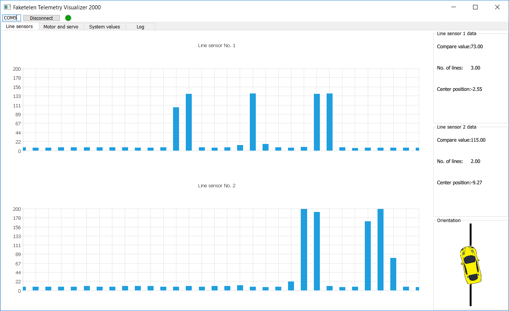

# Faketelen Taxi csapat tapasztalai

Ez a snippet csapatunk által összegyűjtött tapasztalatokat hivatott bemutatni, melyek másoknak a későbbiekben segítséget jelenthetnek.

## 1) Vonalszenzor értékek megjelenítése

A vonalszenzorok adatainak megjelenítésére ChartView-t használtunk QML-ben.  Azért esett a választásunk emellett, mert az ebben 
található BarSeries függvénnyel könnyen megjeleníthető a kétszer 32 érték 1-1 oszlop diagramon. Ehhez szükséges a QtCharts 2.2 
importálása. Az adatokat QmLSetContextProperty-vel küldjük a Cpp oldalról 1-1 32 hosszú QList-et küldve. Ennek a megjelenítésével 
azonban vannak problémák. A folyamatos frissítésre a QML oldalon egy Timert használtunk, amely 10ms-enként frissül és hívja egy általunk 
megírta redraw() függvények. Véleményünk szerint ez egy igen egyszerű megoldás és elég gyors ahhoz, hogy folyamatosnak látszódjon. Az 
adatok frissítését a redraw() függvények végzik, azonban a BarSeries-re való felfűzés nem úgy működik, mint ahogy először arra számítani 
lehetne. Hiába adtunk át jól az értéket egy QML oldali tömbnek, felfűzésnél nem fűzi fel normálisan az értékeket (0-al tölti fel), ez 
azért volt furcsa mivel ha kézzel beírjuk egyesével a tömb elemeit, és az append argumentumában csinálunk belőle tömböt akkor normálisan 
működik. Végül hosszas keresgélés és beleölt órák után arra jutottunk, hogy igaz nem a legelegánsabb megoldás, de működés szempontjából 
az elvárt eredményt adja. Feltöltés előtt érdemes clearelni az adott BarSeries-t , enélkül, egy  új BarSet-et adna hozzá a ChartViewhoz.

## 2) QML

Érdemes már az elején megfelelően struktúrálni a QML fájlokat, mivel igen hamar megtudnak szaladni a méretük több száz sorra.  A
projektünkben mi TabView-t használtunk és négy különböző Tab-ból ált össze a GUI, így kézenfekvő volt, hogy tabonként bontsuk szét a QML
kódot (Így is 300-500 sor lett fülönként, struktúrálás nélkül ez már az átláthatatlan kategória). Használata rendkívül egyszerű a 
QtQuick.Controls 1.4 importálását igényli. Azonban egy probléma van vele, csak az ELSŐ tabot példányosítja! A többi tabot kézzel kell a 
TabViewból a findChild metódussal (mivel ez megkeresi őket). E nélkül nem lehet a bennük található objektumokat elérni, ez különösen 
nagy probléma volt amikor a vonalszámot akartuk az idő függvényében logolni és grafikusan megjeleníteni egy Canvason. Mivel nem volt 
példányosítva az adott tab, nem lehetett elérni a Canvas requestPaint() slotját, e nélkül pedig nem tudtuk frissíteni a rajzoló 
felületet. Sok órát töltöttünk el mire rájöttünk, hogy nem a függvényeinkkel van baj, hanem a Cpp oldalról egyszerűen nem találja a 
rajzoló objektumunkat.



## 3) Build/clean

QMLben történő módosításokat követően, a sima Run-ra nem mindig érzékelte a változtatásokat. Előfordult, hogy sima Build-et követően 
sem, ez a jelenség nem mindig fordult elő, azonban a sokadik ilyen után inkább a biztosra menve fordítottunk, Clean - > Build, Ha 
cleaneltünk és aztán fordítottunk akkor minden esetben működtek a változtatások. Ezzel az egyetlen probléma, hogy sokáig tart, főleg ha 
már a fejlesztés végén jártok (ha tesztek képeket/gifeket a GUI-ba akkor érdemes azokat kikapcsolni a fejlesztés idejére, hatványozottan 
megnő a fordítási idő).

## 4) Qmake

Ha a Signal/slot mechanizmust tervezitek használni (amit ugye kötelező  ) szükséges, hogy az osztályokat QObjectből származtassátok, ez 
memória kezelési szempontjából is célszerű.  Ebből ne felejtsétek el a Q_OBJECT makrót. Sikerült belefutnunk egy érdekes bugba, 
miszerint a build konfigurációban hozzáadtuk, hogy build előtt futassa a qmake-et.  Azonban amikor új osztályt hoztunk létre, az első 
buildet követően külön le kellet futatnunk a qmake-et.

## 5) Timerek


A signal/slot mechanizmusnak egy igen egyszerű formája és a periodikus adat lekérdezést nagyban megkönnyíti. Azonban ha nagyobb 
mennyiségű adatot krédeztek le Bluetoothon és külditek le a QML oldalra, érdemes letiltani addig a Timer interruptját, mivel 
beleszakíthat az adatküldésbe, ha túl gyorsra állítjátok be.

## 6) Dokumentáció

A Doxygennel történő dokumentálásnak alapvető követelménye a jól kommentezett kód, ezt érdemes menet közben megcsinálni, amint 
létrehozol egy új osztály/metódus. Sok időt lehet vele megspórolni.

## 7) Rendszerterv készítése, feladatok felosztása

Miután sikerült megismerkedni a Qt-val és annak mechanizmusaival, érdemes 2-3 órát rászánni egy jól dokumentált rendszerterv 
kidolgozása. A későbbiekben ha előre megbeszélitek milyen osztályokat akartok létrehozni, milyen paraméterekkel, hogyan kommunikáljanak 
egymással, valamint a robottal. 

A feladatokat osszátok fel egymás között, legyen mindenkinek valami amivel specifikusan ő foglalkozik, azonfelül, hogy az alkalmazást 
fejlesztitek. Nekünk jól bevált az, hogy az alábbi felosztást alkalmaztuk:  QML/Robot oldali kommunikáció/Cpp oldali kommunikáció , 
persze mindenki foglalkozott mindennel a végén, de az elindulásban ez sokat segített. 


Itt egy példa a bejegyzésekre:

```html
<RCC>
    <qresource prefix="/">
		<file>images/breakpedal.png</file>
        <file>images/breakpedal_active.png</file>
        <file>images/key.png</file>
        <file>images/key_active.png</file>
    </qresource>
</RCC>
```
