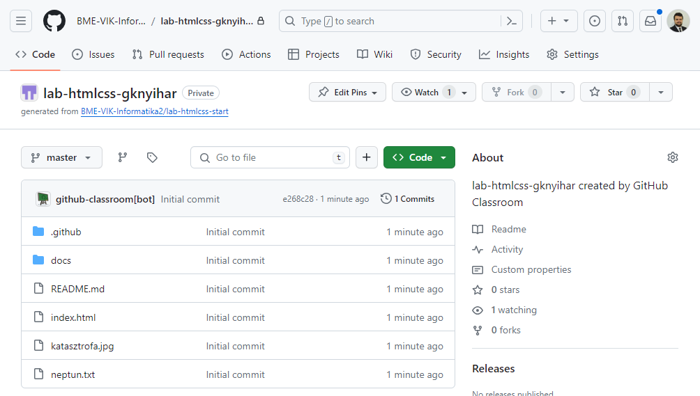

# Info2 feladatok beadása (2024)

> **Fontos**:
> Az utóbbi félévekben több változás is történt laborok beadásának tekintetében, így a korábbi leírások már nem minden esetben érvényesek.

Minden feladat beadásához (labor, házi feladat, zh) a **GitHub** platformot használjuk. Minden labor beadása egy-egy GitHub repository-ban történik, melyet a Moodle-ben található linken keresztül fogtok megkapni. A feladatok megoldását ezen repository-ban kell majd elkészíteni, és ide kell feltölteni. A kész megoldás beadása a repository-ba való feltöltés után egy un. **pull request** formájában történik, amelyet mindig a saját laborvezetőtökhöz kell rendelnetek. Ez a snippet, ennek a folyamatnak a részletes leírását tartalmazza.

**Fontos:** Az itt leírt formai előírások betartása elvárás. A nem ilyen formában beadott megoldásokat nem értékeljük.

## Előkészületek

Első lépésként, ha még nincs ilyenetek, [regisztráljatok](https://github.com/join) magatoknak egy GitHub felhasználót.

A hatékony munkavégzés érdekében ismerkedjünk meg a git alapvető működésével és az alapfogalmakkal, melyhez számos leírás található a [git](/snippets/index.html#git) címke alatt.

## Repository létrehozása 

Minden héten az aktuális feladathoz egy meghívó url-t fogtok kapni a Moodle-ben. A meghívás elfogadásával létre fog jönni a saját repository-tok amiben a megoldásokat kell elkészíteni. Az url minden laborhoz más lesz.

1. Keressük meg a Moodle kurzus oldalán a laborhoz tartozó **meghívó url-t**, és nyissuk meg.

1. Ha kéri, adjunk engedélyt a **GitHub Classroom** alkalmazásnak, hogy használja az account adataidat. 


1. Látni fogunk egy oldalt, ahol elfogadhatjuk a feladatot (`Accept the assignment`). Kattintsunk a gombra.


1. Várjuk meg, amíg elkészül a repository. A repository linkjét itt fogjuk megkapni.


1. Nyissuk meg a repository-t a webes felületen a linkre kattintva.



> A repository privát, vagyis csak te és az oktatók látják a tartalmát.

## Repository klónozása

Annak érdekében, hogy a repository-n dolgozni tudjuk, szükségünk van egy lokális verzióra, amit klónozással fogunk létrehozni. A git alapvetően egy parancssoros alkalmazás, vagyis minden műveletet a parancssorba gépelt utasításokkal tudunk végrehajtani. Viszont annak érdekében, hogy ne kelljen különböző utasításokat ismerni, számos vizuális git kliens program készült már. Ha már van kedvencünk, akkor nyugodtan használjuk azt, mivel bármelyikkel el tudjuk végezni a feladatot. Ha még nem ismerünk ilyet, akkor kövessük az alábbi útmutatót, ahol a Git Extensions programot mutatjuk be. Minden egyes lépéshez kiírjuk a parancssoros megfelelőjét is az utasításnak.

> Ha saját gépen dolgozunk, szükségünk lesz a [Git](https://git-scm.com/download/win) valamint a [Git Extensions](https://gitextensions.github.io/) szoftverre.

1. Másoljuk ki a repository linkjét.

    

1. Nyissuk meg a Git Extensions programot.

1. Első használatkor, vagy a labor kezdetén állítsuk be a nevünket és az email címünket:
    - Válasszuk a `Tools` > `Settings` menüt.
    - Navigáljunk el a `Git` > `Config` almenübe a bal oldalon található fában.
    - Adjuk meg a nevünket és az email címünket, amivel regisztráltunk a GitHub-ra.

    

    **Parancssorban**

    ```bash
    git config user.name "nev"
    git config user.email "nev@email.hu"
    ```

    Ha saját gépen dolgozunk, használhatjuk a global kapcsolót is, ekkor nem kell minden alkalommal megcsinálni.

    ```bash
    git config --global user.name "nev"
    git config --global user.email "nev@email.hu"
    ```

1. Klónozzuk le a repositoryt.
    - Válasszuk a ˙Clone repository` opciót.
    - A `Repository to clone`-hoz adjuk meg a linket amit kimásoltunk.
    - A `Destionation`-nek adjuk meg, hol szeretnénk létrehozni a lokális másolatot.
    - Menjünk a `Clone` gombra, majd `OK` és `Igen`

    

    - Abban az esetben, ha authentikációt kér a program, adjuk meg a felhasználónevünket és egy **personal access token**-t.

    > **Fontos**: 2021 óta a GitHub nem fogad el jelszót az egyes műveletek authentikálásához, emiatt szükségünk lesz egy **Personal Access Token**-re, és mindenhol ezt kell majd használnuk a jelszó helyett.
    > 
    > Tokent a következő módon lehet generálni:
    > - Látogassunk el a [https://github.com/settings/tokens](https://github.com/settings/tokens) oldalra.
    > - Válasszuk a `Generate new token` > `Generate new token (classic)` opciót.
    > - Adjunk meg egy leírást a `Note` mezőbe.
    > - Adjuk meg, hogy mikor járjon le a token az `Expiration` mezőbe. Ha saját gépen dolgozunk, akkor választhatunk hosszú időtartamot, mivel a kliens meg fogja jegyezeni. Laborgépeken érdemes minél rövidebb időt kiválasztani, hogy elkerüljük, hogy valaki illetéktelen hozzáférjen a fiókunkhoz.
    > - A `Scope`-nál pipáljuk be a `repo`-t.
    > 
    > 
    >
    > - Menjünk a `Generate token` gombra a lap alján.
    > - **Másoljuk ki** a kapott tokent és **mentsük el** valahova, mert többet nem lesz lehetőségünk megnézni.
    > - Minden alkalommal, amikor a git kliens jelszót kér, a tokent kell megadni.

    

    **Parancssorban**

    ```bash
    cd <mappa, ahova szeretnék klónozni>
    git clone <repository url>
    ```

## Új branch létrehozása és Neptun kód megadása

Klónozás után a kiindulási kódunk a master branchen található, ahol még semmilyen nyoma nincs a labor megoldásnak. A beadás során a laborvezető mindig a te munkádara lesz kíváncsi, ezért a beadott megoldást mindig a kiindulási alappal fogja összehasonlítani és a változásokat értékelni. Ennek érdekében a kiindulási alapot meg kell tartanunk abban az állapotban, amiben van, vagyis a **master** branchre ne kommitolj soha! Helyette létrehozunk egy új ágat (branch) és azon fogunk dolgozni, majd pedig a pull requestet adunk be, ami pontosan ezt a két ágat fogja összehasonlítani.

1. Hozzunk létre egy új branchet.
    - Válasszuk a `Commands` > `Create branch...` menüpontot.
    - Adjunk meg egy nevet az új branchnek. Bármilyen neved adhatunk, de az egységesség kedvéért legyen `megoldas`.
    - Figyeljünk rá, hogy a branch nevében ne legyen ékezet.
    - Menjünk a `Create branch` gombra, majd `OK`.

    

    **Parancssorban**

    ```bash
    git checkout -b <branch név>
    ```

1. Nyissuk meg a repositoryt és töltsük ki a `neptun.txt` fájlt.
    - A fájlt a repository gyökerében találjuk.
    - Ne írjunk semmi mást a fájlba, csakis a Neptun kódunk 6 karakterét.

1. Kommitoljuk a változtatást.
    - Ellenőrizzük, hogy a megfelelő branchen vagyunk, majd menjünk a `Commit` gombra. A szám a felifat mellett a változtatások számát jelenti.

    

    - Válasszuk ki a változtatásokat, amiket szeretnénk menteni és vigyük le a `Stage` / `Stage all` gombokkal.
    - Adjunk meg egy üzenetet, hogy mit tartalmaz a kommit.
    - Menjünk a `Commit` gombra, majd `OK`.

    

    **Parancssorban**

    ```bash
    git status # változások lekérése

    git add <fájlnév> # adott fájl stagelése
    git add -A # összes fájl stagelése

    git commit -m <kommit üzenet> # stagelt változtatások kommitolása
    ```

## Megoldások elkészítése

Ezután következik a megoldások elkészítése. Ennek során figyelj a következőkre:

- Gyakran, de legalább minden feladat után kommitolj.
- Figyelj rá, hogy mindig jó branchen legyél, valamint hogy azokat a módosításokat mented el, amiket kér a feladat. 
- Kommit üzenetnél nem számít, hogy magyarul vagy angolul írod, de mindig értelmes üzenetet adj meg ami tükrözi, hogy mit tartalmaz a változtatás.


