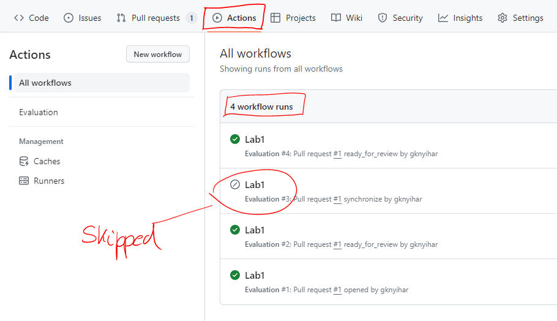

> Az utóbbi félévekben több változás is történt laborok beadásának tekintetében, így a korábbi leírások már nem minden esetben érvényesek.

# Info2 feladatok beadása (2024)

Minden feladat beadásához (labor, házi feladat, zh) a **GitHub** platformot használjuk. Minden labor beadása egy-egy GitHub repository-ban történik, melyet a Moodle-ben található linken keresztül fogtok megkapni. A feladatok megoldását ezen repository-ban kell majd elkészíteni, és ide kell feltölteni. A kész megoldás beadása a repository-ba való feltöltés után egy un. **pull request** formájában történik, amelyet mindig a saját laborvezetőtökhöz kell rendelnetek. Ez a snippet, ennek a folyamatnak a részletes leírását tartalmazza.

> **Fontos**: 
> Az itt leírt formai előírások betartása elvárás. A nem ilyen formában beadott megoldásokat nem értékeljük.

## Előkészületek

Első lépésként, ha még nincs ilyenetek, [regisztráljatok](https://github.com/join) magatoknak egy GitHub felhasználót.

A hatékony munkavégzés érdekében ismerkedjünk meg a git alapvető működésével és az alapfogalmakkal, melyhez számos leírás található a [git](/snippets/index.html#git) címke alatt.

## Repository létrehozása 

Minden héten az aktuális feladathoz egy meghívó url-t fogtok kapni a Moodle-ben. A meghívás elfogadásával létre fog jönni a saját repository-tok amiben a megoldásokat kell elkészíteni. Az url minden laborhoz más lesz.

1. Keressük meg a Moodle kurzus oldalán a laborhoz tartozó **meghívó url-t**, és nyissuk meg.

1. Ha kéri, adjunk engedélyt a **GitHub Classroom** alkalmazásnak, hogy használja az account adataidat. 


1. Látni fogunk egy oldalt, ahol elfogadhatjuk a feladatot (`Accept the assignment`). Kattintsunk a gombra.


1. Várjuk meg, amíg elkészül a repository. A repository linkjét itt fogjuk megkapni.


1. Nyissuk meg a repository-t a webes felületen a linkre kattintva.


> A repository privát, vagyis csak te és az oktatók látják a tartalmát.

## Repository letöltése

Annak érdekében, hogy a repository-n dolgozni tudjuk, szükségünk van egy lokális verzióra, amit klónozással fogunk létrehozni. A git alapvetően egy parancssoros alkalmazás, vagyis minden műveletet a parancssorba gépelt utasításokkal tudunk végrehajtani. Viszont annak érdekében, hogy ne kelljen különböző utasításokat ismerni, számos vizuális git kliens program készült már. Ha már van kedvencünk, akkor nyugodtan használjuk azt, mivel bármelyikkel el tudjuk végezni a feladatot. Ha még nem ismerünk ilyet, akkor kövessük az alábbi útmutatót, ahol a Git Extensions programot mutatjuk be. Minden egyes lépéshez kiírjuk a parancssoros megfelelőjét is az utasításnak.

> Ha saját gépen dolgozunk, szükségünk lesz a [Git](https://git-scm.com/download/win) valamint a [Git Extensions](https://gitextensions.github.io/) szoftverre.

1. Másoljuk ki a repository linkjét.

    

1. Nyissuk meg a Git Extensions programot.

1. Első használatkor, vagy a labor kezdetén állítsuk be a nevünket és az email címünket:
    - Válasszuk a `Tools` > `Settings` menüt.
    - Navigáljunk el a `Git` > `Config` almenübe a bal oldalon található fában.
    - Adjuk meg a nevünket és az email címünket, amivel regisztráltunk a GitHub-ra.

    

    **Parancssorban**

    ```bash
    git config user.name "nev"
    git config user.email "nev@email.hu"
    ```

    Ha saját gépen dolgozunk, használhatjuk a global kapcsolót is, ekkor nem kell minden alkalommal megcsinálni.

    ```bash
    git config --global user.name "nev"
    git config --global user.email "nev@email.hu"
    ```

1. Klónozzuk le a repositoryt.
    - Válasszuk a ˙Clone repository` opciót.
    - A `Repository to clone`-hoz adjuk meg a linket amit kimásoltunk.
    - A `Destionation`-nek adjuk meg, hol szeretnénk létrehozni a lokális másolatot.
    - Menjünk a `Clone` gombra, majd `OK` és `Igen`

    

    - Abban az esetben, ha authentikációt kér a program, adjuk meg a felhasználónevünket és egy **personal access token**-t.

    > **Fontos**: 2021 óta a GitHub nem fogad el jelszót az egyes műveletek authentikálásához, emiatt szükségünk lesz egy **Personal Access Token**-re, és mindenhol ezt kell majd használnuk a jelszó helyett.
    > 
    > Tokent a következő módon lehet generálni:
    > - Látogassunk el a [https://github.com/settings/tokens](https://github.com/settings/tokens) oldalra.
    > - Válasszuk a `Generate new token` > `Generate new token (classic)` opciót.
    > - Adjunk meg egy leírást a `Note` mezőbe.
    > - Adjuk meg, hogy mikor járjon le a token az `Expiration` mezőbe. Ha saját gépen dolgozunk, akkor választhatunk hosszú időtartamot, mivel a kliens meg fogja jegyezeni. Laborgépeken érdemes minél rövidebb időt kiválasztani, hogy elkerüljük, hogy valaki illetéktelen hozzáférjen a fiókunkhoz.
    > - A `Scope`-nál pipáljuk be a `repo`-t.
    > 
    > 
    >
    > - Menjünk a `Generate token` gombra a lap alján.
    > - **Másoljuk ki** a kapott tokent és **mentsük el** valahova, mert többet nem lesz lehetőségünk megnézni.
    > - Minden alkalommal, amikor a git kliens jelszót kér, a tokent kell megadni.

    

    **Parancssorban**

    ```bash
    cd <mappa, ahova szeretnék klónozni>
    git clone <repository url>
    ```

## Új branch létrehozása és Neptun kód megadása

Klónozás után a kiindulási kódunk a master branchen található, ahol még semmilyen nyoma nincs a labor megoldásnak. A beadás során a laborvezető mindig a te munkádara lesz kíváncsi, ezért a beadott megoldást mindig a kiindulási alappal fogja összehasonlítani és a változásokat értékelni. Ennek érdekében a kiindulási alapot meg kell tartanunk abban az állapotban, amiben van, vagyis a **master** branchre ne kommitolj soha! Helyette létrehozunk egy új ágat (branch) és azon fogunk dolgozni, majd pedig a pull requestet adunk be, ami pontosan ezt a két ágat fogja összehasonlítani.

> **Figyelem**:
> Abban az esetben ha ezt a branchet már korábban létrehoztad és csak folytatni szeretnéd a megkezdett munkád, akkor hagyd ki ezt a lépést és ugorj a [Váltás meglévő branchre](#váltás-meglévő-branchre) lépésre. 

1. Hozzunk létre egy új branchet.
    - Válasszuk a `Commands` > `Create branch...` menüpontot.
    - Adjunk meg egy nevet az új branchnek. Bármilyen neved adhatunk, de az egységesség kedvéért legyen `megoldas`.
    - Figyeljünk rá, hogy a branch nevében ne legyen ékezet.
    - Menjünk a `Create branch` gombra, majd `OK`.

    

    **Parancssorban**

    ```bash
    git checkout -b <branch név>
    ```

1. Nyissuk meg a repositoryt és töltsük ki a `neptun.txt` fájlt.
    - A fájlt a repository gyökerében találjuk.
    - Ne írjunk semmi mást a fájlba, csakis a Neptun kódunk 6 karakterét.

1. Kommitoljuk a változtatást.
    - Ellenőrizzük, hogy a megfelelő branchen vagyunk, majd menjünk a `Commit` gombra. A szám a felifat mellett a változtatások számát jelenti.

    

    - Válasszuk ki a változtatásokat, amiket szeretnénk menteni és vigyük le a `Stage` / `Stage all` gombokkal.
    - Adjunk meg egy üzenetet, hogy mit tartalmaz a kommit.
    - Menjünk a `Commit` gombra, majd `OK`.

    

    **Parancssorban**

    ```bash
    git status # változások lekérése

    git add <fájlnév> # adott fájl stagelése
    git add -A # összes fájl stagelése

    git commit -m <kommit üzenet> # stagelt változtatások kommitolása
    ```

## Váltás meglévő branchre

Előfordulhat olyan eset, hogy a laboron laborgépen dolgoztál, de nem sikerült befejezni a munkát, ezért otthon folytatni szeretnéd. Ebben az esetben nem kell újra létrehozni a `megoldas` branchet, hanem a meglévőt tudod folytatni. Ahhoz, hogy folytatni tudd, először ki kell választanod a megfelelő branchet.

1. Nyisd le a branch választó legördülő menüt és menj a `Checkout branch` opcióra.

    

2. Menj a `Remote branch`-re, válaszd az `origin/megoldas` branchet, majd `Checkout` és `OK`.

    

**Parancssorban**

```bash
git checkout <branch> 

# például ebben az esetben:

git checkout megoldas
```


## Megoldások elkészítése

Ezután következik a megoldások elkészítése. Ennek során figyelj a következőkre:

- A feladatokat a kiadott leírás illetve a laborvezető utasításai alapján készítsd el. 
- Gyakran, de legalább minden feladat után kommitolj.
- Figyelj rá, hogy mindig jó branchen legyél, valamint hogy minden módosítást kommitolj, amit te csináltál.
- A beállítási fájlokat, fordítási eredményeket (pl.: `.vs`, `bin`, `˙*.mvb`) ne kommitolj. 
- Kommit üzenetnél nem számít, hogy magyarul vagy angolul írod, de mindig értelmes üzenetet adj meg ami tükrözi, hogy mit tartalmaz a változtatás.
- Amennyiben a feladat képernyőképet kér, azt mindig a megfelelő helyre, a megadott néven mentsd el.
- Szöveges válaszok esetén a kiadott leírás szövegébe, a megfelelő helyre kell írni a választ.

## Megoldások feltöltése

Miután végeztünk, de legkésőbb a labor végén, töltsük fel a megoldásokat a GitHub szerverére. Ezt a műveletet `push`-nak hívják. 

1. Ellenőrizzük, hogy a megfelelő branchen állunk, illetve vannak-e lokális kommitok:
    - Azt, hogy a branchek melyik kommitra mutatnak, a fában láthatjuk.
    - A lokális brancheket zöld színnel, a távoli brancheket bordó színnel láthatjuk.
    - A `megoldas` branch csak lokálisan létezik, mivel nincs sehol `origin/megoldas`.
    - Amennyiben a lokális és a távoli branch ugyanarra a kommitra mutat, akkor a változtatások szinkronizálva vannak.

    

    **Parancssorban**

    ```bash
    git log
    ```

1. Menjünk a `Push` gombra, majd ismét `Push`, `Igen`, `Igen` és `OK`.
    - Abban az esetben, ha authentikációt kér, használjuk a korábbi lépésben készített tokent.

    

    **Parancssorban**

    ```bash
    git push --set-upstream origin <branch> # első alkalommal, amikor még nem létezik a távoli

    git push # minden további alkalommal
    ```

1. Ellenőrizzük, hogy a szinkronban van-e lokális és a távoli branch.
    - A lokális és a távoli branch ugyanarra a kommitra mutat.
    - Nincs nem kommitált változtatás.

    

    **Parancssorban**

    ```bash
    git status
    ```

## Megoldások beadása

Miután feltöltöttünk mindent, még nem vagyunk készen. Még be kell adni a módosításokat amihez egy pull requestet kell létrehozni.

1. Keressük fel a repository oldalát a GitHub-on.

1. Hozzunk létre egy pull requestet.    
    - Ha nem rég pusholtunk, akkor a GitHub fel is ajánla, hogy létrehozhatjuk a pull requestet.
    - Más esetben menjünk a pull request fülre.

    

    - Menjünk a `Create pull request` gombra.
    - A `base` legyen a `master`, a `compare` pedig a `megoldas` branch.
    - Ellenőrizzük a változtatásainkat, melyek megjelennek lejjebb, majd menjünk a `Create pull request` gombra.

    

    - Adjuk a pull requestnek címet, lehetőség szerinte értelmeset. 
    - Olvassuk át az alapértelmezett leírást, és szükség szerint írjunk hozzá megjegyzést. (A preview fülre kattintva jobban olvasható.)

    

    - Ha mindennel elégedettek vagyunk, menjünk a `Create pull request` gombra.

    > **Fontos**: 
    > Miután megnyitottad a pull requestet, le fog futni egy automatikus kiértékelés:
    > - A kiértékelő az alapvető formai követelményeket ellenőrizni (pl.: kitöltötted-e a `neptun.txt`-t).
    > - Kigyűjti a képernyőképeket, amiket egy komment formájában fog posztolni. 
    >   
    > - Ha nem vagy elégedett az eredménnyyel, akkor további kommitokkal tudod javítani. 
    > - Minden egyes alkalommal, amikor pusholsz a branchre, ismét le fog futni az értékelés. Ha ezt nem szeretnéd, állítsd a pull requestet `Draft`-ra.
    >   
    > - Ha elégedett vagy a végeredménnyel, és szeretnéd ismét lefuttatni az ellenőrzőt, állítsd a pull request állapotát vissza.
    >   
    > - **Maximum 5 alkalommal** futtathatod a kiértékelést, utána nem fogadjuk el a beadott megoldást. Az értékelések számát az **Actions** fülön lehet legkönnyebben leolvasni. Itt azok a futtatások számítanak, amik ténylegesen lefutottak és a státuszuk nem `Skipped`.
    >   


1. Ellenőrizzük a pull request tartalmát.

    - A **Converstaion** fülön látjuk az automatikus kiértékelő futásának eredményét és később a laborvezető visszajelzését.
    - A **Commits** fülön látjuk a saját kommitjainkat. Abban az esetben, ha a git kliensünk rosszul van konfigurálva, itt a saját nevünk helyett akár másét is láthatjuk.
    - A **Checks** fülön az auatomatikus kiértékelésekről kaphatunk több információt.
    - A **Files changed** fülön a változtatásokat látjuk, ami alapján a laborvezető értékelni fogja a munkánkat. Ha itt nem látsz mindent módosítást, akkor valami elrontottál.

1. További munka hozzáadása.

    - Abban az esetben ha valamilyen hibát tapasztaltál, vagy nem vagy elégedett a végeredménnyel, akkor további módosításokat tudsz még hozzáadni.
    - Nem szükséges a pull request törlése, vagy lezárása!
    - További kommitok hozzáadása és pusholása után a változtatások automatikusan megjelennek a pull requestben.
    - Figyelj rá, hogy minden pusholáskor le fog futni a kiértékelés ha nem állítod a pull requestet piszkozat állapotúra.

1. Végül ha mindennel elégedett vagy, rendeljük hozzá a pull requestet a laborvezetőhöz.

    - A beadás akkor véglegesedik, ha a laborvezető hozzá van rendelve.
    - A reviewers fülön válasszuk ki a megfelelő laborvezetőt.
        

1. Bizonyosodjunk meg róla, hogy a pull request állapota `Open`.
    
    - Ha minden rendben van, akkor készen vagyunk.

        

## Abban az esetben, ha a laborvezető további módosításokat kér

Előfordulhat olyan eset, hogy a laborvezető csak feltételekkel fogadja el a megoldást és további módosításokat kér. Erről email-ben kapunk értesítést, vagy a **Conversation** fülön is láthatjuk.


Ebben az esetben ugyanúgy kell eljárni, mint a korábbi lépéseknél:

- Nem szükséges a pull request törlése, vagy lezárása!
- További kommitok hozzáadása és pusholása után a változtatások automatikusan megjelennek a pull requestben.
- Figyeljünk az automatikus ellenőrzésre!

Ha készen vagyunk, és elégedettek vagyunk az eredménnyel, menjünk a `Re-request review` gombra, amivel értesítjük a laborvezetőt.


## Értékelés utáni kérdés vagy reklamáció

Ha a feladatok értékelésével vagy az eredménnyel kapcsolatban kérdésed van, használd a pull request kommentelési lehetőségét erre. Annak érdekében, hogy a laborvezető biztosan értesüljön a kérdésedről, használd a `@név` megemlítési funkciót a **laborvezető** megnevezéséhez. Erről automatikusan kapni fog egy email értesítést.


> **Reklamáció csak indoklással**: 
> Ha nem értesz egyet az értékeléssel, a bizonyítás téged terhel, azaz alá kell támasztanod a reklamációt (pl. annak leírásával, hogyan tesztelted a megoldást, és mi bizonyítja a helyességét).

## Mit lehet tenni, ha valamit elrontottál

És végül még egy fontos dolog: mi van, ha valamit elrontassz a folyamatban?

 - Ha még nem hoztad létre a pull requestet, akkor senki nem is látta, hogy valami félre ment, kezd nyugodtan újra az egészet, akár onnan is, hogy egy új branchre még egyszer feltöltöd a labor megoldásodat. (Lehet, hogy ott marad akkor egy régi, fel nem használt branch, de az senkit nem zavar.)

- Ha már létrehoztad a pull requestet, de még nem jött el a leadási határidő, így a laborvezetőd nemigen látta, nyugodtan zárd le (esetleg írd oda kommentárba vagy az elején lévő szövegbe, hogy ez nem a végleges és ne vegyük figyelembe).

- Ha a forráskód szinten maradt le valami, esetleg valamit utólag javítassz, akkor ha a pull request ágára (a fenti példában a “labor” ágra) kommitolsz a pull request létrehozása után, a módosítás automatikusan bekerül a pull requestbe is. Igaz, a laborvezetőd látni fogja az időbeli különbséget, így a határidő utáni módosítást is észre fogja venni, de a határidő előtt nyugodtan utólag is “hozzá lehet még csapni” pár módosítást, ahhoz nem is kell új pull requestet létrehozni.

- És ami még egy kavarodási forrás: mi van akkor, ha elfelejtettél új branchet létrehozni és a masterre kommitoltad a megoldást? Általános szabály, hogy a pull request két ág különbsége. Vagyis ilyen esetben létre hozhatsz egy új branchet a labor megoldása előtti kommitra (ahova eredetileg a masternek kellett volna mutatnia), és a pull requestben akkor megfordulnak a szerepek: a master lesz a megoldást tartalmazó és ez az új ág a “base”, vagyis a kiindulási alap. Gondolj arra, hogy a kommitok gráfja a lényeg és az ágak csak egy-egy kommitra mutatnak. Új ágakkal bármikor bárhova mutathatsz, bármelyiket bárhova áthelyezheted (reset művelet). Kommitot elveszíteni igencsak nehéz, az ágakat meg át lehet helyezni, így elég nagy kavarodásokat is viszonylag könnyen rendbe lehet rakni. Ami fontos, hogy mindig a kommit gráfot nézd és abban gondolkodj! 

- Előfordulhat olyan is, hogy a masterre kommitoltál és nem tudsz pusholni. Ez azért van, mert egyes beállításoktól függően lehet, hogy a master védett, és nem enged közvetlenül pusholni. Ez egy jó indikátor arra, hogy valamit elrontottál. Ilyenkor több lehetőséged is van.
   - Létrehozol egy új branchet az utolsó commithoz és azt az új branchet pusholod. Ilyenkor a masteren lévő extra kommitok nem zavarnak be, mivel az csak a saját gépeden léteznek. Ha zavar akkor akár egy git resettel ezeket törölheted is (de csak óvatosan, mivel ezzel a művelettel akár commitokat örökre elveszíthetsz!).
   - Másik lehetőség, ha nem tudsz új branchet létrehozni (mivel például már adott egy másik amin dolgoznod kéne), akkor egyszerűen állj át arra a branchre amin dolgoznod kéne, majd pedig az egyes commitokat másold át a cherry-pick funkcióval (Jobb klikk a commitra, majd `Cherry-pick this commit` majd `OK`).


- Ha megakadsz, kérj segítséget bizalommal!

## Hozzájárulás

Valami kimaradt ebből a leírásból, vagy valami nem elég egyértelmű? Szívesen veszünk minden javítást. A [Mi a Snippet](/snippets/snippets/0000_MiASnippet/) cikkben részletesen leírást találhatsz arról, te hogyan tudsz ehhez az anyaghoz hozzájárulni.

<small>Szerzők, verziók: Knyihár Gábor</small>
