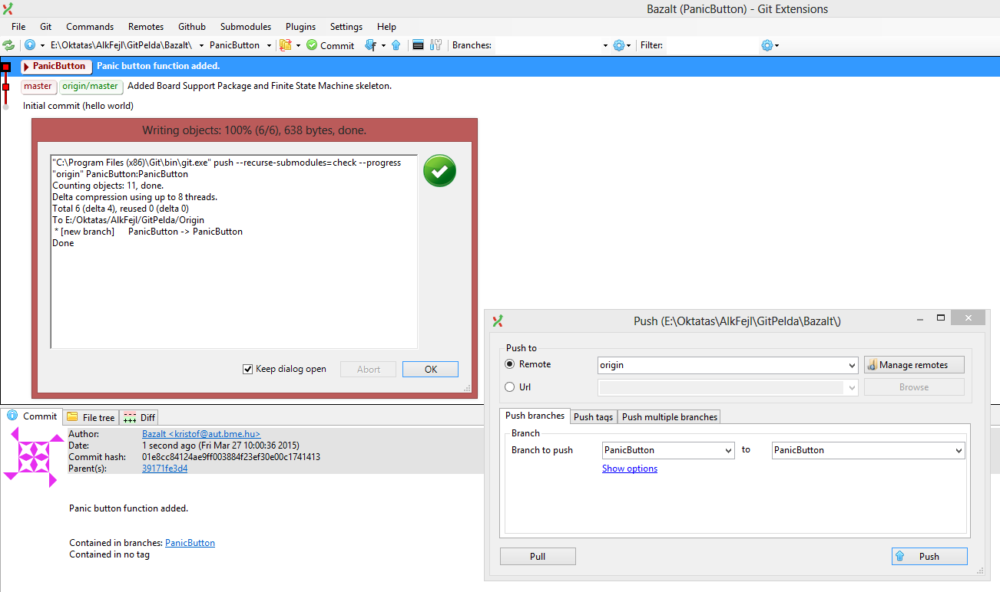
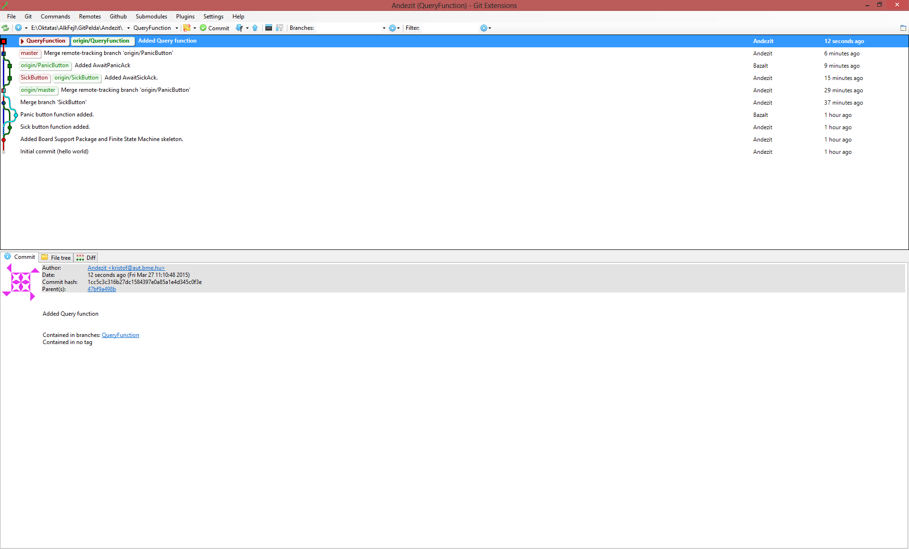

# GIT bevezető

Az alábbi példa egy kis fejlesztési folyamatot mutat be, melyben a két fejlesztő, név szerint Andezit és Bazalt közösen, a GIT verziókövető segítségével követik és osztják meg egymással a változásokat.

Az elkészített program egy kis pánikgomb, melynek segítségével vészjelzéseket lehet küldeni (1) rosszullét, (2) pánikhelyzet esetén. A program forráskódja a bemutatott teljes repositoryval itt érhető el: xxxxxxxxxxxxxxxxxxx

A GIT részletesebb megismeréséhez további olvasmányok:

  * xxxxxxxxx másik GIT snippetek, verziókövetési fogalmak, repository létrehozása nulláról az első commitig, remote beállítása
  * A Pro.Git könyv első 3 fejezete: https://git-scm.com/book/en/v2

## TODO: push 3 github

Az "Andezit és Bazalt" felhasználók minta repositoryján keresztül bemutatja az alapveto muveleteket, screenshotokkal együtt. A minta repository elérheto a github-on.

Ref GitFlow és GitHub flow oldalak.

(Forward integration példa: @Janka, EvoSoft)

emph: a repó csak egy könyvtár a gépen. Repó vs working directory!

Git: bin, deploy dependencies

# Egy szoftver fejlesztési folyamat GIT-tel, lépésről lépésre

A következő példa egy egyszerű program feltételezett fejlesztését mutatja be, amiben két felhasználó, Andezit és Bazalt együtt dolgoznak a programon. A screenshotok a GitExtensions git kliensről készültek.

http://code.google.com/p/gitextensions/

A példa során összeállt repository elérhető egy ZIP-ben az alábbi helyen: xxxxxxxxxxxxxxxxxxxxxxx

## Andezit elkészíti a BSP-t és egy kezdeti verziót

A feladat megoldásához kell egy Board Support Package, mely az áramkör specifikus részeket tartalmazza. Jelen esetben azért, hogy asztali környezetben is futhasson a program, a BSP a terminál ablakot használja kommunikációra, de beágyazott környezetbe átrakva a programot csak a BSP-t kellene lecserélni, a többit nem.)

Miután elkészült a BSP kódja, Andezit commit-olja:

A GitExtensions commit ablak közelebbről. Itt a változások már stagelve vannak és be van írva a commit szövege is.

Mivel Andezit most a Commit gombot nyomta meg, a push művelet még hátra van. A saját lokális repositoryjában már létrejött az új commit, a master branch ezen áll, de a szerver oldali megfelelője a masternek (origin/master) még nem ment tovább. Ezen egy Push művelet segít majd, mely a szerver oldalra feltölti az ott még nem szereplő, új lokális commitokat.

A push művelet elvégzéséhez szükség van a távoli szerverre (vagyis remotera, ami most origin néven fut), valamint hogy melyik lokális branchet melyik távoli branchre akarjuk pusholni. Az esetek túlnyomó többségében itt a brancheken nem kell semmit változtatni. Az előfordul néha, hogy több remote is van és akkor több helyre is tudunk pusholni.

A push művelet ablaka felugrik és egy idú ő után közli, hogy sikeres volt. Ezután az alábbit látja Andezit, vagyis hogy az origin/master most már ugyanarra a commitra mutat, mint az ő lokális master branche.

## Bazal követi az eseményeket

Most, hogy Andezit felpusholta a BSP-t, szól Bazaltnak, hogy már van mit megnézni. Bazalt egyelőre még nem kezd el dolgozni, de fetchel egyet, hogy a távoli commitokat letöltse. (Érdemes megnézni a GitExtensions által kiadott parancsot.)

Mivel Bazaltnál még nincsen lokális branch, ezért kicheckolja az origin/master-t.

## Andezit saját branchen fejlesztésbe kezd

Ezután Andezit tovább dolgozik a Sick Button funkción, amivel rosszullétet lehet majd jelezni. Ehhez létrehoz egy új branchet, amin ő magában, kényelmesen dolgozhat. (Legfrissebb commiton jobb klikk, create branch.) Az új branch neve SickButton. (A SickButton branch még csak lokálisan létezik, pusholni nem pusholta senki a szerverre.)

A forráskód módosítása után ideje commitolni. Mivel a SickBranch az aktuális, ide kerül az új commit.

Most Andezit a Commit ablakban a "Commit and Push"-ra kattintott, így a commit létrehozása után az azonnal feltölődik (pusholódik) a szerverre is. Mivel ott eddig még nem létezett, most jön létre az origin/SickButton.

## Bazalt elkedi a pánik gomb fejlesztését

Eközben Bazalt elkezdi a pánik gomb fejlesztését. Andezithez hasonlóan létrehoz egy saját (un. feature) branchet, amin csak ő fog dolgozni. A neve PanicButton. Amikor készen van, commitolja a változásokat.

Most csak Commitot nyomott, így a commit még csak lokálisan jött létre. A következő lépésben pusholja a szerverre.

## Andezit meglátja Bazalt fejlesztéseit és mergel

Most térjünk át Andezit oldalára, aki egy Fetch All-t nyomva megkapja a Bazalt által létrehozott origin/PanicButton branchet, amiről már a fetch művelet szöveges ablaka is tájékoztatja.

Ezután Andezit repositoryja az alábbiak szerint néz ki: benne van a saját SickButton ága, de mellette már látszik az is, hogy Bazalt is aktív volt és 2 perccel ezelőtt (commit sorának vége) ő is létrehozott egy commitot a saját ágán.

Andezit ekkor úgy dönt, hogy mind a ketten belerakták az alkalmazásba a saját részüket, ideje ezeket összeolvasztani egy kiadható verzióba. A stabilan kiadható verziókat a master branch szokta jelezni, így a cél az lenne, hogy a master branch tartalmazza magában mind a SickButton, mind a PanicButton ágak fejlesztéseit.

Ehhez Andezit áttér a master ágra (master-en jobb klikk, Checkout branch), majd megkezdi először saját ágának a mergelését, mivel a masteren még a SickButton fejlesztései sincsennek jelen. Ehhez a SickButton ágra kattintva "Merge into current branch"-et válasz, azon belül SickButton. (Az mindegy, hogy ilyenkor a SickButton-t, vagy az origin/SickButton-t választja, mivel a kettő ugyanarra a commitra mutat.)

A merge ablak jelen esetben jelzi, hogy a master branchbe fogjuk a SickButton branchet mergelni. Ami fontos, hogy két lehetőségünk van: engedélyezzük a fast-forwardot, vagy nem.

Ha engedélyeznénk a fast forwardot, akkor a master branch csak átugrana a SickButton branch által is mutatott commitra. (Ez csak akkor leheséges, ha a cél branch egyszerű leszármazottja a jelenleginek, most speciel ez így van.) Ha nem engedjük, akkor mindenképpen létrejön egy új commit, aminek két őse lesz. Jelen esetben Andezit ez utóbbit választja, hogy a historyból lehessen majd később is látni, hogy itt volt egy leágazás, ami utána visszakanyarodott a master ágba. (Ennek a döntésnek csak visszakövethetőségi jelentősége van, de az bizony összetettebb esetekben fontos dolog.)

A merge folyamat sikeresen lezajlott magától. (Érdemes itt is megnézni a GitExtensions által kiadott parancsot.)

Ihol, ni! A master ág egy újabb committal bővült, mely mutatja, hogy itt a master ágba visszakanyarodott a SickButton ág. Ezzel a SickButton ág elvesztette jelentőségét, mivel a feature elkészült és vissza mergeltük a master ágba.

A SickButton-t akár törölni is lehetne, miután a mostani fejleményeket pusholtuk a szerverre. De ennyire ne menjünk előre, mert az origin/PanicButton (vagyis Bazalt munkája) még hátra van. Ezt is mergelni kell.

Most viszont gond van: a merge folyamat nem ment zökkenőmentesen. A szöveges ablak szerint 3 fájlban is merge conflict van.

A GitExtensions készségesen rákérdez, hogy fel akarjuk-e most oldani a konfliktusokat. Igen... mi mást tehetnénk.

Kaptunk is egy csinos kis listát azokról a fájlokról, amiben ütközések (konfliktusok) voltak. Kezdjük a munkát a state.h-val. A mergelésre van egy nagyon jó merge tool, ami általában a git-tel együtt feltelepül. Ő a kdiff3, őt nyitjuk meg.

A kdiff3 első ránézésre ijesztő. Második ránézésre még inkább. De aztán hamar kiderül, hogy nem az. Ráadásul egy nagyon okos program.

A state.h fájl esetében az a gond, hogy a State enum értékkészletét egyszerre módosította két fejlesztő ugyanabban a sorban, így az automatikus merge tool nem tudja eldönteni, hogy melyik is a későbbi, melyiket kellene választania.

A bemeneti oldal a 3 felső ablak, a kimeneti az alsó nagy. A felső három sorban:

  * BASE, vagyis a közös ős. Ekkor még nem volt eltérés a két ág között.
  * LOCAL, vagyis a mi változtatásaink. Itt látható a SendSick állapot, mivel Andezit ezen dolgozott.
  * REMOTE, vagyis a távoli, másik branch tartalma, ahol meg Bazalt SendPanic állapota szerepel. (Itt a REMOTE nem arra vonatkozik, hogy a szerveren lévő, csak nem az aktuális branchben, hanem a másikban lévő állapotra.)

A célunk itt az, hogy az alsó ablakban egy helyesen összerakott forráskód legyen. Nyilván mondhatná Andezit azt is, hogy csak az ő általa készített változások maradjanak, de ez nem lenne egy nyerő stratégia.

A felső eszköztárban a felfelé és lefelé mutató nyilak az ütközések közötti mozgást szolgálják, mellettül az A, B és C pedig azt határozza meg, hogy melyik kódrészeket vegyük át: a közös eredetit, a lokálisat, vagy a távolit. Mivel ezek benyomva maradó nyomógombok, így B-t és C-t egyszerre is választhatjuk, amitől mindkét fejlesztő munkája egymás mögé másolva megjelenik lent.

Ez már majdnem jó, csak egy vessző hiányzik. Az alsó ablak szerencsére szerkesztésre is alkalmas, így egy kifinomult mozdulattal a hiányzó vesszőt egyszerűen beírjuk oda, majd a File menüben elmentjük a változásokat és kilépünk.

Utána pedig folytatjuk a mergelést a main.c-vel:

Itt a switch szerkezetben van gubanc, ráadásul a kdiff3 bár mindent megtesz, hogy kibogozza, nem veszi észre, hogy ott nagyon blokkokat kellene egymás után másolni, mert ő mindig a legkisebb módosításokkal próbáljra összehúzni a változásokat.

Ilyenkor vagy kézzel az alsó ablakban össze-copy-pasteljük a megoldást, vagy kihasználjuk a kdiff3 néhány trükkjét. Itt most az a gond, hogy néhány eltérést együtt kellene kezelni és nem darabokban.

Ha a REMOTE ablakban kijelöljük az együtt mozgatandó dolgokat, a Merge menü "Join selected diffs" pontjával ezeket össze tudjuk vonni.

No most már jobban néz ki, nem kallódnak mindenféle zárójelek itt-ott. A B és C verziót egyszerre átvéve ezt kapjuk:

Ugyan a lenti ablakban még ki kell cserélni a break-et egy else if-re, de egyébként a Normal állapot már rendben van.

Az előzőekhez hasonlóan rakja rendbe Andezit a SendSick és SendPanic állapotokat is:

Miután elkészült, a kdiff3 észreveszi, hogy már minden ütközést feloldottunk, így felajánlja, hogy commitolhatunk is:

A commit ablakban már stagelve vannak a frissen mergelt fájlok és ki is van töltve a commit szövege:

Egy kis szépséghiba az unstaged changes résznél a .orig végződésű fájlok jelenléte. Ők már feleslegesek: a git a merge tool számára (vagy ha kézzel mergelünk, nekünk) ezekben a fájlokban mentette el az eredeti verziókat. Mivel nyilván nem akarjuk őket elmenteni a repositoryba, így töröljük őket (a fájlon jobb klikk, reset file changes, ami jelen esetben a törlést jelenti.)

És ezzel készen van a merge. Yupi! Andezit örömében fel is pusholja a változásokat a szerverre és szól Bazaltnak, hogy vegye át a változásokat, mert nagy fejlemények vannak.

## Bazalt átveszi a merge eredményeit

Bazalt nyom egy fetch all-t, amitől megkapja a változásokat az origin/master ágon.

Az origin/master-re nyom egy Checkout branch-et. Mivel nála már volt master branch, igazság szerint neki először át kellett volna menni a PanicButton ágról a master ágra, majd ott mergelni az origin/master-t (fast forwarddal), de most nem ezt választotta: simán reseteli a master ágat az origin/master helyre, nem törődve azzal, hogy az eddig hol volt. Ha nincsennek lokális változások, ezzel a művelettel nincs is semmi gond.

## Andezit rossz ágon dolgozik tovább

Andezit a merge eredményességén felbuzdulva elkészíti az AwaitSickAck állaot elkészítését, mely a Sick jelzés megerősítésére várakozást jelenti. Igen ám, csak rájön, hogy nem azon a branchen van, amin neki dolgoznia kellene (a SickButton-on), hanem a master-en.

Ilyenkor az a biztonságos megoldás, hogy ideiglenesen el kell "stash-elni" a változásokat: elmeneti egy ideiglenes helyre (ez a stash), ahonnan majd a branch váltás után újra elő tudjuk szedni. (A branch váltás során elég könnyű véletlenül eltüntetni a még nem commitolt változásokat.)

A stash után áttér a SickButton ágra:

Majd a SickButton ágba mergeli a master ágat (fast forwarddal), hogy az is a legfrissebb verziót tartalmazza:

A fast forward merge sikeres:

Ezután egy stash pop-ot kérve visszatérnek az AwaitSickAck állapot kódrészletei:

Melyeket most már nyugodtan tud commitolni a SickButton ágon, majd pusholni a szerverre:

## Bazalt folytatja a munkát

Andezit kissé viharos commitja után Bazalt letölti a változásokat (nála is tovább gördül az origin/SickButton), majd hogy minden friss legyen a saját PanicButton ágán is, mergeli abba az origin/SickButton-t. Most is megy a fast forward, mivel nincsen semmi komlikáció, csak előre kell tolni a PanicButton ágat.

Íme az eredmény:

Ezután Bazalt is elkészíti az ő részét, az AwaitPanicAck állapotot, és mivel ő már a helyes ágon van, egyből commitolja:

Az eredmény:

Bazalt egyből pusholja is a változásokat a szerverre:

## Andezit mergeli a masterbe Bazalt munkáját

A feladatok leosztása szerint Andezit dolga a master branch karbantartása, így Bazalt szól neki, hogy készen áll a PanicButton újabb fejlesztése, legyen szíves mergelni a masterbe. Ezt Andezit meg is teszi:

Azért, hogy most is látszódjon a historyn, hogy mely pontok voltak ténylegesen a stabil master elődei, most sem engedi a fast forwardot.

Most megnézve a historyt, tényleg látszik, hogy a master ág mely commitokat érintette, vagyis melyke voltak stabil állapotok. Ha a master léptetésénél fast forwardot használt volna Andezit, akkor nem jöttek volna létre ezek a dedikált commitok, így nem lehetne megkülönböztetni az egyes feature branchek commitjait és a tényleges master branch commitokat.

## Andezit utolsó simítása és az első demó

Az első nagy demózás előtt Andezit még elkészít egy lekérdező funkciót (QueryFunction ágon):

Majd azt mergelve a master branchbe elkészül az első demózható verzió. A sikeres demó végén Andezit és Bazalt úgy dönt, hogy ezt az állapotot érdemes megjelölni, hátha később gyorsan elő kell szedni "tudjátok, azt a verziót, ami a demón olyan szépen működött!". Ezért egy "Demo1" nevű taggel is megjelölik a demózott állapotot.

