# Git pull request

Ebben a snippetben arra látunk egy példát, hogy egy órarendi laboron elkészített forráskódot hogyan lehet csak a github.com felületét használva bejuttatni a github repositorynkba, majd a leadáshoz hogyan lehet egy pull requestet létrehozni, melyben a labor megoldása szerepel.

A példát az Informatika 2 tantárgyhoz kapcsolódóan írom le, de ez csak annyiban tantárgyfüggő, hogy mi a github organization, amiben a repository létrejött, valamint hogy ezúttal a saját repositoryt a github classroom hozta létre. De egyébként egy olyanolyan repositoryról van szó, mint amit magának tud bárki létrehozni.

A kiindulási alap az, hogy van egy github.com repositorynk, melyben a master ágon állunk és ott még semmilyen nyoma nincsen a labor megoldásnak. Mivel a pull request mindig két ágat tud összehasonlítani, a master ág lesz az, ami a labor elkészítése előtti állapotra mutat. Ehhez képest létre fogunk hozni egy új ágat, arra commitoljuk a labor megoldását (egy vagy több committal, ez jelen esetben mindegy), majd a megoldást tartalmazó, új ágat összehasonlítva a master ággal létrehozzuk a pull requestet, melyhez hozzárendeljük a laborvezetőnket, mint reviewer. (Ettől a megoldásunk a laborvezető számára is meg fog jelenni a megnézendő pull requestek között.)

A következőkben két forgatókönyvet is be fogok mutatni. Az elsőben csak a github felületét használjuk, ami nem a szokványos munkafolyamat, de a laborok esetén gyors és egyszerű. A második a preferált eset, amikor a saját gépünkre készítünk egy másolatot a repositoryról, abba dolgozunk, majd a változásokat visszajuttatjuk a szerverre. A pull request létrehozása már mindkét esetben azonos lesz.

# A labor megoldások commitolása egy új branchre - csak a github felületet használva

A kiindulási állapotunk, amikor a saját repositorynkat megnyitjuk a github.com oldalon a következő. Látszik, hogy a BME-VIK-Informatika2 organization alatt található és az aktuális ág (branch) a master:

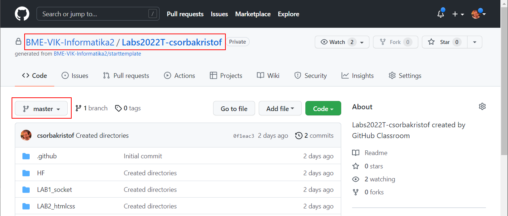

Fontos, hogy a labor megoldását új branchen hozzuk létre, mert a master lesz az összehasonlítás alapja, vagyis a masteren nem szabad nyoma lennie a labor megoldásának. Új branchet úgy hozunk létre, hogy legördítjük a branch listát és a szövegmezőbe beírjuk az új branch nevét (most "Lab01Megoldas") és rákattintunk alatta a létrehozás gombra:

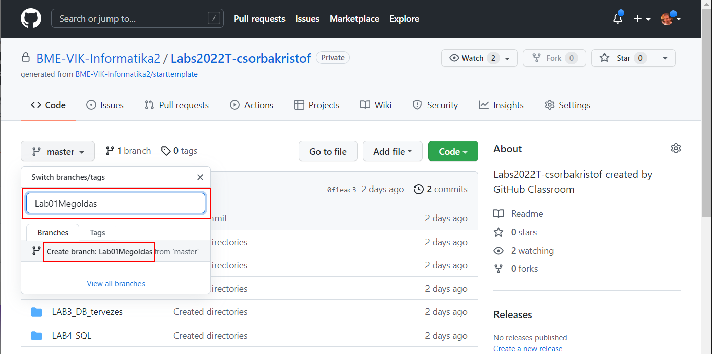

Az új branchen állva (már ez van kiválasztva a legördülő listában) belépünk a labor megoldását váró könyvtárba, hogy oda fel tudjuk majd tölteni a fájlokat:

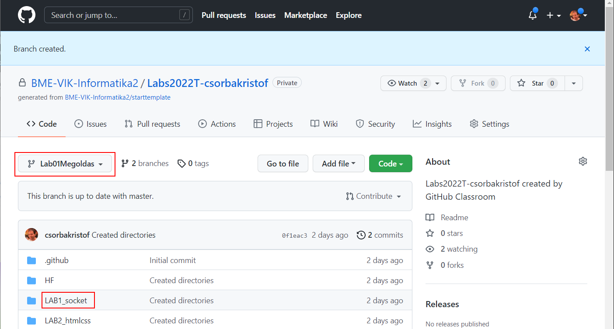

Itt miután még egyszer ellenőriztük, hogy a "Lab01Megoldas" ágon és nem a masteren vagyunk, az "Add file" legördülő listában az "Upload files" lehetőséget választjuk:

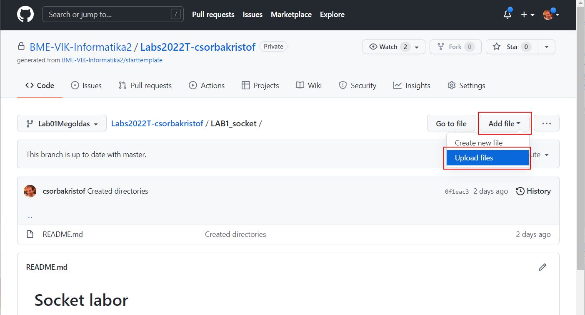

Ennek a labornak a megoldása során speciel egy main.cpp fájlt készítettünk el, amit a nagy feltöltő mezőbe dobva tudunk feltölteni. Általános esetben minden a megoldáshoz kapcsolódó fájlt ide kell bedobnunk, amitől azok feltöltődnek és alul megjelennek:

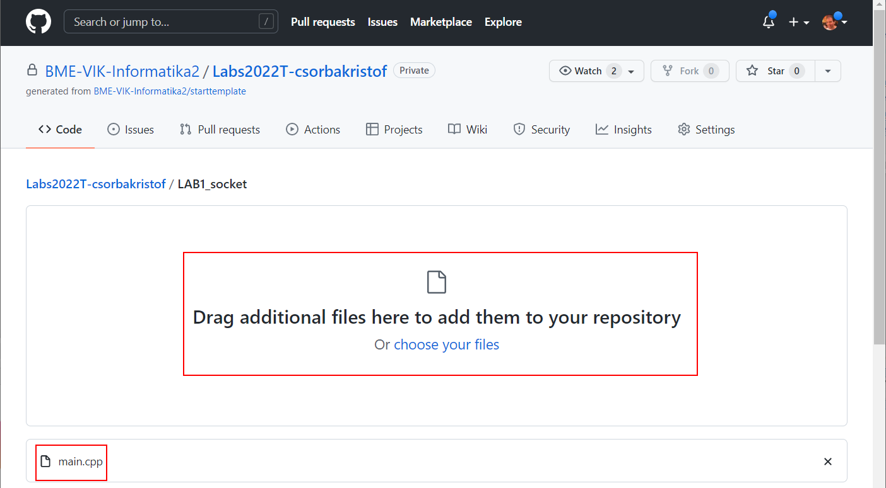

A git commit létrehozásához ezután meg kell adnunk egy commit üzenetet, amit illik valami kifejezőre választani, mint például a "Lab01 megoldása". Itt a github lehetőséget adna arra is, hogy most, egyetlen lépésben létrehozzunk egy új ágat, commitoljuk rá és már indítsuk is a pull request készítést. Ezt is nyugodtan választhatjátok, de most a lépésenkénti megoldást fogom megmutatni, ahol csak a "Commit directly to the Lab01Megoldas branch." opciót választjuk, majd megnyomjuk a "Commit changes" gombot:

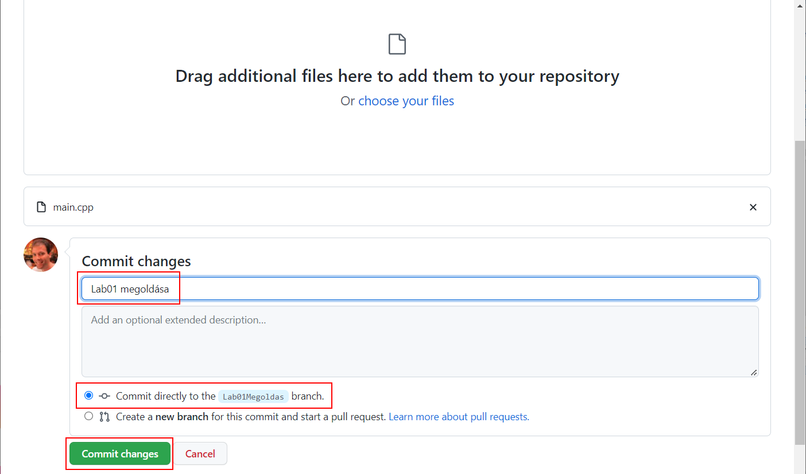

Itt most visszajutunk a repository kód nézetére, továbbra is a Lab01Megoldas ágon állva. Fent megjelenik egy "Compare & pull request" gomb, amivel egyből ugorhatunk a pull request létrehozásra. Nyugodtan használhatjátok azt is, de most megint csak a lassabb, de részletesebb utat mutatom meg. Lépjünk még be a megoldás alkönyvtárába (LAB01_socket), hogy megnézzük a feltöltött fájlt:

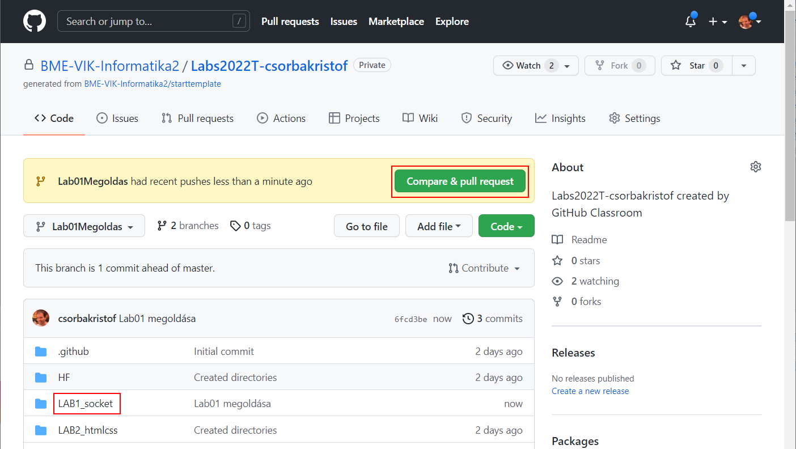

Itt ismét meggyőződhetünk róla, hogy a Lab01Megoldas ágon a LAB01_socket könyvtárban már ott van feltöltve a megoldás. (Érdemes lehet arra is ránézni, hogy ha átmegyünk a master ágra, akkor a main.cpp el fog tűnni, mivel a master ágon a megoldásnak még nyoma sincs.) Ezután fent menjünk át a "Pull requests" oldalra, ahol most fogjuk létrehozni a pull requestet, vagyis beadjuk a már egy külön ágra feltöltött megoldást.

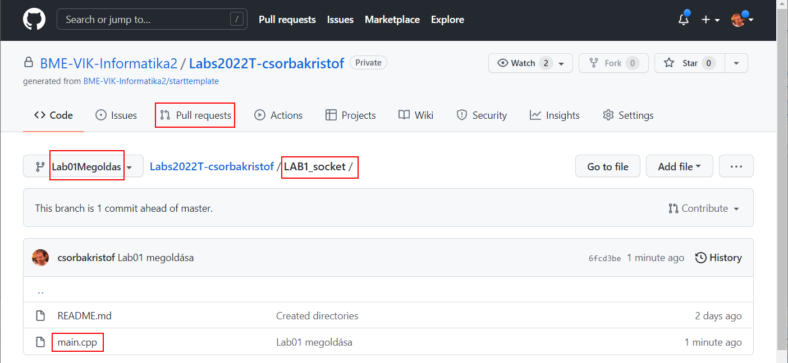

Itt érdemes megjegyezni, hogy ha egy desktop git klienst használunk és a saját gépünkön dolgozva a lokális repositoryba commitolunk egy új Lab01Megoldas ágra, majd azt pusholjuk a github.com remote-ra, akkor pont ide jutunk. A fenti példa azt mutatta meg, hogy lokális repository és telepített git és git kliens nélkül is el tudunk ide jutni.

# Klasszikus git munkafolyamat: repository klónozása és a helyi repositoryba dolgozás

A klasszikus megközelítés szerint a github repositoryt klónozzuk (másolatot hozunk létre a saját gépünkre), abba dolgozunk és végül "pusholjuk" a változásokat (fájl módosítások, új branchek) a szerverre.

Ehhez a saját gépünkön vagy parancssorból használjuk a git-et, vagy egy kliensen keresztül, mint a GitExtensions (van egy csomó ilyen és valójában mindegyik csak helyettünk adja ki a parancssori git parancsokat, így sokszor szinte csak a designban térnek el.)

Az első lépés a klónozás, amihez a github felé authentikálni is kell magunkat. A github pár éve megszüntette azt a lehetőséget, hogy a webes felületen használható usernév - jelszó párossal a git kliensünk is be tudjon lépni. Ehhez personal access tokent kell létrehozni, ami egyfajta programok számára készíthető jelszó. A github felületén lehet generálni őket megadva, hogy segítségével mikhez férhet hozzá a program. 

## Github personal access token generálása

A github.com oldalra belépve a beállításaink között a bal oldali menü alján található egy Developer Settings:

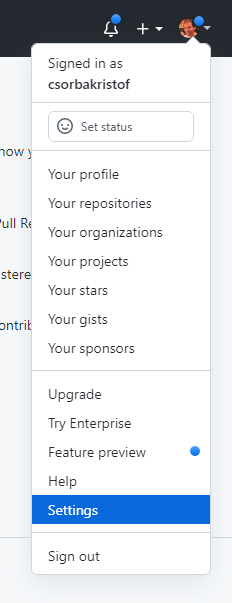

Azon belül pedig most a "Personal Access Tokens - Tokens (classic)" rész kell nekünk. Itt vannak az eddig generált tokenjeink. A "Generate new token"-re kattintva generálhatunk egy újat, például minden labor elején, mert a labor gépeken jobb nem elmenteni a korábbiakat. Ha saját gépet használunk, ahhoz nem kell mindig újat létrehozni.
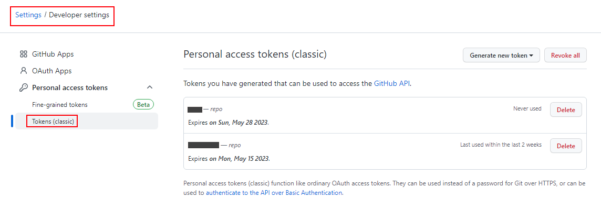

Új token generálása:
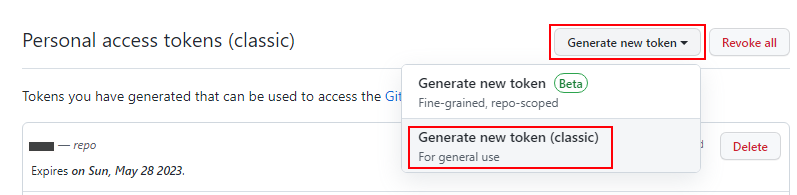

Az új tokennek kell adni egy nevet, amiről tudjuk azonosítani, ha több van. Meg kell adni egy lejárati időt, valamint hogy milyen jogokat biztosítson. Nekünk most a "repo" jog kell majd. Ezután a lista alján lévő nyomógombbal tudjuk legeneráltatni a tokent.

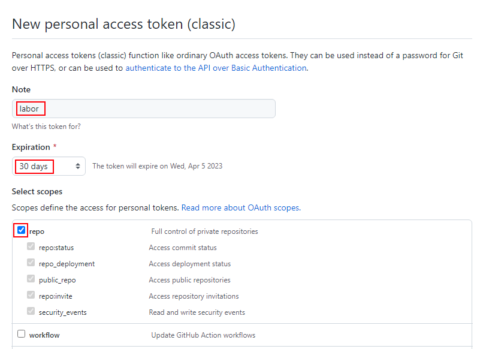

A kész tokent itt kimásolhatjuk a vágólapra. Tegyük is meg, mert ahogy a github is figyelmeztet, többet ez nem fog megjelenni.

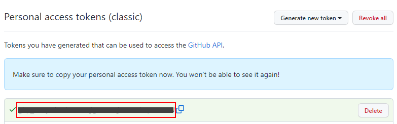

Ha kész a token, ezt használhatjuk az alkalmazásokban jelszónak. Vagyis ha egy bármilyen git kliens felhasználó nevet és jelszót kér, a felhasználói név a githubos usernevünk, a jelszó pedig ez a token!

## A repository klónozása, munka új branchen

Ezután ha a GitExtensions kliens programot használjuk, két lehetőségünk van az authentikációra: vagy klónozzuk a repositoryt és ha majd a git kéri a felhasználó nevet és jelszót, akkor a jelszónál a fent generált access tokent kell megadni. Vagy ha saját gépen dolgozunk, akkor el is menthetjük az access tokent a "Tools - Settings" menüpont "Plugins - GitHub" részében. A Personal Access Tokent egyszerűen másoljuk a szövegmezőbe és nyomjunk "Apply"-t vagy "OK"-ot. Ekkor később a git már nem fog jelszót kérdezni.

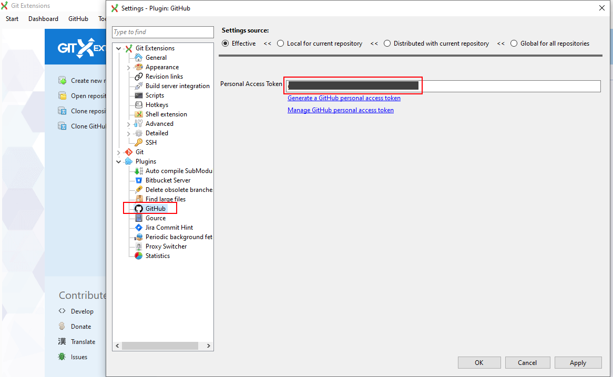

A klónozáshoz kelleni fog a repository elérési útja, amit a github oldalon a repository kezdőoldalán tudunk megnézni a zöld "Code" nyomógombbal (vagy a github classroom is elárulja, amikor végez a repository létrehozásával):

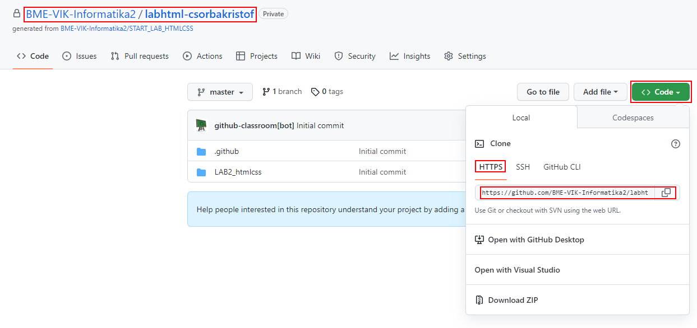

A GitExtensions alkalmazás kezdő képernyőjén vagy a program "Start" menüpontján belül "Clone repository"-t választva meg kell adni a repository URL-t és a célkönyvtárat (innen nyílik majd a repository nevével megegyező nevű alkönyvtár):

A klónozás után a repositoryban elvégezhetjük a labor feladatokat. Mivel más snippetekben ( [Git példafejlesztés](http://bmeaut.github.io/snippets/snippets/0103_GitPeldafejlesztes/) ) ez részletesen le van írva, itt most csak a labor szempontjából legfontosabb pontokat emelem ki.

Első lépésként fontos, hogy létrehozzunk egy új branchet, a master ágon állva jobb gombbal az aktuális commitra kattintva és a "Create new branch here" menüpontot választva:

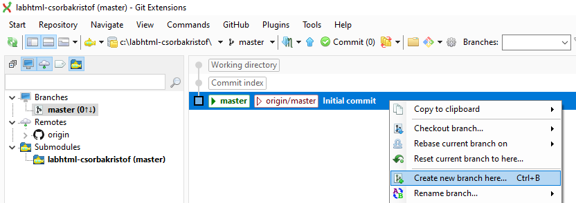

A neve például lehet "labor".

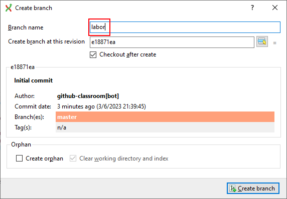

Amikor létrehoztuk, már ez lesz az aktuális branch (a neve előtt kis háromszög jelzi). Ide dolgozunk a labor során:

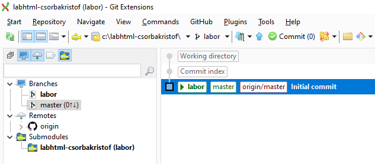

Ha a labor feladatokkal végeztünk és commitolni akarjuk, a GitExtensionsben fent középen van egy "Commit" nyomógomb. Ezt megnyomva látjuk a változásokat. Mivel nem feltétlenül akarjuk az összes változást belevenni a létrehozandó commitba, "stagelni" kell azt, amit bele akarunk venni. Ettől azok a változások átkerülnek a bal alsó mezőbe. Ezután egy beszédes commit message megadása után rányomhatunk a "Commit" gombra. (Később látni fogjátok, hogy érdemes minél sűrűbben commitolni, nem csak a legvégén, de ez most még nem elvárás.)

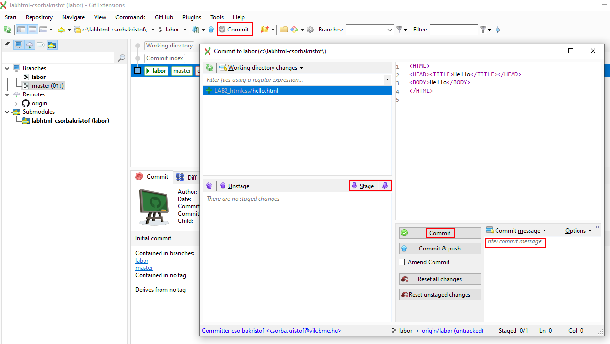

Az új branch és az új commit(ok) még nincsennek fent a github oldalán, így a pull requestet még nem tudjuk létrehozni. Először fel kell tölteni a változásokat a szerver oldalra is. Git alatt erre a "push" művelet szolgál. (A commit dialógus ablakban a "Commit" helyett nyomhatjuk egyből a "Commit & push"-t is, akkor a push is lefut egyből.) A push ikonja egy kis felfelé nyíl fent középen. A felugró dialógus ablakban semmit nem kell módosítani, az "origin" néven futó, eredeti github repositoryba akarjuk felpusholni a változásokat. 

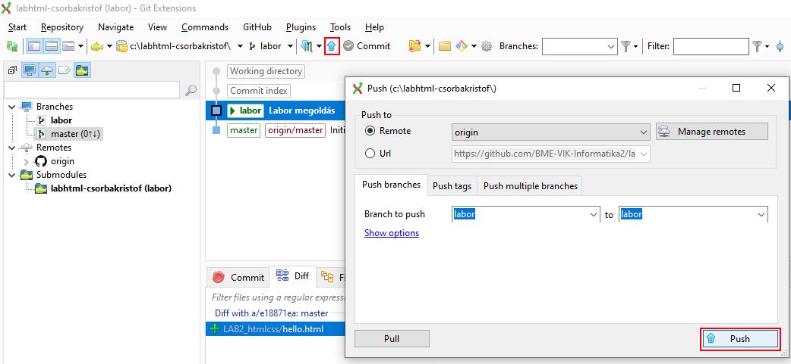

Itt jön majd két kérdés, hogy az új branchet a távoli repositoryban is létre akarjuk-e hozni és az kövesse-e az itteni megfelelőjét, mindkettőre igen a válasz. Ezután a commit gráfban már megjelenik, hogy a "labor" águnk szinkronban van az "origin/labor" ággal, ami a github oldalán lévő megfelelője:

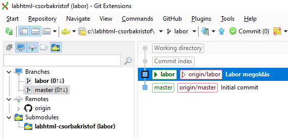

Ezzel a labor megoldásunk felkerült a github szerverére is és készen áll a beadásra, amit egy pull request formájában fogunk összeállítani a github.com oldalon. A pull request majd két branch különbségét fogja nekünk "összecsomagolni". A két branch itt most a master (ami ebben a példában a labor elkezdése előtti állapotra mutat), a másik pedig az, amire most a labor alatt commitoltunk (ennek "labor" a neve a példában). Így a pull request tartalma pont a laboron végzett munka lesz.

# A pull request létrehozása

A repositorynk pull requests oldalán a példában még nincsen nyitott pull request, csak 3 lezárt. Mivel nemrég commitoltunk egy ágra, a github ismét felajánlja, hogy egyből használjuk azt a pull requesthez. De didaktikai okból megint azt az utat választjuk, ami mindig működik: válasszuk a "New pull request" gombot.

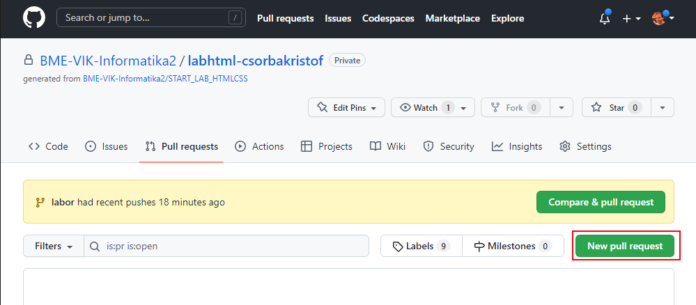

Most kell megadnunk, hogy melyik ágat melyik ággal fogjuk összehasonlítani. A base a kiindulási alap, vagyis marad a master, a compare-t pedig át kell állítanunk a megoldásunkat tartalmazóra, vagyis a labor ágra (ha a csak githubos felületet használó utat választottuk, ott "Lab01Megoldas" néven futott):

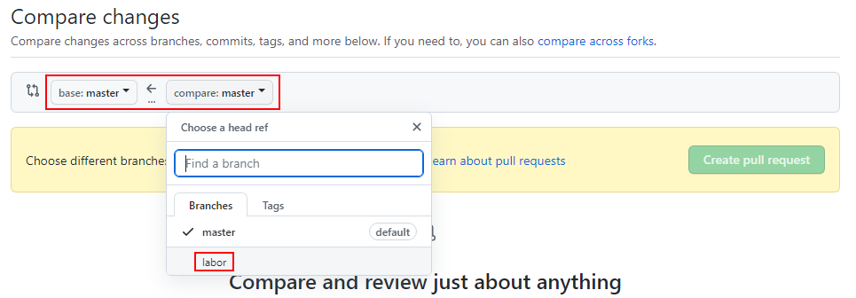

A beállítás után egyből láthatjuk a leendő pull request tartalmát, vagyis hogy milyen módosításokat hajtottunk végre a forráskódban a megoldás során. (Itt most csak egy fájl jelenik meg, melynek minden sora új sor, de ha például kiadott keretprogrammal dolgoznánk, itt pirossal megjelenő, törölt sorok is előfordulhatnának.) Itt győződhetünk meg róla, hogy a pull requestben a labor teljes megoldása benne van és felesleges fájlok pedig nincsennek benne. (Ha több commitban van a megoldás, akkor fontos, hogy itt már minden commit tartalma együtt látszik, vagyis minden módosításnak szerepelnie kell benne, mert a laborvezető is pontosan ezeket a változásokat fogja látni.) Ha minden rendben van, nyomjuk meg a "Create pull request" gombot:

A pull requestnek van egy szöveges üzenet része, amiben alapértelmezés szerint egy sablon szöveg jelenik meg. Itt gyakran egy ellenőrzési listát is elhelyezünk azért, hogy a feladat beadásoknál semmi fontos ne maradjon ki. Ezeket érdemes minden alkalommal végigfutni, hogy helyes pull requestet adjatok le. Közben ide nyugodtan lehet írni bármi egyebet is, ha van valami megjegyzésetek a megoldásotokhoz. Egyes laborokon ide szoktunk screenshotot kérni a futó eredményről, ebbe az oldalba simán lehet copy-pastelni képeket is.)

A szöveges rész kitöltése mellett ekkor lehet reviewert, jelen esetben laborvezetőt hozzárendelni a pull requesthez. Ez azért fontos, mert ettől fog a laborvezetőtöknél megjelenni a labor beadásotok, így szerez majd róla tudomást. A reviewer listát a kis fogaskerék ikonnal tudjátok lenyitni és ellenőrizzétek, hogy a saját laborvezetőtök userneve előtt megjelenik a kis pipa, amikor kiválasztjátok:

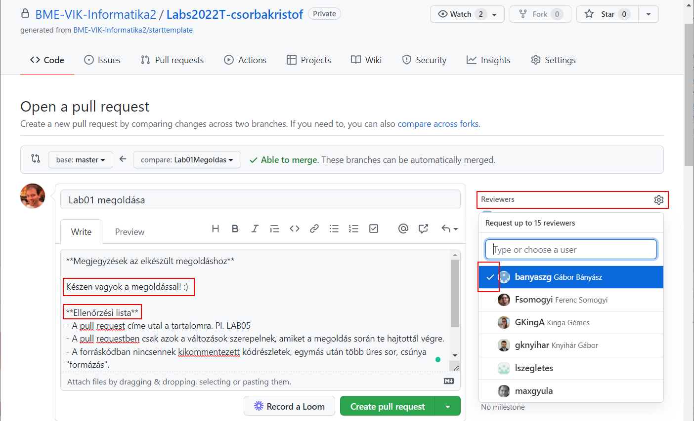

A labvezér beállítása után egy utolsó ellenőrzés, és mehet is a "Create pull request":

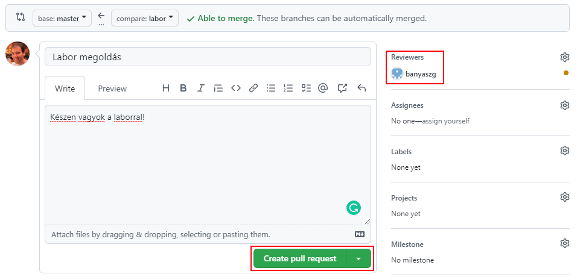

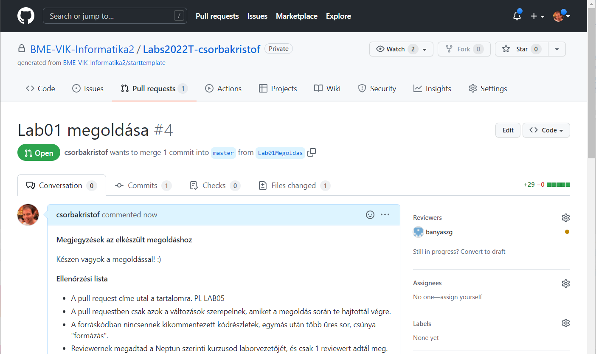

Ilyenkor még érdemes egy pillantást vetni a pull request "Files changed" oldalára, melyen ismét ellenőrizhetitek, hogy pontosan azok a változások kerültek bele, amiket akartatok.

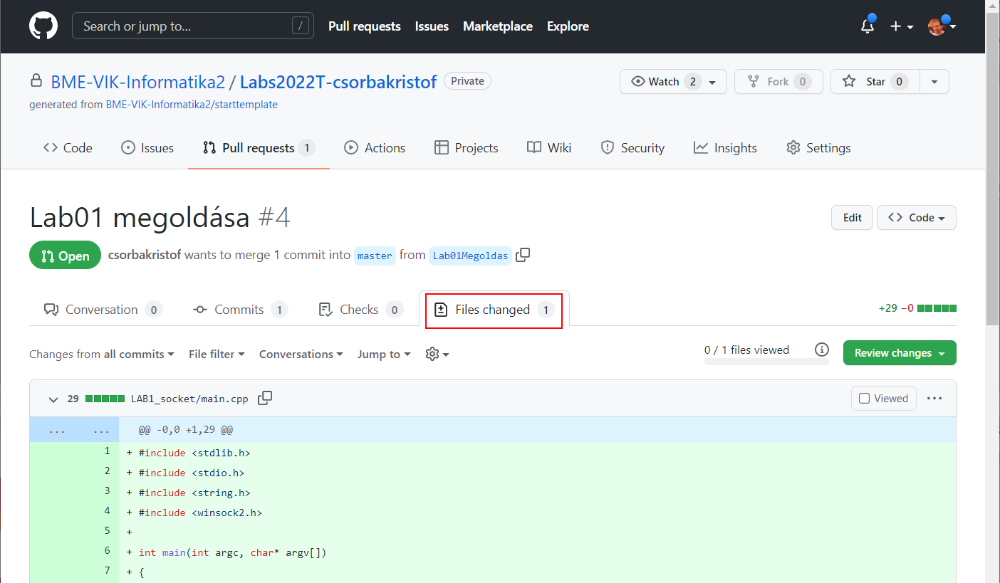

A pull request "Conversation" oldala egyébként a megjegyzésként írt szövegetek után tartalmazza időrendi sorrendben az összes eseményt, ami a pull requesttel történt: a benne lévő commitokat, valamint a reviewer felkérést is.

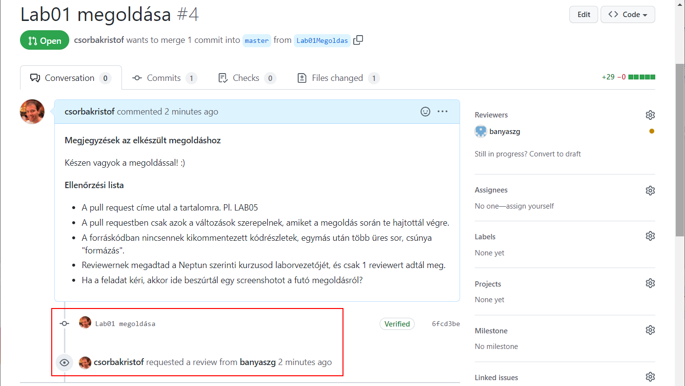

Fontos, hogy bár ennek a végén nektek is lehetőségetek van mergelni a pull requestet (jelen esetben a tartalma beleolvadna a master ág tartalmába), vagy csak lezárni a pull requestet, ezt NE tegyétek meg, mivel akkor értelmét veszíti az egész pull request és a laborvezetőtök nem is szerez tudomást a beadott labor megoldásról.

Amint a laborvezetőtök értékelte a megoldásotokat, a forráskódhoz fűzött esetleges kommentárjai, valamint az a tény, hogy elfogadta a pull requestet, szintén itt fog megjelenni.

Itt érdemes megjegyezni, hogy a hagyományos munkafolyamatban a pull request sorsának általában az a vége, hogy mergelődik. Itt ennek nincsen feltétlenül értelme: a laborokon mi csak arra használjuk a pull requestet, hogy jelezze a beadást tényét és könnyen lehessen visszajelzést adni. Ha a megoldás utána marad a "labor" ágon és nem mergelődik a master ágra, az a tantárgyi keretek között nem gond. Ettől függetlenül nyugodtan mergelhetitek, miután a labvezér elfogadta.

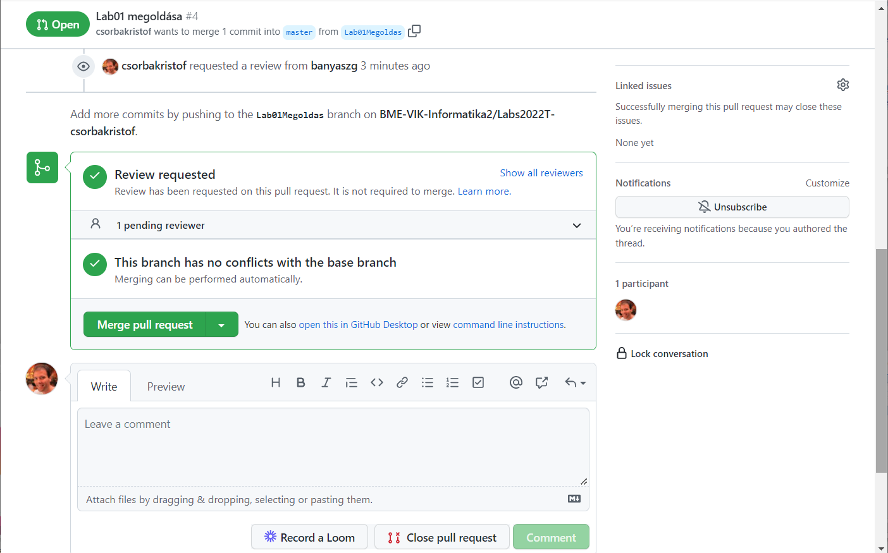

A folyamatban lévő, vagyis nyitott pull requestjeiteket mindig meg tudjátok nézni a repositorytok "Pull requests" oldalán:

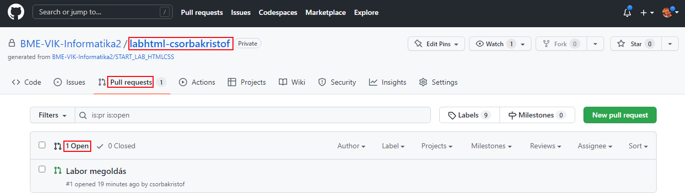

És végül még egy fontos dolog: mi van, ha valamit elrontassz a folyamatban?

  - Ha még nem hoztad létre a pull requestet, akkor senki nem is látta, hogy valami félre ment, kezd nyugodtan újra az egészet, akár onnan is, hogy egy új branchre még egyszer feltöltöd a labor megoldásodat. (Lehet, hogy ott marad akkor egy régi, fel nem használt branch, de az senkit nem zavar.)
  - Ha már létrehoztad a pull requestet, de még nem jött el a leadási határidő, így a laborvezetőd nemigen látta, nyugodtan zárd le (esetleg írd oda kommentárba vagy az elején lévő szövegbe, hogy ez nem a végleges és ne vegyük figyelembe).
  - Ha a forráskód szinten maradt le valami, esetleg valamit utólag javítassz, akkor ha a pull request ágára (a fenti példában a "labor" ágra) commitolsz a pull request létrehozása után, a módosítás automatikusan bekerül a pull requestbe is. Igaz, a laborvezetőd látni fogja az időbeli különbséget, így a határidő utáni módosítást is észre fogja venni, de a határidő előtt nyugodtan utólag is "hozzá lehet még csapni" pár módosítást, ahhoz nem is kell új pull requestet létrehozni.
  - Ha a leadási határidő után javítanál valamit, inkább szólj a labvezérednek, hogy készítenél egy új pull requestet, hogy ne legyen kavarodás.

  És ami még egy kavarodási forrás: mi van akkor, ha elfelejtettél új branchet létrehozni és a masterre commitoltad a megoldást? Általános szabály, hogy a pull request két ág különbsége. Vagyis ilyen esetben létre hozhatsz egy új branchet a labor megoldása előtti commitra (ahova eredetileg a masternek kellett volna mutatnia), és a pull requestben akkor megfordulnak a szerepek: a master lesz a megoldást tartalmazó és ez az új ág a "base", vagyis a kiindulási alap. Gondolj arra, hogy a commitok gráfja a lényeg és az ágak csak egy-egy commitra mutatnak. Új ágakkal bármikor bárhova mutathatsz, bármelyiket bárhova áthelyezheted (reset művelet). Commitot elveszíteni igencsak nehéz, az ágakat meg át lehet helyezni, így elég nagy kavarodásokat is viszonylag könnyen rendbe lehet rakni. Ami fontos, hogy mindig a commit gráfot nézd és abban gondolkodj! (Ha pedig megakadsz, kérj segítséget, praktikusan egy commit gráf screenshottal kezdve.)

<small>Szerzők, verziók: Csorba Kristóf</small>
