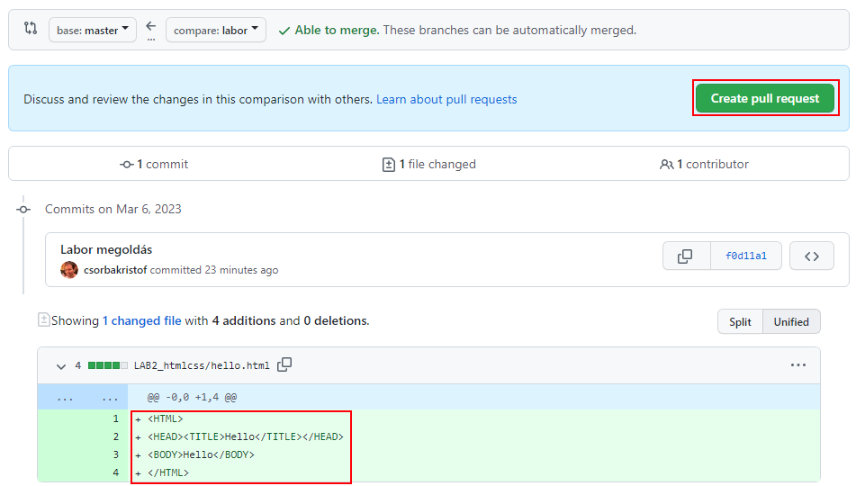
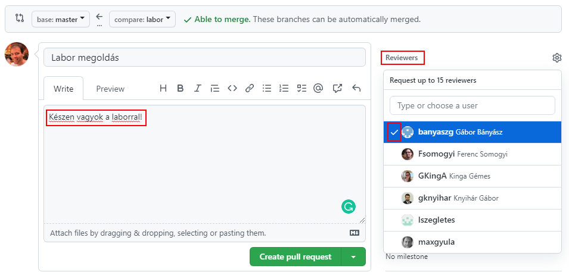
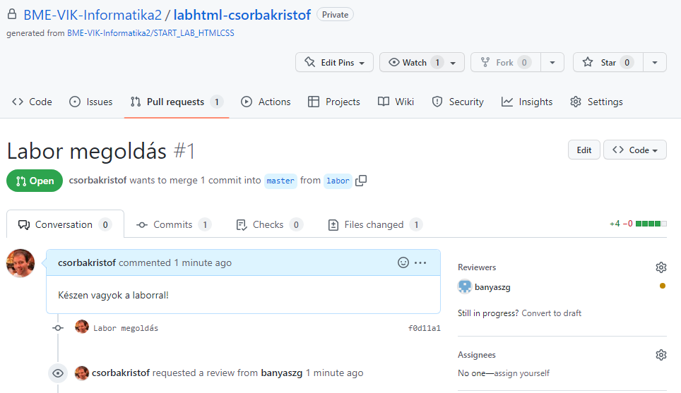
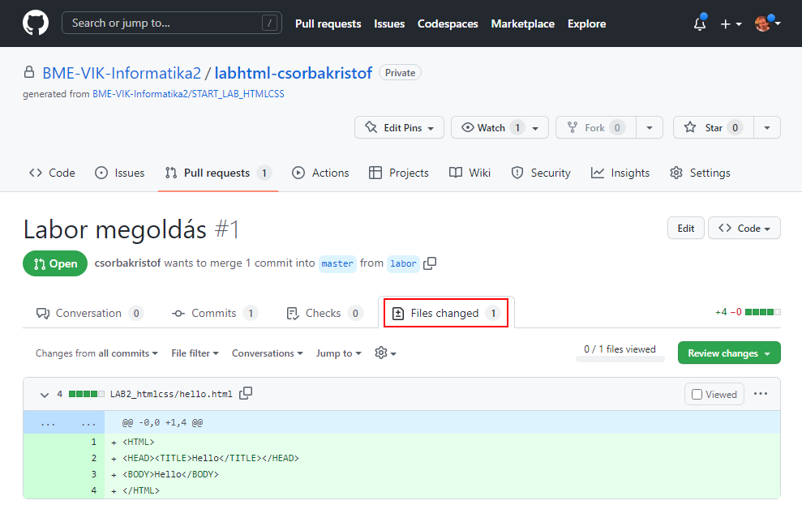
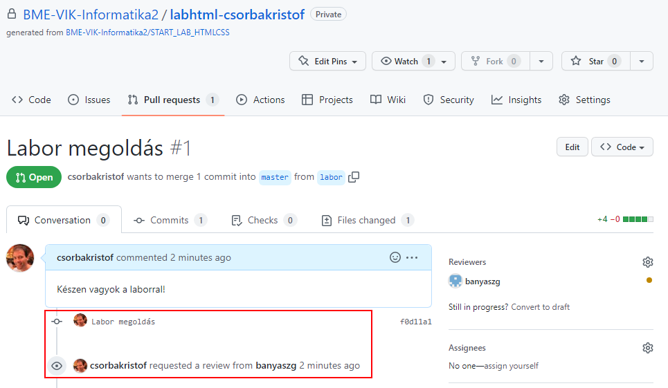

# Git pull request

Ebben a snippetben arra látunk egy példát, hogy egy órarendi laboron elkészített forráskódot hogyan lehet csak a github.com felületét használva bejuttatni a github repositorynkba, majd a leadáshoz hogyan lehet egy pull requestet létrehozni, melyben a labor megoldása szerepel.

A példát az Informatika 2 tantárgyhoz kapcsolódóan írom le, de ez csak annyiban tantárgyfüggő, hogy mi a github organization, amiben a repository létrejött, valamint hogy ezúttal a saját repositoryt a github classroom hozta létre. De egyébként egy olyanolyan repositoryról van szó, mint amit magának tud bárki létrehozni.

A kiindulási alap az, hogy van egy github.com repositorynk, melyben a master ágon állunk és ott még semmilyen nyoma nincsen a labor megoldásnak. Mivel a pull request mindig két ágat tud összehasonlítani, a master ág lesz az, ami a labor elkészítése előtti állapotra mutat. Ehhez képest létre fogunk hozni egy új ágat, arra commitoljuk a labor megoldását (egy vagy több committal, ez jelen esetben mindegy), majd a megoldást tartalmazó, új ágat összehasonlítva a master ággal létrehozzuk a pull requestet, melyhez hozzárendeljük a laborvezetőnket, mint reviewer. (Ettől a megoldásunk a laborvezető számára is meg fog jelenni a megnézendő pull requestek között.)

# A labor megoldások commitolása egy új branchre

A kiindulási állapotunk, amikor a saját repositorynkat megnyitjuk a github.com oldalon a következő. Látszik, hogy a BME-VIK-Informatika2 organization alatt található és az aktuális ág (branch) a master:

Fontos, hogy a labor megoldását új branchen hozzuk létre, mert a master lesz az összehasonlítás alapja, vagyis a masteren nem szabad nyoma lennie a labor megoldásának. Új branchet úgy hozunk létre, hogy legördítjük a branch listát és a szövegmezőbe beírjuk az új branch nevét (most "Lab01Megoldas") és rákattintunk alatta a létrehozás gombra:

Az új branchen állva (már ez van kiválasztva a legördülő listában) belépünk a labor megoldását váró könyvtárba, hogy oda fel tudjuk majd tölteni a fájlokat:

Itt miután még egyszer ellenőriztük, hogy a "Lab01Megoldas" ágon és nem a masteren vagyunk, az "Add file" legördülő listában az "Upload files" lehetőséget választjuk:

Ennek a labornak a megoldása során speciel egy main.cpp fájlt készítettünk el, amit a nagy feltöltő mezőbe dobva tudunk feltölteni. Általános esetben minden a megoldáshoz kapcsolódó fájlt ide kell bedobnunk, amitől azok feltöltődnek és alul megjelennek:

A git commit létrehozásához ezután meg kell adnunk egy commit üzenetet, amit illik valami kifejezőre választani, mint például a "Lab01 megoldása". Itt a github lehetőséget adna arra is, hogy most, egyetlen lépésben létrehozzunk egy új ágat, commitoljuk rá és már indítsuk is a pull request készítést. Ezt is nyugodtan választhatjátok, de most a lépésenkénti megoldást fogom megmutatni, ahol csak a "Commit directly to the Lab01Megoldas branch." opciót választjuk, majd megnyomjuk a "Commit changes" gombot:

Itt most visszajutunk a repository kód nézetére, továbbra is a Lab01Megoldas ágon állva. Fent megjelenik egy "Compare & pull request" gomb, amivel egyből ugorhatunk a pull request létrehozásra. Nyugodtan használhatjátok azt is, de most megint csak a lassabb, de részletesebb utat mutatom meg. Lépjünk még be a megoldás alkönyvtárába (LAB01_socket), hogy megnézzük a feltöltött fájlt:

Itt ismét meggyőződhetünk róla, hogy a Lab01Megoldas ágon a LAB01_socket könyvtárban már ott van feltöltve a megoldás. (Érdemes lehet arra is ránézni, hogy ha átmegyünk a master ágra, akkor a main.cpp el fog tűnni, mivel a master ágon a megoldásnak még nyoma sincs.) Ezután fent menjünk át a "Pull requests" oldalra, ahol most fogjuk létrehozni a pull requestet, vagyis beadjuk a már egy külön ágra feltöltött megoldást.

Itt érdemes megjegyezni, hogy ha egy desktop git klienst használunk és a saját gépünkön dolgozva a lokális repositoryba commitolunk egy új Lab01Megoldas ágra, majd azt pusholjuk a github.com remote-ra, akkor pont ide jutunk. A fenti példa azt mutatta meg, hogy lokális repository és telepített git és git kliens nélkül is el tudunk ide jutni.

# A pull request létrehozása

A repositorynk pull requests oldalán a példában még nincsen nyitott pull request, csak 3 lezárt. Mivel nemrég commitoltunk egy ágra, a github ismét felajánlja, hogy egyből használjuk azt a pull requesthez. De didaktikai okból megint azt az utat választjuk, ami mindig működik: válasszuk a "New pull request" gombot.

Most kell megadnunk, hogy melyik ágat melyik ággal fogjuk összehasonlítani. A base a kiindulási alap, vagyis marad a master, a compare-t pedig át kell állítanunk a megoldásunkat tartalmazóra, vagyis a Lab01Megoldas ágra:

A beállítás után egyből láthatjuk a leendő pull request tartalmát, vagyis hogy milyen módosításokat hajtottunk végre a forráskódban a megoldás során. (Itt most csak egy fájl jelenik meg, melynek minden sora új sor, de ha például kiadott keretprogrammal dolgoznánk, itt pirossal megjelenő, törölt sorok is előfordulhatnának.) Miután meggyőződtünk róla, hogy itt látható a labor teljes megoldása. (Ha több commitban van a megoldás, akkor fontos, hogy itt már minden commit tartalma együtt látszik, vagyis minden módosításnak szerepelnie kell benne, mert a laborvezető is pontosan ezeket a változásokat fogja látni.) Ha minden rendben van, nyomjuk meg a "Create pull request" gombot:

A pull requestnek van egy szöveges üzenet része, amiben alapértelmezés szerint egy sablon szöveg jelenik meg. A példában itt egy ellenőrzési lista szerepel. Ezeket érdemes minden alkalommal végigfutni, hogy helyes pull requestet adjatok le. Közben ide nyugodtan lehet írni bármi egyebet is, ha van valami megjegyzésetek a megoldásotokhoz. Egyes tantárgyakból ide szoktunk screenshotot kérni a futó eredményről.)

A szöveges rész kitöltése mellett ekkor lehet reviewert, jelen esetben laborvezetőt hozzárendelni a pull requesthez. Ez azért fontos, mert ettől fog a laborvezetőtöknél megjelenni a labor beadásotok, így szerez majd róla tudomást. A reviewer listát a kis fogaskerék ikonnal tudjátok lenyitni és ellenőrizzétek, hogy a saját laborvezetőtök userneve előtt megjelenik a kis pipa, amikor kiválasztjátok:

A labvezér beállítása után egy utolsó ellenőrzés, és mehet is a "Create pull request":

Ilyenkor még érdemes egy pillantást vetni a pull request "Files changed" oldalára, melyen ismét ellenőrizhetitek, hogy pontosan azok a változások kerültek bele, amiket akartatok. (Például egy labor megoldásba nem került bele a néha ezzel párhuzamosan készített házi feladat megoldásának néhány commitja.)

A pull request "Conversation" oldala egyébként a megjegyzésként írt szövegetek után tartalmazza időrendi sorrendben az összes eseményt, ami a pull requesttel történt: a benne lévő commitokat, valamint a reviewer felkérést is.

Fontos, hogy bár ennek a végén nektek is lehetőségetek van mergelni a pull requestet (jelen esetben a tartalma beleolvadna a master ág tartalmába), vagy csak lezárni a pull requestet, ezt NE tegyétek meg, mivel akkor értelmét veszíti az egész pull request és a laborvezetőtök nem is szerez tudomást a beadott labor megoldásról.

Amint a laborvezetőtök értékelte a megoldásotokat, a forráskódhoz fűzött esetleges kommentárjai, valamint az a tény, hogy elfogadta a pull requestet, szintén itt fog megjelenni.

Itt érdemes megjegyezni, hogy a hagyományos munkafolyamatban a pull request sorsának általában az a vége, hogy mergelődik. Itt ennek nincsen feltétlenül értelme: a laborokon mi csak arra használjuk a pull requestet, hogy jelezze a beadást tényét és könnyen lehessen visszajelzést adni. Ha a megoldás utána marad a Lab01Megoldas ágon és nem mergelődik a master ágra, az a tantárgyi keretek között nem gond. Ettől függetlenül nyugodtan mergelhetitek, miután a labvezér elfogadta.

A folyamatban lévő, vagyis nyitott pull requestjeiteket mindig meg tudjátok nézni a repositorytok "Pull requests" oldalán:

És végül még egy fontos dolog: mi van, ha valamit elrontassz a folyamatban?

  - Ha még nem hoztad létre a pull requestet, akkor senki nem is látta, hogy valami félre ment, kezd nyugodtan újra az egészet, akár onnan is, hogy egy új branchre még egyszer feltöltöd a labor megoldásodat. (Lehet, hogy ott marad akkor egy régi, fel nem használt branch, de az senkit nem zavar.)
  - Ha már létrehoztad a pull requestet, de még nem jött el a leadási határidő, így a laborvezetőd nemigen látta, nyugodtan zárd le (esetleg a írd oda kommentárba vagy az elején lévő szövegbe, hogy ez nem a végleges és ne vegyük figyelembe).
  - Ha a forráskód szinten maradt le valami, esetleg valamit utólag javítassz, akkor ha a pull request ágára (a fenti példában a Lab01Megoldas ágra) commitolsz a pull request létrehozása után, a módosítás automatikusan bekerül a pull requestbe is. Igaz, a laborvezetőd látni fogja az időbeli különbséget, így a határidő utáni módosítást is észre fogja venni, de a határidő előtt nyugodtan utólag is "hozzá lehet még csapni" pár módosítást, ahhoz nem is kell új pull requestet létrehozni.
  - Ha a leadási határidő után javítanál valamit, inkább szólj a labvezérednek, hogy készítenél egy új pull requestet, hogy ne legyen kavarodás.

  És ami még egy kavarodási forrás: mi van akkor, ha elfelejtettél új branchet létrehozni és a masterre commitoltad a megoldást? Általános szabály, hogy a pull request két ág különbsége. Vagyis ilyen esetben létre hozhatsz egy új branchet a labor megoldása előtti commitra (ahova eredetileg a masternek kellett volna mutatnia), és a pull requestben akkor megfordulnak a szerepek: a master lesz a megoldást tartalmazó és ez az új ág a "base", vagyis a kiindulási alap. Gondolj arra, hogy a commitok gráfja a lényeg és az ágak csak egy-egy commitra mutatnak. Új ágakkal bármikor bárhova mutathatsz, bármelyiket bárhova áthelyezheted (reset művelet). Commitot elveszíteni igencsak nehéz, az ágakat meg át lehet helyezni, így elég nagy kavarodásokat is viszonylag könnyen rendbe lehet rakni. Ami fontos, hogy mindig a commit gráfot nézd és abban gondolkodj! (Ha pedig megakadsz, kérj segítséget, praktikusan egy commit gráf screenshottal kezdve.)

<small>Szerzők, verziók: Csorba Kristóf</small>
