# Git haladó

A kiindulási alapunk Andezit és Bazalt projektje a demo1 tag kirakása után.

Mivel a demo1 tag kirakása után még létezik az origin/QueryFunction, de már nincsen rá szükség, Andezit megszünteti. Erre a GitExtensions még képes, így parancssorból adja ki az alábbi parancsot:

    git push origin :QueryFunction

Bazalt helyi repositoryjában természetesen ettől még ott szerepel az origin/QueryFunction tracking reference, bár a remote oldalon már nincs megfelelője, így mérsékelten hasznos. Bazalt az olyan branch hivatkozásoktól, melynek már nincsen megfelelője a remote oldalon, az alábbiak szerint tud megszabadulni:

    git fetch --prune origin
        x [deleted]         (none)     -> origin/QueryFunction

## Andezit: új állapotátmenetek és szépítés

---- TODO kellene egy ábra az állapotgépről!

Andezit úgy dönt, hogy hiányzik néhány állapot átmenet. Konkrétan ha pánik gombot nyomunk, akkor annak bármelyik várakozó állapotban át kellene ugrania pánikjelzésre. Akkor is, ha például éppen arra várunk, hogy a Sick jelzésünkre megjöjjön a megerősítés (AwaitSickAck állapot).

A módosításokat Andezit egy új, NewTransitions branchre commitolja és egyelőre még nem pusholja a szerver oldalra. Azt tervezi, hogy még egy kicsit szépít a kódon, majd utána rebaseli a munkáját a master ágra, akkor pedig a rebase előtt nem szabad pusholni. (Hogy miért nem, arról később lesz szó.)

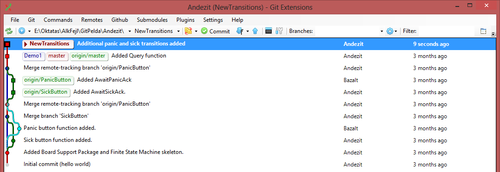

A szépítés abban nyilvánul meg, hogy a bsp.c-ben a handleCommunication által kiírt szövegben az "awaiting" el volt írva, ezt most javítja és commitolja.

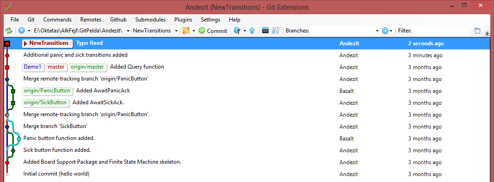

## Bazalt: közben kibővíti a logolást

Bazalt egy MoreLogging ágat hoz létre, majd oda commitolja a módosításait, hogy minden állapotváltozás kerüljön bele a logba.

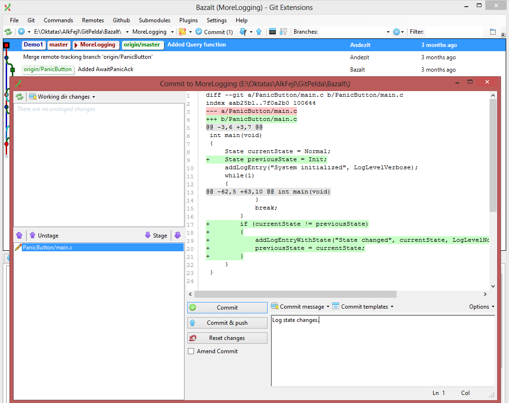

Majd pusholja is a fejleményeket az originra.

## Andezit rebasel

Andezit mielőtt pusholná az állapotátmenetes munkáját, nyom egy fetch all-t.

Ekkor látja, hogy Bazalt is dolgozott. Most tegyük fel, hogy Andezit nem a merge mellett dönt, hanem rebaselni akar, hogy a repository history ne legyen olyan kusza.

A merge sikeres:

(Látszik, hogy mivel a main.c-t ketten is módosították párhuzamosan, a GIT merge toolnak a 3-way-merge üzemmódra kellett átváltania, mivel fájlon belüli konkurrens változásokat is ki kellett bogoznia. De ez ütközés nélkül sikerült neki.) 

Andezit pusholja a NewTransitions ágat. Ezután Bazalt nyom egy fetch all-t és az alábbiakat látja:

## Bazalt bővíti a logolást

Tegyük fel, hogy Bazalt még mielőtt mergelné Andezit új állapotátmeneteit, kiegészíti a főciklus switch-ét egy default case-szel.

Majd Bazalt úgy dönt, hogy a default state jó lenne, ha assertelne is, így ezt is commitolja:

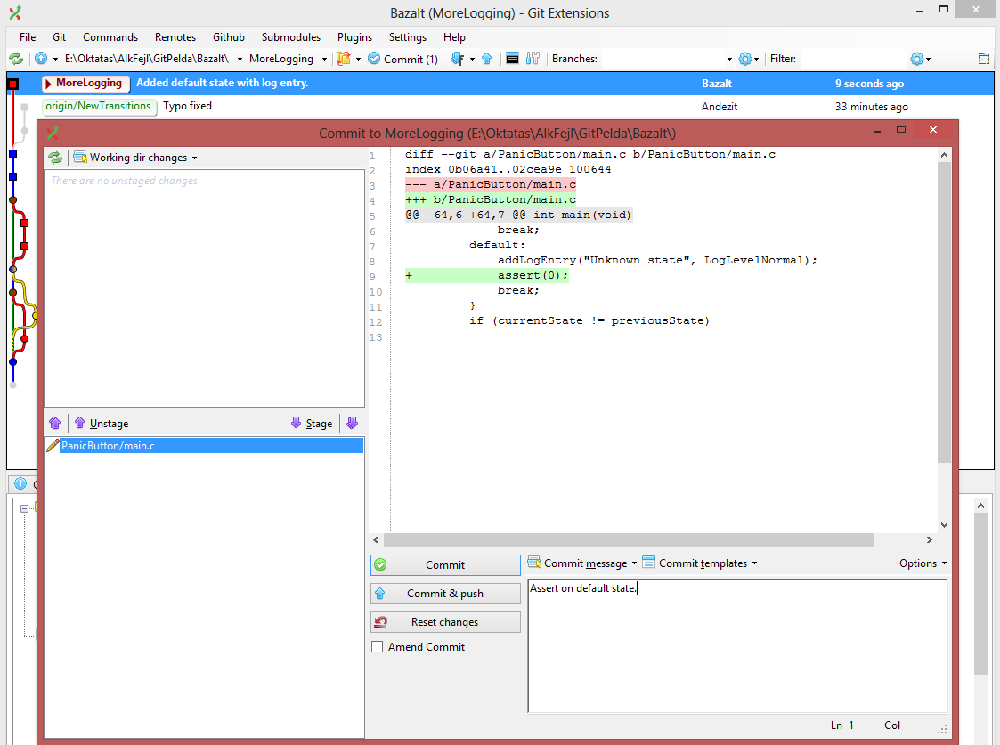

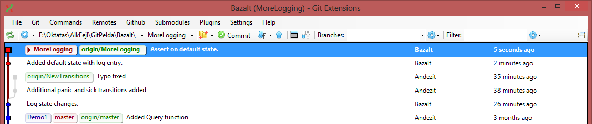
 
Ezután Bazalt szól Andezitnek, hogy miket készített. 

## Andezit cherry pickel

Andezit úgy dönt, hogy kiegészíti az új állapot átmeneteit log bejegyzésekkel.

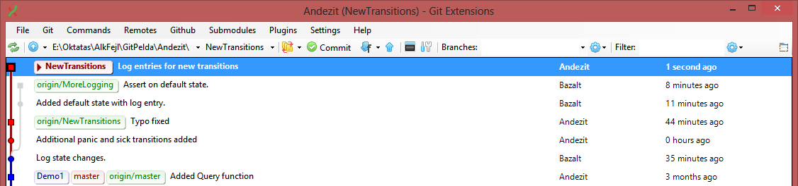

És hogy a log így teljes legyen, át akarja venni Bazalt default állapotát, viszont az assert használatot még nem.

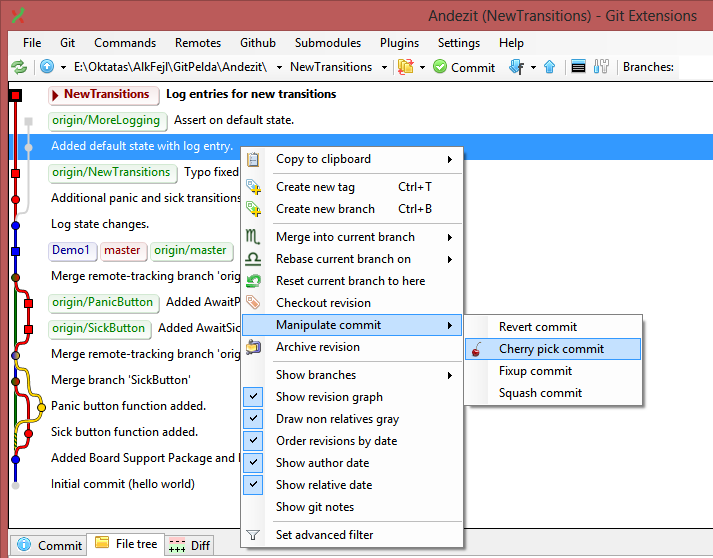

A cherry pick sikeres:

Mivel Andezit nem kérte a cherry picknél, hogy automatikusan commitolódjon is, most az átvett változások stagelve vannak, de nem commitolva. A commithoz rányom a Commit gombra, ahol már minden elő van készítve (Bazalt eredeti commit szövegével együtt):

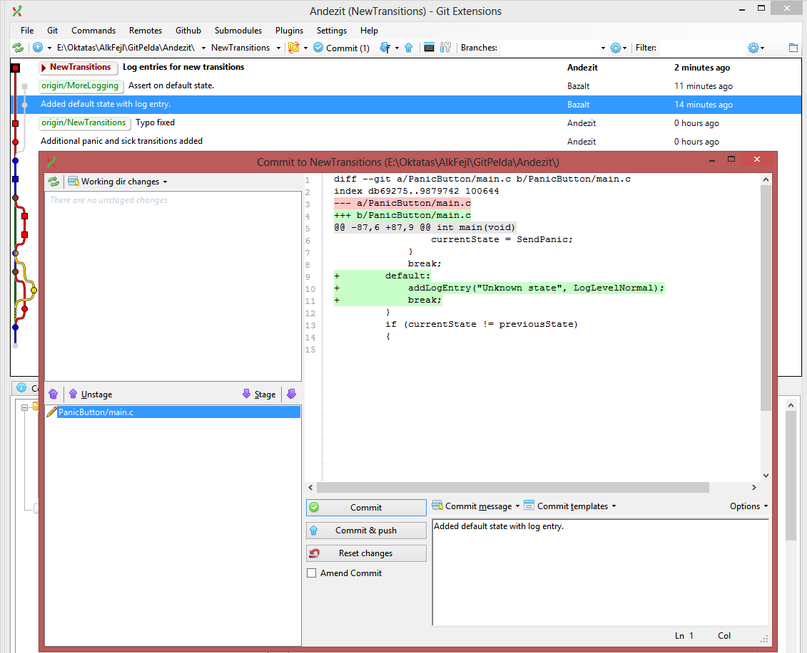

Pusholva a fejleményeket Andezitnél a végeredmény így néz ki:

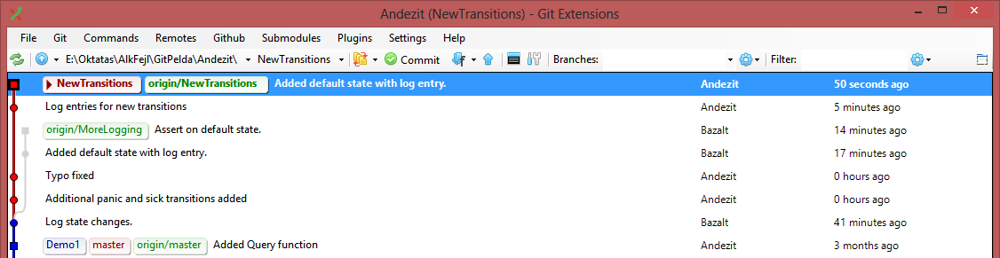

## Bazalt mergel és kész a demo2

Bazalt ezután úgy dönt, hogy készen állnak az új demóra, így először a MoreLogging ágba mergeli az origin/NewTransitions ágat (a merge folyamatot nem zavarja, hogy magába mergel egy olyan commitot, amit ő maga készített korábban, mivel a merge tool csak konstatálja, hogy ezügyben nincsen eltérés.)

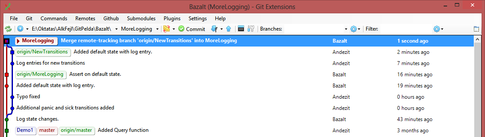

Ekkor Bazalt még utoljára ellenőrzi, hogy tényleg minden szépen fut-e. Sajnos kiderül, hogy a program nem is fordul, ugyanis sikerült duplázni a switch default ágát:

        default:
            addLogEntry("Unknown state", LogLevelNormal);
            break;
        default:
            addLogEntry("Unknown state", LogLevelNormal);
            assert(0);
            break;

Még jó, hogy ellenőrizte. A merge még sem volt olyan zökkenőmentes. Semmi gond, gyors javítás, utána pedig commit. Jobban belegondolva ez a merge része kellett volna, hogy legyen. Mivel a merge commitot még nem pusholta, éppen módosíthatja is. Erre való az "amend commit": a mostani commitot beleolvasztja az előzőbe. Tipikusan akkor használjuk, ha valami lemaradt:

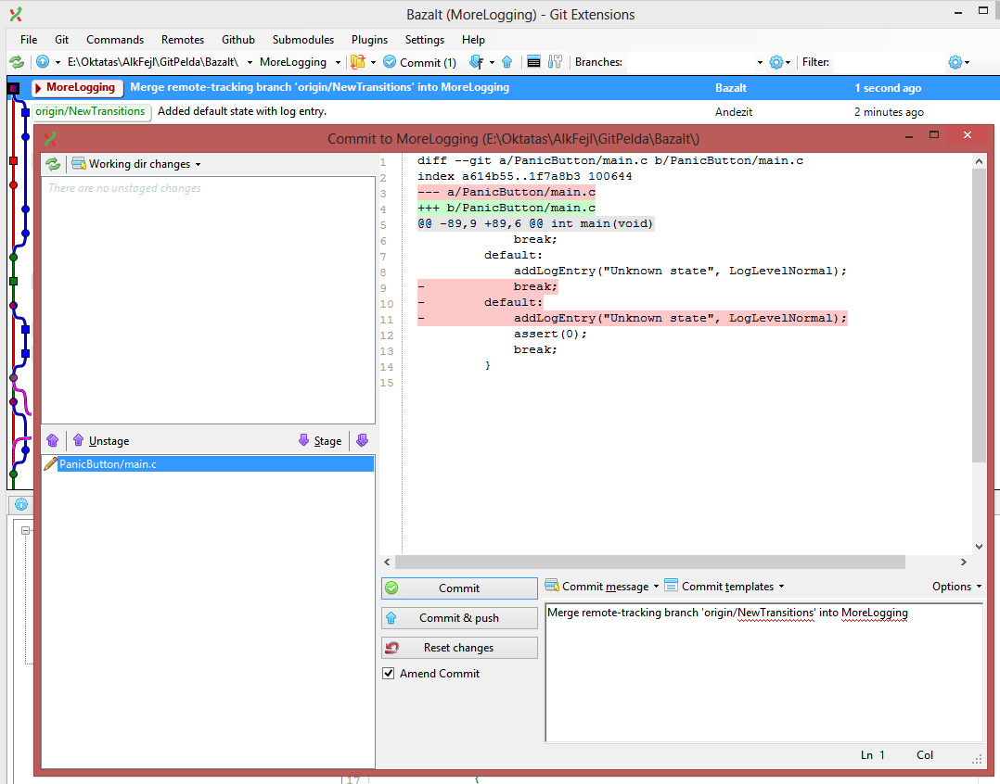

A GIT azonnal figyelmeztet, hogy ezt csak akkor tegyük, ha mások még nem látták az előző commitot, mert módosítjuk azt is:

Miután Bazalt meggyőződött róla, hogy a program most már tényleg helyesen működik, átvált a master ágra, mergeli bele a MoreLogging-ot (új merge commitot hozva létre, a fast-forward a master esetében nem olyan nyerő). Pusholja a master branchet és rárakja a Demo2 taget is (és azt is pusholja):

Befejezésül Andezit és átvált a master branchére és mergeli bele (fast-forwarddal) az új origin/master-t.
