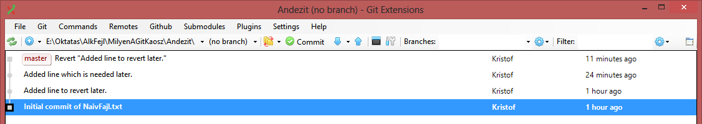

# GIT tűzvédelem
Avagy milyen az, amikor a repositoryban elszabadul a káosz. És főleg mit lehet olyankor tenni.

Ez egyébként azért fontos kérdés, mert sokak azért nem szeretik használni a GIT-et, mert félnek, hogy valamit összekuszálnak és elvesztenek valami fontosat. (Vagy csak a többiek igen ingerültek lesznek.)

A kísérletezéshez készítettem 3 repositoryt, melyek Andezit, Bazalt, és az Origin (szerver) repositoryját fogják képviselni.

    $ cd Origin
	$ git init --bare --shared=all
	$ cd ..
	$ git clone Origin Andezit
	Cloning into 'Andezit'...
	warning: You appear to have cloned an empty repository.
	done.
	$ git clone Origin Bazalt
	Cloning into 'Bazalt'...
	warning: You appear to have cloned an empty repository.
	done.

No ezzel meg is vagyunk. (A fentiekben az Origin a klónozandó repository neve, az Andezit és Bazalt pedig a könyvtárak, ahova klónozni szeretném őket. Így minden szépen egymás mellé került.)

Most már csak egy fájl kell, amin lehet kísérletezni. Ez lett a NaivFajl.txt, az alábbi kezdeti tartalommal:

	Ez itt a naív fájl, ami azt hiszi, hogy nyugis helyen van.

## Reset current branch

A következőkben tegyül fel, hogy Andezit kiegészítt a szövegünket egy sorral, és ezt a változtatást utána majd vissza akarja vonni.
 
	Ez itt a naív fájl, ami azt hiszi, hogy nyugis helyen van.
	Ez meg az a szöveg, aminek a beszúrását majd visszavonjuk.

Az utolsó commitot visszavonni könnyű, hiszem csak az előzőre vissza kell rakni a branchet. Próbáljuk is ki, jobb klikk és "Reset current branch to here":

Resetelni többféle módon tudunk:

  * Soft: csak a branch hivatkozását módosítja, a stagelt fájlok (ez az index tartalma) és a munkakönyvtár nem változik. Gyakorlatilag ha újra commitolunk, visszaállíthatjuk a reset előtti állapotot.
  * Mixed: a soft eset mellett az indexet is visszaállítja, ami kiveszi a stageből a fájlokat. Egy stageléssel és committal ezt is vissza tudjuk még állítani.
  * Hard: a fentiek mellett a munkakönyvtárat is reseteli, vagyis ez az, ami ténylegesen a fájlokat is visszaállítja egy korábbi állapotra.

Most a hard verziót választjuk, mert az az igazán veszélyes. Jön is egyből a figyelmeztetés:

A művelet sikerült:

A HEAD az a commit, ami a következő létrehozott commit szülője lesz. Jelen esetben ez a master ágat követi, a HEAD és a master most az első commitra mutat.

## Egy commit elveszítése és visszaszerzése

Na és ha mégsem ez lett volna az eredeti szándék, akkor ilyenkor szokott jönni a pánik: eltűnt a commitom, jajj, a sok órás munkám!

Szerencsére a repositoryból nem törlődik (csak néha, takarításkor) az a commit, ami nem kapcsolódik a commitok gráfjához. Csak éppen már nincsen rá hivatkozás.

Az eltűnt commitot GitExtensions alól már nem tudjuk előszedni, de parancssorból igen. Nem kell mást tenni, mint lekérni a reflog-ot, vagyis a referencia változások logját. Ebben most az alábbiak szerepelnek:

	$ git reflog
	af6290e HEAD@{0}: reset: moving to af6290ef74fdf4696d9da1319d7f33cdc3ab1b33
	6c10c8e HEAD@{1}: commit: Added line to revert later.
	af6290e HEAD@{2}: commit (initial): Initial commit of NaivFajl.txt

Látszik, hogy volt ott nekünk egy commitunk, amit a hash kódja azonosít: 6c10c8e.
Ilyenkor vagy létrehozunk egy branchet erre a commitra, vagy a reset parancsot adjuk ki megint, csak most a célnak az elveszett commitot adjuk meg:

	$ git reset 6c10c8e
	Unstaged changes after reset:
	M       NaivFajl.txt

Ezután frissítve a GitExtensions képét:

Huhh, visszajött. Mint ahogy a konzolon is szólt a git és a GitExtensionsben is látszik, van valami commitolni való, vagyis a munkakörnyvtárban van valami, amit még nem commitoltunk. Mi lehet az?

Mivel most a munkakönyvtárban még nem hoztuk vissza a majdnem elveszített változást (ott most a NaivFajl.txt csak egy soros), a GIT jelzi, hogy a master által mutatott állapothoz képest "törlődött" az a 2. sor. No ez nem teljesen az, amit mi szeretnénk, így a Commit ablakban a NaivFajl.txt-re jobb gombbal kattintva "Reset file changes"-zel vonjuk vissza a "változásokat". Vagyis minden legyen olyan, amilyen a HEAD (és master) által mutatott commit szerint van:

Néhány megjegyzés:

  * A "git reflog" parancsnál részletesebb információkat is ad a "git log -g", ha szükséges.
  * Ez a szituáció részletesen le van írva a GIT dokumentációban: https://git-scm.com/book/en/v2/Git-Internals-Maintenance-and-Data-Recovery
  * A sehonnan el nem érhető objektumok (pl. commitok) törlésére a "git prune" parancs szolgál: http://git-scm.com/docs/git-prune

## A revert commit (először)

Ha egy olyan commitot akarunk visszavonni, ami már régebben volt és azóra ráépülek más commitok, akkor nem tudjuk a resettel ilyen könnyen megoldani. Ilyenkor kell a revert commit, vagyis egy olyan commit, ami egy másik "inverze".

Ezért először Andezit felvesz egy új sort:

	Ez itt a naív fájl, ami azt hiszi, hogy nyugis helyen van.
	Ez meg az a szöveg, aminek a beszúrását majd visszavonjuk.
	Ez meg az a sor, amit meg akarunk tartani.

És commitolja:

Ezután jön a felvetés, hogy mi lenne, ha a második commitot visszavonnánk.
Ehhez a visszavonandó commiton kiválasztjuk, hogy "Revert commit":

Most kérhetnénk, hogy egyből commitolja a revert commitot, de inkább tegyük meg ezt kézzel, hogy lássuk, hogyan is néz ki belülről.

Oops, nem sikerült visszavonni. Sajnos a merge tool nem tudta kideríteni, hogy mit is kell módosítani ahhoz, hogy eltűnjön a törlendő commit eredménye, így elindul a kézi merge folyamat:

Szerencsére a KDiff3 okos eszköz és ő már rájött, hogy különösebb segítség nélkül mit kell tennie:

A KDiff sajnos a magyar karakterekkel kicsit hadilábon áll, de ez nem olyan zavaró:

Mivel a helyzetet helyesen megoldotta, csak el kell mentenünk az eredményt és kilépni.

Most lássuk, mit mutat a Commit ablak.

Látszik, hogy a stagelt változás tényleg szépen visszavonja a törölni kívánt commitot. A commit szövegében pedig benne van, hogy mi történt és mivel volt gond. (Ezt persze nyugodtan átíthatjuk.)

Ami itt még érdekes, az egy "NaivFajl.txt.orig" nevű fájl, ami megjelent. Ennek tartalma:

	Ez itt a naív fájl, ami azt hiszi, hogy nyugis helyen van.
	<<<<<<< HEAD
	Ez meg az a szöveg, aminek a beszúrását majd visszavonjuk.
	Ez meg az a sor, amit meg akarunk tartani.
	=======
	>>>>>>> parent of 6c10c8e... Added line to revert later.

A GIT alapvetően parancssoros eszköz és a mergehez ez a fájl mutatja, hogy a NaivFajl.txt miben tért el az eredeti verziótól. (A KDiff3 is ezt használta fel.) Mivel ez nekünk nem kell, jobb gombbal és "Reset file changes"-t választva töröljük, a NaivFajl.txt változásait pedig commitoljuk.

## A revert commit visszavonása

Ha már így belejöttünk a visszavonásokba, gondoljuk át, revert commitot hogyan lehet visszavonni. Ha még nem mentünk tovább, a reset módszer is működik. Ha meg továbbmentünk, akkor kiderül, hogy a revert commit visszavonása szintén egy revert commit (a revert commitra): a revert commit semmiben nem különbözik egy hagyományos committól, csak éppen a benne lévő változás mellesleg egy korábbinak pont az ellenkezője. És mivel már tudjuk, hogy bármilyen commitot hogyan lehet visszavonni, ezt is ugyanúgy vissza tudjuk vonni.

## Detached head és arra commit

Korábban volt szó arról, hogy mi a HEAD: egy referencia arra a commitra, "amin éppen állunk". Jelen esetben ez ugyanaz, mint amin a master branch áll.

(Ha megnézzük az Andezit/.git/HEAD fájl tartalmát, abban bizony pont ez van:

	ref: refs/heads/master

és már nincs is benne.)

Normál körülmények között nem szokott előfordulni, hogy a HEAD nem egy branchre mutat, de ki lehet próbálni, milyen az. Ehhez checkout-oljunk egy olyan commitot, ami nem egy branch végén áll. Például a legelsőt:

A GIT figyelmeztet is, hogy biztos ezt akarjuk-e.

A GIT végrehajtja a checkout-ot, de egyúttal azt is leírja, hogy mi a helyzet:

Detached head állapotban vagyunk: 

Ha innen commitolunk, akkor az semmilyen formában nem befolyásolja a brancheket, mivel egy új részfát kezdünk el. Ilyesmit leginkább csak akkor szoktunk tenni, ha valamit gyorsan ki akarunk próbáli egy korábbi verzión, bár akkor is szerencsésebb egy branchet létrehozni rá és azt checkout-olni. Erre a lehetőségre hívja fel a figyelmünket az üzenet is: ha meggondolnánk magunkat és amit innen commitolunk, mégis fontos, akkor bármikor létrehozhatunk egy új branchet, ami a mostani helyre fog mutatni.

Csak a teljesség kevéért commitoljunk egyet, hogy megnézzük, milyen az:

Jön is a figyelmeztetés, hogy ezt így könnyen el tudjuk ám veszíteni:

De mi csak menjünk most tovább.

És íme az eredmény:

Ha tehát ezt meg is akarjuk tartani, akkor fontos, hogy egy branchet hozzunk létre rá. Tegyük meg ezt is: jobb klikk és "Create now branch". A felugró ablakban adunk neki egy nevet és már készen is van.

## Rebase a push után

Egy további hibalehetőség az, ha rebaseljük a munkánkat, de azután, hogy már pusholtuk.

Tegyük fel, hogy Andezit mindkét ágát pusholja, Bazalt pedig pullolja őket és még commitol is egyet a frissen letöltött fromDetachedHead ágra:

Igen ám, csak Andezit közben dolgozik tovább, commitol egyet és úgy dönt, hogy rebaseli a munkáját a master ágra:

Van egy kis merge conflict, de a KDiff3-mal megoldjuk:

Ilyenkor a rebase miatt a merge toolnak végig kell mennie a rebaselt commitokon és végre kell őket hajtania a master ág végéről kezdve. Közben ha ütközés van, akkor lehet, hogy be kell neki segíteni. (De ne felejtsük el, hogy ha bármi gond van, a rebase előtti állapotra mindig vissza tudunk térni, így nagyon aggódni emiatt sem kell!)

És ezen a ponton Andezit úgy dönt, hogy pusholja a változásokat. Igen ám, csak a saját fromDetachedHead ágát nem tudja pusholni, mivel az nem folytatása az origin/fromDetachedHead ágnak:

Itt két dolgot tehet Andezit: vagy mergeli az origin/fromDetachedHead ágat a saját lokális fromDetachedHead ágába, vagy nem foglalkozik ezzel az ággal többet, előre hozza a mastert és kész.

Nézzük meg mindkét verziót:

### A rebaselt ág hátrahagyása

Áttérve a master ágra és azt fast-forwarddal előrehozva a fromDetachedHead branchre, végül pusholva mastert az alábbi helyzet kapjuk:

És mit lát ebből Bazalt?

Azt, hogy amire eddig alapozta a munkáját, az lemásolódott a master ágra és Andezit ott megy tovább. Tehát ő is kénytelen lesz rebaselni vagy mergelni a munkáját a master ágra. (Ez egy commit esetén nem annyira baj, de nagyobb fejlesztések esetén határozottan rossz, ha mindenkinek meglepetés szerűen rebaselni kell a munkáját.)

### Rebaselt ág mergelése

Tegyük fel, hogy Andezit rájött, hogy ez így nem jó, ezért mergeli az origin/DetachedHead ágat a lokális fromDetachedHead ágába, hogy utána pusholni tudja.

Egy igen érdekes helyzet állt elő: mivel a két ág között valójában nincs eltérés, a merge commit létrejön, de nem tartalmaz semmilyen változást. Viszont így már lehet pusholni mindent.

És ebből Bazalt mit lát? Ezt:

A helyzet kicsit kusza, de alapvetően neki ugyanúgy az eddigi munkáját mergelnie kell a távoli ágakhoz. Azért egy fokkal egyszerűbb lett volna, ha Andezit csak akkor rebasel, ha már mindent commitolt, amit akart. Mert akkor egyetlen commit sorozatot helyez át, amin a többiek könnyebben át tudnak venni és nem duplázódnak commitok.
