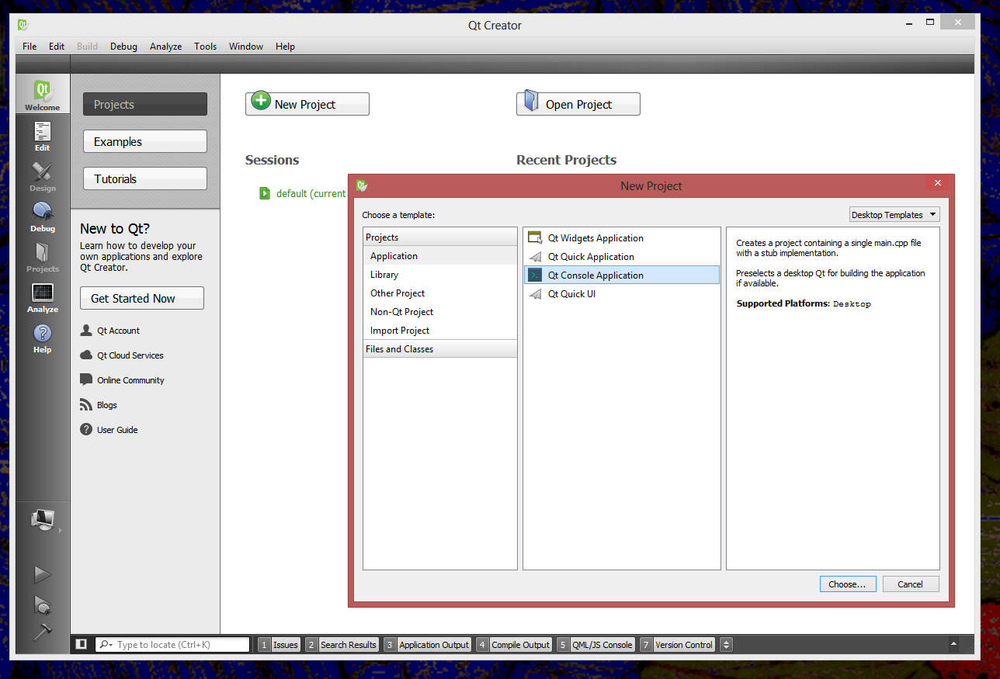
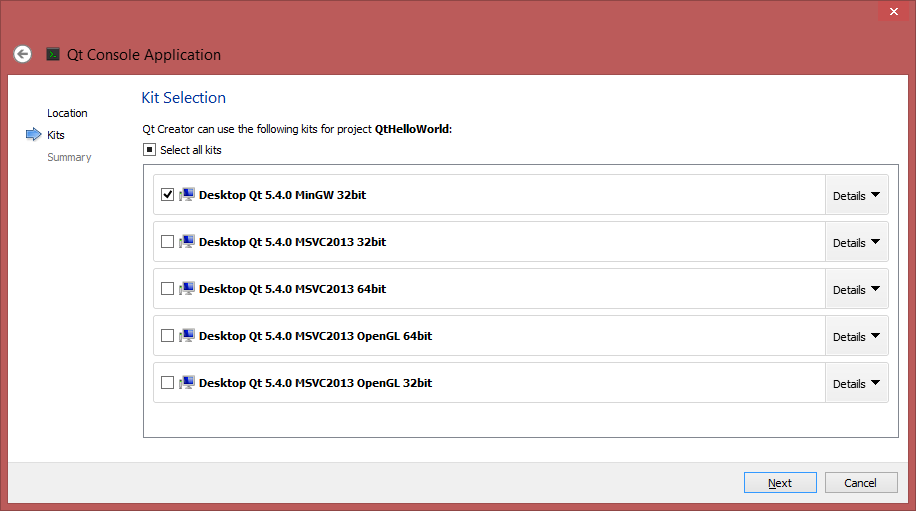
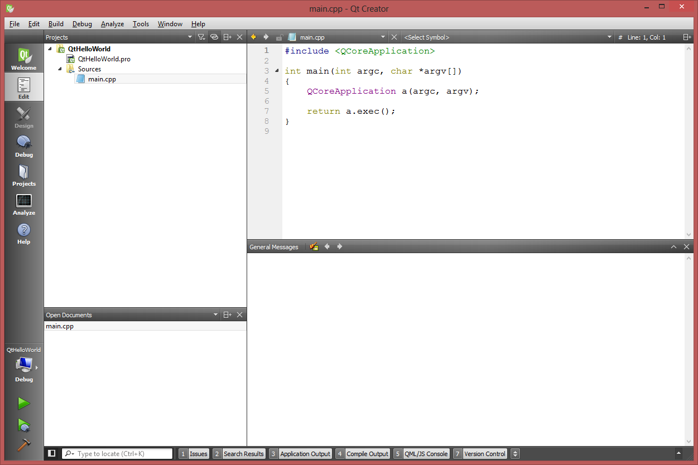

# Qt toolchain és Hello world alkalmazás

A Qt egy C++ és (elsősorban) GCC fölé épülő, cross-platform környezet. Náhány előnye, amit érdemes lehet kihasználni:

  * C++-ban elérhetünk egy kiterjedt osztálykönyvtárat és nem csak az STL-re támaszkodhatunk.
  * A QML (vagy a Widgetek) segítségével könnyen tudunk GUI-t, vagyis grafikus felhasználói felületet készíteni.
  * Cross-platform, így többek között Windows, Linux és iOS alatt is használható.

Letölteni innen lehet: [https://www.qt.io/](https://www.qt.io/)

A Qt környezet alapvetően a GCC fordítócsaládra épít (Windows alatt ezt a MinGW formájában érhetjük el), de szükség esetén kiválóan működik a Visual Studio fordítójával is.

## A Qt+MinGW toolchain részei

C++ esetén a Qt toolchain az alábbiak szerint működik:

  * Qt Creator (community edition): az ingyenes, grafikus fejlesztői környezet (IDE).
  * MinGW: a fordító (vagy GCC Linux alatt, clang iOS alatt)
  * make: a klasszikus Linuxos make, mely a Makefile-ok alapján elvégzi a függőségek feloldását és a megfelelő sorrendben lefordítja a programunk (megváltozott) részeit.
  * qmake: a Qt egy Makefile generátor programja. Gyakorlatilag a qmake számára kell megadnunk, hogy milyen forrásfájlokból áll a programunk, ami alapján ő majd generálja a make számára a Makefile-okat.
  * MOC: A Qt egyik nagy magic része, a Meta-Object Compiler. Ez a Qt-s C++ fájlokból szabványos C++ fájlokat generál, hogy a GCC valójában már azokat fordítsa majd le. Ennek segítségével érték el a Qt fejlesztői, hogy Qt alatt olyan nyelvi elemeket is lehet használni (pl. signals and slots), amit a szabvány C++ sajnos nem támogat. Ráadásul ezeket a használt fordítótól függetlenül használhatjuk, mivel a fordító már szabványos C++ kódot fog kapni.
  * gdb: Ez a gcc debuggere. Amikor a Qt Creatorban debuggoljuk a programunkat, a háttérben valójában ezzel a programmal kommunikálunk. Ő rakja le a töréspontokat, folytatja a végrehajtást, kéri le a változó értékeket stb. Közvetlenül ritkán van vele dolgunk.

## Egy Qt projekt létrehozása

Most pedig nulláról indulva hozzunk létre egy konzolos hello world alkalmazást és nézzük meg, hogyan is épül fel.

A Qt Creatort elindítva és a New Projectre kattintva válasszuk az Application - Qt Console Application lehetőséget. A projekt neve "QtHelloWorld" lesz.

Ha többi toolchain is fent van a gépünkön (pl. Visual Studio), akkor választhatunk, hogy melyekre akarjuk előkészíteni a projektet. Lehet többre is, de most a MinGW elegendő lesz:

Next-next-finish engineering és készen is vagyunk:

F5-re le is fordul és el is indul a program, bár még nem tesz semmit.

(Qt Creatorban a bal alsó sarokban tudjuk kiválasztani, hogy Debug vagy Release módban fordítjuk a programot. A Ctrl-R debugger nélkül futtatja a programot (sima zöld "play gomb"), az F5 pedig debuggerrel (zöld play gomb bogárral). Egy debug módban lefordított programot simán lehet debuggolás nélkül is futtatni.)  

Írjuk át a programot az alábbira:

	#include <QDebug>

	int main(int argc, char *argv[])
	{
	    Q_UNUSED(argc);
	    Q_UNUSED(argv);
	    qDebug() << "Hello, world!";
	    return 0;
	}

Mivel a program akkor szép, ha nem generál csomó warningot, úgy illik, hogy a nem használt változókat a Q_UNUSED makróval jelöljük. (A háttérben ez a makró használja a paraméterét, de semmi értelmeset nem csinál vele. De megnyugtatja a fordítót, hogy tényleg tudunk róla, hogy ezt nem használjuk.) 

A kíváncsiak nyomhatnak a Q_UNUSED-on egy F2-t is (vagy jobb klikk, Follow symbol under cursor) és megnézhetik, pontosan mi van a makróban.

(Megjegyzés: amit kitöröltük, egy QCoreApplication objektumot hozott létre és indított el. Ez az objektum például akkor kell, ha grafikus felületet akarunk készíteni, mert ő indítja el a Qt-s ablakok eseménykezelőit. De most ilyesmire nincsen szükségünk.)

A qDebug() szintén egy makró, melynek visszatérési értéke egy debug célokra szolgáló stream. Olyasmi, mint az std::cout sima C++ alatt. A lényeg, hogy tudunk vele a konzolra írni.

Ezzel végeztünk is magával a programunkkal. Nézzük meg a projekt fájlt, a QtHelloWorld.pro-t:
 
	#-------------------------------------------------
	#
	# Project created by QtCreator 2015-07-13T16:04:52
	#
	#-------------------------------------------------
	
	QT       += core
	QT       -= gui
	
	TARGET = QtHelloWorld
	CONFIG   += console
	CONFIG   -= app_bundle
	
	TEMPLATE = app
	
	SOURCES += main.cpp

Ennek a fájlnak két fő feladata van: a Qt környezet konfigurálása (pl. akarunk-e GUI támogatást a programunkba, alkalmazást (exe) vagy osztálykönyvtárat (lib) akarunk-e fordítani, vagy ha több projektünk is van, amiket együtt kell lefordítani (pl. egy alkalmazás, aminek egy részét lib-be fordítjuk), azt is itt kell megadni.

A QT kezdetű sorok bekapcsolják a Qt core funkciókat és kikapcsolják a GUI funkciókat. A célalkalmazás (vagyis a neve) a QtHelloWorld, ami egy sima konzol alkalmazás. Az alkalmazás sablon alapján készül a konfiguráció, nincs benne header fájl és forrás fájl is csak egy: a main.cpp.

## A projekt a fájlrendszerben

Ha megnézzük azt a könyvtárat, ahol a projektünk van, észrevesszük, hogy ott van még egy fájl QtHelloWorld.pro.user néven. Ez a projekt felhasználói szintű beállításait tartalmazza, ezért tipikusan például verziókövetni nem is szoktuk, mert mindenkinél más. (Ha letöröljük, a projekt megnyitásakor újra meg kell adnunk, hogy milyen toolchaint akarunk használni, mert az például ebben van.)

Ha belenézünk, többnyire a beállításaink vannak benne kulcs-érték párok formájában. Pl. "EditorConfiguration.AutoIndent" és "ProjectExplorer.BuildConfiguration.BuildDirectory".

Ami egyből feltűnhet, hogy a fordítás eredménye, az exe fájl nincs itt. Erre pont a fent említett BuildDirectory beállítás adja meg a választ: egy könyvtárral kijjebb van egy build-QtHelloWorld-Desktop_Qt_5_4_0_MinGW_32bit-Debug nevű könyvtár. Ezt hívják shadow buildnek: a fordítás kimenete máshova kerül, hogy a forráskód könyvtárát ne "szemetelje" össze. A neve utal a fordítási beállításokra (MinGW és Debug mód), benne pedig az alábbiak vannak:

  * a gyökerében van Makefile, Makefile.Debug és Makefile.Release. A Makefile működésére most nem térünk ki. Lényeg, hogy ez már konkrétan tartalmazza, hogy mely fájlokat kell lefordítani és milyen beállításokkal kell meghívni a fordítót és a linkert. Van egy közös rész, valamint a Debug és Release mód különbségeit tartalmazó fájlok. 
  * debug és release könyvtárak: a release könyvtárunk még üres, mivel release módban még nem fordítottuk le egyszer sem a programunkat. A debugban található a keresett exe fájl, valamint a main.cpp fordításából származó main.o (object fájl).

(Ha esetleg a munkánk során arra gyanakszunk, hogy valami nem fordult újra, pedig kellene neki, akkor egyrészt a Qt creatorban a projekten jobb gombbal kattintva a Clean ebben a build könyvtárban takarít, vagy akár magát a könyvtárat is letörölhetjük, az akkor biztosan mindent újrageneráltat.)

## A fordítási folyamat lépésről lépésre

Most nézzük meg, pontosan mik történnek, amikor fordul a programunk. Ehhez letöröltem a build könyvtárat és a projektre kattintva kértem egy Build-et. Lent a Compile Output ablakban az alábbiak jelentek meg.

	16:33:48: Running steps for project QtHelloWorld...

Most a QtHelloWorld projekthez szükséges lépéseket futtatjuk.

	16:33:48: Starting: "C:\Qt\5.4\mingw491_32\bin\qmake.exe" E:\Oktatas\AlkFejl\QtHelloWorld\QtHelloWorld.pro -r -spec win32-g++ "CONFIG+=debug"

Indul a qmake. Megkérjük, hogy a QtHelloWorld.pro fájl alapján készítsen Makefile-okat win32 alatti G++ (GCC C++ fordítója) fordításhoz. Debug módban szeretnénk fordítani.

	16:33:49: The process "C:\Qt\5.4\mingw491_32\bin\qmake.exe" exited normally.

Szuper, exited normally, a qmake lefutott.
	
	16:33:49: Starting: "C:\Qt\Tools\mingw491_32\bin\mingw32-make.exe" 
	C:/Qt/Tools/mingw491_32/bin/mingw32-make -f Makefile.Debug

Indul a MinGW make-je, méghozzá a Makefile.Debug fájl alapján fog dolgozni.

	mingw32-make[1]: Entering directory 'E:/Oktatas/AlkFejl/build-QtHelloWorld-Desktop_Qt_5_4_0_MinGW_32bit-Debug'

A sor elején látszik, hogy most már a make üzeneteit látjuk. Először is belép a munkakönyvtárába. 

	g++ -c -pipe -fno-keep-inline-dllexport -g -frtti -Wall -Wextra -fexceptions -mthreads -DUNICODE -DQT_CORE_LIB -I..\QtHelloWorld -I"C:\Qt\5.4\mingw491_32\include" -I"C:\Qt\5.4\mingw491_32\include\QtCore" -I"debug" -I"." -I"C:\Qt\5.4\mingw491_32\mkspecs\win32-g++" -o debug\main.o ..\QtHelloWorld\main.cpp

A make elindította a g++ fordítót. Itt elég sok parancssori kapcsoló van, melyeknek most csak egy része érdekes számunkra:

  * -Wall -Wextra: csomó warningot bekapcsol, vagyis elég kritikusan nézi a forráskódot.
  * -I: Ez negy nagyon fontos kapcsoló: ezek adják meg az include könyvtárakat, vagyis hogy a fordító hol keresse a .h fájlokat.
  * -o: output file, vagyis a fordítás eredménye ide kerül. Jelen esetben a main.o object fájl az.
  * Végül kapcsoló nélkül a bemeneti cpp fájlt látjuk.  

Ezzel a compiler el is végezte minden feladatát, mivel több cpp fájlunk nincsen. Ha lenne, mindre egyesével meghívódna a fordító.

	g++ -Wl,-subsystem,console -mthreads -o debug\QtHelloWorld.exe debug/main.o  -LC:/Qt/5.4/mingw491_32/lib -lQt5Cored 

Mivel a make ezzel minden cpp fájlt lefordított, meghívja a linkert (ami jelen esetben szintén a g++ egyik funkciója, de működésében attól még a fordítási folyamat egy alapvetően másik lépése). Itt a fontosabb paraméterek:

  * -o: most is a kimeneti fájl neve, ami most már exe.
  * Ezután jönnek a bemeneti fájlok, most csak a debug/main.o, az előző lépés eredménye.
  * -L: library path megadása, vagyis ezekben a könyvtárakban keresi majd a linker a könyvtárakat (lib fájlok).
  * -l: konkrét libraryk, amiket linkelni szeretnénk. Fontos, hogy a -L az elérési utakat adja meg, a -l pedig a függőségeket, amikre szükség lesz.

Itt érdemes megemlíteni, hogy a libraryket is lehet release és debug módban is fordítani, és ha bináris formában kapjuk meg őket, akkor tipikusan mindkettőt mellékelik. A debug módban fordított library neve általában azonos a release módúval, kivéve a név végén lévő "d"-t, mint a fenti példában is a Qt5Cored.

	mingw32-make[1]: Leaving directory 'E:/Oktatas/AlkFejl/build-QtHelloWorld-Desktop_Qt_5_4_0_MinGW_32bit-Debug'

A make végzett ebben a könyvtárban, visszalép egyet. (A make egész könyvtár szerkezeteket be tud járni úgy, hogy minden könyvtárban lehet neki feladatot adni Makefile formájában. Például több program is lehet egymás mellett, mindnek lehet saját Makefile-ja, és a gyökérben lehet egy olyan, ami minden könyvtárra ráküldi a make-et, a részleteket meg majd ott megtalálja.)

	16:33:50: The process "C:\Qt\Tools\mingw491_32\bin\mingw32-make.exe" exited normally.
	16:33:50: Elapsed time: 00:01.

Sikeresen végeztünk. Ráadásul egész gyorsan.

Ami a fentiekből fontos: minden hiba és warning, ami az "Issues" ablakban megjelenik (vagy általában bármely fejlesztő környezet hibajelző ablakában), az innen származik, a fordító a konzol ablakba írja ki őket. Vagyis például ha a fordító nem talál egy include fájlt, akkor a konzol ablakban megkeresve, hogy mikor kaptuk ezt a hibát, meg lehet azt is nézni, hogy milyen paraméterekkel futott le a fordító. Onnan pedig kiderül, hogy pontosan melyik könyvtárakban kereste a header fájlokat. A header és lib fájlok meg nem találásával kapcsolatos hibákat tipikusan innen lehet megoldani.  

A fordítás során kaphatunk a fordítótól hibákat (pl. ismeretlen változó, szintaktikai hiba stb.), vagy a linkertől ("undefined reference"). Ez utóbbi már nem a forráskód egy konkrét sorára hivatkozik, hanem arra utal, hogy egy vagy több object fájl hivatkozik valamire, amit viszont semelyik object vagy library fájlban nem talál a linker, így a hívási csonkokat nem tudja hova bekötni. (Ilyen esetben azt kell ellenőrizni, hogy az a cpp fájl, amiben a nem talált függvény van, tényleg lefordult-e, és a linkernek fel van-e sorolva bemenetként (vagy libraryként a -l kapcsolóval), a linker pedig nem reklamált-e, hogy nem találja.

## Fájlok: projekt, forráskód, header, fordítási termékek és társaik

A toolchain és fordítás után még egyszer menjünk végig az egyes fájlokon, amikkel egy projektben találkozhatunk:

  * pro: Qt projekt fájl, a qmake bemenete. Az alapvető fordítási beállításokat és a forrásfájlokat, valamint a header fájlokat tartalmazza. 
  * pri: Olyan projekt fájl, amit include-ol a pro fájl. Szintaktikáját tekintve megegyeznek, csak a felhasználás más. Például ha több projektnek vannak közös beállításai, azokat egy közös pri fájlból vehetik át.
  * Makefile: A qmake generálja, a make számára parancsfájl. Leírja, hogy milyen sorrendben és milyen paraméterekkel kell meghívni a fordítót.
  * Makefile.Debug: A Makefile kiegészítése Debug módra.
  * Makefile.Release: A Makefile kiegészítése Release módra.
  * cpp: C++ forrásfájl. A G++ minden egyes CPP fájlt egymástól függetlenül (!) lefordít és object fájlt készít belőlük. A fájlon kívüli hivatkozások (pl. máshol definiált függvények, változók) az object fájlban még csak csonkok, amiket majd a linker összeköt. (A linker a nevét is innen kapta.)
  * h: header fájl. A cpp fájlok includeolják őket (amitől a tartalmuk egy az egyben bemásolódik a cpp fájlba). Feladatuk, hogy deklaráljanak másik cpp fájlokban definiált osztályokat, metódusokat, változókat. (Előfordul olyan is, hogy a header fájlban van megírva a tényleges függvénytörzs is. Erre akkor van szükség, ha a cpp lefordításához már tudni kell a függvény belső tartalmát is. Ez gyakori eset a C++ sablonoknál (template).) A header fájlok tartalma csak egyszer kerülhet bele egy cpp fájlba, mert különben többször deklarálnánk a tartalmukat. Hogy a sok include direktíva nehogy többször includeoljon be egy fájlt, un. header guarddal szoktuk védeni. Ez úgy működik, hogy a header fájl tartalmát egy #ifdef veszi körül és csak akkor lép bele a fordító, ha még nincs definiálva egy olyan makró, amit az #ifdef után egyből definiálunk is. (Hasonló és még gyorsabb, de hivatalosan nem szabványos megoldás a "#pragma once" direktíva használata.)
  * obj vagy .o: Object fájl (tárgykód), mely egy cpp fájl lefordított formája. A linker ezeket és a lib fájlokat olvassa be és kapcsolja össze a köztük lévő hivatkozásokat.
  * lib: Library fájl (függvénykönyvtár): hasonló az object fájlhoz, általában sok object fájl összeszerkesztésével jön létre. Olyan függvények, osztályok vannak bennük, amiket több programban történő felhasználásra szántak. Ilyenkor megkapjuk a lib fájlokat, valamint a hozzájuk tartozó header fájlokat, hogy a saját cpp fájljainkban hivatkozni tudjunk a lib tartalmára.
  * dll: Dinamikusan linkelt könyvtár. Olyan, mint a lib, csak nem a linker fordítja hozzá a programhoz, hanem a program indulásakor töltődik be hozzá. Minden DLL-hez tartozik egy lib, amit hozzá kell fordítanunk a programunkhoz, ez azonban csak függvénycsonkokat tartalmaz, amik a program betöltésekor összekapcsolódak a DLL megfelelő függvényeivel. (A rendszer a DLL-eket az exe könyvtárában és a PATH környezeti változóban megadott könyvtárakban keresi. Így ha indításkor az a gond, hogy nincs meg egy DLL, akkor vagy be kell rakni a helyét a path-ba, vagy az exe mellé kell másolni.)
  * moc_....cpp: Az Qt Meta-Object Compilerének kimenete. Erre a fentiekben még nem láttunk példát, mert semmi olyat nem használtunk, amihez kellett volna. Tartalma szabvány C++ fájl, ami a mi cpp fájljainból generálódik, hogy a szabványos fordítók le tudják kezelni a Qt-specifikus nyelvi elemeket (pl. "signal", "slot", "emit" kulcsszavak).
  * qml: A Qt deklaratív felhasználói felület leíró fájljai. Ezekkel a grafikus felülettel kapcsolatban fogunk találkozni. Ezek írják le, hogy milyen elemek vannak egy ablakban, azok hogy kapcsolódnak egymáshoz, a listák honnan veszik az adataikat stb. Egyszerűbb feladatokat JavaScript nyelven a QML fájlokban is le lehet írni, nem kell "áthívni" a cpp oldalra.
  * qrc: A Qt rendszer képes arra, hogy a program exe fájljába belecsomagoljon egyéb un. erőforrásokat. Ezek tipikusan olyan fájlok, amikre az exe-nek szüksége lesz. Pl. QML fájlok és képek. Ezeket kell itt felsorolni.

Ahhoz képest, hogy egy hello world programot írtunk, elég sok mindenről szó esett. De a fordítási folyamatnak az egyes lépéseit fontos egyszer végignézni, mert rengeteg hibát akkor lehet könnyen megoldani, ha tisztában vagyunk vele, mi is történik a háttérben. (Egy fekete dobozról elég nehéz megmondani, hogy miért nem mondja azt, hogy "Hello world"...)

<small>Szerzők, verziók: Csorba Kristóf</small>
