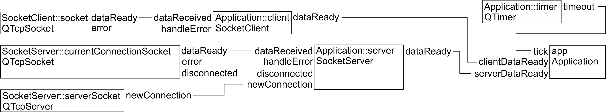

# QtSocketDemo

A QtSocketDemó példa alkalmazás bemutatja a socketek használatát Qt alatt. 
[Az alkalmazás forráskódja itt érhető el.](https://github.com/csorbakristof/alkalmazasfejlesztes/)

A program a következőket teszi: felépít egy szerver socketet, majd egy kliens socketet, amivel csatlakozik hozzá. Ezután másodpercenként elküld a kliens socketen egy "Mizu?" szöveget. És akárhányszor kap a szerver oldalon egy "Mizu?" kérdést, arra visszaküldi, hogy "Minden OK.".

A program célja, hogy megmutassa, hogyan kell

  * Létrehozni szerver és kliens socketeket Qt alatt.
  * Hogyan lehet a QTcpSocket és QTcpServer objektumok signaljaihoz csatlakozni.
  * Hogyan lehet egyszerű, szöveges üzeneteket küldeni és fogadni.

A forráskód részletesen kommentezett, így első lépésként érdemes a 3 header fájlt végignézni. A main függvény az alábbi:

	int main(int argc, char *argv[])
	{
	    SocketServer server;
	    SocketClient client;
	    Application app(argc, argv, server, client);
	
	    server.start(3333);
	
	    client.connect(QString("localhost"), 3333);
	
	    app.startSending();
	
	    return app.exec();
	}

Most bár az Application osztály tartalmazza a klienst és a szervert is, amiken keresztül önmagával beszélget, a kliens és szerver oldali kommunikáció szét van választva: ha a kliens oldalon érkezik be adat, akkor az Application::clientDataReady slot hívódik meg és reagál megfelelően, ha pedig a szerver oldalra érkezik be adat, akkor az Application::serverDataReady slot hívódik meg. (Ez utóbbi pedig ha "Mizu?" az üzenet, akkor válaszol is.)

A SocketClient és SocketServer osztályok beburkolják a teljes kommunikációt. Mivel a konkrét küldés és fogadás egyforma a két esetben, itt most duplikált a forráskód, hogy teljesen szétváljon a két oldal. Általános esetben természetesen ezeket a közös funkciókat ki szoktuk emelni egy ősosztályba, ami a nagyon hasonlóan működő Simple Telemetry Visualizer (STV) mintaalkalmazásban már meg is történt.

A példaprogram signaljainak térképe az alábbi:

A SocketClient és SocketServer is tartalmaz belül egy-egy QTcpSocket objektumot. Ezek dataReady és error signaljaira feliratkoznak, amikor pedig egy teljes üzenet beérkezett (egy dataReady nem azt jelenti, hogy pont annyi adat jött, mint amennyi egy teljes üzenet), akkor ezt a dataReady signaljukkal jelzik, amire pedig már az Application objektum iratkozik fel.

A szerver oldal annyiban más, hogy a QTcpSocket csak akkor jön létre, amikor ténylegesen kapcsolódik valaki. Ezt a QTcpServer a newConnection signalon keresztül jelzi. Ilyenkor kell lekérni a QTcpSocketet (ez lesz a SocketServer::currentConnectionSocket) és csatlakozni a signaljaihoz.

Ezen kívül van még egy QTimer, ami másodpercenként jelez az Applicationnek (tick slot), hogy küldjön ki egy újabb "Mizu?" üzenetet.

Az alkalmazás részletes működése legkönnyebben a fenti signal térkép és a forráskódban lévő kommentek alapján követhető.
