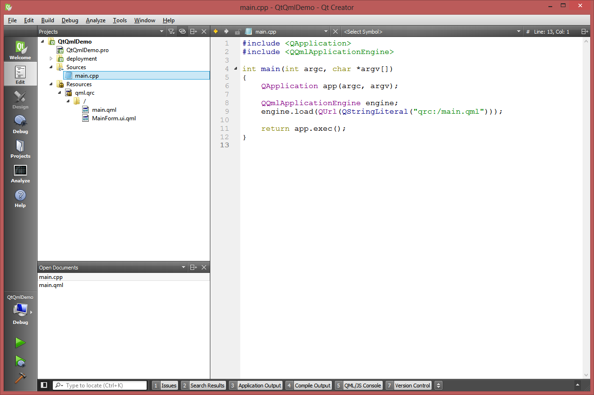
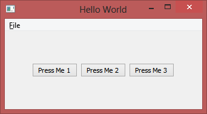

# QtQmlDemo

Ha a Qt Creator indításakor Qt Quick Applicationt választunk, akkor rögtön kaptunk egy kis alkalmazás keretet, amivel QML-es alkalmazást tudunk készíteni. (A QtQuick az az osztálykönyvtár, aminek a felhasználó felület leíró nyelve a QML.)

A kiindulási alap így néz ki:

Elindítva az alkalmazást az alábbi ablakot kapjuk:

A File/Exit kilép, a többi művelet csak kiírja, hogy megtörtént az esemény.

Nézzük most végig, hogy miből áll ez a kis példaprogram.

## main.cpp

A main.cpp tartalma igen tömör:

	#include <QApplication>
	#include <QQmlApplicationEngine>
	
	int main(int argc, char *argv[])
	{
	    QApplication app(argc, argv);
	
	    QQmlApplicationEngine engine;
	    engine.load(QUrl(QStringLiteral("qrc:/main.qml")));
	
	    return app.exec();
	}

Létrehoz egy QApplication objektumot, aminek az app.exec() hívásával indul el az ablakkezelő rendszer eseménykezelő főciklusa. Vagyis a főprogram összerakja a felhasználó felületet, majd amíg ki nem lépünk, eseményekre vár és minden eseménynél végrehajtja a megfelelő eseménykezelőt.

Ezen kívül létrejön egy QQmlApplicationEngine objektum is, ami pedig a QML felület betöltéséért, felépítéséért és üzemeltetéséért felelős.

(A QStringLiteral majdnem ugyanaz, mintha QString()-et írnánk, csak fordítási időben létre tud jönni egy read-only QString objektum, így futási időben sokkal gyorsabb.)

Ami itt igazán érdekes, az a QML fájl és az elérési útja (URI-je): a QRC fájl egy un. resource leíró fájl. Ezt a bal oldali könyvtárszerkezetben is láthatjuk. A lényege, hogy az ebben a qml.qrc fájlban szerelő fájlok belefordulnak az exe fájlba, így a program viszi őket magával, nem kell külön fájlként odamásolni őket a telepítéskor. Ilyen erőforrások tipikusan a QML fájlok és például képek szoktak lenni.

## qml.qrc

A QRC fájl tartalma az alábbi (jobb klikk, Open in Text Editor):

	<RCC>
	    <qresource prefix="/">
	        <file>main.qml</file>
	        <file>MainForm.ui.qml</file>
	    </qresource>
	</RCC>

A lényege, hogy az itt felsorolt - egyébként a projektben létező - fájlok bekerülnek a fordításkor az exe fájlba. Hivatkozni rájuk úgy lehet, ahogy a main() függvényben is láttuk, pl. "qrc:/main.qml". (A "/" prefixet már a QRC fájlban adtuk meg.)

## pro fájl

Még mielőtt a QML részbe belemennénk, nézzük meg a QtQmlDemo.pro projekt fájlt is.

	TEMPLATE = app

Ez jelenti azt, hogy egy futtatható alkalmazást szeretnénk. (És nem például libraryt.)
	
	QT += qml quick widgets
	
Szükségünk lesz a QT keretrendszerből a qml, quick és widgets részekre. Widgeteket most nem használunk, viszont a QApplication osztály használatához is ez kell.
A háttérben ezek a beállítások példul bizonyos include és library fájl csoportok elérési útjait veszik hozzá a projektünkhöz.

	SOURCES += main.cpp
	
Forrás fájlunk csak egy van, a main.cpp.

	RESOURCES += qml.qrc
	
Resource leíró fájlunk is csak egy van, a qml.qrc (ami egyébként több fájlra hivatkozik, de ez más kérdés.)

	# Additional import path used to resolve QML modules in Qt Creator's code model
	QML_IMPORT_PATH =

Ha külső QML fájlokat is szeretnénk használni, itt adhatnánk meg a helyüket. Péládul ha egy nagyon szép grafikon rajzoló QML komponenst letöltünk. 
	
	# Default rules for deployment.
	include(deployment.pri)

Itt egy másik projekt fájlt includeolunk. A kiterjesztése azért pri és nem pro, hogy ez is jelezze, hogy ezt includolásra szánták.

A deployment.pri tartalmába most nem megyünk bele. Sok esetben nem is kell hozzányúlni. Elsősorban akkor van rá szükség, ha a program telepítése valamiért speciális, például mert Android alatt processzor architektúra függő, hogy mi hol van a fájlrendszerben.

## MainForm.ui.qml

Ennek a fájlnak a tartalmát egyrészt megnézhetjük a QML designerben is, vagy szövegszerkesztőben is. (A bal oldali eszköztárban a "Design" és "Edit" gombokat kiválasztva.)

Ez a fájl egy összetett felhasználó felület elemet ír le: azt, ami a menü kivételével az alkalmazás ablakában megjelenik. Van rajta sorba rendezve 3 nyomógomb. 

	import QtQuick 2.4
	import QtQuick.Controls 1.3
	import QtQuick.Layouts 1.1

Itt különböző osztály csoportokat importálunk, hogy használhassuk őket. A nevük után a verziószámot is meg kell adni. Ezek a sorok kb. be is importálnak mindent, amire egy nem túl bonyolult felület összerakásához szükségünk van.
	
	Item {

Ez egy új felhasználói felület elem lesz. Mellesleg összetett, mert benne további elemek vannak.

	    width: 640
	    height: 480
	
Minden elemnek vannak tulajdonságai, propertyjei. Ezeket itt simán, számszerűen is beállíthatjuk, de majd később látni fogjuk, hogy akár JavaScript kódot is használhatunk a meghatározásukhoz, vagy az adatkötések segítségével megadhatjuk, hogy az értéküket mindig valahonnan máshonnan vegyék.

	    property alias button3: button3
	    property alias button2: button2
	    property alias button1: button1
	
A három Button control elég mélyen van a hierarchiában, így a könnyebb elérhetőség érdekében itt egy aliast hozunk létre nekik: kintről lehet majd úgy hivatkozni rájuk, mintha ezen a szinten lennének, közvetlenül az Item alatt, button1, button2 és button3 néven.

	    RowLayout {

A layout egy elrendezést irányító elem. Ami benne van, azokat úgy helyezi el, hogy sorban legyenek.

	        anchors.centerIn: parent
	
Maga a RowLayout is rendelkezik tulajdonságokkal. Ilyen az anchors. Itt lehet megadni, hogy a RowLayout elem határai hova igazodjanak. Itt most bárhogy is mozog vagy méreteződik az ablak, ő a szülőjének a közepén lesz. (Itt lehet például olyanokat is megadni, hogy minden irányba töltse ki a szülőt, ami jelen esetben az eggyel kintebb definiált Item.)

	        Button {

Most egy Button osztályú elem jön.

	            id: button1

Ha konkrét azonosítót is szeretnénk a nyomógombnak adni, hogy tudjuk rá hivatkozni máshonnan, azt az "id" tulajdonság beállításával tudjuk megtenni. Eddig erre nem volt szükség, mert nem akarunk például magára a RowLayoutra hivatkozni. De most kelleni fog.

	            text: qsTr("Press Me 1")

A Buttonnak van egy text tulajdonsága, amit egy konkrét szövegre állítunk be. A qsTr() makrónak annyi feladata van, hogy jelzi, hogy ezt a stringet ha nemzetközi programot fejlesztünk, le kell fordítani, mert megjelenik a felhasználói felületen. Erre is van a Qt-nek támogatása, de ebbe most nem megyünk bele.

A további két Button hasonló az elsőhöz.

	        }
	
	        Button {
	            id: button2
	            text: qsTr("Press Me 2")
	        }
	
	        Button {
	            id: button3
	            text: qsTr("Press Me 3")
	        }
	    }
	}
	
Mint látható, itt a felhasználói felület felépítését adtuk meg, de a viselkedésről semmit nem mondtunk. Ez azért van, mert ez egy általánosabban használható felhasználói felület elem (bár most nyilván csak a main.qml-ből fogjuk egyszer példányosítani).

A lényeg, hogy a viselkedést majd ott adjuk meg, ahol felhasználjuk ezt a felület elemet.

## main.qml

A main.qml a felhasználó felületünk gyökéreleme. Definiál egy ablakot, benne egy menüt, valamint példányosítja a MainForm elemet (ami a MainForm.ui.qml fájlban van leírva) és beállítja az eseménykezelőket.

	import QtQuick 2.4
	import QtQuick.Controls 1.3
	import QtQuick.Window 2.2
	import QtQuick.Dialogs 1.2
	
	ApplicationWindow {
	    title: qsTr("Hello World")
	    width: 640
	    height: 480
	    visible: true

Az ApplicationWindow az alkalmazás főablakat. Beállítjuk a címét, méretét és láthatóságát.
	
	    menuBar: MenuBar {
	        Menu {
	            title: qsTr("&File")
	            MenuItem {
	                text: qsTr("&Open")
	                onTriggered: messageDialog.show(qsTr("Open action triggered"));
	            }
	            MenuItem {
	                text: qsTr("E&xit")
	                onTriggered: Qt.quit();
	            }
	        }
	    }

A menüsor egy MenuBar osztályú elem. A "menuBar : MenuBar" azt jeleti, hogy az ApplicationWindow menuBar tulajdonságának adunk értéket úgy, hogy az egy MenuBar osztályú elem lesz, aminek itt helyben adjuk meg az értékét. A MenuBar tartalmaz egy Menu elemet (ez lesz a File menü), aminek van címe, valamint benne vannak MenuItem-ek (Open és Exit). A címekben az "&" jel határozza meg a billentyűparancsokat: az Alt-F, Alt-O és Alt-x az egyes menüpontokat fogják aktiválni.

Ezeknek az elemeknek már eseményeik (signaljaik) is vannak. QML alatt az eseményeknek megfelelő signalokat JavaScript kódrészletekhez tudjuk kötni. A signal neve "Triggered", amihez kódrészletet az "onTriggered"-nek értéket adva tudunk rendelni. A fenti esetben az Open triggerére meghívjük a messageDialog objektum show() metódusát, az Exit esetében pedig a Qt.quit() hívással leállítjuk a programot.
	
	    MainForm {
	        anchors.fill: parent
	        button1.onClicked: messageDialog.show(qsTr("Button 1 pressed"))
	        button2.onClicked: messageDialog.show(qsTr("Button 2 pressed"))
	        button3.onClicked: messageDialog.show(qsTr("Button 3 pressed"))
	    }

Itt példányosítjuk a MainForm elemet. Az "anchors.fill" tulajdonságnak megadhatjuk, hogy az elem mely elemet töltse ki teljesen. Most a szülőt, ami az ApplicationWindow. Ezen kívül beállítunk eseménykezelőket is, miközben kihasználjuk, hogy a nyomógombok bár a MainForm mélyén vannak (egy RowLayout alatt), aliasokon keresztül könnyen el tudjuk őket érni.
	
	    MessageDialog {
	        id: messageDialog
	        title: qsTr("May I have your attention, please?")
	
	        function show(caption) {
	            messageDialog.text = caption;
	            messageDialog.open();
	        }
	    }

Végül létrehozunk még egy MessageDialog objektumot is az ablakon belül, ami egy felugró üzenet ablakot jelent. Adunk neki "id"-t, mert így tudunk rá hivatkozni az eseménykezelőkben. Beállítjuk a title tulajdonságot, valamint definiálunk benne egy JavaScript függvényt. Olyan ez, mintha egy MessageDialog osztályból származtattunk volna egy sajátot és kiegészítjük egy újabb metódussal. A függvény pedig nem tesz mást, mint a paraméterül kapott szövegre állítja a text tulajdonságot, majd feldobja a dialógus ablakot. (A JavaScript gyengén típusos nyelv, a paraméter típusát nem kell megadni. Lehet bármi, amit a változót használó kódrészek le tudnak majd kezelni.

	}

## Összefoglalás, a qrc_qml.cpp

Ezzel a végére is értünk a Qt QML-es példa keretprogramjának. A fordításkor megnézve a konzolt egy érdekes részre lehetünk figyelmesek:

	C:\Qt\5.4\mingw491_32\bin\rcc.exe -name qml ..\QtQmlDemo\qml.qrc -o debug\qrc_qml.cpp
	
	g++ -c -pipe -fno-keep-inline-dllexport -g -frtti -Wall -Wextra -fexceptions -mthreads -DUNICODE -DQT_QML_DEBUG -DQT_DECLARATIVE_DEBUG -DQT_QUICK_LIB -DQT_WIDGETS_LIB -DQT_GUI_LIB -DQT_QML_LIB -DQT_NETWORK_LIB -DQT_CORE_LIB -DQT_NEEDS_QMAIN -I..\QtQmlDemo -I"C:\Qt\5.4\mingw491_32\include" -I"C:\Qt\5.4\mingw491_32\include\QtQuick" -I"C:\Qt\5.4\mingw491_32\include\QtWidgets" -I"C:\Qt\5.4\mingw491_32\include\QtGui" -I"C:\Qt\5.4\mingw491_32\include\QtQml" -I"C:\Qt\5.4\mingw491_32\include\QtNetwork" -I"C:\Qt\5.4\mingw491_32\include\QtCore" -I"debug" -I"." -I"C:\Qt\5.4\mingw491_32\mkspecs\win32-g++" -o debug\qrc_qml.o debug\qrc_qml.cpp

Az első sor egy rcc.exe program segítségével a qml.qrc fájlból készít egy qrc_qml.cpp fájlt, a második pedig hozzáfordítja azt a projekthez.

Ennek a generált cpp fájlnak igen tanulságos, bár mérsékelten olvasható a tartalma.

	[...]

	static const unsigned char qt_resource_data[] = {
	  // E:/Projektek/alkalmazasfejlesztes/QtQmlDemo/MainForm.ui.qml
	  0x0,0x0,0x2,0x42,
	  0x69,
	  0x6d,0x70,0x6f,0x72,0x74,0x20,0x51,0x74,0x51,0x75,0x69,0x63,0x6b,0x20,0x32,0x2e,
	  0x34,0xd,0xa,0x69,0x6d,0x70,0x6f,0x72,0x74,0x20,0x51,0x74,0x51,0x75,0x69,0x63,
	  0x6b,0x2e,0x43,0x6f,0x6e,0x74,0x72,0x6f,0x6c,0x73,0x20,0x31,0x2e,0x33,0xd,0xa,
	  0x69,0x6d,0x70,0x6f,0x72,0x74,0x20,0x51,0x74,0x51,0x75,0x69,0x63,0x6b,0x2e,0x4c

	[...]

	static const unsigned char qt_resource_name[] = {
	  // MainForm.ui.qml
	  0x0,0xf,
	  0x5,0xe3,0xf8,0x3c,
	  0x0,0x4d,
	  0x0,0x61,0x0,0x69,0x0,0x6e,0x0,0x46,0x0,0x6f,0x0,0x72,0x0,0x6d,0x0,0x2e,0x0,0x75,0x0,0x69,0x0,0x2e,0x0,0x71,0x0,0x6d,0x0,0x6c,

	[...]

A fájl binárisan tartalmazza az erőforrás fájlok tartalmát és neveit. Az első blokk a tényleges adattartalom, a második pedig egy részlet a fájlok neveiből. A nevek UTF-16 kódolással szerepelnek, vagyis minden karakter 2 bájt. A "0x0, 0x4d" péládul az M betű a MainForm elejéről.
 