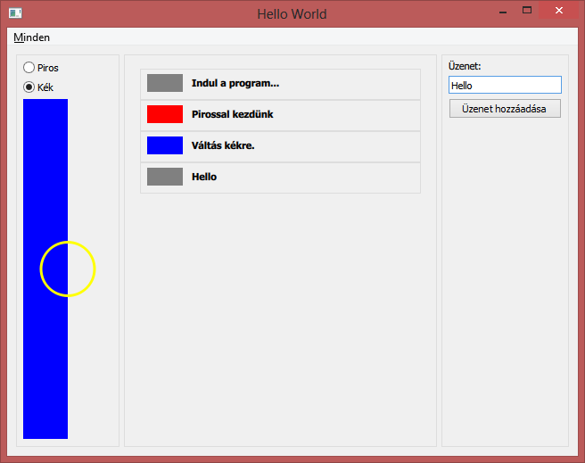

# QML Kontrollok

Ennek a snippetnek az alapja a [QmlControlKupac példaprogram](https://github.com/csorbakristof/alkalmazasfejlesztes/tree/master/QmlControlKupac) QML oldala. A C++ oldali funkciókról később lesz szó.
 
Az alkalmazás egyetlen ablaka egyfajta állatorvosi ló, mely számos felhasználói felület elemet tartalmaz:

A bal oldali csoportban színt választhatunk a nagy téglalapnak, alatta egy Canvas látható, melyre rajzolunk. Középen egyfajta eseménynapló olvasható, melyben megjelenik, ha színt váltunk a bal oldalon. A jobb oldali csoporttal egy szöveges üzenetet vehetünk fel a középső listára, szürke háttérszínnel.

A "Minden" menüben van a kilépés. (Valamint egy később a C++ oldalra irányított funkció.)

## QML elemek és csoportosításuk

QML alatt nagyon sok féle felhasználói felület elemet használhatunk. Mi most az alábbiakra térünk ki:

  * Item: egy általános elem (pl. C# alatt ez a Control megfelelője).
  * MenuBar, MenuItem: Egy menü és egy menüpont.
  * RowLayout, ColumnLayout: elrendezést vezérlő elemek, róluk külön lesz szó.
  * GroupBox: Csoportosító elem, logikailag összetartozó elemeket fog össze.
  * RadioButton: Választó gomb. "ExclusiveGroup" csoportokhoz rendelésükkel kiválasztásuk kölcsönösen kizárja egymást.
  * Canvas: Vászon elem, amire tetszőlegesen tudunk rajzolni, jelen esetben a megjelenítő függvényét JavaScriptben megírva.
  * ListView: A lista elem, róla is külön lesz szó. 
  * Text: Sima, statikus felirat.
  * TextField: Szövegbeviteli mező.
  * Button: Nyomógomb.

QML alatt az elemek hierarchikus egymásba ágyazását úgy írjuk le, hogy az elemeken belülre írjuk azt, ami benne van. Egy elemen belül egyrészt beállíthatjuk az elem tulajdonságait, a slotjaihoz írhatunk JavaScript kódot, valamint a tároló jellegű elemekbe további elemeket rakhatunk bele.

Ami minden elemnek van és be lehet állítani (csak a legfontosabbakat említve):

  * id: itt egy azonosítót adhatunk meg, amivel lehet hivatkozni az elemre.
  * objectName: C++ oldalról ez alapján a név alapján tudjuk megkeresni az elemeket.
  * x, y, width, height: a szokásos pozíció és méretek.
  * anchors: erről az elrendezésnél lesz szó. Arra szolgál, hogy az elem oldalait oda tudjuk ragasztani más elemekhez, hogy átméretezések után is együtt maradjanak. 

## Elemek elrendezése QML alatt

QML alatt két fő megoldási irány van az elemek elrendezésére: az egyik a layoutok használata (pl. RowLayout, ColumnLayout, GridLayout stb.), vagy az anchors tulajdonság használata.

### Layoutok és anchorok

A layoutok a bennük lévő elemeket maguktól elrendezik. Jelen példában a RowLayout és ColumnLayout sorba vagy oszlopba rendezi őket, vagyis ők határozzák meg, hogy minek hol legyen a bal felső sarka, mi legyen a szélessége és magassága.

A másik lehetőség az anchors: minden elemnek van egy anchors tulajdonsága, amit beállítva valamihez hozzá tudjuk ragasztani azt a tulajdonságot. Például:

  * "anchors.left: parent.left" az elem bal oldalát a szülő bal oldalához ragasztja. Ugyanígy van right, top és bottom is.
  * "anchors.fill: parent" az elem minden oldalát úgy állítja be, hogy az kitöltse a szülő elemet. Ez a lehetőség azért van, mert gyakran kell és így nem kell kiírni a left, right, top, bottom eseteket.
  * "anchors.margins: 10" minden irányra egyesével vagy együtt meg lehet adni egy margót, vagyis hogy az összeragasztás figyelembe vételekor mennyi távolságot tartson az elem.

A mostani példában alapvetően a layoutokat fogjuk használni, de például a ColumnLayout csak függőlegesen állít be méreteket, így vízszintesen az anchorokat fogjuk használni.

A példaprogram RadioCanvasList elemének felépítése az alábbi. (A "..." részek a belső részletek, azokat is hamarosan megnézzük.) Alapvetően 3 oszlopa van, amik belül egymás alá rendezett elemeket tartalmaznak, kivéve a középsőt, mely csak egy ListView elemet.

Az egész egy RowLayoutban van, ami kitölti a teljes szülőjét és "margin" távolságot tart ("margin" egy változó).

    RowLayout {
        id: baseGrid
        anchors.fill: parent
        anchors.margins: margin

Az első GroupBox egy ColumnLayoutot tartalmaz. Itt egy érdekes csavar is van: a GroupBox szeretné függőlegesen kitölteni a helyét. Ezt alapvetően a RowLayoutban kellene beállítani, mivel az felel a GroupBox méretének beállításáért, viszont ez minden RowLayouton belüli elemre eltérhet. Ezért ezek a beállítások úgy vannak megoldva, hogy a GroupBoxon belül vannak és *a Layoutnak szólnak, de csak a GroupBox-ra vonatkoztatva*.

        GroupBox {
            Layout.fillHeight: true

            ColumnLayout {
			...
            }
        }

A második oszlop egy olyan GroupBox, ami széltében és magasságban is kitölti a helyét. Mivel a két szélsőnek fix mérete van (az első akkora, amennyire a tartalma miatt szükség lesz, az utolsónak pedig meg van adva a szélessége), így vízszintesen ő fog mindig átméreteződni.

        GroupBox
        {
            Layout.fillHeight: true
            Layout.fillWidth: true

            ListView {
			...
            }
        }

        GroupBox {
            Layout.fillHeight: true
            width: 200

            ColumnLayout {
			...
            }
        }

## A ListView

A ListView egy különleges elem: van neki egy modellje, ami egy lista. És van neki egy "sablonja" ami azt adja meg, hogy egy elem hogyan kell, hogy kinézzen. Ezután a ListView fogja a sablont (ezt delegatenek hívja) és azzal, mint mintával, megjeleníti a modellben szereplő elemeket.

    ListView {
        id: eventLog
        anchors.fill: parent
        anchors.margins: 10

A delegate egy GroupBox, benne egy egymás mellé rakott Rectangle és Text elemmel. (A Row olyasmi, mint a RowLayout, csak butább. De arra pont jó, hogy egymás mellé rakjon két elemet. Itt most szélességeket, kitöltéseket nem kell neki beállítani.) A delegate megadásánál szerepelnek olyan értékek, hogy "colorCode" és "message". Ezek itt változók, amiknek majd a modell köteles értéket adni.

        delegate: GroupBox {
            anchors.left: parent.left
            anchors.right: parent.right
            Row {
                id: row2
                Rectangle {
                    width: 40
                    height: 20
                    color: colorCode
                }
                Text {
                    text: message
                    anchors.verticalCenter: parent.verticalCenter
                    font.bold: true
                }
                spacing: 10
            }
        }

A modell egy ListModel példány. Az id-ja alapján fogunk rá hivatkozni, ha további elemeket akarunk beleírni. Ilyenkor a lista ezt észre fogja venni, és magától frissíti a megjelenítést. A ListElementek tetszőleges tulajdonságokat tartalmazhatnak. Az a fontos, hogy azokat is tartalmazzák, amikre a delegate hivatkozik: jelen esetben a "colorCode" és "message". 

        model: ListModel {
            id: eventLogModel
            ListElement {
                message: "Indul a program..."
                colorCode: "grey"
            }
            ListElement {
                message: "Pirossal kezdünk"
                colorCode: "red"
            }
        }
    }

Itt most konkrét értékeket is adtunk a modellnek, hogy legyen kezdőérték is. Ehhez a listához később eseménykezelőkből tudunk majd értéket adni.

## A forráskód részletesen

Ennek az alkalmazásnak a jelenleg vizsgált funkcióihoz minimális C++ oldal tartozik, mert minden QML-ben van. (A [...] részt most ki is lehet venni, az csak a C++-os példákhoz kell majd.)

	int main(int argc, char *argv[])
	{
	    QApplication app(argc, argv);
	
	    QQmlApplicationEngine engine;
	    engine.load(QUrl(QStringLiteral("qrc:/main.qml")));

		[...]	
	
	    return app.exec();
	} 
	
### main.qml

A QML oldal két fájlból áll: az egyik a main.qml, amely beállítja az ablak paramétereit és a főmenüt, majd példányosítja a RadioCanvasList elemet, ami lényegében minden egyebet tartalmaz.

	import QtQuick 2.4
	import QtQuick.Controls 1.3
	import QtQuick.Window 2.2
	import QtQuick.Dialogs 1.2
	
	ApplicationWindow {
	    title: "QmlControlKupac"
	    width: 640
	    height: 480
	    visible: true
	
A következőkben később csak a C++-ból eléréshez szükséges objektum nevet állítunk be (ez alapján lehet majd megtalálni C++-ból valamit a QML fájlban), valamint definiáltunk egy signal-t, amit szintén csak a C++ kiegészítésben fogunk használni. 

	    // A C++ oldal számára
	    objectName: "ApplicationWindow"
	    signal addGreenEntry();
	
A menüt az ablak menuBar tulajdonságának adjuk értékül. A MenuItem-nek van egy signalja "Triggered" néven. Ehhez QML alatt egyből létre is jön egy slot onTriggered néven, aminek ha JavasScript kódot adunk értékül, akkor az a signal hatására le is fog futni.  

	    menuBar: MenuBar {
	        Menu {
	            title: "&Minden"
	            MenuItem {
	                text: "&Zöld"
	                onTriggered: addGreenEntry();
	            }
	            MenuItem {
	                text: "&Kilépés"
	                onTriggered: Qt.quit();
	            }
	        }
	    }
	
Végül pedig példányosítjuk a RadioCanvasList elemet. Nevét onnan kapta, hogy Radio button, Canvas és List is van benne. Itt meg lehetne neki adni tulajdonságokat, id-t vagy sok egyebet, de most semmi ilyesmire nincs szükségünk. Az elem típusának nevét mindig a fájlnév adja meg (most RadioCanvasList.qml).

	    RadioCanvasList {
	    }
	}

### RadioCanvasList.qml

Ez az a fájl, ami (a menü kivételével) a teljes felhasználói felületet leírja.

	import QtQuick 2.4
	import QtQuick.Controls 1.3
	import QtQuick.Layouts 1.1
	
	Item {
	    anchors.fill: parent
	    objectName: "RadioCanvasList"

A propertyk egyszerű változók, amiket később tudunk használni. (Szükség esetén a C++ oldalról is tudjuk őket olvasni és írni.) 
	
	    property int margin: 10
	    property color selectedColor : "grey"
	
	    // C++ oldal is el tudja érni
	    property int lineWidth : 3

QML alatt könnyen lehet JavaScript függvényeket készíteni. A paramétereknek itt nincsen típusa. A függvényben értéket adunk a selectedColor változónak, a drawingCanvas elemünket újrarajzoltatjuk, a ListView modelljéül szolgáló listára felveszünk egy új bejegyzést, valamint a konzolra is kiírjuk, hogy mi történt.
	
	    // C++ oldal is el tudja érni
	    function selectColor(messageText, color)
	    {
	        selectedColor = color;
	        drawingCanvas.requestPaint();
	        eventLogModel.append( { message: messageText, colorCode: color } );
	        console.log("selectColor(" + messageText + ", " + color + ")");
	    }
	
Itt kezdődik a RowLayout, amely a 3 oszlopot helyezi egymás mellé.

	    RowLayout {
	        id: baseGrid
	        anchors.fill: parent
	        anchors.margins: margin
	
	        // 1. oszlop
	
	        GroupBox {
	            Layout.fillHeight: true

A RadioButton-ok kölcsönös kizárást egy ExclusiveGroup definiálásával adhatjuk meg.

	            ExclusiveGroup { id: radioButtonExclusiveGroup }
	
	            ColumnLayout {
	                anchors.fill: parent
	
	                RadioButton {
	                    id: redRadioButton
	                    text: "Piros"
	                    exclusiveGroup: radioButtonExclusiveGroup

Kattintás esetén a teendő egy függvényhívás, melyet JavaScript kódként adunk meg. 

	                    onClicked: {
	                        selectColor("Váltás pirosra.", "red");
	                    }
	                }
	
	                RadioButton {
	                    id: blueRadioButton
	                    text: "Kék"
	                    exclusiveGroup: radioButtonExclusiveGroup
	                    onClicked: {
	                        selectColor("Váltás kékre.", "blue");
	                    }
	                }
	
A Canvas az, amire tudunk rajzolni az onPaint eseménykezelőjének elkészítésével. A rajzolás alapja egy context objektum elkérése, mely rendelkezik számos rajzoló függvénnyel. A vonal rajzolás érdekessége, hogy először megadjuk, hogy miket rajzoljon, majd a stroke() függvény meghívásával rajzoljuk ki az egészet ténylegesen.

	                Canvas {
	                    id: drawingCanvas
	                    width: 100
	                    Layout.fillHeight: true
	
	                    onPaint: {
	                        var context = getContext("2d");
	                        context.reset();
	                        context.fillStyle = selectedColor
	                        context.fillRect(0, 0, width/2, height);
	                        context.lineWidth = lineWidth;
	                        context.strokeStyle = "rgba(255,255,0,1)";
	                        context.ellipse(width/2-30,height/2-30,60,60);
	                        context.stroke();
	                        console.log("drawingCanvas.onPaint kész");
	                    }
	                }
	            }
	        }
	
	        // 2. oszlop
	
	        GroupBox
	        {
	            Layout.fillHeight: true
	            Layout.fillWidth: true
	
	            ListView {
	                id: eventLog
	                anchors.fill: parent
	                anchors.margins: 10
	                delegate: GroupBox {
	                    anchors.left: parent.left
	                    anchors.right: parent.right
	                    Row {
	                        id: row2
	                        Rectangle {
	                            width: 40
	                            height: 20
	                            color: colorCode
	                        }
	                        Text {
	                            text: message
	                            anchors.verticalCenter: parent.verticalCenter
	                            font.bold: true
	                        }
	                        spacing: 10
	                    }
	                }
	                model: ListModel {
	                    id: eventLogModel
	                    ListElement {
	                        message: "Indul a program..."
	                        colorCode: "grey"
	                    }
	                    ListElement {
	                        message: "Pirossal kezdünk"
	                        colorCode: "red"
	                    }
	                }
	            }
	        }
	
	        // 3. oszlop
	
	        GroupBox {
	            Layout.fillHeight: true
	            width: 200
	
	            ColumnLayout {
	                anchors.fill: parent
	
	                Text {
	                    text: "Üzenet:";
	                }
	
	                TextField {
	                    id: messageTextField
	                    Layout.fillWidth: true
	                    placeholderText: "Ide írd be az üzenetet..."
	                }
	
	                Button {
	                    id: addMessageButton
	                    Layout.fillWidth: true
	                    text: "Üzenet hozzáadása"
	
	                    onClicked: {
	                        eventLogModel.append( { message: messageTextField.text, colorCode: "grey" } );
	                    }
	                }
	
Mivel ebben az oszlopban nincs olyan elem, amit elegánsan szét lehetne függőlegesen húzni, berakunk egy plusz elemet, ami kitölt minden maradék függőleges helyet.

	                // Placeholder
	                Item {
	                    Layout.fillHeight: true
	                }
	            }
	        }
	    }
	}
	

## Összefoglalás

Ez a példaprogram bemutatta néhány felhasználói felület elem és az elrendezés alapjait. Érdemes megfigyelni, hogy C++ oldalon elegendő a projekt létrehozásakor kapott példakód, mivel semmi másra nincsen szükségünk: minden megjelenést és még a funkiókat is JavaScript nyelven, a QML kódban írtuk le.

Sokszor halljuk, hogy a QML deklaratív. Ez azt jelenti, hogy itt nem lépésenként adjuk meg, hogy hogyan működjön a felhasználói felület, hanem csak azt írjuk le, hogy milyen legyen. És a QML motor a többit magától megoldja. Például egy elem méretét akár egy függvénnyel is meghatározhatjuk: ha a bemeneti paraméterek megváltoznak, a QML motor magától újra ki fogja számolni az értékeket, ezzel nekünk nem kell törődnünk.

A QML fájlokat bele lehet fordítani az EXE fájlokba, de lehetnek az EXE mellett is. Ez utóbbi eset akkor lehet nagyon hasznos, ha több felhasználói felületet akarunk ugyanazzal a programmal támogatni. A QML egy kiváló lehetőséget biztosít arra, hogy az alkalmazásunknak a felhasználói felületét teljesen leválasszuk az alkalmazás logikáról. Így a design és a háttérlogika fejlesztése sokkal kevésbbé van összekötve. Egy QML-hez értő designer nagyon sok mindent meg tud oldani a C++ oldali fejlesztők nélkül is. Leginkább csak abban kell megegyezni, hogy a modellek (mint a fenti példában a ListView modellje) milyen néven és tartalommal állnak rendelkezésre, és hogy milyen signalokat lehet használni. 

## További információk

  * Összetettebb példákat a SimpleTelemetryVisualizer program tartalmaz.
  * A QML-C++ kapcsolatról külön snippet szól: [0136_QtQmlCpp](../0136_QtQmlCpp/0136_QtQmlCpp.html) 

<small>Szerzők, verziók: Csorba Kristóf</small>
