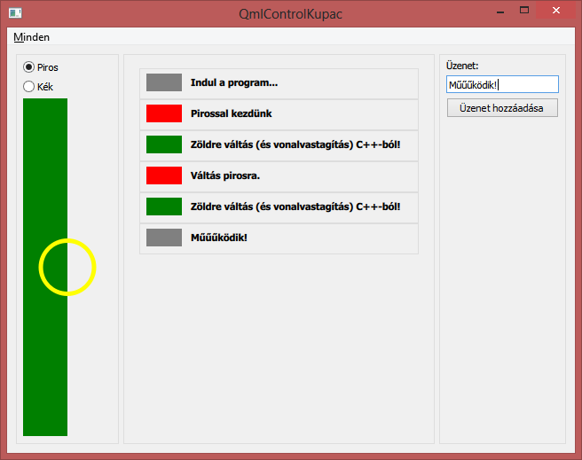

# Qt alatt a QML és C++ oldal kapcsolata

Ennek a snippetnek az alapja a [QmlControlKupac példaprogram](https://github.com/csorbakristof/alkalmazasfejlesztes/tree/master/QmlControlKupac) alkalmazás. A QML oldal nagy részét egy másik snippet ([0135_QtQmlControlKupac](../0135_QtQmlControlKupac/0135_QtQmlControlKupac.html)) mutatja be részletesen, itt most a QML és C++ oldal kapcsolatáról lesz szó.

A QML és C++ kapcsolatát az alábbi funkciókon kereszül fogom bemutatni:

  * A "Zöld" menüpont egy QML-ben definiált signalt aktivál, amit egy C++ oldali függvényhez kötünk.
  * A RadioCanvasList elemnek a selectColor metódusát QML oldalról már használtuk, de most meghívjuk C++ oldalról is.
  * A RadioCanvasList elemnek a lineWidth tulajdonságát C++ oldalról fogjuk beállítani.

Így ha valaki a Zöld menüpontot választja, akkor ezzel üzen C++ oldalra, ahonnan az aktuális színt egy függvényhívással zöldre állítjuk (ez ugyanúgy bekerül a középső esemény listába is), valamint a sárga kör vonalvastagságát is megnöveljük.

Ehhez az alábbiak kellenek:

  * QML alatt az elérendő tulajdonságok és függvények létrehozása
  * QML alatt az elérendő objektumoknak az objectName tulajdonság beállítása, mert ez alapján tudjuk majd megkeresni őket C++ oldalról és kérni rájuk egy pointert (mint QtQuickObject-ek).
  * C++ oldalon be kell kötni a QML oldali signalt és válaszul függvényt hívni és tulajdonságot beállítani a QML oldalon.

Mivel a signalokat csak QObjectből származó objektumokhoz lehet kötni, a main() függvény pedig nem ilyen, kelleni fog egy osztály, ami a C++ oldali feladatokat képviseli. Ez a MainWindowCppSide.

## QML oldal előkészítése

A main.qml-ben létrehozunk egy signalt, amit a Zöld menüpont fog aktiválni. Ezen kívül a főablaknak megadjuk az objectName tulajdonságát, hogy C++ oldalról meg tudjuk majd keresni. 

	import QtQuick 2.4
	import QtQuick.Controls 1.3
	import QtQuick.Window 2.2
	import QtQuick.Dialogs 1.2
	
	ApplicationWindow {
	    title: "QmlControlKupac"
	    width: 640
	    height: 480
	    visible: true
	
	    // A C++ oldal számára
	    objectName: "ApplicationWindow"
	    signal addGreenEntry();

A RadioCanvasList.qml-ben már rendelkezésre áll minden, ami kell: az objectName, a lineWidth tulajdonság és a selectColor metódus.

	import QtQuick 2.4
	import QtQuick.Controls 1.3
	import QtQuick.Layouts 1.1
	
	Item {
	    anchors.fill: parent
	    objectName: "RadioCanvasList"
	
	    property int margin: 10
	
	    property color selectedColor : "grey"
	
	    // C++ oldal is el tudja érni
	    property int lineWidth : 3
	
	    // C++ oldal is el tudja érni
	    function selectColor(messageText, color)
	    {
	        selectedColor = color;
	        drawingCanvas.requestPaint();
	        eventLogModel.append( { message: messageText, colorCode: color } );
	        console.log("selectColor(" + messageText + ", " + color + ")");
	    }
	[...]

## A C++ oldal alapjai

Ahhoz, hogy a QML oldalhoz hozzáférjünk, a Qml motortól el kell kérni a legfelsőbb szintű QML objektumot (QObject pointerként). Mivel a QML oldal egy fa struktúrát követ, az objektumok gyerekein végig tudunk menni és meg tudjuk keresni azokat az objektumokat, amikre szükségünk van. A MainWindowCppSide konstruktora azért megkapja a QML motortól a gyökér objektumot:

	#include <QApplication>
	#include <QQmlApplicationEngine>
	#include "MainWindowCppSide.h"

	int main(int argc, char *argv[])
	{
	    QApplication app(argc, argv);
	
	    QQmlApplicationEngine engine;
	    engine.load(QUrl(QStringLiteral("qrc:/main.qml")));
	
	    MainWindowCppSide mainWindowCppSide(engine.rootObjects()[0]);
	
	    return app.exec();
	}

(Tudjuk, hogy gyökér objektumból pontosan egy van, még ha az általánosság miatt itt listát is kapunk vissza.)

A MainWindowCppSide osztály ezután az alábbiak szerint alakul. Azért, hogy a Signals and Slots rendszer működjön, mindenképpen QObject-nek kell lennie. A konstruktor a rootObject alapján megkeresi az "ApplicationWindow" objectName-mel rendelkező objektumot és hozzáköti az addGreenEntryHandler() slotot.

	#pragma once
	#ifndef MAINWINDOWCPPSIDE_H
	#define MAINWINDOWCPPSIDE_H
	#include <QObject>
	#include <QQuickItem>
	
	class MainWindowCppSide : public QObject
	{
	    Q_OBJECT
	
	public:
	    MainWindowCppSide(QObject *rootObject);
	    ~MainWindowCppSide() = default;
	
	public slots:
	    /** Eseménykezelő a QML oldali addGreenEntry signalhoz. */
	    void addGreenEntryHandler();
	private:
	    QQuickItem* findItemByName(const QString& name);
	    QQuickItem* findItemByName(QObject *rootObject, const QString& name);
	    QQuickItem* findItemByName(QList<QObject*> nodes, const QString& name);
	    QQuickItem* mainWindowObject;
	};
	
	#endif // MAINWINDOWCPPSIDE_H

A MainWindowCppSide.cpp pedig:

	#include <QQmlProperty>
	#include "MainWindowCppSide.h"
	
	MainWindowCppSide::MainWindowCppSide(QObject *rootObject)
	    : QObject(nullptr)
	{
	    if (!rootObject)
	    {
	        qDebug() << "Nem találom a rootObject-et.";
	    }
	
	    mainWindowObject = findItemByName(rootObject, QString("ApplicationWindow"));
	
	    if (!mainWindowObject)
	    {
	        qDebug() << "Nem találom a ApplicationWindow objektumot.";
	    }
	
	    qDebug() << "QML signal csatlakoztatása";
	    QObject::connect(mainWindowObject, SIGNAL(addGreenEntry()),
	        this, SLOT(addGreenEntryHandler()));
	
	    qDebug() << "MainWindowCppSide inicializálva.";
	}
	
A csatlakoztatott eseménykezelő pedig a Zöld menüpont kiválasztása esetén megkeresni a RadioCanvasList elemet, meghívja a setColor metódusát és beállítja a lineWidth tulajdonságát. Mivel ezek a QML oldalon vannak, hivatkozni rájuk csak szövegesen, a nevükkel tudunk. Az invokeMethod egy adott QObject névvel adott metódusát meg tudja hívni, a QQmlProperty::write pedig értéket tud adni hasonló módszerrel. A változók, amikre az adatcsere során szükség van, azért QVariant típusúak, mivel a QML/JavaScript oldalon nincsennek típusok megadva. A QVariant egy nagyon ravasz osztály, mely egyszerre tud számos, gyakran használt típust tárolni, vagyis át tud vinni például szöveget és számot is. Tény, hogy a C++ kódban egy kicsit "körbe kell makrózni" ezeket a műveleteket, hogy a Qt meta-object rendszerének emészthető legyen, de ha megszokjuk, utána egyrészt kényelmesen használható, másrészt csak minimálisan változik esetről esetre.

	void MainWindowCppSide::addGreenEntryHandler()
	{
	    qDebug() << "MainWindowCppSide::addGreenEntryHandler()";
	    auto radioCanvasList = findItemByName("RadioCanvasList");
	    // Metódus meghívása
	
	    QVariant returnedValue;
	    QVariant messageText = "Zöldre váltás (és vonalvastagítás) C++-ból!";
	    QVariant color = "green";
	    qDebug() << "selectColor QML függvény meghívása...";
	    QMetaObject::invokeMethod(radioCanvasList, "selectColor",
	        Q_RETURN_ARG(QVariant, returnedValue),
	        Q_ARG(QVariant, messageText),
	        Q_ARG(QVariant, color));
	
	    QQmlProperty::write(radioCanvasList, "lineWidth", 5);
	}

Végül pedig a függvény, ami objectName alapján megkeres egy elemet. Rekurzívan végigkeres minden gyerek objektumot, amíg a feltétel nem teljesül.
	
	QQuickItem* MainWindowCppSide::findItemByName(const QString& name)
	{
	    Q_ASSERT(mainWindowObject != nullptr);
	    if (mainWindowObject->objectName() == name)
	    {
	        return mainWindowObject;
	    }
	    return findItemByName(mainWindowObject->children(), name);
	}
	
	QQuickItem* MainWindowCppSide::findItemByName(QObject *rootObject, const QString& name)
	{
	    Q_ASSERT(rootObject != nullptr);
	    if (rootObject->objectName() == name)
	    {
	        return (QQuickItem*)rootObject;
	    }
	    return findItemByName(rootObject->children(), name);
	}
	
	QQuickItem* MainWindowCppSide::findItemByName(QList<QObject*> nodes, const QString& name)
	{
	    for(int i = 0; i < nodes.size(); i++)
	    {
	        // Node keresése
	        if (nodes.at(i) && nodes.at(i)->objectName() == name)
	        {
	            return dynamic_cast<QQuickItem*>(nodes.at(i));
	        }
	        // Gyerekekben keresés
	        else if (nodes.at(i) && nodes.at(i)->children().size() > 0)
	        {
	            QQuickItem* item = findItemByName(nodes.at(i)->children(), name);
	            if (item)
	                return item;
	        }
	    }
	    // Nem találtuk.
	    return nullptr;
	}

És íme végeredmény:

## További olvasnivaló

  * [http://doc.qt.io/qt-5/qtqml-cppintegration-interactqmlfromcpp.html](http://doc.qt.io/qt-5/qtqml-cppintegration-interactqmlfromcpp.html)

<small>Szerzők, verziók: Csorba Kristóf</small>
