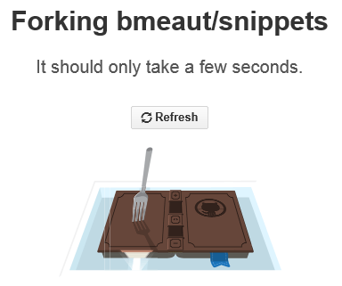
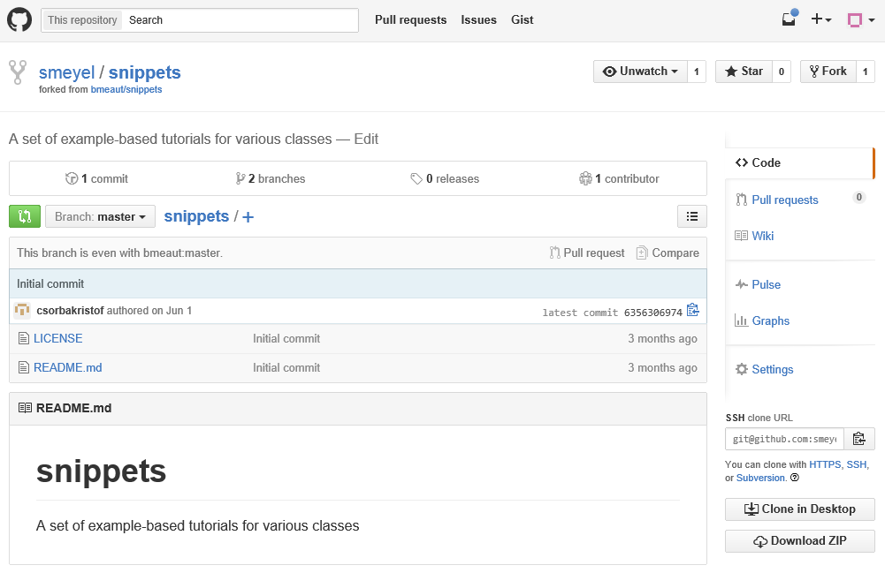
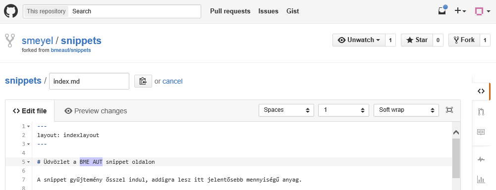
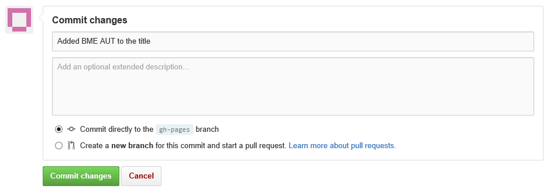

# Fork és pull request a github-on

A github-on ha egy repositoryhoz nincsen collaborator hozzáférésünk, akkor közvetlenül nem tudunk bele pusholni, így nem tudunk hozzájárulni a tartalmához. Erre az a megoldás, hogy

  * "forkolunk" belőle, vagyis létrehozunk belőle egy saját másolatot,
  * a másolaton végrehajtjuk a javasolt módosításokat
  * küldünk egy pull requestet a repo fejlesztőinek
  * a repo fejlesztői ha arra érdemesnek tartják a hozzájárulásainkat, akkor pullolhatják, vagyis átvehetik őket.

Ez a snippet bemutatja, hogy a github.com-on hogyan lehet forkolni egy repositoryt, végrehajtani benne valamilyen módosítást, majd elküldeni a repo tulajdonosának egy pull requestet. Végül pedig hogy ő hogyan tudja átvenni a javasolt módosításokat.

A kiinduló pont az, hogy belépve a github-ra felkeressük a forkolni kívánt repositoryt:

[A snippet github weboldalon](https://github.com/bmeaut/snippets)

# Forkolás

A gh-pages brachen.

## További olvasnivaló

  * https://help.github.com/articles/fork-a-repo/

<small>Szerzők, verziók: Csorba Kristóf</small>

<small>A szerzők megjelölése egyrészt azért fontos, hogy lehessen látni, kinek az alkotása egy snippet, másrészt az esetleges hibákkal kapcsolatban is őt érdemes keresni.</small>
