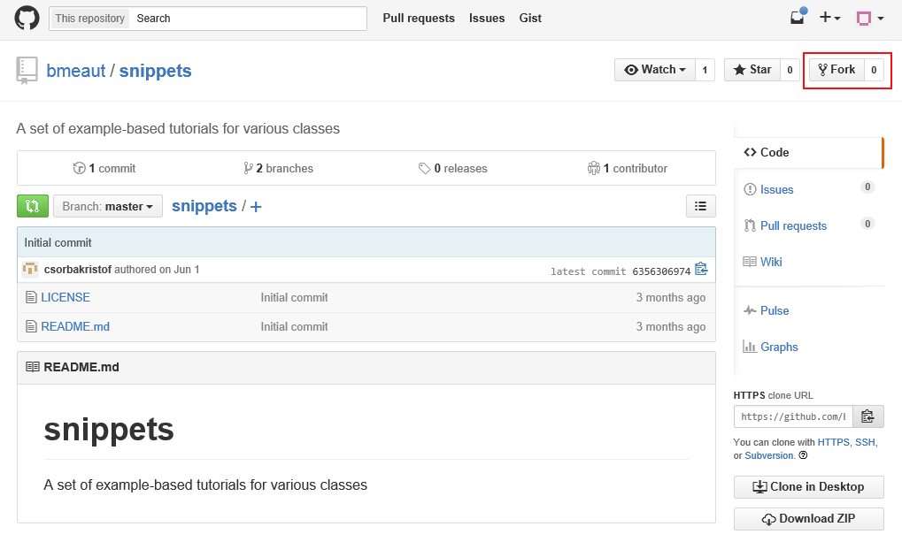
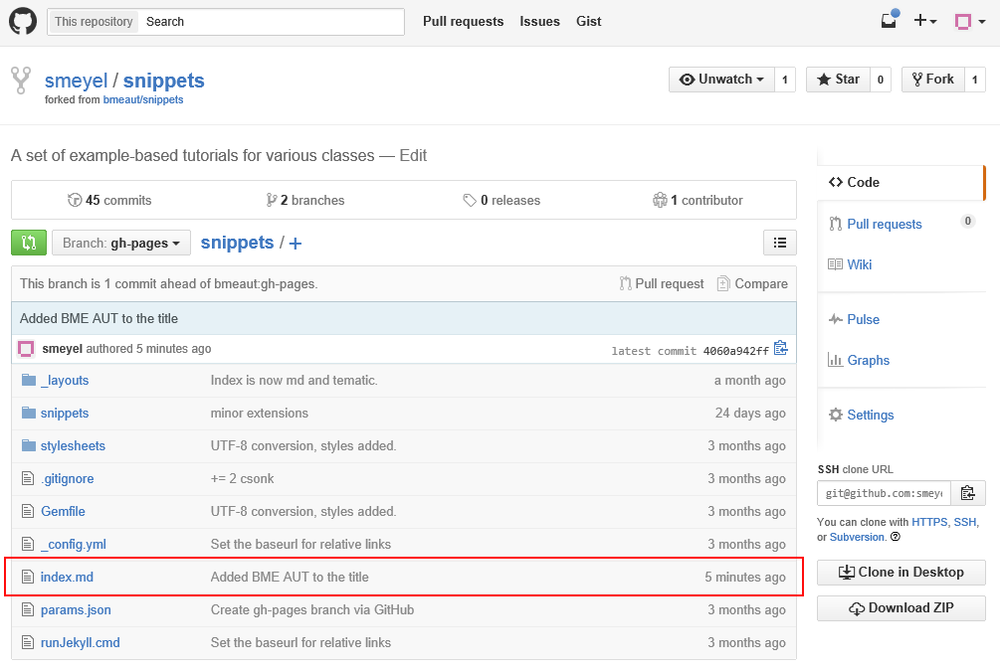
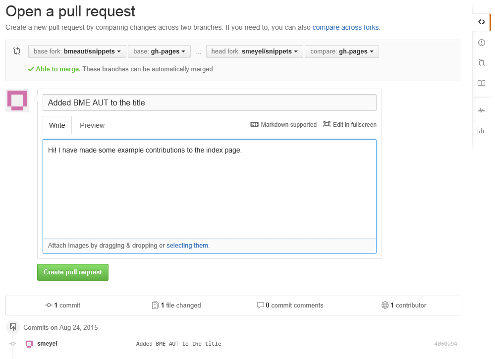
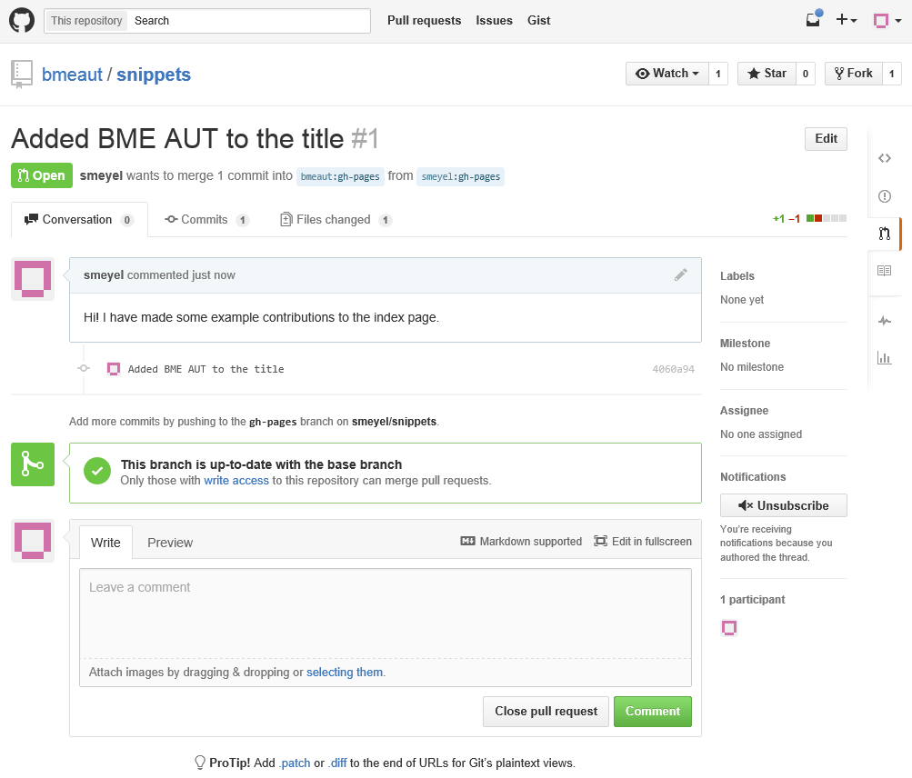
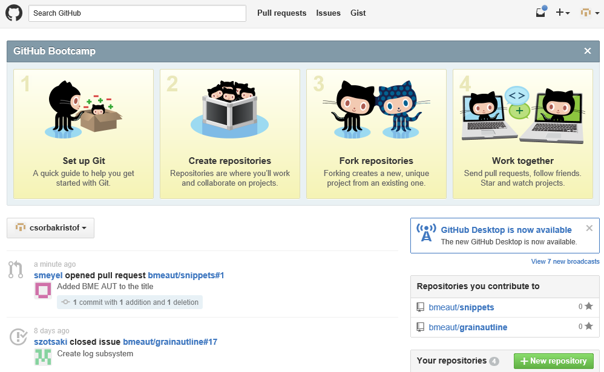
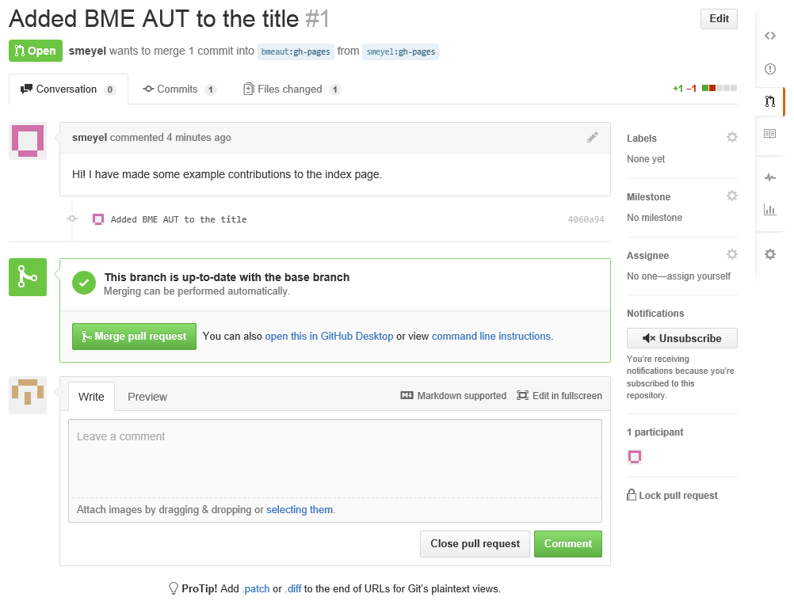

# Fork és pull request a github-on

A github-on ha egy repositoryhoz nincsen collaborator hozzáférésünk, akkor közvetlenül nem tudunk bele pusholni, így nem tudunk hozzájárulni a tartalmához. Erre az a megoldás, hogy

  * "forkolunk" belőle, vagyis létrehozunk belőle egy saját másolatot,
  * a másolaton végrehajtjuk a javasolt módosításokat
  * küldünk egy pull requestet a repo fejlesztőinek
  * a repo fejlesztői ha arra érdemesnek tartják a hozzájárulásainkat, akkor mergelhetik, vagyis átvehetik őket.

Ez a snippet bemutatja, hogy a github.com-on hogyan lehet forkolni egy repositoryt, végrehajtani benne valamilyen módosítást, majd elküldeni a repo tulajdonosának egy pull requestet. Végül pedig hogy ő hogyan tudja átvenni a javasolt módosításokat.

A kiinduló pont az, hogy belépve a github-ra felkeressük a forkolni kívánt repositoryt:

[A snippet github weboldalon](https://github.com/bmeaut/snippets)

## Forkolás

A forkolás egy igen egyszerű lépés, csak meg kell nyomni a Fork gombot.

Ilyenkor létrejön egy saját másolatunk a reporól, ami azonban tudja, hogy honnan ágaztunk el eredetileg: "forked from bmeaut/snippets".

## Hozzájárulás

Ezután lehet dolgozni a projekthez való hozzájárulásunkon. Jelen esetben az index.md fájlba fogjuk beírni azt, hogy a BME AUT snippet oldalán üdvözöljük a felhasználót, és nem csak a "snippet oldalon". Ehhez a github webes szerkesztőjét használjuk, de nyilván lehetne klónozni és lokálisan a gépünkön is dolgozni.

A lap alján máris lehet commitolni:

Most a gh-pages nevű brachen dolgozunk, mivel az az, ami a github.io oldalakon automatikusan megjelenik, így a snippet oldal alapvetően azt használja. Az új állapot, amit meg szeretnénk osztani a snippet oldal tulajdonosával:

## A pull request létrehozása 

Pull requestet nagyon könnyű létrehozni. Először a Compare-re kattintunk, hogy megnézzük az alkotásunkat:

Majd a Create pull requestre kattintunk. Ehhez adnunk kell neki egy címet és egy kis kommentárt is illik hozzá írni, hogy mit is változtattunk.

A Create pull request gombra kattintás után elkészül a pull request. Ez olyasmi, mint egy külön branch, amihez lehet kommentárokat is fűzni (beszélgetni róla), majd akinek joga van ehhez, tudja mergelni az eredeti bmeaut/snippets repositoryba.

## A tulajdonos látja a pull requestet és kiegészítést kér

A snippet repó eredeti tulajdonosa belépve az oldalára látja, hogy a smeyel nevű user nyitott egy pull requestet.

A snippets repository oldalán a "pull requests" alatt is látszik, hogy van egy pull request:

A pull requestek listáján most csak egy van:

Ezt kiválasztva ugyanaz a beszélgetős oldal jelenik meg, ahol smeyel befejezte a munkát.

Most tegyük fel, hogy a BME AUT mellé egy URL-t is hiányol a repo gazdája, így kommentárba kiegészítést kér:

## A pull request kiegészítése

A smeyel user belépve a pull request oldalára látja a kérést:

Most is a böngészőben fogja módosítani a fájlt:

És a lap alján egyből commitolja is a változtatást:

A pull requestet nem kell újra létrehozni, az mindig az aktuális verzióra vonatkozik. (Csak most már két commit is van benne.)

## Mergelés

(Megjegyzem, hogy közben a tulajdonos is dolgozott és pusholt egyet a gh-pages branchre, de mivel az a módosítás automatikusan mergelhető a pull request tartalmával, ez semmi gondot nem okoz.)

Most a snippet repo tulajdonosa belép a githubra és látja a pull request változását. (Meg azt is, hogy most már 2 commitból áll.) A "Files changed" így néz ki:

A Conversation oldal pedig így:

Most már a tulaj is elégedett a pull request tartalmával, így rákattint, hogy "Merge pull request". Ír hozzá kommentárt és véglegesíti:

Végül pedig még ír hozzá egy végső kommentárt, amiben megköszöni a munkát:

## A végeredmény

Ezután a snippet oldalon már szépen megjelenik az URL is:

A repository commit gráfja ekkor GitExtensionsben így néz ki:

Látszik, hogy a fork és pull request egy új branch létrehozásaként és annak mergeléseként jelenik meg. Nincs ebben semmi misztikus.

## További olvasnivaló

  * [https://help.github.com/articles/fork-a-repo/](https://help.github.com/articles/fork-a-repo/)

<small>Szerzők, verziók: Csorba Kristóf</small>
