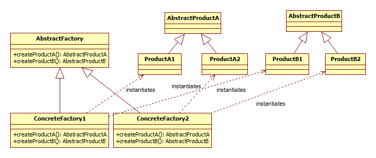

TODO: UML diagram beszúrása és leírása; hivatkozás példaprogramra (ha van)

## Abstract factory

Az abstract factory tervezési minta igen közel áll a factory method tervezési mintához. Gyakorlatilag azok egy csoportját fogja össze. Erre akkor van szükség, ha több féle objektumot kell tudni létrehozni, de nem tetszőleges kombinációban, hanem az egymásnak megfelelőeket. Ekkor egy abstract factory összefogja a factory methodokat és amikor példányosítani kell valamit, akkor mindig az éppen aktuális abstract factory megfelelő factory methodját fogjuk használni.

### Bevezető példa

Ha például valamilyen adatsor alapjá akarunk dokumentumokat (pl. reportokat) generálni és erre több "design" is rendelkezésre áll (pl. minimál, modern, kaligrafikus stb.), akkor ezek mint abstract factory tartalmazhatnak bekezdés, ábra és táblázat generáló objektumokat (factory methodokat). Így ha egyszer kiválasztottuk a designt, akkor utána minden annak megfelelően generálódik. És ehhez mindössze annyit kell tenni, hogy a dokumentum generálónak a designnak megfelelő abstract factory egy példányát kell átadni, hogy "ezt használd minden létrehozásához".

### Részletek

Az abstract factory egymástól függő objektumok egy családját létrehozó interfészt ad, anélkül, hogy a konkrét osztályokat specifikálná. Factory method csoportokat fog össze. Olyan csoportokat, hogy a létrehozott termékek összeférhetőek legyenek. (Ez olyan, mint egy Linux disztribúció telepítője: ott is csomagok egy egymással kompatibilis halmazát telepítjük.)

Ez tipikusan akkor hasznos, ha cserélhető komponenseink vannak, de azokat nem lehet tetszőlegesen, egymástól függetlenül cserélni, csak bizonyos kombinációkban.

Az abstract factory osztálydiagramja az alábbi:

A látrehozás helyén csak egy AbstractFactory referenciánk van és annak tudjuk a createProductA és createProductB metódusát meghívni. Azt, hogy valójában az 1-es vagy 2-es termékcsoport A vagy B termékét hozzuk létre, azt az határozza meg, hogy valójában egy ConcreteFactory1 vagy ConcreteFactory2 példányt használunk.

Előnyök

  * Könnyű lecserélni az egész "készletet", mivel csak az abstract factory példányosításánal kell váltani.

Hátányok

  * Nehéz egy újabb factory methodot (terméket) felvenni, mivel akkor az összes abstract factoryt módosítani kell.

Megjegyzések

  * Az abstract factory gyakran singleton, mivel sok helyen kellhet és elég egyetlen példány belőle.
  * A kliens ezután ne használjon new operatátort, hanem a factory metódusokat használja új példányok létrehozására.
  * Az abstract factory gyakran factory method mintákat tartalmaz belül, de implementálható a Prototype tervezési mintával is.
  * A minta használható a Facade alternatívájaként olyan esetekben, amikor platform specifikus osztályokat kell elrejteni. Ebben az esetben külön abstract factory van például Windows és Linux esetére és fordításkor a preprocesszor dönti el, hogy melyik használatát fordítja bele a programba.

### Példa: platform függőség

Platform függőség kezelése esetén az abstract factory egy kombinációja az oprendszernek (pl. fájlkezelést hogyan kell megoldani), kommunikációs protokollnak, használt adatbázisnak. Ennek szükségességét például az jelzi, ha már nagyon sok az #ifdef (platform feltétellel) a kódban.

### Példa: look-and-feel

Tipikus look-and-feel implementáció az abstact factory: a kiválasztott témának megfelelő abstract factory fogja létrehozni a felhasználói felület elemeit.

### További példák

Az alábbi példák a factory method és az abstract factory minták határán vannak, mivel a kettő között sokszor elég keskeny a határ.

  * Adatbázis kapcsolatért felelős objektum létrehozása, ha a konkrét adatbázis fajtája csak a konfigurációból derül ki, futási időben. (Akár azért is, mert az egyes ügyfeleknél kint lévő verziók más adatbázisra épülnek.)
  * Protokollok és esetleg verzióik közötti váltás lehetősége.
  * Diagnosztikai vagy a versenyen használt protokoll implementáció (loggol, visszaellenőriz, kísérleti verziók). Ki lehet választani, hogy a diagnosztika vagy a robusztusság a fontosabb. (Robusztusság esetén nem az a cél, hogy minden apró hibát jelezzen, amint lehet, hanem hogy amit csak tud, oldjon meg és menjen tovább.)

## További olvasnivaló

  * http://stackoverflow.com/questions/2280170/why-do-we-need-abstract-factory-design-pattern
  * https://sourcemaking.com/design_patterns/abstract_factory

<small>Szerzők, verziók: Csorba Kristóf</small>
