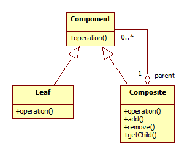

## Composite

A composite olyan objektumgráfoknál használatos, ahol a gráf egy eleme ugyanúgy viselkedik, mint egy egész részgráf: ugyanazon interfész mögött lehet egyetlen elem is, de elemek egy halmaza is.

### Bevezető példa

Az ablakkezelő rendszerkben az ablakok control-okból állnak (nyomógomb, szövegdoboz stb.). Viszont a hierarchikus csoportosítás kedvéért vannak container controlok is, melyekbe amellett, hogy ők maguk is controlok, további controlokat lehet belerakni. Amikor az ablakkezelő rendszer meg akar jeleníteni egy controlt, meghívja a rajzoló metódusát. Ha ez éppen egy container control, akkor annak a rajzoló metódusa továbbhívja az összes tartalomazott control rajzoló metódusát. Ezáltal a hívó oldalnak nem kell tudnia, hogy egy egyszerű controlt, vagy egy összetettet jelenít éppen meg.

A Composite design pattern lényege, hogy ugyanazon interfészen kereszül érünk el egy elemet és többet egyszerre.

### Részletek

A megvalósítás alapja általában annyi, hogy az ősosztály (mint a control) container leszármazottjai valamilyen tároló mechanizmussal controlok egy halmazát is tudják tárolni.

    class Control
    {
    public:
        virtual void draw() = 0;
    };

    class ContainerControl : public Control
    {
    public:
        virtual void draw() override
        {
            for(auto& c : internalControls)
            {
                c.draw();
            }
        }

    private:
        std::vector<Control&> internalControls;
    };

Így a controlokból tetszőleges hierarchia építhető fel, melyet ha egyetlen gyökéreleme van (ilyen például az ablak egy ablakkezelő rendszerben), nagyon egyszerűen, a gyökérelem draw() metódusával meg tudunk jeleníteni.

A Composite design pattern egyes megvalósításai például abban eltérnek, hogy a gyerek manipuláló metódusok az ősosztályban vannak-e. A fenti példában ilyen lenne a

   Control::AddControl(Control& c);

Egy általános UML osztálydiagram az alábbi:

A Componentnek kétféle leszármazottja van: a Leaf, amik a "hagyományos" elemei a gráfnak (például Button a felhasználói felületen), a Composite pedig olyan elem, ami másik elemeket tartalmaz (pl. Panel a felhasználói felületen).

### Példa: RobonAUT manőver

Ha egy robot az összetett menővereket úgy végzi el, hogy azok egyszerűbb menűverek sorozatai, akkor a Composite design pattern segítégével nagyon elegánsan fel lehet építeni ezeket a hierarchikus menőver szekvenciákat. Minden menőver vagy elemi, és akkor a futtató metódus azt végre is hajtja, vagy összetett, amikor pedig a futtató metódus sorban végrehajtja az egyes tartalmazott menővereket.

Az implementáció nagyon hasonló lenne a fenti Control példához, csak Control helyett Maneuver, draw() helyett pedig execute() lenne. Fontos, hogy az execute() metódus csak akkor térjen vissza, ha a robot ténylegesen be is fejezte a manővert.

(A megoldás igény esetén még a Command design patternnel is kominálható, ha az elemi manőverek objektumoknak egy külön Command objektum megadásával mondjuk meg, hogy ténylegesen mi lesz a feladat.)

### Példa: áramköri blokkok szimulációban

Egy áramkör szimulációban az egyes blokkok leírására szintén nagyon alkalmas a Composite design pattern, mivel ott is ugyanilyen egymásba skatulyázós hierarchiát figyelhetünk meg. Ebben az esetben az egyes blokkok interfésze kicsit trükkösebb, mivel tetszőleges számú ki- és bemenetet is támogatnia kell, a container blokk pedig a belső összeköttetéseket is le kell, hogy írja, ami szintén bonyolítja a helyzetet.

## További olvasnivaló

  * [A command design pattern](https://en.wikibooks.org/wiki/C%2B%2B_Programming/Code/Design_Patterns#Command)
