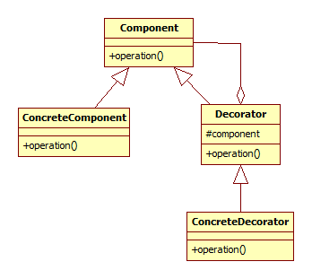

## Decorator

A decorator egy osztály képességeit egészíti ki úgy, hogy ehhez nem kell módosítani az eredeti osztályt.

### Bevezető példa

Tegyük fel, hogy van egy olyan ImageMorph osztályunk, mely képeken tud képmorfológiai műveleteket végezni. (Ilyen például a foltokon belüli lyukak kitöltése.) Az ImageMorph osztályt külső libraryként használjuk, így módosítani nem tudunk rajta.

    class ImageMorph
    {
    public:
        virtual void FillHoles(Image& img) const;
    };

Az alkalmazásunk teljesítményének vizsgálata és debuggolási célokra nagyon jó lenne, ha az ImageMorph minden egyes metódusának meg tudnánk mérni az időigényét, amit a meghívás és visszatérés tényével együtt logolni tudnánk.

Erre megoldás a Decorator design pattern, mely kiegészíti az ImageMorph osztály képességeit a teljesítmény mérésével és a logolással. Ehhez leszármaztat az eredeti ImageMorphból egy ImageMorphLogging osztályt, mely emiatt mindenhol használható, ahol az ImageMorph használható. Tartalmaz minden publikus metódust, amit az ImageMorph, de mielőtt azokat továbbhívná egy belül tárolt ImageMorph példányba, elvégzi a kiegészítő funkciókat.

    class ImageMorphLogging : public ImageMorph
    {
    public:
        explicit ImageMorphLogging(ImageMorph& im)
            : internalImageMorph(im)
        { }

        void FillHoles(Image& img) const override
        {
          qDebug() << "ImageMorph::FillHoles starting";
          QElapsedTimer timer;
          timer.start();
          internalImageMorph.FillHoles(img);
          qDebug() << "ImageMorph::FillHoles finished, time: " << timer.elapsed() << " ms";
        }

    private:
        const ImageMorph& internalImageMorph;
    };

Ezután bárhol, ahol eddig az ImageMorphot használtuk, használhatjuk az ImageMorphLogger osztályt is, ha a konstruktorának megadunk egy eredeti ImageMorphot. (Itt most arról nem beszélünk, hogy az eredeti ImageMorph példányát hogyan fogjuk felszabadítani. Most ez a hívó oldal felelőssége, de megoldhatnánk úgy is, hogy az ImageMorphLogger egy unique_ptr<ImageMorph> smart pointerrel tárolja az eredeti ImageMorph példányt, ami így megszűnik, ha az ImageMorphLogger példány megszűnik.)

### Részletek

A minta bent aggregál egy eredeti példányt (vagyis például egy pointerrel hivatkozik egy eredeti példányra), a decorator ősosztály is implementálja a dekorálandó interfészt, de csak továbbít. Leszármazott dekorátorok pedig kiegészíthetik a simán továbbhívó metódusokat.

    class abstract Window;
    class SimpleWindow : Window;
    class abstract WindowDecorator : Window; // benne default továbbhívások
    class FirstDecorator : WindowDecorator;

A fenti ImageMorph példában bemutatott implementáció kihasználja, hogy az ImageMorphnak nincsennek publikus attribútumai. Ha lennének, akkor azokat örökölné az ImageMorphLogger osztály is, viszont ha ezeket valaki kívülről módosítaná, akkor nem venné észre, hogy valójában nem az internalImageMorph attribútumait módosította, hanem az ImageMorphLogger sajátját, amit viszont a metódusok nem vesznek figyelembe.

Fontos, hogy a decorator nem tudja kiegészíteni az eredeti osztály interfészét: amire ott nincsen metódus, azt nem tudja kiegészíteni.

### UML osztálydiagram

Mind az eredeti osztály, mind a decorator a közös interfész leszármazottja. Míg a ConcreteComponent (hívhatjuk az eredeti implementációnak is) simán tartalmazza a műveletet, addig a ConcreteDecorator tartalmaz egy Component-et (tipikusan egy ConcreteComponent-et, de éppen az is lehet egy decorator), aminek továbbadja a műveleteket. Ha többféle Decorator leszármazottunk is van, az egyes műveletek alapértelmezett működését (dekorációmentes továbbhívás a component-be) örökölhetik a Decorator ősosztályukból is, és akkor csak azt kell implementálni, ami tényleg "dekorált".

### Példa: Jogosultság ellenőrzése

A decorator design pattern utólagos jogosultság ellenőrzési rendszer készítésére is alkalmas: ha egy osztály minden egyes metódushívása előtt ellenőrizni kell, hogy éppen akkor ehhez van-e jogunk, akkor az ellenőrzéseket egy decorator osztály metódusaiban el lehet végezni.

### További példák

   * A [GrainAutLine](http://bmeaut.github.io/grainautline/) rendszerben a blobok olyan foltok, amik kőzetek szemcséit fedik le. Ha például azt szeretnénk, hogy az egyes foltokhoz színeket is lehessen rendelni, ezt a decorator mintával is meg lehet oldani, amihez akkor az eredeti Blob osztályt nem kell módosítani.
   * Olyan grafikus elem a felhasználó felületen, melyet utólag kiegészítünk, hogy többlet információkat is meg tudjon jeleníteni magán akkor, amikor kirajzolja magát.

<small>Szerzők, verziók: Csorba Kristóf</small>
