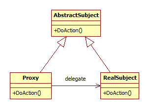

## Proxy

A proxy egy osztály, mely interfészt biztosít valami máshoz.

### Bevezető példa

Tegyük fel, hogy egy távvezérelhető robot minden funkcióját egy objektum metódushívásaival akarjuk elérni. Azt szeretnénk, hogy azon az objektumon kívül a kommunikáció részleteivel már egyáltalán ne kelljen foglalkozni.

A megoldás a Proxy design pattern: az alkalmazásunkban egy Proxy objektum fogja képviselni a robotunkat, minden kérés hozzá fut majd be, amiket ő a megfelelő módon továbbít.

	class RobotProxy
	{
	public:
	   virtual void Forward(int distance) = 0;
	   virtual void Turn(int degrees) = 0;
	   virtual int ReadFrontDistanceSensor() = 0 const;
	};
	
	class DefaultRobotProxy : public RobotProxy
	{
	public:
	   virtual void Forward(int distance) override;
	   virtual void Turn(int degrees) override;
	   virtual int ReadFrontDistanceSensor() const override;
	};

Ennek az osztálynak a használata egyrészt nagyon egyszerű és kényelmes, másrészt van még egy nagy előnye: könnyen le lehet cserélni. Tesztelési célokra készíthetünk egy olyan leszármazottat is, ami valójában egy szimulátorhoz csatlakozik. Vagy egy olyat, ami csak a felhasználó felület tesztelésére szolgál és csak kiírja, hogy "most előre küldjük a robotot 3 méterrel".

(Amennyiben a szimulátor és az igazi robot eléggé hasonló protokollal kommunikál, akkor lehet, hogy felesleges két Proxy kialakítása. Elég, ha a Proxy konstruktora paraméterként megkap egy kommunikációs objektumot, amit használ majd. Ennek lecserésésével a Proxy nem is tudja majd, hogy valójában az igazi robottal beszél, vagy a szimulátorral.)

### Általános felépítés

A proxy általános UML osztálydiagramja az alábbi:

Lényege, hogy az absztrakt ősosztály előír egy műveletet, amit a tényleges implementáció (RealSubject) is megvalósít, de a Proxy is. Viszont a Proxy tartalmaz egy hivatkozást (ez lehet egy pointer helyett akár hálózati kapcsolat is) a RealSubjectre és valójában csak továbbítja a kérést.

Itt érdemes megjegyezni, hogy a Proxy minta szorosan kapcsolódik a dependency injection koncepcióhoz, mivel előfordul, hogy egy osztály egy függőségét (valamilyen más objektumot, amire szüksége van) egy proxyn kereszül éri el. 

### További példák

  * Jogosultság ellenőrzés
  * Egyszerűbb interfész (Ez az alkalmazás nagyon közel van a Facade design patternhez.)
  * Távoli erőforrások eléréséhez interfész (pl. webservice, REST API hívások)
  * Távoli, nagy erőforrás igényű műveletek koordinálása. Például a tényleges kérés előtt már elkezdi a végrehajtást.
  * Ha egy osztály funkciói eredetileg nem szálbiztosak és nem tuduk rajta módosítani, egy Proxy eltakarhatja és megoldhatja a szükséges szinkronizációkat.
  * A std::shared_ptr<> smart pointer is egyfajta proxy, mivel elérhetővé teszti a pointer értékét, valamint számolja a hivatkozásokat, és ha ez a számláló eléri a nullát, megszünteti a pointer által hivatkozott objektumot.
  * Például WebServiceek használatakor (olyan függvények, melyeket HTTP protokollon kereszül lehet meghívni) a forráskód szintjén automatikusan generálódnak a proxy osztályok, így a webservice hívása ugyanúgy történik, mint akármilyen másik objektum egy metódusának meghívása. Csak az valójában HTTP protokollon kereszül egy szerverre továbbítja a kérést.
  * A lazy initialization másik neve virtual proxy, mivel az is úgy viselkedik, mintha egy proxy lenne, ami az első tényleges hozzáférés pillanatában gyorsan még inicializálja a célobjektumot.

<small>Szerzők, verziók: Csorba Kristóf</small>
