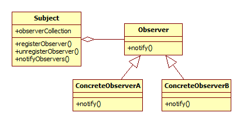

## Observer vagy publish/subscribe

Az observer tervezési minta lehetővé teszi, hogy egy objektum értesítést kapjon akkor, ha egy másik objektumban valamilyen esemény (például attribútumok változása) bekövetkezik.

### Bevezető példa

Tegyük fel, hogy egy HTML szerkesztő alkalmazást készítünk. Azt szeretnénk, hogy két nézet is legyen egyszerre: az egyik a HTML forráskódot mutatja, a másik pedig a kirenderelt weboldalt. Ilyenkor teljesen jogos elvárás az, hogy ha a forrás nézetben egy H2 taget átírok H1-re, akkor a másik nézetben azonnal lássam, hogy a fejléc betűtípusa ettől megváltozik. Ha pedig a kész weboldal nézetében egy sort átszínezünk kékre, akkor ez a forráskódban is azonnal jelenjen meg.

Egy ilyen alkalmazásban tipikusan a document - view megközelítést alkalmazzuk, ahol egy dokumentum és két hozzá kapcsolódó nézet van. Az Observer design pattern lényege, hogy a nézetek figyelik a dokumentumot, és ha az megváltozik, arról szeretnének azonnal tudomást szerezni, hogy ennek megfelelően módosíthassák a megjelenésüket a felhasználói felületen. Ezt úgy érik el, hogy az observerek feliratkoznak a dokumentum változását jelző eseményekre, így ha a dokumentum változik, minden feliratkozott observer kap róla értesítést.

    class Document;

    class IObserver
    {
    public:
        onDocumentChanged(const Document& doc)
    }

    class Document
    {
    public:
        void registerObserver(IObserver& obs)
        {
          observers.push_back(obs);
        }

    private:
        std::vector<IObserver&> observers;

        void notifyAllObservers() const
        {
            for(auto& obs : observers)
            {
              obs.onDocumentChanged(* this);
            }
        }
    }

A *notifyAllObservers()* metódus azért private, mert minden esetben a dokumentum kezdeményezi az observerek tájékoztatását, miután megváltozott a tartalma.

### Részletek

Az observer design pattern tipikusan egy-több függőségeket kezel le, ahol egy példány változásairól minden függő példány értesül. Szokták ezt még publish/subscribe tervezési mintának is nevezni. Főleg elosztott eseménykezelésre használjuk (amikor nem egy központi helyen vannak az eseménykezelők, hanem mindenki - viszonylag független módon - tudomást szerez arról, ami érdekli.) Fontos eleme a Document-View modellnek és a Model-View-Control architektúráknak is.

Az implementációra kiváló megoldást ad a Qt signals-and-slots rendszere is.

Az implementációnál figyelni kell arra, hogy ha egy observer hamarabb is megszűnhet, mint amiket figyel, akkor a megfigyelt objektum észrevegye, hogy a nála lévő referencia vagy pointer az observerre már érvénytelen. (Ilyenkor hasznos az std::weak_ptr.)

Előnyök:

  * Laza csatolás, a dokumentumnak mindegy, hányan figyelik.
  * Jól skálázható, mivel sok feliratkozást is könnyen tud kezelni a megoldás.

Hátrányok:

  * Elég nehéz módosítani az üzenetek formátumát (mivel ahhoz minden notify() implementációt módosítani kell), így előfordulhat, hogy az idővel szűk keresztmetszet lesz: egyre több mindenről derül ki, hogy azt is át kellene adni az observernek.

Általánosan az observer minta osztálydiagramja az alábbi:

A megfigyelt osztálytól azt várjuk el, hogy tárolja a megfigyelő observerjeit és ebbe a tárolóba fel lehessen venni és ki lehessen venni konkrét observer példányokat (registerObserver(), unregisterObserver()). Ezen kívül természetesen képesnek kell lennie arra, hogy a megfigyelt esemény bekövetkezésekor értesítse az observereket (notifyObservers()). Az observerektől mindössze annyit várunk el, hogy a notifyObservers() jelzését tudják fogadni, ami ebben az esetben a notify() metódus implementálása. (Előfordul az is, hogy a notify() paramétere a Subject maga, ha olyan eseményt figyel az observer, aminél fontos, hogy kinél következett be.)

### Példa: robotban szenzor adatok frissítése

Egy autonóm mobil robotban a sok fedélzeti szenzor értékét vagy folyamatosan pollozni kell (vagyis periodikusan lekérdezni, hogy változott-e), vagy ki lehet alakítani egy observeres megoldást, ahol a szenzor értesíti a regisztrált observereket. Vagy akkor, ha (1) új mérési eredmény áll rendelkezésre, vagy (2) ha az új eredmény jelentősen el is tér az előzőtől.

(A 2. esetben az observer regisztrációjánál lehet, hogy azt is meg kell tudni adni, hogy az adott observer mekkora változás esetén kapjon értesítést. Annak ugyanis kicsi az esélye, hogy egy szenzor mindig pontosan ugyanazt méri, így ilyen küszöbszint nélkül folyamatosan kapnánk az értesítéseket. Ha ezt a küszöbszintet observerenként lehet állítani, akkor az egyes alrendszerek különböző érzékenységgel figyelhetik a szenzort.)

Ugyanezt a mechanizmust egyébként nem csak a szenzorokkal lehet kialakítani, hanem magasabb szintű "érzékelőkkel" is: például lehet készíteni egy olyan virtuális szenzort, ami ráépül az oldalsó távolságmérőre és akkor jelez, ha már meggyőződött róla, hogy egy közeli, kiszögelléses fal mellett megy a robot. Ilyenkor a felsőbb szintű logika lehet, hogy elég, ha csak erre a virtuális szenzorra iratkozik fel. Milyen kényelmes, ha van egy függvényünk, ami akkor hívódik meg, ha egyértelműen kiszögelléses fal mellett haladunk.

<small>Szerzők, verziók: Csorba Kristóf</small>
