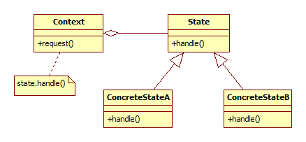

## State

A state minta lehetővé teszi egy objektum számára, hogy megváloztassa a működését, ha a belső állapota változik.

### Bevezető példa

Autonóm robotoknál általános, hogy viselkedésüket a környezetéből érkező információk határozzák meg. Vagyis attól függően, hogy az érzékelők miket jeleznek, a robotnak módosítania kell a viselkedését. A Strategy design pattern megmutatja, hogyan lehet egy algoritmust könnyen kicserélhetővé tenni. A State design pattern ezt úgy használja fel, hogy a robotnak mindig van egy aktuális állapota (véges állapotú automatát feltételezve), ami pedig magában tartalmazza azt, hogy hogyan reagál az eseményekre, egyfajta Strategy patternként.

(Az alábbi kódrészlet több helyen a láthatóságok miatt nem fordul. Ezeket terjedelmi okokból nem vettem bele az alábbi példába, mivel hiányuk az érthetőséget nem befolyásolja.)

    class Robot
    {
    public:
        Robot();
        void setState(State s);
    private:
        State currentState;
    };

    class State
    {
    public:
        State(Robot& r) : robot(r) { }
        virtual void onFrontDistanceChanged(float distance) { }
        virtual void onLeftDistanceChanged(float distance) { }
        virtual void onRightDistanceChanged(float distance) { }
        virtual void onLeftWallDetected(float distance) { }
        virtual void onRightWallDetected(float distance) { }
        virtual void onVelocityChanged(float velocity) { }
        virtual void onTick() { }
    private:
        Robot& robot;
    };

Érdemes a State ősosztályban alapértelmezett metódusokat adni, hogy az egyes Stateekben csak azokat kelljen megírni, amire ténylegesen szükség van.

    class CruiseState : public State
    {
    public:
      CruiseState(Robot& r) : State(r) { }
      virtual void onLeftWallDetected(float distance) override;
    };

    class StoppingState : public State
    {
    public:
      StoppingState(Robot& r) : State(r) { }
      virtual void onVelocityChanged(float velocity) override;

    private:
      const float maxSpeedForStopped = 0.01;
    };

    class StandbyState : public State
    {
    public:
      StandbyState(Robot& r) : State(r) { }
    };

    Robot::Robot()
       : currentState(CruiseState(*this))
    { }

    void CruiseState::onLeftWallDetected(float distance)
    {
        robot.setState(StoppingState(robot));
    }

    void StoppingState::onVelocityChanged(float velocity)
    {
      if (velocity <= maxSpeedForStopped)
      {
        robot.setState(StandbyState(robot));
      }
    }

Ebben a példában ha a robot bal oldalán egyértelműen (többszörös mérésekkel igazolva) fal van, akkor a robot elkezd megállni (StoppingState). Ha pedig megállt, akkor állva marad (StandbyState).

### Részletek

Általánosan a State design pattern lehetővé teszi egy objektum számára, hogy változtasson a saját viselkedésén, ha a belső állapota változik. (Mivel a belső állapotát leíró objektum tárolja az ilyen esetben érvényes viselkedés leírását is.)

Ezt úgy éri el, hogy a contextnek (a fenti példában a robot, vagyis akinek állapota van) van egy aktuális állapota, melyet azonban az állapot le tud cserélni.

A State pattern klasszikus, C implementációja vagy egy look-up-table, vagy egy hatalmas switch szerkezet szokott lenni.

Ez az objektum orientált megközelítés bár elsőre esetleg feleslegesen bonyolultnak tűnhet, sokkal áttekinthetőbb képet ad akkor, amikor már az egyes állapotok implementációjánál tartunk: egy osztály egy állapot, a metódusok az egyes események. Itt már az egyes állapot osztályokon belül már csak azzal az egy állapottal kell foglalkozni, megfelelően elválasztva a többitől, külön osztályban és valószínűleg külön fájlban is.

További lehetőségek a fenti példában

  * Ha az állapotváltáskor jelentős logikát kell futtatni, akkor a State váltást végző függvény már meg is hívhatja az új állapotnak valami onEntering() metódusát, hogy az a belépéskor mindig lefusson. Ugyanígy lehet onLeave() metódust is készíteni.
  * a StandbyState-ben az onTick esemény segítségével villogjon egy helyzetjelző fény

A Strategy és State minta elég közel állnak egymáshoz. A fő eltérés, hogy a strategy mintában nem a belső állapot dönti el, hogy mikor vált stratégiát, hanem azt kívülről kapja az objektum, például a konfigurációtól függően. De a state mintához a strategy is hasznos lehet, ha például számos állapotban kell vonalat követnie a robotnak, viszont ezt a vonalkövetési módszert cserélhetővé akarjuk tenni. A cserét macera minden állapotban lekódolni, sokkal jobb, ha az viszont strategy minta szerint kerül bele, a State-ek pedig csak használják.

A state minta osztálydiagramja az alábbi:

A Context, vagyis aminek állapotai vannak, valamilyen kérés (request()) kezelése esetén a State egyik ősosztályára bízza a helyzet kezelését (state.handle()). Attól függ a ténylegesen meghívott handle(), hogy éppen melyik az aktuális állapot (ConcreteStateA vagy ConcreteStateB). Fontos, hogy a State leszármazottak számára valahogy lehetővé kell tenni, hogy lecseréljék magukat egy másik állapotra (pl. Context::setCurrentState(State& newState)), mert az állapotok csak ekkor fognak tudni váltani magukról egy másikra.

Az állapotváltást a State leszármazottjai kezdeményezik. Vagy úgy, hogy a Context számára mindig létrehoznak egy új State példányt (pl. context.setCurrentState(make_unique<ConcreteStateB>()) ), vagy ha nem akarjuk mindig újra példányosítani az osztályokat, a Context maga is tárolhat minden State leszármazottból egy példányt (pl. std::map-ben), ahonnan a State csak elkéri és átadja a Contextnek, mint következő.

### További példák

  * Hierarchikus menük implementálására is hasznos lehet a minta: minden almenü egy state osztály.
  * Beágyazott környezetben például egy grafikus LCD megjelenítési módjai között lehet state mintával váltogatni.
  * Egy rajzprogramban a kiválasztott eszközt is meg lehet valósítani state mintával.

<small>Szerzők, verziók: Csorba Kristóf</small>
