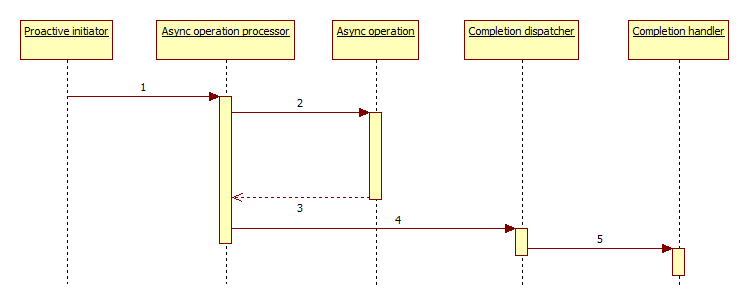

# Más struktúrális minták (FÉLKÉSZ)

## Bridge (MED)

### Bevezető példa

### Részletek

Belső példány az adaptee (ctor kapja meg), a publikus metódusok pedig arra forgatják át a hívásokat. Az Adapter emellett megvalósíthat egy interfészt, ami a kliens elvárásait definiálja.

    class BridgePattern {
        public static void main(String[] args) {
            Shape[] shapes = new Shape[] {
            new CircleShape(1, 2, 3, new DrawingAPI1()),
            new CircleShape(5, 7, 11, new DrawingAPI2()),
        };

        for (Shape shape : shapes) {
            shape.resizeByPercentage(2.5);
            shape.draw();
        }
    }

### Példa:

### Példa:

### További példák

## Flyweight (MED)

### Bevezető példa

* Labirintusos vagy táblás játék mezői és a tileset

### Részletek

Sok kis objektum csomó közös memóriaterülettel. Pl. egy doksi karakterei, de mögöttük a képek közösek. (Wrn konkurrencia!)

Ehhez lehet, hogy egyfajta singleton FlyWeightPointer kell, ami a közös részeket tárolja és példányosítja.

### Példa:

### Példa:

### További példák

## Front Controller (SKIP)

Webes rendszerek, mindent az index.php szolgál ki (lehet, hogy továbbhív). Pl. navigáció egyszerűbb, mint az egyes oldalakat összepókhálózni linkekkel.

(Hmmm... Command pattern és Facade?)

### Bevezető példa

### Részletek

### Példa:

### Példa:

### További példák

# Más viselkedési minták (behavioral patterns)

## Chain of responsibility (MED)

### Bevezető példa

### Részletek

### Példa:

### Példa:

### További példák

Command objektumok forrása és egy sor végrehajtó objektum. Addig megy minden command a láncban, amíg valaki le nem kezeli.

Variáció: elágazás is lehet a láncban, végrehajtási fák

"The following code illustrates the pattern with the example of a logging class. Each logging handler acts as the processing object. Each handler decides if any action is to be taken at this log level and then passes the message on to the next logging handler. Note that this example should not be seen as a recommendation on how to write logging classes."

private Logger* next;

StdOut, Email, StdErr loggers
(Ebben a példában: a lánc összerakására lehet builder osztályt készíteni!)

## Command (MED)

### Bevezető példa

### Részletek

### Példa:

### Példa:

### További példák

'''class Light : ISwitchable
ISwitchable lamp = new Light();
class CloseSwitchCommand : ICommmand;

//Pass reference to the lamp instance to each command
ICommand switchClose = new CloseSwitchCommand(lamp);
ICommand switchOpen = new OpenSwitchCommand(lamp);'''

Sok felhasználási tipp:
http://en.wikipedia.org/wiki/Command_pattern

Bookkeping, progress bar, mobile code...

Példák

* Robot elemi műveletek (soros végrehajtásra), lásd még Active Object pattern

## Iterator (MED)

### Bevezető példa

### Részletek

### Példa:

### Példa:

### További példák

Csak említsem meg, hogy ez is egy pattern, amit ráadásul sokszor használnak is. Részletesen belemenni viszont nem kell. Lásd STL konténerek, range for a C++11-ben.

## Memento (MED)

### Bevezető példa

### Részletek

### Példa:

### Példa:

### További példák

Undo művelet alapja.

## Visitor (MED)

### Bevezető példa

### Részletek

### Példa:

### Példa:

### További példák

Egy művelet végrehajtása egy objektum struktúra elemein anélkül, hogy a célobjektumokon módosítani kellene.

"In essence, the visitor allows one to add new virtual functions to a family of classes without modifying the classes themselves; instead, one creates a visitor class that implements all of the appropriate specializations of the virtual function. The visitor takes the instance reference as input, and implements the goal through double dispatch."

Visitor calls element.accept(this), that calls visitor.visit(this).
Ez így double dispatch, az accept és visit is rendelkezhet mindenféle típusú paraméterekkel, amikből a fordító választ a másik oldalnak megfelelően.

Példák

* BlobContainer, bár abban nincsen double dispatch

## Template method (SKIP)

### Bevezető példa

### Részletek

### Példa:

### Példa:

### További példák

"Define the skeleton of an algorithm in an operation, deferring some steps to subclasses. Template method lets subclasses redefine certain steps of an algorithm without changing the algorithm's structure"

Az általános workflowt csak egyszer kell megírni.

Nem lehet mindent felülcsapni a rendszerben, csak a megengedett helyeket.

## Interpreter (SKIP)

Nyelv interpretálásra, nekünk most nem releváns.

## Mediator (SKIP)

Mindenkinek a mediator üzen, nem mindenki egymásnak. A mediatort lehet hívni, ő majd megfelelően továbbít az aggregált komponenseknek. Lehet, hogy sima broadcast, de az is lehet, hogy az egyes funkció kategóriáknak mást kell üzennie.

Lazítja a csatolást.
"defines an object that encapsulates how a set of objects interact"

## Blackboard (SKIP)

"Generalized observer, which allows multiple readers and writers. Communicates information system-wide."

# Más konkurrencia tervezési minták (Concurrency patterns)

# Design patterns - Cuncurrency handling patterns

## Active object (MED)

Szétválik a metódus hívása és végrehajtása. Bent a metódus csak felvesz egy új feladatot (runnable queue) a feladatra. Közben meg ő ezeket hajtogatja is végre, ahogy halad előre. Konkurrencia bevezetése belső kezeléssel.

## ? Balking (MED)

Metódus az allapottól függően lehet, hogy nem tud lefutni. Ekkor vagy hibát dob, vagy visszatér. (Pl. bocs, most nem értek rá... mint az M6 mérésben a send-ek, ha foglalt a periféria.)

Egyesek szerint antipattern, az API-ját mindenki támogassa, vagy legyen előtte Facade.

## Proactor (MED)

http://en.wikipedia.org/wiki/Proactor_pattern

Egy async reactor. Hosszan tartó folyamatokat futtat async, majd completion handlert hív.

## Thread pool (MED)

(Special case of object pool.) Mi a különbség ez és a Leaders/followers között?

## Monitor-object (REM only)

Szokásos lock mechanizmus, "synchronized" kulcsszó, itt most nem tárgyaljuk.

A metódusai kölcsönösen kizárják egymást.

## Reactor (MED/SKIP)

(Rem: A user interface eseménykezelése pont ilyen?)

Async bejövő kéréseket sync továbbít a kezelőkhöz. A kezelőket lehet nála regisztrálni.

Korlátozza a max. párhuzamosíthatóságot.

## Object pool (rem only)

Elmondandó

* Általánosítása a connection és thread pooloknak. Újrahasznosítással elkerüli a rengeteg drága létrehozási és felszabadítása munkát.

Ha nincs szabad, 3 megoldás: (1) error code, (2) még egy példány létrehozása, több szálú esetben (3) blokkolás amíg nem lesz szabad.

Fontos a poolba visszatéréskor az állapot resetelése! Pl. egy authentikációs token esetében...

## Double-ckecked locking (SKIP)

SKIP

Sokszor gondokhoz vezet, egyesek szerint anti-pattern.

Először megnézzük, hogy kell-e a lock, ha igen, akkor lockolunk és újra ellenőrzünk.

## Thread-specific pool (SKIP)

"Szálon belül globális változó", C++11-ben thread_local kulcsszó.

<small>Szerzők, verziók: Csorba Kristóf</small>
