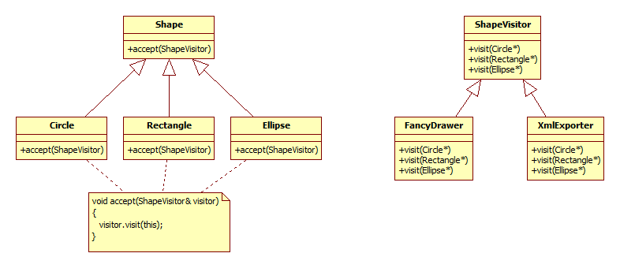
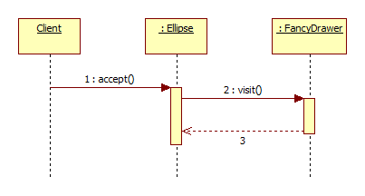

## A Visitor tervezési minta

A visitor tervezési minta célja, hogy (látszólag) új funkciókkal lehessen kibővíteni osztályokat anélkül, hogy módosítanánk az adott osztályt.

### Bevezető példa

Tegyük fel, hogy egy vektoros rajzprogramot készítünk, amiben az alakzatok (Circle, Rectangle és Ellipse osztályok) egy közös Shape ősből származnak. Az alapvető funkciókkal már készen vagyunk, viszont most szeretnénk készíteni két új funkciót. Az egyik egy alternatív megjelenítési stílus, a másik pedig egy exportálási funkció, ami XML fájlba tudja kiírni a rajzunk tartalmát.

Tegyük fel, hogy az osztályaink már meg tudják magukat jeleníteni, de többet nem. És az osztályokhoz nem is akarunk már hozzányúlni. Vagy azért, mert nem tudunk, vagy azért, mert nem akarjuk óriás osztályokká tenni őket. Sokkal jobb lenne a fenti két új funkciót valahogy kiszervezni az osztályokból.

A visitor tervezési minta lényege, hogy készítünk egy lehetőséget arra, hogy egy kívülről kapott objektum minden osztályunkat "végiglátogasson" és mindegyikkel csináljon valamit. Ráadásul a visitornak és a végiglátogatott osztályoknak is többféle osztálya lehet: most van háromféle alakzatunk, amit nyilvánvalóan eltérően kell kezelni, és van két funkciónk (új megjelenítés és XML export).

A megoldás az alábbi osztály diagramon látható:

Minden Shape leszármazottat felkészítünk arra, hogy fogadjon egy visitort. Amikor az accept() metódusnak átadjuk majd a konkrét visitort, az accept() fogja meghívni a visitor visit() metódusát, ami paraméterként megkapja a hívó referenciáját.

Ezt a műveletet hívjuk double dispatchnek. Azért jó, mert ha egy generikus tárolónk van, ami csak Shape* pointereket tárol, valamint van egy ShapeVisitor* pointerünk a visitorra (de nem tudjuk, konkrétan melyik az), akkor is minden szépen működik: az accept() bár ShapeVisitor referenciát kap, mivel a visit() virtuális függvény, a helyes leszármazott visitor implementációt fogja meghívni. A visit() paramétereként pedig a this pointert kapja meg, ami már a tényleges Shape leszármazottra mutató pointer (és nem Shape*, azért kell minden Shape leszármazottban implementálni az accept()-et és ezért nem lehet simán örökölni az ősből). Így ténylegesen a megfelelő visitor implementációnak a meglátogatott alakzatnak megfelelő metódusa fog meghívódni. (Ezt elegánsan úgy is mondhatjuk, hogy a meghívott metódus mind a visitor, mind az alakzat dinamikus típusának megfelelően hívódik meg.)

### Egyéb részletek

A gyakorlatban sokszor előfordul a visitor mintának egy egyszerűsített változata, amikor a visitor visit() metódusa csak egyféle paramétereket kaphat. Például azért, mert csak egyféle objektumokat kell tudni "meglátogatni".

Ilyenkor lehet készíteni a meglátogatandó elemek tárolója számára egy olyan metódust, ami paraméterül kap egy lambda kifejezést, aminek a paramétere egy ilyen elem. A tároló pedig minden egyes elemére lefuttatja a lambda kifejezést. A fenti példában ebben az esetben lenne egy ShapeContainer, aminek lenne egy Shape-ekre értelmezett lambda kifejezést kapó metódusa:

    void ShapeContainer::ForEach(std::function<void(const Shape&)> lambda)
    {
       for(const Shape& s : shapeVector)
       {
          lambda(s);
       }
    }

### További olvasnivaló

A visitor tervezési mintára konkrét implementációs példa szerepel a [0216_VisitorObserverPelda](../0216_VisitorObserverPelda/0216_VisitorObserverPelda.html) snippetben.

<small>Szerzők, verziók: Csorba Kristóf</small>
