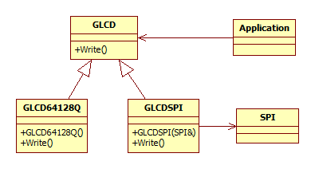
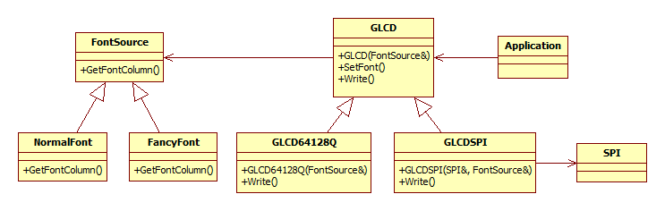
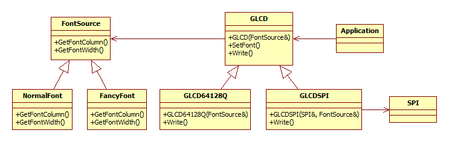

## GLCD szoftver tervezési példa

A következő leírás egy grafikus LCD és a hozzá kapcsolódó betűtípus kezelés megvalósításának tervezési lépéseit mutatja be. A konkrét megvalósítás most nem cél, csak a szoftver komponensek és kapcsolataiknak a megtervezése, és az ehhez kapcsolódó gondolatmenet bemutatása.

### A feladat

Tegyük fel, hogy beágyazott környezetben akarunk egy grafikus LCD-hez osztálykönyvtárat készíteni, ami alapján utána majd kényelmesen tudjuk vezérelni a kijelzőt. Nyilván ez egy kicsit általános, így most az alábbi feltételezésekkel fogunk élni:

  * Többféle grafikus LCD-t szeretnénk támogatni, ha esetleg a hardver változna.
  * A GLCD-k egy része GPIO-kon keresztül, saját protokollal kommunikál (pl. Displaytech 64128Q), de van, amelyik SPI-on.
  * A GLCD elvárt funkció közül most csak a string kiírására koncentrálunk, de természetesen az interfésze egyéb dolgokra, pl. kép kirakására is képes lehet.
  * Szeretnénk, ha többféle betűtípussal is tudna írni.

A tervezés során szeretnénk követni a SOLID elveket, kiemelten figyelve az open-close principle-re. Tegyük fel továbbá, hogy a többféle betűtípus támogatása első körben még nem feladat, az majd menet közben derül ki.

### Első kör: GLCD interfész

A GLCD-t az alkalmazásaink egy interfészen keresztül fogják elérni, ami majd elfedi azt, hogy pontosan melyik modellről is van szó. Ebből az következik, hogy kell egy (absztrakt) GLCD class, amin keresztül ki lehet írni stringet.

Mi a helyzet a kommunikációval? A GLCD példányoknak nyilván kell majd kommunikálni, de a közös ősosztályban nem tudjuk, hogy hogyan, mert az példány (GLCD hardver) függő. Így ez nem is kerül bele az ősosztályba, majd a leszármazottak megoldják.

    class GLCD
    {
    public:
      virtual void Write(uchar row, uchar col, const char* text) = 0;
    };

Bárki, akinek rendelkezésre áll egy GLCD példány, az tud írni rá. Ennek az osztálynak most két leszármazottja lesz. (A metódusok részleteibe most nem megyünk bele.)

    class GLCD64128Q : public GLCD
    {
    public:
      GLCD64128Q();
      virtual void Write(uchar row, uchar col, const char* text);
    private:
      const uint16_t GPIO_PIN_ENABLE = 2;
    };

    class GLCDSPI : public GLCD
    {
    public:
      GLCDSPI(SPI& spi);
      virtual void Write(uchar row, uchar col, const char* text);
    private:
      SPI& spi;
    };

Az SPI kommunikációt használó esetben érdemes az SPI kapcsolat részleteit egy másik, újrahasznosítható osztályba kiszervezni, hogy ott már csak át kelljen adni a konstruktorba (dependency injection módszer). Valószínűleg a main() függvény fog majd példányosítani egy SPI objektumot és amikor a grafikus LCD-hez ér, már csak átadja neki.

(Az SPI referenciát nem lenne szerencsés az ősosztályban tárolni, mivel csak néhány leszármazott használja. Az ilyen adatoknak nem ott van a helye, hanem lentebb az osztály hierarchiában. Ha több SPI-os leszármazott lenne, akkor azoknak lehet egy közös ősosztályuk, ami a GLCD-ből származik le és már tartalmazza az SPI-ra a referenciát.)

A GPIO egy kicsit problémásabb: hogyan is kellene elegánsan megmondani, hogy a GLCD melyik lába melyik GPIO-ra csatlakozik? Mivel a projektben ezen a ponton még valószínűleg nem akarunk hű-de-általános rendszer készíteni, cserébe haladni akarunk a munkával, egy lehetséges megoldás, ha a GLCD64128Q osztályon belül előre látóan, de bedrótozzuk a GPIO kiosztást. (Hátha nem is kell másik kiosztással dolgozni, YAGNI: You Aint Gonna Need It.) Persze azért bedrótozni úgy fogjuk, hogy könnyű legyen lecserélni, ha pl. később a konstruktor kap majd egy ilyen beállításokat tartalmazó struct-ot. Addig is az osztályon belül készítünk rá private konstansokat (GPIO_PIN_ENABLE) és azokat használjuk. Így ha módosítani kell, csak egy helyen kell, ráadásul ez az módosítás az interfészt nem fogja befolyásolni és csak ott kell tudni róla, ahol a konstruktort meghívjuk.

Lássuk, hogy állunk a tervezési SOLID elvekkel:

  * Single Responsibility Principle: a GLCD interfésznek és leszármazottjainak csak GLCD kezelés a feladata, semmi más. Az SPI kommunikáció például nem ide tartozik, az ki van szervezve.
  * Open-Close Principle: Ha új GLCD hardvert kell támogatni, csak egy új GLCD leszármazottat kell létrehozni és a main()-ben azt kell példányosítani. Vagyis máshol nem kell módosítani már meglévő forráskódon.
  * Liskov Substitution Principle: minden GLCD leszármazott pontosan azt teszi az örökölt metódusaiban, amire azt az ősosztályban szántuk. Ez itt a példában nem látszik, de a Write metódusokban figyelünk rá, hogy más mellékhatás ne legyen.
  * Interface Segregation Principle: itt most nem sok szétválasztható dolog volt, így ez az elv most nem jött elő.
  * Dependency Inversion Principle: teljesül, mivel a programunk többi része nem függ majd a konkrét GLCD implementációtól, csak a GLCD ősosztálytól. Az alacsony szintű részletek el vannak rejtve az interfész mögé. (Az osztály diagramon a rendszer többi része felől nem vezet irányított út a GLCD leszármazottakhoz.)

### Második kör: több betűtípus támogatása

A fenti megoldás a Write metódusokban nyilván valahonnan előszedi, hogy hogyan is néznek ki az egyes karakterek. Valószínűleg van erre egy jókora tömb valami hasonló kezdettel: (A példában a 32-es ASCII kódú karaktertől kezdve minden egyes karakter képének 5 byte formájában megadjuk az 5 oszlopát.)

    #pragma once
    #ifndef _FONT_H__
    #define _FONT_H__
    char fontdata[] = {
        0x00, 0x00, 0x00, 0x00, 0x00, // SPACE
        0x00, 0x00, 0x5F, 0x00, 0x00, // !
        0x00, 0x03, 0x00, 0x03, 0x00, // "
        0x14, 0x3E, 0x14, 0x3E, 0x14, // #
        0x24, 0x2A, 0x7F, 0x2A, 0x12, // $

Ezt kellene most kiszervezni a GLCD interfész alól azért, hogy később cserélhető legyen és ez a GLCD-nek ne tűnjön fel. A dependency inversion principle érdekében ismét készítük egy ősosztályt, ami be fogja burkolni az egyes font készleteket.

    class FontSource
    {
    public:
        virtual char GetFontColumn(char ch, int column) = 0;
    };

A GetFontColumn fogja mindig visszaadni a "ch" karakter "column" sorszámú oszlopát. C-ben a FontSource helyett valószínűleg annyit tettünk volna, hogy a GLCD-nek van egy pointere egy ilyen fontdata tömbre, amit meg lehet változtatni és mindig arra a fontkészletre mutatott volna, amire éppen szükség van. Ez rendben is van, ha (1) nem objektum orientáltan dolgozunk, és (2) biztosak lehetünk benne, hogy minden létező fontdata tömb pont ugyanilyen lesz.

Nyilván az új interfész bevezetésével most sajnos módosítani kell a GLCD leszármazottakat, hogy a Write metódusok külső forrásból kérjék le a karaktereket, ezt most nem tudjuk elkerülni. Ezen kívül a GLCD konstruktort is módosítani kell, hogy elmentse a használt FontSource referenciáját. (Sőt, ha mehet közben akarunk módosítani, akkor egy setter metódus sem árt.)

    class GLCD
    {
    public:
        GLCD(FontSource& fontSource) { SetFont(fontSource); }
        void SetFont(FontSource& fontSource) { this->fontSource = fontSource; }
        virtual void Write(uchar row, uchar col, const char* text) = 0;
    protected:
        FontSource& fontSource;
    };

Érdemes megemlíteni, hogy a fontSource-ot érdemes az ősosztályban kezelni, a leszármazottaknak ezzel már ne legyen semmi dolga. (A láthatósága protected, különben nem tudnák a leszármazottak használni.) A GLCD leszármazottak szintén a konstruktorukban fogják megkapni a FontSource referenciát, amit továbbadnak majd a GLCD ősosztály konstruktorának. Például a GLCDSPI esetében:

    class GLCDSPI : public GLCD
    {
    public:
        GLCDSPI(SPI& spi, FontSource& fontSource) : GLCD(fontSource) { this->spi = spi; }
        virtual void Write(uchar row, uchar col, const char* text);
    private:
        SPI& spi;
    };

A Write metódusok megfelelő módosításával sikeresen ki is szerveztük a FontSource támogatást. A FontSource egyes leszármazottai belül valószínűleg egy a "fontdata" megoldáshoz hasonló tömböt fognak használni. Ez már belső magánügyük. A lényeg, hogy kintről ezeket lehet cserélgetni és a GLCD mindig az aktuálisat használja.

    class NormalFont : public FontSource
    {
      public:
          virtual char GetFontColumn(char ch, int column);
    }

    class FancyFont : public FontSource
    {
      public:
          virtual char GetFontColumn(char ch, int column);
    }

Lássuk, hogy állunk a tervezési SOLID elvekkel:

  * Single Responsibility Principle: A GLCD felelősségéből kivettük a betűtípus támogatást, mert bár eddig az egy belső ügynek számított, most már többfélét kell támogatni, így jelentős felelősségi körré emelkedett. A FontSource leszármazottaknak pedig egyetlen, igen egyszerű feladata van: adják vissza a kért karakter kért oszlopát leíró byteot.
  * Open-Close Principle: ez az alapelv most egy kicsit sérült, mivel a több betűtípus támogatásához meg kellett változtatnunk a GLCD tartalmát és konstruktorát. Ezt nem tudtuk elkerülni, viszont a továbbiakban ha új betűtípust kell felvenni, már újra teljesülni fog az elv, mert már csak egy új FontSource leszármazottra lesz szükség.
  * Liskov Substitution Principle: a FontSource-ra is igaz, hogy a leszármazottainál figyelünk majd arra, hogy semmi, az interfész alapján nem várt mellékhatást is okozzanak.
  * Interface Segregation Principle: mivel a font kezelés jelentős feladat lett, ennek kezelését kiemeltük a GLCD-ből. (Lehetne azon érvelni, hogy akkor a GLCD származzon egy "ChangeableFontConsumer" interfészből és a SetFont abban legyen a GLCD helyett, de ez egy kicsit már túlzás lenne a mostani környezetben.)
  * Dependency Inversion Principle: teljesül, mivel sem a main(), sem a GLCD nem tud az egyes betűtípusok alacsony szintű megvalósításáról. Az osztály diagramban nem vezet irányított út a GLCD-ből a FontSource leszármazottjaihoz, így azok változása sincs hatással a GLCD implementációkra.

### Harmadik kör: eltérő méretű betűk támogatása

Tegyük fel, hogy az eddigi betűtípus támogatásunkkal sokáig vígan fejlődött a projekt (az open-close principle betartásával), most azonban a betűtípusok közé egy szélesebb karaktereket tartalmazót is fel akarunk venni. Ehhez egy kicsit megint bele kell nyúlni a már elkészült kódrészletekbe, de ha ügyesek vagyunk, utána sokáig megint nem kell majd piszkálni őket.

Ha csak szélesebbek a betűk, akkor a fenti FontSource::GetFontColumn még rendben van (nincsen több sora egy karakternek), mindössze annyi kiegészítés kell, hogy a FontSource-tól el kell tudni kérni, hogy egy karakter hány oszlopból áll:

    class FontSource
    {
    public:
      virtual char GetFontColumn(char ch, int column) = 0;
      virtual int GetFontWidth() = 0;
    };

Itt esetleg elgondolkozhatunk, hogy ha már úgyis módosítani kell a GLCD::Write metódusokat, hogy ezt kérdezzék le, esetleg a több soros (8 pixelnél magasabb) betűtípusok támogatását is berakjuk-e. Ez tervezői döntés annak függvényében, hogy mennyire érezzük ezt az igényt reálisnak.

Az egyes GLCD::Write-ok módosítása és FontSource::GetFontWidth metódusok megírása után a FontSource már alkalmas lesz a szélesebb betűtípus támogatására is.

Érdemes megjegyezni, hogy ha C-ben fontdata tömbre mutató pointert adtunk volna át a GLCD vezérlőnek, akkor itt most vagy le kellett volna cserélni a char pointert egy struct pointerre (ami nem csak a fontdata tömb pointerét tartalmazza, hanem mellette a méreteket is), vagy további paramétereket is át kellett volna adogatni a GLCD-nek, amik egyébként a betűtípus belső adatreprezentációjára vonatkoznak. Vagyis a GLCD egyre több információt tárolt volna a font adatok felépítéséről. Objektum orientált megközelítésben a fenti esetben továbbra is igaz, hogy bár új műveleteket fel kell néha venni, a GLCD továbbra sem tudja, hogy a FontSource::GetFontColumn és FontSource::GetFontWidth mi alapján válaszolja azt, amit. Ez pedig azt is jelenti, hogy a FontSource leszármazottak belül nyugodtan változhatnak, az senkit nem fog zavarni. (Például készíthetünk olyan fontot, ami valójában egy külső memória modulból töltődik be és tömörítődik ki. Vagy dőlt betűket generálhatunk a normál betűk képének megdöntésével, amihez azokat nem kell újra letárolni.)

### Egyéb megjegyzések

Azt még érdemes megemlíteni, hogy a 2. körben a GLCD konstruktorokból kihagyhattuk volna a FontSource referenciákat, ha bevezetünk egy globális default fontot. Így akkor egyszerűsödik az interfész, viszont meg kell oldani, hogy a GLCD ősosztály hogyan találja meg a default FontSource-ot a konstruktorában. Erre fel lehet használni a singleton tervezési mintát, amivel készíthetünk egy mindenhonnan elérhető FontCollection-t, amiből el lehet kérni pl. név alapján a FontSource-okat, és biztosítjuk, hogy egy "default" nevű mindig lesz.

<small>Szerzők, verziók: Csorba Kristóf</small>
