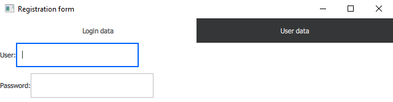
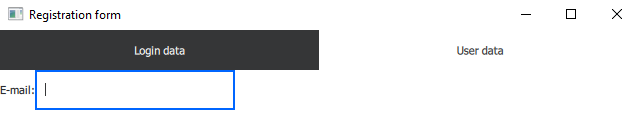

# Qt Qml Focus

## Kezdetek

A bemutatót egy nagyon egyszerű Hello World alkalmazással kezdjük.

```javascript
import QtQuick 2.7
import QtQuick.Controls 2.0

ApplicationWindow {

    visible: true
    width: 640
    height: 480
    title: qsTr("Hello World")

}
```

### Debuggolás

A fókuszproblémák debuggolása nehéz feladat, mivel a felületi elemek nagy részénél nem látszik, hogy fókuszban vannak-e éppen vagy sem. (Ez alól például a TextField kivétel, hiszen ott a villogó kurzor jelzi.)

Első lépésként ezért szúrjuk be a következő kódot az ApplicationWindow törzsébe.

```javascript
onActiveFocusItemChanged: {
    console.log("Actvie focus changed! -----------------------")
    var object = activeFocusItem
    while(object) {
        console.log(object.objectName + " " + object.toString() + " AF: " + object.activeFocus + " F: " + object.focus)
        object = object.parent
    }
}
```

A fenti kódrészlet minden esetben meghívódik amikor az ApplicationWindow érzékeli hogy másik (nem feltétlenül közvetlen) gyereke került fókuszba. Az éppen fókuszban lévő gyermekét az activeFocusItem nevű propertyjén keresztül érhetjük el.

Ebből az objektumból kiindulva felmászunk az objektumfán egészen a root elemig és minden megtalált szülő elemről kiírjuk az alábbiakat:

* Az objectName propertyt, ezt manuálisan beállíthatjuk a komponenseinken, így könnyebb megkülönböztetni a felületi elemeket.
* Az object.toString() eredményét, mely az objektumról ad információkat. Számunkra az objektum típusa érdekes, hiszen így nem kell a teljes alkalmazásunkat telerakni objectName-kkel, enélkül is nagyjából be tudjuk azonosítani ki kicsoda.
* Az activeFocus és a focus propertyjét az aktuális elemnek. Ezek segítségével tudjuk meghatározni melyik elem került/kerüljön fókuszba, ezekről lesz a továbbiakban részletesebben szó.

### Jótanács

Ha ilyen nehézkesen látható problémákat szeretnénk javítani saját alkalmazásunk fejlesztésekor, érdemes minden változtatás után manuálisan teljesen kitörölni a build könyvtárat. A qmake ugyanis még nem tökéletes, néha előfordul, hogy bizonyos változtatásokat nem érzékel a qml fájlokban és nagyon sokáig lehet keresni a hibát 'Miért nem működik?' amikor a mi kódunk jó lenne csak éppen még egy régebbi verziót látunk futtatáskor.

## Egyszerű alkalmazások

A fókusz kezeléséhez QML-ben két fontos propertyt tudunk használni.

**Focus property:** Alapvetően minden komponensre false a default értéke, a programozó kézzel állíthatja be igazra. Ha az értéke igazra van állítva az azt jelenti hogy ez a komponens *szeretne* fókuszba kerülni.

**ActiveFocus property:** Ez egy csak olvasható property amely akkor válik igazzá, hogyha a komponens *megkapta* a fókuszt.

### Bevezető példa

Szúrjuk be az alábbi két TextFieldet az ApplicationWindow törzsébe!

```javascript
    TextField  {
        id: elso
        objectName: "elso"
        text: "Első: " + (focus ? "Fókuszt kér, " : "Fókuszt nem kér, ") + (activeFocus ? "fókuszt kap." : "fókuszt nem kap.")
        width: 300
        height: 30
        anchors.horizontalCenter: parent.horizontalCenter
    }

    TextField {
        id: masodik
        objectName: "masodik"
        text: "Második: " + (focus ? "Fókuszt kér, " : "Fókuszt nem kér, ") + (activeFocus ? "fókuszt kap." : "fókuszt nem kap.")
        width: 300
        height: 30
        anchors.top: elso.bottom
        anchors.topMargin: 10
        anchors.horizontalCenter: parent.horizontalCenter
    }
```

Elindítottam az alkalmazást, ráklikkeltem az első majd a második TextField-re, majd bezártam az alkalmazást. A debug konzolon az alábbiak jelentek meg:

```console
Debugging starts
QML debugging is enabled. Only use this in a safe environment.
QML Debugger: Waiting for connection on port 8624...
qml: Actvie focus changed! -----------------------
qml:  QQuickItem(0x2b687a853b0) AF: true F: true
qml:  QQuickRootItem(0x2b687904cd0) AF: true F: true
qml: Actvie focus changed! -----------------------
qml: elso QQuickTextField(0x2b70c22e390, "elso") AF: true F: true
qml:  QQuickItem(0x2b687a853b0) AF: true F: true
qml:  QQuickRootItem(0x2b687904cd0) AF: true F: true
qml: Actvie focus changed! -----------------------
qml: masodik QQuickTextField(0x2b687a78880, "masodik") AF: true F: true
qml:  QQuickItem(0x2b687a853b0) AF: true F: true
qml:  QQuickRootItem(0x2b687904cd0) AF: true F: true
qml: Actvie focus changed! -----------------------
Debugging has finished
```

Látható, hogy induláskor csak a gyökérelem fókuszálódik. Ez nem ApplicationWindow típusú, mivel az ApplicationWindowba tett komponensek az ApplicationWindow contentItem nevű, QQuickRootItem típusú propertyjét kapják meg szülőnek. Ezért látjuk ezt az elemet a listában először.

Ha beleklikkelünk az első TextFieldbe a következő képet fogjuk látni:


A második TextFieldbe klikkelés hasonlóan néz ki.

Ha másik ablakra klikkelünk (jelen esetben én a QtCreator ablakára klikkeltem a leállításhoz) azáltal a teljes alkalmazás fókusza elveszik. Ilyenkor a focus propertyje a TextFieldnek igaz marad, tehát amint visszaváltunk erre az ablakra ismét ez a TextField fog fókuszba kerülni.


Nézzük meg mi történik ha hozzáadunk egy

```javascript
focus: true
```
sort például a második TextField törzsébe és úgy indítjuk el az alkalmazást!

Azt fogjuk tapasztalni, hogy induláskor azonnal a második TextField fókuszálódik. Nem kellett beleklikkelnünk!


Ez jól jön olyan oldalak fejlesztésekor ahol a felhasználótól azonnal inputot fogunk kérni (például felhasználónév - jelszó párost). Ilyenkor megspóroljuk a usernek azt a kellemetlenséget, hogy neki kelljen ráklikkelnie a megfelelő mezőre, hogy az adatait megadhassa.

### Property binding példa

Nézzünk egy kicsit bonyolultabb példát!

Tegyük fel, hogy olyan alkalmazást írunk ahol opcionálisan megadható a felhasználó email címe. Először be kell jelölnünk hogy igen, meg szeretnénk adni az email címünket és utána írhatjuk be a megfelelő mezőbe.

Illesszük be a következő, ezt megvalósító kódot az ApplicationWindow törzsébe:

```javascript
   RadioButton {
        id: radio
        objectName: "radio"
    }

    Text {
        id: question
        objectName: "question1"
        text: "Would you like to give me your email address?"
        anchors.left: radio.right
        anchors.verticalCenter: radio.verticalCenter
    }

    TextField  {
        id: email
        objectName: "email"
        width: 300
        height: 30
        anchors.top: radio.bottom
        focus: radio.checked
        enabled: radio.checked
    }
```

Indítsuk el az alkalmazást!


Kapcsoljuk be a RadioButtont!


A property binding segítségével a focus property igazzá vált amint a RadioButtont bekapcsoljuk és ettől a TextField fókuszba került. Így a usernek nem kellett külön beleklikkelnie a mezőbe, hanem rögtön kezdheti írni az email címét.

A konzolon eközben az alábbi kimenet látható:

```console
Debugging starts
QML debugging is enabled. Only use this in a safe environment.
QML Debugger: Waiting for connection on port 10680...
qml: Actvie focus changed! -----------------------
qml:  QQuickItem(0x197f2bc91a0) AF: true F: true
qml:  QQuickRootItem(0x197f2a65880) AF: true F: true
qml: Actvie focus changed! -----------------------
qml: radio QQuickRadioButton(0x197f2a98900, "radio") AF: true F: true
qml:  QQuickItem(0x197f2bc91a0) AF: true F: true
qml:  QQuickRootItem(0x197f2a65880) AF: true F: true
qml: Actvie focus changed! -----------------------
qml: email QQuickTextField(0x19837153fe0, "email") AF: true F: true
qml:  QQuickItem(0x197f2bc91a0) AF: true F: true
qml:  QQuickRootItem(0x197f2a65880) AF: true F: true
qml: Actvie focus changed! -----------------------
Debugging has finished
```

Az alkalmazás bekapcsolása után rákattintottunk a RadioButtonre, ami emiatt fókuszba került. A klikkelésünk eredménye az lett, hogy a RadioButton checked propertyjének értéke igaz lett. Emiatt aktiválódott a hozzá tartozó property binding és a TextField focus propertyjének értékébe belemásolódott a checked új értéke. Ennek hatására a TextField elkérte és meg is kapta az aktív fókuszt.

A szépség kedvéért az enabled propertyt is ugyanezen mechanizmus mentén kezeltem, így nem is lehet írni a mezőbe ha nem engedélyezett az email megadása.

### Konkurens fókuszkérés példa

Próbáljuk ki mi történik ha egynél több komponensre tesszük rá a focus propertyt!

```javascript
    TextField  {
        id: elso
        objectName: "elso"
        text: "Első: " + (focus ? "Fókuszt kér, " : "Fókuszt nem kér, ") + (activeFocus ? "fókuszt kap." : "fókuszt nem kap.")
        width: 300
        height: 30
        focus: true
        anchors.horizontalCenter: parent.horizontalCenter
    }

    TextField {
        id: masodik
        objectName: "masodik"
        text: "Második: " + (focus ? "Fókuszt kér, " : "Fókuszt nem kér, ") + (activeFocus ? "fókuszt kap." : "fókuszt nem kap.")
        width: 300
        height: 30
        anchors.top: elso.bottom
        anchors.topMargin: 10
        focus: true
        anchors.horizontalCenter: parent.horizontalCenter
    }
```


A második elem focus propertyje hamis, pedig beleégettük a kódba hogy igaz legyen! Tehát a Qt motorja nem engedélyez egyszerre egynél több igaz focus propertyt. A prioritási sorrend nem dokumentált része a Qt-nek, de valójában attól függ, hogy melyik komponenst deklaráltuk előrébb. A fejlesztés során erre a tulajdonságára ne támaszkodjunk, hiszen bármikor megváltozhat egy frissítéssel!

### Tanulságok

Egyszerű alkalmazások esetén a focus property használatával programozottan tudjuk irányítani, hogy a felhasználói felületen éppen mi kerüljön fókuszba. Ehhez annyit kell tennünk, hogy a megfelelő pillanatban a megfelelő elemen a focus propertyt igazra állítjuk.

Hogy éppen melyik komponens van fókuszban az az activeFocus read-only propertyből derül ki, az éppen fókuszált elemen és annak a szülein lesz igaz az értéke.

A focus propertyk programozott beállítását property binding segítségével célszerű végezni, hiszen ezek automatikusan aktiválódnak ha megváltozik az értékük és így nagyon könnyű bizonyos feltétlekkel megszabni hogy mikor hova kerüljön a fókusz az alkalmazásban.

Figyeljünk oda, hogy egyszerre mindig csak egyetlen elemnek legyen igazra állítva a focus propertyje, nagy galibát tud okozni ha össze-vissza állítgatjuk a fókuszt és elfelejtkezünk róla.

## Összetett alkalmazások

A lenti példát érdemes QtCreatorben megírva követni.

Tegyük fel hogy szoftverfejlesztőként dolgozunk egy alkalmazáson melynek a regisztrációs felülete így néz ki:

```javascript
import QtQuick 2.7
import QtQuick.Controls 2.0
import QtQuick.Layouts 1.3

ApplicationWindow {

    onActiveFocusItemChanged:  {
        console.log("Actvie focus changed! -----------------------")
        var object = activeFocusItem
        while(object) {
            console.log(object.objectName + " " + object.toString() + " AF: " + object.activeFocus + " F: " + object.focus)
            object = object.parent
        }
    }

    visible: true
    width: 640
    height: 480
    title: qsTr("Registration form")

    header: TabBar {
        id: tabBar
        currentIndex: stackLayout.currentIndex
        TabButton {
            text: qsTr("Login data")
        }
        TabButton {
            text: qsTr("User data")
        }
    }

    StackLayout {
        id: stackLayout
        anchors.fill: parent
        currentIndex: tabBar.currentIndex

        Column {
            Row {
                height: 40
                Label {
                    text: "User:"
                    anchors.verticalCenter: parent.verticalCenter
                }
                TextField {
                    objectName: "user"
                    anchors.verticalCenter: parent.verticalCenter
                }
            }

            Row {
                height: 40
                Label {
                    text: "Password:"
                    anchors.verticalCenter: parent.verticalCenter
                }
                TextField {
                    objectName: "password"
                    anchors.verticalCenter: parent.verticalCenter
                }
            }
            spacing: 10
        }

        Column {
            Row {
                height: 40
                Label {
                    text: "E-mail:"
                    anchors.verticalCenter: parent.verticalCenter
                }
                TextField {
                    objectName: "email"
                    anchors.verticalCenter: parent.verticalCenter
                }
            }
            spacing: 10
        }
    }
}
```

A felületünk 2 tabból áll.

Az első tabon a bejelentkezési adatok adhatóak meg:


A második tabon egyéb adatok, jelen esetben egy email cím:


Egyik nap jön a főnökünk és azt mondja: Panaszkodnak a userek, hogy folyton rá kell klikkelni a beviteli mezőkre, ez így nem lesz jó, csináljuk meg hogy amint megnyílik a tab azonnal lehessen kezdeni gépelni!

Rendben van, tegyünk rá focus: true propetyt mindkét tabon az első mezőre.

```javascript
                TextField {
                    objectName: "user"
                    anchors.verticalCenter: parent.verticalCenter
                    focus: true
                }
```

```javascript
                TextField {
                    objectName: "email"
                    anchors.verticalCenter: parent.verticalCenter
                    focus: true
                }
```

Indítsuk el az alkalmazást, nézzük meg mi történik!


Sikerült! Az első oldal azonnal befókuszált. Nézzük meg mi történt a második oldalon.


Ajjaj... Itt valami nincs rendben. Nézzük meg a konzolon a kimenetet!

```console
Debugging starts
QML debugging is enabled. Only use this in a safe environment.
QML Debugger: Waiting for connection on port 11642...
qml: Actvie focus changed! -----------------------
qml: user QQuickTextField(0x291bd059de0, "user") AF: true F: true
qml:  QQuickRow(0x291bd04dce0) AF: false F: false
qml:  QQuickColumn(0x291bd04d8d0) AF: false F: false
qml:  QQuickStackLayout(0x291bd04d430) AF: false F: false
qml:  QQuickItem(0x29178825480) AF: true F: true
qml:  QQuickRootItem(0x291787db9f0) AF: true F: true
qml: Actvie focus changed! -----------------------
qml:  QQuickTabButton(0x291bd04a6b0) AF: true F: true
qml:  QQuickItem(0x2917884d060) AF: false F: false
qml:  QQuickListView(0x2917884c6f0) AF: true F: true
qml:  QQuickTabBar(0x2917884b070) AF: true F: true
qml:  QQuickItem(0x29178825480) AF: true F: true
qml:  QQuickRootItem(0x291787db9f0) AF: true F: true
qml: Actvie focus changed! -----------------------
Debugging has finished
```
Amikor ráklikkeltünk a User data tabra az fókuszba került és a mi mezőnk nem kapta meg a fókuszt. Sőt ha most visszalépünk az 1. tabra akkor már az sem fókuszál automatikusan, a TabBar-nál marad a fókusz.

Azt szeretnénk elérni, hogy minden esetben amikor az adott felületi elem megjelenik a kijelzőn akkor ő kapja meg az aktív fókuszt.

A láthatósághoz kellene kötni a focust!

QML-ben minden Item-nek van egy visible propertyje ami a láthatóságot szabályozza!

Bindoljuk rá az értékét a focus propertyre!

```javascript
                TextField {
                    objectName: "user"
                    anchors.verticalCenter: parent.verticalCenter
                    focus: visible
                }
```

```javascript
                TextField {
                    objectName: "email"
                    anchors.verticalCenter: parent.verticalCenter
                    focus: visible
                }
```

Nézzük meg most mi történik:



Az első oldal jó!



A második is jó!

Ha oda-vissza klikkelgetünk, nem romlik el!

Nézzük meg a konzolon a kimenetet és gondoljuk végig mi történik:

```console
Debugging starts
QML debugging is enabled. Only use this in a safe environment.
QML Debugger: Waiting for connection on port 11672...
qml: Actvie focus changed! -----------------------
qml: user QQuickTextField(0x26b3c8e3860, "user") AF: true F: true
qml:  QQuickRow(0x26b3c8dddd0) AF: false F: false
qml:  QQuickColumn(0x26b3c8dd9c0) AF: false F: false
qml:  QQuickStackLayout(0x26b3c8dd520) AF: false F: false
qml:  QQuickItem(0x26ab80aaf90) AF: true F: true
qml:  QQuickRootItem(0x26ab7f27360) AF: true F: true
qml: Actvie focus changed! -----------------------
qml:  QQuickTabButton(0x26b3c8da8f0) AF: true F: true
qml:  QQuickItem(0x26b3c90b800) AF: false F: false
qml:  QQuickListView(0x26b3c90ae90) AF: true F: true
qml:  QQuickTabBar(0x26ab80b85c0) AF: true F: true
qml:  QQuickItem(0x26ab80aaf90) AF: true F: true
qml:  QQuickRootItem(0x26ab7f27360) AF: true F: true
qml: Actvie focus changed! -----------------------
qml: email QQuickTextField(0x26b3c8f0180, "email") AF: true F: true
qml:  QQuickRow(0x26b3c8ee650) AF: false F: false
qml:  QQuickColumn(0x26b3c8edb70) AF: false F: false
qml:  QQuickStackLayout(0x26b3c8dd520) AF: false F: false
qml:  QQuickItem(0x26ab80aaf90) AF: true F: true
qml:  QQuickRootItem(0x26ab7f27360) AF: true F: true
qml: Actvie focus changed! -----------------------
Debugging has finished
```

* Ráklikkelünk a TabButtonra, ettől a TabBar currentIndexe megváltozott.
* Ez rá van bindolva a StackLayout currentIndex-ére, vagyis a StackLayout currentIndexe is megváltozik. A StackLayoutban ezzel oldalváltást indítottunk el.
* Ezt úgy viszi véghez, hogy az 1. oldal visible propertyjét falsera, a 2. oldal visible propertyjét truera állítja.
* Ez a visible property rá van bindolva a mi beviteli mezőnk focus propertyjére, tehát az is igazra vált.
* Mivel ez a fókusz kérés később jött mint a user inputból jövő TabButtonra fókuszálás ezért a Qt átadja a mezőnek a fókuszt.

### Összefoglaló

* Az ember azt hinné, hogy ha egy Item A-nak gyereke Item B akkor Item A-n egy focus:false property megakadályozza hogy Item B fókuszba kerüljön.  Ha pedig Item A-n focus:true property van beállítva akkor Item B-nek van esélye fókuszba kerülni. (Példáula visible property így működik.) Pontosan ellentétesen működik a focus property.

* Ha az Item A-n a focus propertyt igazra állítjuk akkor ez azt jelenti, hogy a gyerekei közül egyik sem kerülhet fókuszba. Az objektumfában a fókusz terjedése megáll, megakad amint elér egy olyan Itemet, amelynek a focus propertyje igazra van állítva, vagyis a gyerekei nem kerülhetnek automatikusan aktív fókuszba. Természetesen a felhasználó klikkeléssel vagy tabulátorral fókuszba tudja hozni az adott Itemet, kizárólag induláskor az automatikusan kisztott fókuszt akadályozza ez meg.

* Ha egy Itemen a focus propertyt hamisra állítjuk, az nem fogja megakadályozni hogy a gyerekei fókuszba kerülhessenek.

* Egy jó módszer arra, hogy szabályozni tudjuk melyik Item kaphat aktív fókuszt az alkalmazásunkban az, hogy mindig kizárólag egyetlen Item focus propertyjét állítjuk igazra. Ezt könnyen el lehet érni, hiszen a QML property bindingja segítségével egyszerű feltételrendszert köthetünk a focus propertykhez. Kisebb alkalmazásokban ez elegendő.

* Nagyobb, bonyolultabb alkalmazásokban ennek a módszernek a használata exponenciálisan nehézzé válhat a rengeteg komponens miatt. Itt jön képbe a FocusScope, ami a következőképpen működik: Ha egy FocusScope focus propertyje igazra van állítva és megkapja az aktív fókuszt akkor ezt tovább terjeszti a gyermekei felé (a FocusScopeon belül ugyanazok a szabályok érvényesek mint egy egyszerű alkalmazásban, egyszerre csak egy Item kaphat fókuszt).

* Ez pont az ellenkezője annak ahogyan az Item működik: a focus property hamisra állításával a FocusScope nem fogja engedni, hogy a gyerekei fókuszba kerülhessenek. Ha igazra állítjuk akkor pedig ez nem fogja megakadályozni azt.

* Egymásba ágyazott FocusScopek is működnek: ha mindnek igazra van állítva a focus propertyje akkor az aktív fókusz le tud jutni mindhez és elterjedni a szülő-gyerek láncban a legalsó szintekre.

* Létezik egy függvény, a forceActiveFocus(), amely az Item minden közvetlen felmenőjén, ami FocusScope beállítja a focus propertyt truera. Ez jól jön ha sok egymásba ágyazott FocusScope-on belül van az Item.
