# Qt Qml Focus

## Kezdetek

A bemutatót egy nagyon egyszerű Hello World alkalmazással kezdjük.

```javascript
import QtQuick 2.7
import QtQuick.Controls 2.0

ApplicationWindow {

    visible: true
    width: 640
    height: 480
    title: qsTr("Hello World")

}
```

### Debug

A fókuszproblémák debuggolása nehéz feladat, mivel a felületi elemek nagy részénél nem látszik, hogy fókuszban vannak-e éppen vagy sem. (Ez alól például a TextField kivétel, hiszen ott a villogó kurzor jelzi.)

Első lépésként ezért szúrjuk be a következő kódot az ApplicationWindow törzsébe:

```javascript
onActiveFocusItemChanged: {
    console.log("Actvie focus changed! -----------------------")
    var object = activeFocusItem
    while(object) {
        console.log(object.objectName + " " + object.toString() + " AF: " + object.activeFocus + " F: " + object.focus)
        object = object.parent
    }
}
```

A fenti kódrészlet minden esetben meghívódik amikor az ApplicationWindow érzékeli, hogy másik (nem feltétlenül közvetlen) gyereke került fókuszba. Az éppen fókuszban lévő gyermekét az activeFocusItem nevű propertyjén keresztül érhetjük el.

Ebből az objektumból kiindulva felmászunk az objektumfán egészen a root elemig és minden megtalált szülőelemről kiírjuk az alábbiakat:

* Az objectName propertyt, ezt manuálisan beállíthatjuk a komponenseinken, így könnyebb megkülönböztetni a felületi elemeket.
* Az object.toString() eredményét, mely az objektumról ad információkat. Számunkra az objektum típusa érdekes, hiszen így nem kell a teljes alkalmazásunkat telerakni objectNamekkel, enélkül is nagyjából be tudjuk azonosítani, hogy ki kicsoda.
* Az activeFocus és a focus propertyjét az aktuális elemnek. Ezek segítségével tudjuk meghatározni melyik elem került/kerüljön fókuszba, ezekről lesz a továbbiakban részletesebben szó.

### Jótanács

Ha ilyen nehézkesen látható problémákat szeretnénk javítani saját alkalmazásunk fejlesztésekor, érdemes minden változtatás után manuálisan teljesen kitörölni a build könyvtárat. A Qt ugyanis még nem tökéletes, néha előfordul, hogy bizonyos változtatásokat nem érzékel a forrásfájlokban és nagyon sokáig lehet keresni a hibát, hogy 'Miért nem működik?' ha a mi kódunk jó lenne, csak éppen még egy régebbi verziót látunk futtatáskor.

(Én azt vettem észre, hogy törlés helyett a Clean nem jó megoldás, mert a Makefileokat nem törli ki. Ha nagyon furcsa dolgokat művel az alkalmazásunk, tényleg érdemes kézzel kitörölni a build könyvtárat.)

## Egyszerű alkalmazások

A fókusz kezeléséhez QML-ben két fontos propertyt tudunk használni.

**Focus property:** Alapvetően minden komponensre hamis a default értéke, a programozó kézzel állíthatja be igazra. Ha az értéke igazra van állítva az azt jelenti, hogy ez a komponens *szeretne* fókuszba kerülni.

**ActiveFocus property:** Ez egy csak olvasható property amely akkor válik igazzá, hogyha a komponens *megkapta* a fókuszt.

### Bevezető példa

Szúrjuk be az alábbi két TextFieldet az ApplicationWindow törzsébe!

```javascript
    TextField  {
        id: elso
        objectName: "elso"
        text: "Első: " + (focus ? "Fókuszt kér, " : "Fókuszt nem kér, ") + (activeFocus ? "fókuszt kap." : "fókuszt nem kap.")
        width: 300
        height: 30
        anchors.horizontalCenter: parent.horizontalCenter
    }

    TextField {
        id: masodik
        objectName: "masodik"
        text: "Második: " + (focus ? "Fókuszt kér, " : "Fókuszt nem kér, ") + (activeFocus ? "fókuszt kap." : "fókuszt nem kap.")
        width: 300
        height: 30
        anchors.top: elso.bottom
        anchors.topMargin: 10
        anchors.horizontalCenter: parent.horizontalCenter
    }
```

Elindítottam az alkalmazást, ráklikkeltem az első majd a második TextField-re, majd bezártam az alkalmazást. A debug konzolon az alábbiak jelentek meg:

```console
Debugging starts
QML debugging is enabled. Only use this in a safe environment.
QML Debugger: Waiting for connection on port 8624...
qml: Actvie focus changed! -----------------------
qml:  QQuickItem(0x2b687a853b0) AF: true F: true
qml:  QQuickRootItem(0x2b687904cd0) AF: true F: true
qml: Actvie focus changed! -----------------------
qml: elso QQuickTextField(0x2b70c22e390, "elso") AF: true F: true
qml:  QQuickItem(0x2b687a853b0) AF: true F: true
qml:  QQuickRootItem(0x2b687904cd0) AF: true F: true
qml: Actvie focus changed! -----------------------
qml: masodik QQuickTextField(0x2b687a78880, "masodik") AF: true F: true
qml:  QQuickItem(0x2b687a853b0) AF: true F: true
qml:  QQuickRootItem(0x2b687904cd0) AF: true F: true
qml: Actvie focus changed! -----------------------
Debugging has finished
```

Látható, hogy induláskor csak a gyökérelem fókuszálódik. Ez nem ApplicationWindow típusú, mivel az ApplicationWindowba tett komponensek az ApplicationWindow contentItem nevű, QQuickRootItem típusú propertyjét kapják meg szülőnek. Ezért látjuk ezt az elemet a lista tetején.

Ha beleklikkelünk az első TextFieldbe a következő képet fogjuk látni:

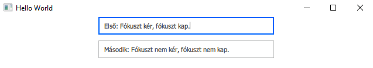

A második TextFieldbe klikkelés hasonlóan néz ki.

Ha másik ablakra klikkelünk (jelen esetben én a QtCreator ablakára klikkeltem a leállításhoz) azáltal a teljes alkalmazás fókusza elveszik. Ilyenkor a focus propertyje a TextFieldnek igaz marad, tehát amint visszaváltunk erre az ablakra ismét ez a TextField fog fókuszba kerülni.


Nézzük meg mi történik ha hozzáadunk egy

```javascript
focus: true
```

sort például a második TextField törzsébe és úgy indítjuk el az alkalmazást!

Azt fogjuk tapasztalni, hogy induláskor azonnal a második TextField fókuszálódik. Nem kellett beleklikkelnünk!

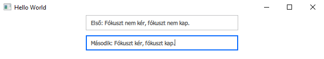

Ez jól jön olyan oldalak fejlesztésekor ahol a felhasználótól azonnal inputot fogunk kérni (például felhasználónév - jelszó párost). Ilyenkor megspóroljuk a usernek azt a kellemetlenséget, hogy neki kelljen ráklikkelnie a megfelelő mezőre, hogy az adatait megadhassa.

### Property binding példa

Nézzünk egy kicsit bonyolultabb példát!

Tegyük fel, hogy olyan alkalmazást írunk ahol opcionálisan megadható a felhasználó email címe. Először be kell jelölnünk hogy igen, meg szeretnénk adni az email címünket és csak utána írhatjuk be a megfelelő mezőbe.

Illesszük be a következő, ezt megvalósító kódot az ApplicationWindow törzsébe:

```javascript
   RadioButton {
        id: radio
        objectName: "radio"
    }

    Text {
        id: question
        objectName: "question1"
        text: "Would you like to give me your email address?"
        anchors.left: radio.right
        anchors.verticalCenter: radio.verticalCenter
    }

    TextField  {
        id: email
        objectName: "email"
        width: 300
        height: 30
        anchors.top: radio.bottom
        focus: radio.checked
        enabled: radio.checked
    }
```

Indítsuk el az alkalmazást!

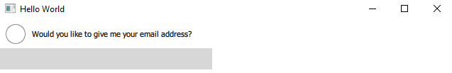

Kapcsoljuk be a RadioButtont!

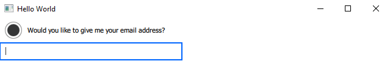

A property binding segítségével a focus property igazzá vált amint a RadioButtont bekapcsoljuk és ettől a TextField fókuszba került. Így a usernek nem kellett külön beleklikkelnie a mezőbe, hanem rögtön kezdheti írni az email címét.

A konzolon eközben az alábbi kimenet látható:

```console
Debugging starts
QML debugging is enabled. Only use this in a safe environment.
QML Debugger: Waiting for connection on port 10680...
qml: Actvie focus changed! -----------------------
qml:  QQuickItem(0x197f2bc91a0) AF: true F: true
qml:  QQuickRootItem(0x197f2a65880) AF: true F: true
qml: Actvie focus changed! -----------------------
qml: radio QQuickRadioButton(0x197f2a98900, "radio") AF: true F: true
qml:  QQuickItem(0x197f2bc91a0) AF: true F: true
qml:  QQuickRootItem(0x197f2a65880) AF: true F: true
qml: Actvie focus changed! -----------------------
qml: email QQuickTextField(0x19837153fe0, "email") AF: true F: true
qml:  QQuickItem(0x197f2bc91a0) AF: true F: true
qml:  QQuickRootItem(0x197f2a65880) AF: true F: true
qml: Actvie focus changed! -----------------------
Debugging has finished
```

Az alkalmazás bekapcsolása után rákattintottunk a RadioButtonre, ami emiatt fókuszba került. A klikkelésünk eredménye az lett, hogy a RadioButton checked propertyjének értéke igaz lett. Emiatt aktiválódott a hozzá tartozó property binding és a TextField focus propertyjének értékébe belemásolódott a checked új értéke. Ennek hatására a TextField elkérte és meg is kapta az aktív fókuszt.

A szépség kedvéért az enabled propertyt is ugyanezen mechanizmus mentén kezeltem, így nem is lehet írni a mezőbe ha nem engedélyezett az email megadása.

### Konkurens fókuszkérés példa

Próbáljuk ki mi történik ha egynél több komponensre tesszük rá a focus propertyt!

```javascript
    TextField  {
        id: elso
        objectName: "elso"
        text: "Első: " + (focus ? "Fókuszt kér, " : "Fókuszt nem kér, ") + (activeFocus ? "fókuszt kap." : "fókuszt nem kap.")
        width: 300
        height: 30
        focus: true
        anchors.horizontalCenter: parent.horizontalCenter
    }

    TextField {
        id: masodik
        objectName: "masodik"
        text: "Második: " + (focus ? "Fókuszt kér, " : "Fókuszt nem kér, ") + (activeFocus ? "fókuszt kap." : "fókuszt nem kap.")
        width: 300
        height: 30
        anchors.top: elso.bottom
        anchors.topMargin: 10
        focus: true
        anchors.horizontalCenter: parent.horizontalCenter
    }
```

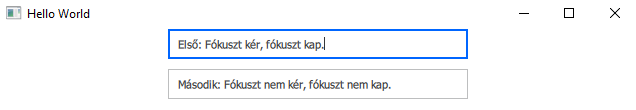

A második elem focus propertyje hamis, pedig beleégettük a kódba, hogy igaz legyen! Tehát a Qt motorja nem engedélyez egyszerre egynél több igaz focus propertyt. A prioritási sorrend nem dokumentált része a Qt-nek, de valójában attól függ, hogy melyik komponenst deklaráltuk előrébb. A fejlesztés során erre a tulajdonságára ne támaszkodjunk, hiszen bármikor megváltozhat egy frissítéssel!

### Tanulságok

Egyszerű alkalmazások esetén a focus property használatával programozottan tudjuk irányítani, hogy a felhasználói felületen éppen mi kerüljön fókuszba. Ehhez annyit kell tennünk, hogy a megfelelő pillanatban a megfelelő elemen a focus propertyt igazra állítjuk.

Hogy éppen melyik komponens van fókuszban az az activeFocus read-only propertyből derül ki, az éppen fókuszált elemen és annak a szülein lesz igaz az értéke.

A focus propertyk programozott beállítását property binding segítségével célszerű végezni, hiszen ezek automatikusan aktiválódnak ha megváltozik az értékük és így nagyon könnyű bizonyos feltétlekkel megszabni, hogy mikor hova kerüljön a fókusz az alkalmazásban.

Figyeljünk oda, hogy egyszerre mindig csak egyetlen elemnek legyen igazra állítva a focus propertyje, nagy galibát tud okozni ha össze-vissza állítgatjuk a fókuszt és elfelejtkezünk róla.

## Összetett alkalmazások

A lenti példát érdemes QtCreatorben megírva követni.

Tegyük fel hogy szoftverfejlesztőként dolgozunk egy alkalmazáson, melynek a regisztrációs felülete így néz ki:

```javascript
import QtQuick 2.7
import QtQuick.Controls 2.0
import QtQuick.Layouts 1.3

ApplicationWindow {

    onActiveFocusItemChanged:  {
        console.log("Actvie focus changed! -----------------------")
        var object = activeFocusItem
        while(object) {
            console.log(object.objectName + " " + object.toString() + " AF: " + object.activeFocus + " F: " + object.focus)
            object = object.parent
        }
    }

    visible: true
    width: 640
    height: 480
    title: qsTr("Registration form")

    header: TabBar {
        id: tabBar
        currentIndex: stackLayout.currentIndex
        TabButton {
            text: qsTr("Login data")
        }
        TabButton {
            text: qsTr("User data")
        }
    }

    StackLayout {
        id: stackLayout
        anchors.fill: parent
        currentIndex: tabBar.currentIndex

        Column {
            Row {
                height: 40
                Label {
                    text: "User:"
                    anchors.verticalCenter: parent.verticalCenter
                }
                TextField {
                    objectName: "user"
                    anchors.verticalCenter: parent.verticalCenter
                }
            }

            Row {
                height: 40
                Label {
                    text: "Password:"
                    anchors.verticalCenter: parent.verticalCenter
                }
                TextField {
                    objectName: "password"
                    anchors.verticalCenter: parent.verticalCenter
                }
            }
            spacing: 10
        }

        Column {
            Row {
                height: 40
                Label {
                    text: "E-mail:"
                    anchors.verticalCenter: parent.verticalCenter
                }
                TextField {
                    objectName: "email"
                    anchors.verticalCenter: parent.verticalCenter
                }
            }
            spacing: 10
        }
    }
}
```

A felületünk 2 tabból áll.

Az első tabon a bejelentkezési adatok adhatóak meg:

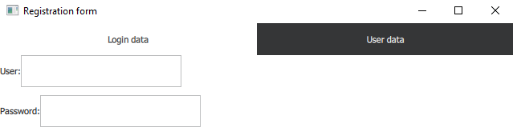

A második tabon egyéb adatok, jelen esetben egy email cím:

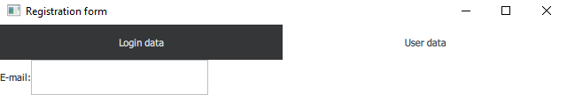

Egyik nap jön a főnökünk és azt mondja: Panaszkodnak a userek, hogy folyton rá kell klikkelni a beviteli mezőkre, ez így nem lesz jó, csináljuk meg hogy amint megnyílik a tab, azonnal el lehessen kezdeni gépelni!

Rendben van, tegyünk focus propetyt mindkét tabon az első mezőre!

```javascript
                TextField {
                    objectName: "user"
                    anchors.verticalCenter: parent.verticalCenter
                    focus: true
                }
```

```javascript
                TextField {
                    objectName: "email"
                    anchors.verticalCenter: parent.verticalCenter
                    focus: true
                }
```

Indítsuk el az alkalmazást, nézzük meg mi történik!

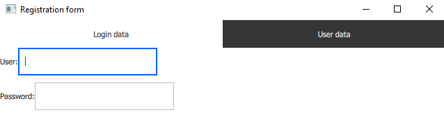

Sikerült! Az első oldal azonnal befókuszált. Nézzük meg mi történt a második oldalon...

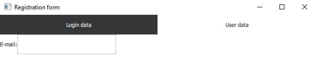

Ajjaj... Itt valami nincs rendben. Nézzük meg a konzolon a kimenetet!

```console
Debugging starts
QML debugging is enabled. Only use this in a safe environment.
QML Debugger: Waiting for connection on port 11642...
qml: Actvie focus changed! -----------------------
qml: user QQuickTextField(0x291bd059de0, "user") AF: true F: true
qml:  QQuickRow(0x291bd04dce0) AF: false F: false
qml:  QQuickColumn(0x291bd04d8d0) AF: false F: false
qml:  QQuickStackLayout(0x291bd04d430) AF: false F: false
qml:  QQuickItem(0x29178825480) AF: true F: true
qml:  QQuickRootItem(0x291787db9f0) AF: true F: true
qml: Actvie focus changed! -----------------------
qml:  QQuickTabButton(0x291bd04a6b0) AF: true F: true
qml:  QQuickItem(0x2917884d060) AF: false F: false
qml:  QQuickListView(0x2917884c6f0) AF: true F: true
qml:  QQuickTabBar(0x2917884b070) AF: true F: true
qml:  QQuickItem(0x29178825480) AF: true F: true
qml:  QQuickRootItem(0x291787db9f0) AF: true F: true
qml: Actvie focus changed! -----------------------
Debugging has finished
```

Amikor ráklikkeltünk a User data tabra az fókuszba került és a mi mezőnk nem kapta meg a fókuszt. Sőt ha most visszalépünk az 1. tabra akkor már az sem fókuszál automatikusan, a TabBarnál marad a fókusz. Eszünkbe jut, hogy nem jó dolog teletűzdelni a programot focus propertykkel... Mit lehet ilyenkor tenni?

Egy jó módszer arra, hogy szabályozni tudjuk melyik Item kaphat aktív fókuszt az alkalmazásunkban az, hogy mindig kizárólag egyetlen Item focus propertyjét állítjuk igazra. Ügyes property bindingokkal továbbra is kikényszeríthetnénk a helyes fókuszálást (hint: visible property), kisebb alkalmazásokban ez a módszer megfelelő lenne.

Nagyobb, bonyolultabb alkalmazásokban ennek a módszernek a használata exponenciálisan nehézzé válhat a rengeteg komponens miatt. Itt jön képbe a FocusScope, aminek a működésének megértéshez először nézzük meg milyen hatással van a gyerek Itemekre az, ha a szülő focus propertyjét állítgatjuk.

Próbáljuk meg megoldani a fenti problémát azzal, hogy 'letiltjuk' a focust a megfelelő szülőn!

```javascript
    StackLayout {
        id: stackLayout
        anchors.fill: parent
        currentIndex: tabBar.currentIndex

        Column {
            focus: parent.currentIndex === 0

            Row {
                height: 40
                Label {
                    text: "User:"
                    anchors.verticalCenter: parent.verticalCenter
                }
                TextField {
                    id: user
                    objectName: "user"
                    anchors.verticalCenter: parent.verticalCenter
                    focus: true
                }
            }

            Row {
                height: 40
                Label {
                    text: "Password:"
                    anchors.verticalCenter: parent.verticalCenter
                }
                TextField {
                    objectName: "password"
                    anchors.verticalCenter: parent.verticalCenter
                }
            }
            spacing: 10
        }

        Column {
            focus: parent.currentIndex === 1
            Row {
                height: 40
                Label {
                    text: "E-mail:"
                    anchors.verticalCenter: parent.verticalCenter
                }
                TextField {
                    objectName: "email"
                    anchors.verticalCenter: parent.verticalCenter
                    focus: true
                }
            }
            spacing: 10
        }
    }
```

Tehát mindig az a Column kap fókuszt amelyiknek az indexe megegyezik az aktuális indexszel. Ezzel elértük, hogy csak az aktív Columnon belül lehessen fókuszt kiosztani. Ugye?

Sajnos nem!

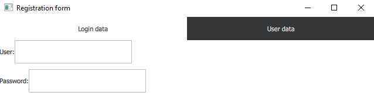

Mi történhetett?

Nézzünk rá a konzolra!

```console
Debugging starts
QML debugging is enabled. Only use this in a safe environment.
QML Debugger: Waiting for connection on port 11837...
qml: Actvie focus changed! -----------------------
qml:  QQuickColumn(0x1cbc35d55c0) AF: true F: true
qml:  QQuickStackLayout(0x1cbc35d50f0) AF: false F: false
qml:  QQuickItem(0x1cbc3601300) AF: true F: true
qml:  QQuickRootItem(0x1cb7ede4850) AF: true F: true
qml: Actvie focus changed! -----------------------
Debugging has finished
```

A Column megkapta a fókuszt, de sajnos ez nem terjedt tovább a gyerekelemre. Ez azt jelenti, hogyha egy Item focus propertyjét igazra állítjuk, azzal **megakadályozzuk** a gyerekelemeinek a fókuszba kerülését.

Szuper, akkor találtunk egy propertyt ami megakadályozza a gyerekek fókuszba kerülését, csak fordítva kellene használni!

Sajnos ez sem igaz, hiszen csak úgy tudjuk letiltani vele egy részfában a fókuszt ha mi magunk kapjuk azt meg. Így hiába tiltódott most le az 1. oldalon a user TextField fókusza, a 2. oldalon az email field nem kaphatta volna meg a fókuszt, hiszen az 1. oldalon lévő Column elvette előle is.

Tehát ez a módszer nem fog működni.

Nekünk egy olyan komponensre lenne szükségünk, amely letiltani és engedélyezni tudja a gyerekelemeinek fókuszba kerülését, **úgy hogy közben ő maga soha nem veszi el mások elől az aktív fókuszt**, egyfajta adminisztrációs elemre.

Ezt a komponenst hívják FocusScopenak.

A FocusScope úgy működik, hogyha a focus propertyjét igazra állítjuk, akkor az engedélyezi a gyermekei számára az aktív fókuszba kerülést, ha pedig hamisra állítjuk akkor az megakadályozza minden gyermekelem aktív fókuszba kerülését.

Használjunk tehát FocusScopeokat!

```javascript
    StackLayout {
        id: stackLayout
        anchors.fill: parent
        currentIndex: tabBar.currentIndex

        FocusScope {

            focus: parent.currentIndex === 0

            Column {
                Row {
                    height: 40
                    Label {
                        text: "User:"
                        anchors.verticalCenter: parent.verticalCenter
                    }
                    TextField {
                        id: user
                        objectName: "user"
                        anchors.verticalCenter: parent.verticalCenter
                        focus: true
                    }
                }

                Row {
                    height: 40
                    Label {
                        text: "Password:"
                        anchors.verticalCenter: parent.verticalCenter
                    }
                    TextField {
                        objectName: "password"
                        anchors.verticalCenter: parent.verticalCenter
                    }
                }
                spacing: 10
            }
        }

        FocusScope {

            focus: parent.currentIndex === 1

            Column {
                Row {
                    height: 40
                    Label {
                        text: "E-mail:"
                        anchors.verticalCenter: parent.verticalCenter
                    }
                    TextField {
                        objectName: "email"
                        anchors.verticalCenter: parent.verticalCenter
                        focus: true
                    }
                }
                spacing: 10
            }
        }
    }
```

Az első oldal működik!

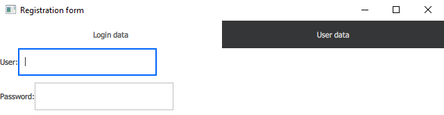

A második oldal is működik!

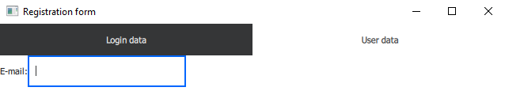

Ha oda-vissza váltunk az oldalak között továbbra is működik!

A konzolon látható, hogy megjelentek a FocusScopeok az objektumfában.

```console
Debugging starts
QML debugging is enabled. Only use this in a safe environment.
QML Debugger: Waiting for connection on port 11893...
qml: Actvie focus changed! -----------------------
qml: user QQuickTextField(0x1f3aa3123b0, "user") AF: true F: true
qml:  QQuickRow(0x1f3aa30c990) AF: false F: false
qml:  QQuickColumn(0x1f3aa30c580) AF: false F: false
qml:  QQuickFocusScope(0x1f3aa30c050) AF: true F: true
qml:  QQuickStackLayout(0x1f3aa30bbb0) AF: false F: false
qml:  QQuickItem(0x1f325ad9ba0) AF: true F: true
qml:  QQuickRootItem(0x1f325abc7e0) AF: true F: true
qml: Actvie focus changed! -----------------------
qml:  QQuickTabButton(0x1f3aa347000) AF: true F: true
qml:  QQuickItem(0x1f3aa341250) AF: false F: false
qml:  QQuickListView(0x1f3aa3408e0) AF: true F: true
qml:  QQuickTabBar(0x1f325b21390) AF: true F: true
qml:  QQuickItem(0x1f325ad9ba0) AF: true F: true
qml:  QQuickRootItem(0x1f325abc7e0) AF: true F: true
qml: Actvie focus changed! -----------------------
qml: email QQuickTextField(0x1f3aa31fdf0, "email") AF: true F: true
qml:  QQuickRow(0x1f3aa31d980) AF: false F: false
qml:  QQuickColumn(0x1f3aa31d570) AF: false F: false
qml:  QQuickFocusScope(0x1f3aa31c7b0) AF: true F: true
qml:  QQuickStackLayout(0x1f3aa30bbb0) AF: false F: false
qml:  QQuickItem(0x1f325ad9ba0) AF: true F: true
qml:  QQuickRootItem(0x1f325abc7e0) AF: true F: true
qml: Actvie focus changed! -----------------------
qml:  QQuickTabButton(0x1f322f314a0) AF: true F: true
qml:  QQuickItem(0x1f3aa341250) AF: false F: false
qml:  QQuickListView(0x1f3aa3408e0) AF: true F: true
qml:  QQuickTabBar(0x1f325b21390) AF: true F: true
qml:  QQuickItem(0x1f325ad9ba0) AF: true F: true
qml:  QQuickRootItem(0x1f325abc7e0) AF: true F: true
qml: Actvie focus changed! -----------------------
qml: user QQuickTextField(0x1f3aa3123b0, "user") AF: true F: true
qml:  QQuickRow(0x1f3aa30c990) AF: false F: false
qml:  QQuickColumn(0x1f3aa30c580) AF: false F: false
qml:  QQuickFocusScope(0x1f3aa30c050) AF: true F: true
qml:  QQuickStackLayout(0x1f3aa30bbb0) AF: false F: false
qml:  QQuickItem(0x1f325ad9ba0) AF: true F: true
qml:  QQuickRootItem(0x1f325abc7e0) AF: true F: true
qml: Actvie focus changed! -----------------------
Debugging has finished
```

### Megjegyzések

Egymásba ágyazott FocusScopek is működnek: ha mindegyiknek igazra van állítva a focus propertyje akkor az aktív fókusz el tud terjedni a szülő-gyerek láncban a legalsó szinten lévő gyerekekig ahol a focus propertyk alapján történik a választás.

Létezik egy függvény, a forceActiveFocus(), amely az Item minden közvetlen felmenőjén, ami FocusScope beállítja a focus propertyt truera. Ez pont az ilyen többszörösen egymásba ágyazott FocusScope-ok esetében jön jól, bár nem eredményez túl szép kódot ha mindenhol ezt alkalmazzuk.
