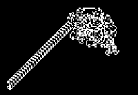
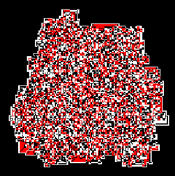
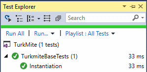

# Turkmite esettanulmány: refactor és tesztek írása

Több helyről nőtt az igény, hogy mutassak egy kerek egész példát arra, hogy egy már elkészült kis programot hogyan lehet szépíteni, majd tesztekkel körülvenni. Az erre kiválasztott példa egy régi kedvencem, a turkmesz vagy turkmite, ami a turing gép és a termesz összetételéből áll. Matematikailag egy sejt automata, ami egy "végtelen" képen szaladgál és minden pixelen valami egyszerű szabály szerint átszínezheti azt és irányt vált. A legegyszerűbb eset fekete-fehér és ha fekete mezőn áll, fehérre festi és jobbra fordul, ha pedig fehéren áll, akkor feketére festi és balra fordul, majd meg egy pixelnyit előre. Ha elég sokáig futtatjuk, az alábbi kép jön ki:



Érdekessége, hogy a kezdeti össze-vissza kolbászolás után a balra lefelé haladó, periodikus mintát kezdi el építeni és folytatja a végtelenségig.

A leíráshoz kapcsolódó program C# nyelven íródott és elérhető [egy github repositoryban](https://github.com/csorbakristof/turkmite). A leírás egyes lépései commitonként haladnak majd végig a repositoryban lévő forráskódon, így minden állapotot ki tudsz próbálni, meg tudsz nézni részletesen is.

## Commit: "Initial working version"

A program első verziója szándékosan nem a legszebb. Működik, de a megoldás eleganciája, a karbantarthatóság igencsak gyönge alapokon áll. (A megoldás az OpenCvSharp3 nuget packaget használja a képfeldolgozási részekhez. Innen most elég annyi, hogy a Mat egy mátrix, ami 200x200-as, minden pixele egy Vec3b (3 elemű vektor, B-G-R színsorrenddel) és a képtől kapott indexerrel lehet őket gyorsan elérni, módosítani. A Cv2.ImShow és WaitKey szerintem rájösztök, mire való. Az OpenCV egy sima konzolos alkalmazásból is meg tud jeleníteni GUI-t.)

```cs
namespace TurkMite
{
    class Program
    {
        static void Main(string[] args)
        {
            Mat img = new Mat(200, 200, MatType.CV_8UC3, new Scalar(0, 0, 0));
            var indexer = img.GetGenericIndexer<Vec3b>();
            int x = 100;
            int y = 100;
            int direction = 0;  // 0 up, 1 right, 2 down, 3 left
            for(int i=0; i<13000; i++)
            {
                Vec3b currentColor = indexer[y, x];
                if (currentColor == new Vec3b(0,0,0))
                {
                    indexer[y, x] = new Vec3b(255, 255, 255);
                    direction++;
                    if (direction > 3)
                        direction = 0;
                }
                else
                {
                    indexer[y, x] = new Vec3b(0, 0, 0);
                    direction--;
                    if (direction < 0)
                        direction = 3;
                }
                switch(direction)
                {
                    case 0:
                        y--;
                        break;
                    case 1:
                        x++;
                        break;
                    case 2:
                        y++;
                        break;
                    case 3:
                        x--;
                        break;
                }
                if (x < 0)
                    x = 199;
                if (x > 199)
                    x = 0;
                if (y < 0)
                    y = 199;
                if (y > 199)
                    y = 0;
            }
            Cv2.ImShow("TurkMite", img);
            Cv2.WaitKey();

        }
    }
}
```

Mi a legrosszabb benne? Nos lássuk csak...

  * Minden egy metódusban van. Ez a temporal coupling: csak azért, mert valamiket egyszerre kell elvégezni, attól még nem kell egy helyre bedobálni mindent.
  * A Vec3b konstansokat csomószor feleslegesen létrehozzuk.
  * Szószátyár kód, hosszú switch és if sorozat.
  * Az egész kód újrahasznosíthatósága minimális, semmi nem objektum orientált benne.

Tehát az első lépés, hogy ha már van egy ilyen kis turkmite, akkor ugyan legyen már egy osztálya neki. Márcsak azért is, mert szemmel láthatóan neki vannak belső állapotváltozói, műveletei stb.

## Commit: TurkMite class created

No ez még mindig nem a legszebb megoldás, de legalább már van egy osztályunk. Egyelőre marad a Program classon belül, mivel csak innen használjuk. Gyorsabb a munka, majd idővel úgyis kikerül másik fájlba. Közben a konstruktor kicsit okosabb lett, hogy a kezdő pozíciót a kapott kép méretei alapján állítsa be.

```cs
namespace TurkMite
{
    class Program
    {
        static void Main(string[] args)
        {
            Mat img = new Mat(200, 200, MatType.CV_8UC3, new Scalar(0, 0, 0));
            var turkmite = new TurkMite(img);
            for(int i=0; i<13000; i++)
            {
                turkmite.Step();
            }
            Cv2.ImShow("TurkMite", turkmite.Image);
            Cv2.WaitKey();
        }

        class TurkMite
        {
            public Mat Image { get; }
            private int x;
            private int y;
            private int direction;  // 0 up, 1 right, 2 down, 3 left
            private Mat.Indexer<Vec3b> indexer;
            public TurkMite(Mat image)
            {
                Image = image;
                x = image.Cols / 2;
                y = image.Rows / 2;
                direction = 0;
                indexer = image.GetGenericIndexer<Vec3b>();
            }

            public void Step()
            {
                Vec3b currentColor = indexer[y, x];
                if (currentColor == new Vec3b(0, 0, 0))
                {
                    indexer[y, x] = new Vec3b(255, 255, 255);
                    direction++;
                    if (direction > 3)
                        direction = 0;
                }
                else
                {
                    indexer[y, x] = new Vec3b(0, 0, 0);
                    direction--;
                    if (direction < 0)
                        direction = 3;
                }
                switch (direction)
                {
                    case 0:
                        y--;
                        break;
                    case 1:
                        x++;
                        break;
                    case 2:
                        y++;
                        break;
                    case 3:
                        x--;
                        break;
                }
                if (x < 0)
                    x = 199;
                if (x > 199)
                    x = 0;
                if (y < 0)
                    y = 199;
                if (y > 199)
                    y = 0;
            }

        }
    }
}
```

Azon egy ideig gondolkoztam, hogy magát a képet a TurkMite hozza létre, vagy kívülről kapja a konstruktora. Nem egyértelmű a kérdés, végül kívülről kapja. Ha a konstruktor hozná létre, akkor meg jó eséllyel egy szélesség-magasságot kellene neki átadni, akkor meg már nem sokkal lennénk előrébb, mert a "new Size(200,200)" szinte pont olyan, mint képet létrehozni...

(Ja igen, bocs, hogy a commit szövegek angolul vannak... forráskódban és commit szövegben szerintem szerencsésebb, de ez egy messze menő téma...)

Ami most leginkább szúrja a szemem, az a szín konstansok ügye, valamint a végén a switch és az if-ek... ezzel kellene kezdeni valamit.

## Commit: Color constants, direction handling refactored

```cs
class TurkMite
{
    public Mat Image { get; }
    private int x;
    private int y;
    private int direction;  // 0 up, 1 right, 2 down, 3 left
    private Mat.Indexer<Vec3b> indexer;
    public TurkMite(Mat image)
    {
        Image = image;
        x = image.Cols / 2;
        y = image.Rows / 2;
        direction = 0;
        indexer = image.GetGenericIndexer<Vec3b>();
    }

    readonly Vec3b black = new Vec3b(0, 0, 0);
    readonly Vec3b white = new Vec3b(255, 255, 255);

    public void Step()
    {
        Vec3b currentColor = indexer[y, x];
        if (currentColor == black)
        {
            indexer[y, x] = white;
            direction++;
        }
        else
        {
            indexer[y, x] = black;
            direction--;
        }

        direction = (direction+4) % 4;
        var delta = new(int x, int y)[] { (0, -1), (1, 0), (0, 1), (-1, 0) };
        x += delta[direction].x;
        y += delta[direction].y;
        x = Math.Max(0, Math.Min(Image.Cols, x));
        y = Math.Max(0, Math.Min(Image.Rows, y));
    }
}
```

Na így már jobb egy kicsit. A színek kikerültek konstansokba osztály szintre, a ``Step()`` vége pedig így tömörebb és szerintem nem romlott a közérthetősége. A ``delta`` egy C# 7-es tuple tömb, amiben még az első és második mezőnek nevet (x és y) adtam, hogy ne csak Item1 és Item2 legyen. Lehetett volna Vector is, és akkor a léptetés mehetett volna a felülcsapott ``+`` operátorral, mint vektor összeadás, de akkor meg egy csomó ``new Vector`` jelenik meg, így ezt elvetettem.

(Itt megjegyzem, hogy a ``Math.Min(Image.Cols, x)`` nem helyes, mert a szélességgel megegyező x koordinátát is megenged, ami már eggyel több a kelleténél, de ezt ekkor még nem vettem észre. Legalább majd a tesztírásnál látszik, hogy ott milyen szépen kijönnek a hibák.)

És most mi legyen a következő lépés? Hmmm... ez a Step metódus kicsit nagy és egynél több dolgot végez el (a turkmite szabályai szerint lép, majd ellenőrzi a pozíció határokat és ilyesmi). Single Responsibility Principle, kérem szépen, nem ártana az általános ellenőrzéseket és léptetést leválasztani a turkmite specifikus részről. És egyébként is a ``Step()`` túl általános szó, ha feldaraboljuk, lesz benne pár új metúdus név, amik majd jobban elmondják, mi is történik akkor, amikor ``Step()`` van...

## Commit: "Explode Step into private methods"

```cs
public void Step()
{
    indexer[y, x] = GetNextColorAndUpdateDirection(indexer[y, x]);
    PerformMove();
}

private void PerformMove()
{
    direction = (direction + 4) % 4;
    var delta = new(int x, int y)[] { (0, -1), (1, 0), (0, 1), (-1, 0) };
    x += delta[direction].x;
    y += delta[direction].y;
    x = Math.Max(0, Math.Min(Image.Cols, x));
    y = Math.Max(0, Math.Min(Image.Rows, y));
}

private Vec3b GetNextColorAndUpdateDirection(Vec3b currentColor)
{
    if (currentColor == black)
    {
        direction++;
        return white;
    }
    else
    {
        direction--;
        return black;
    }
}
```

Tadaaa! Mostantól van egy ``GetNextColorAndUpdateDirection``, ami leírja a turkmite viselkedését (majd egyszer ebből biztosan absztrakt metódus lesz egy ősosztályban), valamint egy ``PerformMove()``, ami meg figyel a korlátok betartására.

Itt most egy elég rövid kis szépítés jön... a ``delta`` kikerülhetne osztály szinte, hogy csak egyszer hozzuk létre (és persze akkor már legyen readonly), meg a két szín konstant ``black`` és ``white`` is legyen private, az ``indexer`` deklarációja meg lehetne a hozzá tartozó kép mellett, ha már összetartoznak. Ezek vannak az "Extracted delta, reordered attributes" commitban, ami tényleg annyira apróság, hogy most nem másolom ide.

Helyette most akkor ideje belecsapni a lecsóba és végre behozni egy kis absztrakciót, ha már azt mondogatjuk, hogy OOP meg ilyenek: ideje kiszervezni a turkmite-független funkciókat egy ősosztályba.

## Commit: "Extracted TurkmiteBase"

Végre van egy ősosztályunk, benne egy absztrakt ``GetNextColorAndUpdateDirection`` metódussal, amit majd szépen minden konkrét turkmite felüldefiniál, mint ahogy most az ``OriginalTurkmite`` is teszi. A pozíció inicializálás, léptetés és a kép határainak figyelembe vétele közös lesz. Innentől kezdve egy turkmit többnyire a mozgási szabályát leíró metódust, valamint valószínűleg a kedvenc színkonstansait tartalmazza majd.

```cs
class Program
{
    static void Main(string[] args)
    {
        Mat img = new Mat(200, 200, MatType.CV_8UC3, new Scalar(0, 0, 0));
        var turkmite = new OriginalTurkmite(img);
        for(int i=0; i<13000; i++)
        {
            turkmite.Step();
        }
        Cv2.ImShow("TurkMite", turkmite.Image);
        Cv2.WaitKey();
    }

    class OriginalTurkmite : TurkmiteBase
    {
        readonly private Vec3b black = new Vec3b(0, 0, 0);
        readonly private Vec3b white = new Vec3b(255, 255, 255);

        public OriginalTurkmite(Mat image) : base(image)
        {
        }

        protected override Vec3b GetNextColorAndUpdateDirection(Vec3b currentColor)
        {
            if (currentColor == black)
            {
                direction++;
                return white;
            }
            else
            {
                direction--;
                return black;
            }
        }
    }

    abstract class TurkmiteBase
    {
        public Mat Image { get; }
        private Mat.Indexer<Vec3b> indexer;
        private int x;
        private int y;
        protected int direction;  // 0 up, 1 right, 2 down, 3 left
        public TurkmiteBase(Mat image)
        {
            Image = image;
            x = image.Cols / 2;
            y = image.Rows / 2;
            direction = 0;
            indexer = image.GetGenericIndexer<Vec3b>();
        }

        readonly private (int x,int y)[] delta = new(int x, int y)[] { (0, -1), (1, 0), (0, 1), (-1, 0) };

        public void Step()
        {
            indexer[y, x] = GetNextColorAndUpdateDirection(indexer[y, x]);
            PerformMove();
        }

        private void PerformMove()
        {
            direction = (direction + 4) % 4;
            x += delta[direction].x;
            y += delta[direction].y;
            x = Math.Max(0, Math.Min(Image.Cols, x));
            y = Math.Max(0, Math.Min(Image.Rows, y));
        }

        protected abstract Vec3b GetNextColorAndUpdateDirection(Vec3b currentColor);
    }
}
```

Mi legyen a következő lépés? Nos az ``OriginalTurkmite.GetNextColorAndUpdateDirection`` valahogy nem szép: a választott új színt visszaadja, az irányt viszont ő maga állítja be. Egy metódus lehetőleg vagy legyen funkciónális (és akkor nem módosít állapotot, csak a paraméterei alapján valamit visszaad), vagy módosítsa az állapotot, akkor viszont például neki illene a színt is beállítani. Ez amolyan felelősségi kör kavarodás: feladata az irány beállítása, a szín beállítása viszont nem? Nem hangzik túl konzisztensnek... így két osztály között nagyon komoly összefonódás lesz, mivel a feladat egyik felét az egyik, a másik felét a másik végzi el.

Na de mit lehetne itt tenni? Nyilván nem kellene a képet babrálni az ``OriginalTurkmite`` osztályból, az csak adja vissza a kívánt színt. Igen ám, de a szabály a ``direction`` változását írja le. Most akkor vagy csak a változást adjuk vissza, vagy a ``GetNextColorAndUpdateDirection`` kapja meg paraméterként az előző irányt és adja vissza az újat? Az még egy paraméter... lassan már átadhatnánk neki egy teljes turkmite állapotleírást is... és ő meg visszaad egy másikat... jajj... ebbe nem kellene belemenni!

Legyen inkább az, hogy az irány változását is visszaadja a ``GetNextColorAndUpdateDirection``. (Utólag belegondolva így az elnevezés már csak részben kifejező, de ez csak utólag jutott eszembe... hagyok valamit a kedves Olvasónak is.)

## Commit: "Also return delta direction, more compact and functional."

Itt is kihasználjuk a C# 7 tuple újdonságát, mert így kényelmesen vissza tudunk adni két visszatérési értéket. És egyúttal plusz előny, hogy a ``TurkmiteBase.direction`` ismét lehet private, mivel a leszármazott osztálynak már nem kell vele foglalkoznia. A ``Step()``-nek lett egy kicsit több dolga, de hát még így is KISS (Keep It Simple and Stupid).

```cs
class OriginalTurkmite : TurkmiteBase
{
    readonly private Vec3b black = new Vec3b(0, 0, 0);
    readonly private Vec3b white = new Vec3b(255, 255, 255);

    public OriginalTurkmite(Mat image) : base(image)
    {
    }

    protected override (Vec3b newColor, int deltaDirection) GetNextColorAndUpdateDirection(Vec3b currentColor)
    {
        return (currentColor == black) ? (white, 1) : (black, -1);
    }
}

abstract class TurkmiteBase
{
    public Mat Image { get; }
    private Mat.Indexer<Vec3b> indexer;
    private int x;
    private int y;
    private int direction;  // 0 up, 1 right, 2 down, 3 left
    public TurkmiteBase(Mat image)
    {
        Image = image;
        x = image.Cols / 2;
        y = image.Rows / 2;
        direction = 0;
        indexer = image.GetGenericIndexer<Vec3b>();
    }

    readonly private (int x,int y)[] delta = new(int x, int y)[] { (0, -1), (1, 0), (0, 1), (-1, 0) };

    public void Step()
    {
        int deltaDirection;
        (indexer[y, x], deltaDirection) =
            GetNextColorAndUpdateDirection(indexer[y, x]);
        PerformMove(deltaDirection);
    }

    private void PerformMove(int deltaDirection)
    {
        direction += deltaDirection;
        direction = (direction + 4) % 4;
        x += delta[direction].x;
        y += delta[direction].y;
        x = Math.Max(0, Math.Min(Image.Cols, x));
        y = Math.Max(0, Math.Min(Image.Rows, y));
    }

    protected abstract (Vec3b newColor, int deltaDirection) GetNextColorAndUpdateDirection(Vec3b currentColor);
}
```

Kicsit haboztam, hogy az absztrakt ``GetNextColorAndUpdateDirection`` deklarációjában ilyen hosszú nevet adjak-e a két visszatérési értéknek, mert elég hosszú lett, de végül ezt választottam, mert erre távolabbi helyekről, leszármazott osztályokból is fogunk hivatkozni, vagyis a scopeja nagy. Akkor pedig jobb, ha kifejező a neve, mert ha csak c és d lett volna, akkor innen messze már nem derül ki, hogy mit jelent. Márpedig ha nem derül ki, akkor el kell jönnie a fejlesztőnek ide a deklarációhoz, beleolvasni... na pont ezt kellene elkerülni a beszédes forráskóddal.

Mi legyen a következő lépés? Nos úgy érzem, ez az implementáció már elég szép és OO ahhoz, hogy létrehozzunk egy másik turkmitet is... mondjuk valami három színűt!

## Commit: ThreeColorTurkmite added

És milyen kényelmes, hogy van ősosztály, így csak a lényegre kell koncentrálni (meg egy üres konstruktorra, hogy legyen image... hmmm... lehet, hogy egyszer majd mégis kiszedem az egész kép létrehozást és átrakom a ``TurkmiteBase`` ősosztályba?)

```cs
class ThreeColorTurkmite : TurkmiteBase
{
    readonly private Vec3b black = new Vec3b(0, 0, 0);
    readonly private Vec3b white = new Vec3b(255, 255, 255);
    readonly private Vec3b red = new Vec3b(0, 0, 255);

    public ThreeColorTurkmite(Mat image) : base(image)
    {
    }

    protected override (Vec3b newColor, int deltaDirection) GetNextColorAndUpdateDirection(Vec3b currentColor)
    {
        if (currentColor == black)
            return (white, 1);
        else if (currentColor == white)
            return (red, -1);
        else
            return (black, -1);
    }
}
```

És ettől kezdve ha a főprogramban az újat példányosítom, akkor elkészül az új kép! Jujj de izgi, vajon hogy néz ki? (Mert hogy a szabályokat csak úgy hasból írtam...)

```cs
var turkmite = new ThreeColorTurkmite(img);
for(int i=0; i<500000; i++)  // 13000
{
    turkmite.Step();
}
```

Itt közbejött egy kis komplikáció: az új turkmite képe nem fejlődik ki elég szépre 13000 lépés alatt. Neki pár próbálkozás után kell 500000, hogy jól nézzen ki:



Na de most akkor az egyiknél 13000, a másiknál 500000... ha valaki meglátja, hogy kommentárban ott hagytam a 13000-et, sikító lábrángást kap! Nem, nem, mostantól szemmel láthatóan a turkmitnek kellene megmondania, hogy nála hány lépés kell a szép kép előállításához. Aztán azt majd a fejlesztő szépen beállítja. Erre a megoldás az, hogy az ősosztályban van egy

```cs
abstract class TurkmiteBase
{
...
    public abstract int PreferredIterationCount { get; }
...
}
```

és ezt mindenki szépen felülírja, amire szeretné. A főprogram ciklusa pedig lekérdezi és ennyiszer hívja meg a ``Step()``-et. Ezt is egy külön commitba raktam ("Moved PreferredIterationCount into implementations."), de ide nem másolom be.

Most, hogy ilyen szépen összeállt két turkmite implementáció, ideje áttérni arra, amivel TDD (Test Driven Development) esetén kezdeni kellett volna, de most útólag készül el: a unit tesztekre. Tesztelni kellene az ősosztály és a leszármazottak funkcióit is, hogy később ha valaki valamit refactorál, átír, kiegészít, akkor egy mozdulattal le tudja ellenőrizni, hogy még minden szépen működik-e.

## Commit: "Exploded into separate files, added first (trivial) unit test."

Ez a commit sok módosítást nem tartalmaz, csak a forráskód masszív újrarendezését. Majd amikor teszteljük az osztályokat, inkább oda fogom bemásolni az itt kialakított fájlokat is. Ami itt változott:

  * Létrejöttek a TurkmiteBase.cs, OriginalTurkmite.cs, ThreeColorTurkmite.cs és nyilván jól összement a Program.cs.
  * Létrehoztam egy új unit teszt projektet is TurkmiteTests néven. Ebben lett egy TurkmiteBaseTests.cs.

Az első unit teszt igazából csak azt teszteli, hogy a teszt környezet működőképes-e:

```cs
namespace TurkmiteTests
{
    [TestClass]
    public class TurkmiteBaseTests
    {
        [TestMethod]
        public void Instantiation()
        {
            var t = new OriginalTurkmite(new Mat(10,10,MatType.CV_8UC3));
        }
    }
}
```

Ugyan a ``TurkmiteBase`` osztályt kellen itt tesztelni, de az absztrakt, így példányosítani nem tudom. Erre amúgy is mindjárt ki kell találni valamit, de egyelőre az ``OriginalTurkmite`` példányosítása is jó lesz.



És akkor most eljött az a pillanat, amikor el kell gondolkozni a tesztelhetőségen. Miket teszteljünk?

## Commit: Test: Step calls GetNextColorAndUpdateDirection

Először teszteljük le azt, hogy a ``TurkmiteBase.Step()`` egyáltalán meghívja-e a leszármazott `GetNextColorAndUpdateDirection` metódusát. Na de hogyan? A megoldás viszonylag egyszerű: készítünk egy fiktív turkmitet, ami semmi mást nem csinál, csak a ``GetNextColorAndUpdateDirection`` metódásában megjegyzi, hogy meghívták, és ennek tényét fogja a teszt ellenőrizni:

```cs
[TestClass]
public class TurkmiteBaseTests
{
    [TestMethod]
    public void GetNextColorAndUpdateDirection_IsCalled()
    {
        var t = new TestTurkmiteBase(new Mat(10,10,MatType.CV_8UC3));
        t.Step();
        Assert.IsTrue(t.GetNextColorAndUpdateDirectionInvoked);
    }

    class TestTurkmiteBase : TurkmiteBase
    {
        public bool GetNextColorAndUpdateDirectionInvoked = false;

        protected override (Vec3b newColor, int deltaDirection) GetNextColorAndUpdateDirection(Vec3b currentColor)
        {
            // Mocked to monitor invocation
            GetNextColorAndUpdateDirectionInvoked = true;
            return (new Vec3b(0,0,0), 0);
        }

        public TestTurkmiteBase(Mat img) : base(img)
        {
        }

        public override int PreferredIterationCount => 0;
    }
}
```

A ``TestTurkmiteBase`` egy belső osztály, amit csak ennek az egy unit teszt osztálynak a kedvéért hozunk létre. Mock objektum lesz belőle, amivel azt vizsgáljuk, hogy valami más (most az őse) helyesen kommunikált-e vele. Most ezt a ``GetNextColorAndUpdateDirectionInvoked`` publikus bool változóba fogja elmenteni, a teszt pedig ezt ellenőrzi. A teszt zöld, ez tényleg meg is történik.

## Commit: First direction test

Ahhoz, hogy a ``TurkmiteBase.PerformMove`` metódust teszteljük, először is látni kellene őt is és mindazt, amin dolgozik. Most private és valószínűleg nem lenne annyira jó csak a tesztek kedvéért publikussá tenni. Ehelyett protected lesz és a teszt tartalmaz majd egy olyan leszármazottat, ami egy publikus wrapper metódussal elérhetővé teszi:

```cs
public abstract class TurkmiteBase
{
    public Mat Image { get; }
    public abstract int PreferredIterationCount { get; }
    protected Mat.Indexer<Vec3b> indexer;
    protected int x;
    protected int y;
    protected int direction;  // 0 up, 1 right, 2 down, 3 left
    public TurkmiteBase(Mat image)
    {
        Image = image;
        x = image.Cols / 2;
        y = image.Rows / 2;
        direction = 0;
        indexer = image.GetGenericIndexer<Vec3b>();
    }

    readonly private (int x, int y)[] delta = new(int x, int y)[] { (0, -1), (1, 0), (0, 1), (-1, 0) };

    public void Step()
    {
        int deltaDirection;
        (indexer[y, x], deltaDirection) =
            GetNextColorAndUpdateDirection(indexer[y, x]);
        PerformMove(deltaDirection);
    }

    protected void PerformMove(int deltaDirection)
    {
        direction += deltaDirection;
        direction = (direction + 4) % 4;
        x += delta[direction].x;
        y += delta[direction].y;
        x = Math.Max(0, Math.Min(Image.Cols, x));
        y = Math.Max(0, Math.Min(Image.Rows, y));
    }

    protected abstract (Vec3b newColor, int deltaDirection) GetNextColorAndUpdateDirection(Vec3b currentColor);
}
```

Így már össze lehet rakni a ``PerformMove_DirectionCorrect`` tesztet is:

```cs
[TestClass]
public class TurkmiteBaseTests
{
    private TestTurkmiteBase turkmite = new TestTurkmiteBase(new Mat(10, 10, MatType.CV_8UC3));
...
    [TestMethod]
    public void PerformMove_DirectionCorrect()
    {
        turkmite.X = 5;
        turkmite.Y = 5;
        turkmite.D = 0;
        turkmite.PerformMove(0);
        Assert.AreEqual(5, turkmite.X);
        Assert.AreEqual(4, turkmite.Y);
        Assert.AreEqual(0, turkmite.D);
    }

    class TestTurkmiteBase : TurkmiteBase
    {
        public int X { get { return this.x; } set { this.x = value; } }
        public int Y { get { return this.y; } set { this.y = value; } }
        public int D { get { return this.direction; } set { this.direction = value; } }
        public bool GetNextColorAndUpdateDirectionInvoked = false;

        public new void PerformMove(int deltaDirection)
        {
            base.PerformMove(deltaDirection);
        }
...
    }
}
```

Ez a teszt valemennyit már tesztel a ``PerformMove`` metódusból, de azért messz nem mindent.

## Commit: Extend direction test and extract assert method.

Bővítünk egy kicsit a tesztünkön, viszont mivel elég sok mindent kell ellenőrizni, érdemes egy ``AssertTurkmiteState`` segédmetódust is bevezetni. Fontos, hogy a tesztjeink esetében is ugyanúgy figyeljünk a kód áttekinthetőségére, újrahasznosíthatóságára, mint a production kódban! Egy hosszabb ideig tartó projektben a tesztek nagyon fontosak lesznek később! Ott sem szabad megjelennie a kód rothadás jeleinek!

```cs
[TestMethod]
public void PerformMove_DirectionCorrect()
{
    turkmite.X = 5;
    turkmite.Y = 5;
    turkmite.D = 0;
    turkmite.PerformMove(0);
    AssertTurkmiteState(5, 4, 0);
    turkmite.PerformMove(1);
    AssertTurkmiteState(6, 4, 1);
    turkmite.PerformMove(1);
    AssertTurkmiteState(6, 5, 2);
    turkmite.PerformMove(1);
    AssertTurkmiteState(5, 5, 3);
    turkmite.PerformMove(1);
    AssertTurkmiteState(5, 4, 0);
    turkmite.PerformMove(-1);
    AssertTurkmiteState(4, 4, 3);
}

private void AssertTurkmiteState(int x, int y, int d)
{
    Assert.AreEqual(x, turkmite.X);
    Assert.AreEqual(y, turkmite.Y);
    Assert.AreEqual(d, turkmite.D);
}
```

OK, ez megvan. Mit teszteljünk következőnek? Az még nincsen leellenőrizve, hogy a kép határán helyesen viselkedik-e a ``PerformMove``, ez lesz a következő.

## Commit: ImageBoundary test added, found bug.

Ennél a commitnál a teszthez kivezetni már semmit nem kellett, csak megírni őket:

```cs
[TestMethod]
public void ImageBoundaryWorks()
{
    AssertMove(5, 0, 0, 5, 0);
    AssertMove(5, 9, 2, 5, 9);
    AssertMove(9, 5, 1, 9, 5);
    AssertMove(0, 5, 3, 0, 5);
}

private void AssertMove(int startX, int startY, int direction, int finalX, int finalY)
{
    turkmite.X = startX;
    turkmite.Y = startY;
    turkmite.D = direction;
    turkmite.PerformMove(0);
    AssertTurkmiteState(finalX, finalY, direction);
}
```

És ekkor vettem észre egy hibát, ami eddig nem jött elő, pedig kezdettől fogva benne volt a ``TurkmiteBase.PerformMove`` metódusban: a ``Math.Min(Image.Cols, x)`` eddig megengedte, hogy x egyenlő legyen az oszlopok számával, ami már túlindexelés lett volna. (Szemmel láthatóan a programot futtatgatva szerencse (vagy pont hogy nem?), hogy egyszer sem érte el a turkmite a kép jobb vagy alsó szélét.) Helyesen:

```cs
protected void PerformMove(int deltaDirection)
{
    direction += deltaDirection;
    direction = (direction + 4) % 4;
    x += delta[direction].x;
    y += delta[direction].y;
    x = Math.Max(0, Math.Min(Image.Cols-1, x));
    y = Math.Max(0, Math.Min(Image.Rows-1, y));
}
```

Tanulságos... és úgy tűnik, még ilyen egyszerű esetben sem volt hasznontalan pár tesztet megírni. (Ha megnézitek a commitokat, a teljes teszteléses rész megírása kb. 45 perc volt a kitalálásával együtt.)

## Commit: StepUpdatesCorrectly test added.

Az ősosztályban ami még teszteletlenül maradt, az a ``Step()`` magasabb szintű működése: adott pontból adott szabály szerint haladva a turkmite jó helyre kerül-e és helyesen színezi-e át a kiinduló mezőt?

Ehhez először a teszt turkmitemet kicsit módosítottam: egyrészt a ``GetNextColorAndUpdateDirection`` nem bedrótozva a (0,0,0) színt adja vissza, hanem ezt egy osztály szintű konstansból veszi (tudom, igen, és oda van bedrótozva... :) ). Ezt miért jó? Azért, mert a unit tesztbe nem azt fogom írni, hogy assert és (0,0,0), hanem assert és elkérem ezt a konstanst! Vagyis ha esetleg valamiért később megváltozik az értéke, akkor a tesztet ez nem fogja zavarni. A több helyen leírt konstans érték mindig gyanús (code smell)!
A másik változás, hogy eddig a visszaadott ``deltaDirection`` 0 volt, vagyis hogy ne változzon az irány. A teszt szempontjából jobb, ha változik, így most már 1 lesz.

```cs
class TestTurkmiteBase : TurkmiteBase
{
...
    public readonly Vec3b ReturnedColor = new Vec3b(1,1,1);

    protected override (Vec3b newColor, int deltaDirection) GetNextColorAndUpdateDirection(Vec3b currentColor)
    {
        // Mocked to monitor invocation
        GetNextColorAndUpdateDirectionInvoked = true;
        return (ReturnedColor, 1);
    }
...
}
```

És így a teszt:

```cs
[TestMethod]
public void StepUpdatesCorrectly()
{
    turkmite.X = 5;
    turkmite.Y = 5;
    turkmite.D = 0;
    turkmite.Step();
    var indexer = turkmite.Image.GetGenericIndexer<Vec3b>();
    var newColor = indexer[5, 5];
    Assert.AreEqual(turkmite.ReturnedColor, newColor);
    // Note: mock returns "turn right".
    AssertTurkmiteState(6, 5, 1);
}
```

Tudom, a kommentár is code smell lehet... de itt szerintem hasznos megemlíteni, mert a kód itteni részéből nem derül ki, hogy a mock turkmite jobbra akar mindig fordulni.

(Csak a teljesség kedvéért említem meg, hogy a teszt inicializálásakor létrehozott képet itt már beszíneztem fekete kezdőszínre, még ha a mock turkmite viselkedését a szín most nem is befolyásolja. De a Mat-oknak szerencsés kezdőszínt megadni, mert egy későbbi tesztben lehet, hogy megfeledkezünk róla, most meg pont eszembe jutott.)

## Commit: OriginalTurkmiteTests added, exposed internal colors to be safer in the test.

Mivel a turkmite ősosztályt most már alaposan leteszteltük, ideje tesztelni az ``OriginalTurkmite`` leszármazottat is.

A tesztelendő kód az alábbi:

```cs
public class OriginalTurkmite : TurkmiteBase
{
    public override int PreferredIterationCount => 13000;
    readonly protected Vec3b black = new Vec3b(0, 0, 0);
    readonly protected Vec3b white = new Vec3b(255, 255, 255);

    public OriginalTurkmite(Mat image) : base(image)
    {
    }

    protected override (Vec3b newColor, int deltaDirection) GetNextColorAndUpdateDirection(Vec3b currentColor)
    {
        return (currentColor == black) ? (white, 1) : (black, -1);
    }
}
```

Nos ezen túl sok tesztelni való nincsen. Mivel szinte mindent az ősosztály végez és itt már tényleg csak maga a szabály maradt, igen kényelmes helyzetben vagyunk: egy állapotmentes metódust kell letesztelni, ami kétfére színt kaphat bemenetül és ezekre jól tudjuk, hogy mit kell reagálnia. (Milyen jó, hogy a direction beállítását kiszedtük innen, ugye? :) )

Mivel itt is egy protected metódust kell megvizsgálni, kap egy szép ``TestOriginalTurkmite`` wrappert, ami publikussá csomagolja a tesztelendő metódust. Így két teszt metódus megvizsgálja a két esetet és készen is vagyunk.

```cs
[TestClass]
public class OriginalTurkmiteTests
{
    TestOriginalTurkmite turkmite = new TestOriginalTurkmite(new Mat(10, 10, MatType.CV_8UC3, new Scalar(0, 0, 0)));

    [TestMethod]
    public void BlackField_Correct()
    {
        var result = turkmite.GetNextColorAndUpdateDirection(turkmite.Black);
        Assert.AreEqual(turkmite.White, result.newColor);
        Assert.AreEqual(1, result.deltaDirection);
    }

    [TestMethod]
    public void WhiteField_Correct()
    {
        var result = turkmite.GetNextColorAndUpdateDirection(turkmite.White);
        Assert.AreEqual(turkmite.Black, result.newColor);
        Assert.AreEqual(-1, result.deltaDirection);
    }

    private class TestOriginalTurkmite : OriginalTurkmite
    {
        public new (Vec3b newColor, int deltaDirection) GetNextColorAndUpdateDirection(Vec3b currentColor)
        {
            return base.GetNextColorAndUpdateDirection(currentColor);
        }

        public Vec3b White { get { return white; } }
        public Vec3b Black { get { return black; } }

        public TestOriginalTurkmite(Mat image) : base(image)
        {
        }
    }
}
```

## Befejezés

A fentiek fényében szerintem már mindenki le tudná tesztelni a 3 színű turkmitot is, ezt már nem részletezem. Remélem, tanulságos volt ez a kis fejlesztés, refaktorálás és tesztírás. Igyekeztem összefoglalni a mögöttes gondolatmeneteket is, ami közben a fejemben járt.

Írjatok teszteket, mert a teszt lefedettség és a fejlesztéskori stresszfaktor szorzata állandó, fordítottan arányosak! :) Ha pedig úgy érzitek, hogy már túl sok mock osztályt, wrappert és hasonlót kellett leírni, akkor el lehet gondolkozni, hogy egy mocking keretrendszert akartok-e használni. Egy ekkora feladatnál szerintem még felesleges, de ez megint csak ízlés kérdése.
