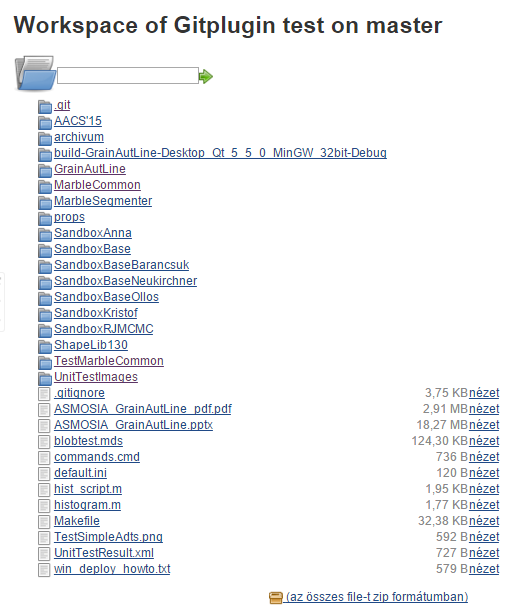
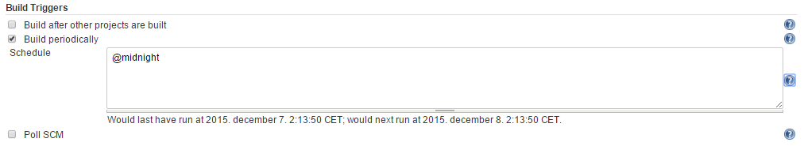
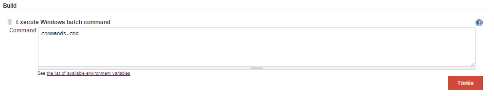
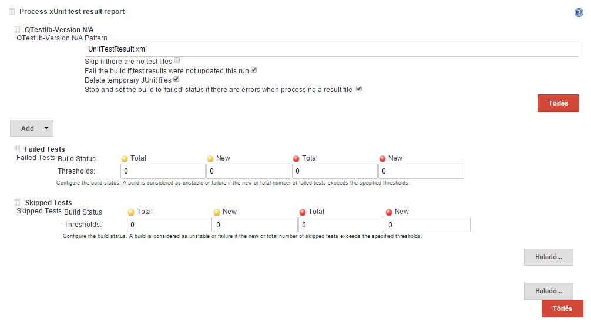
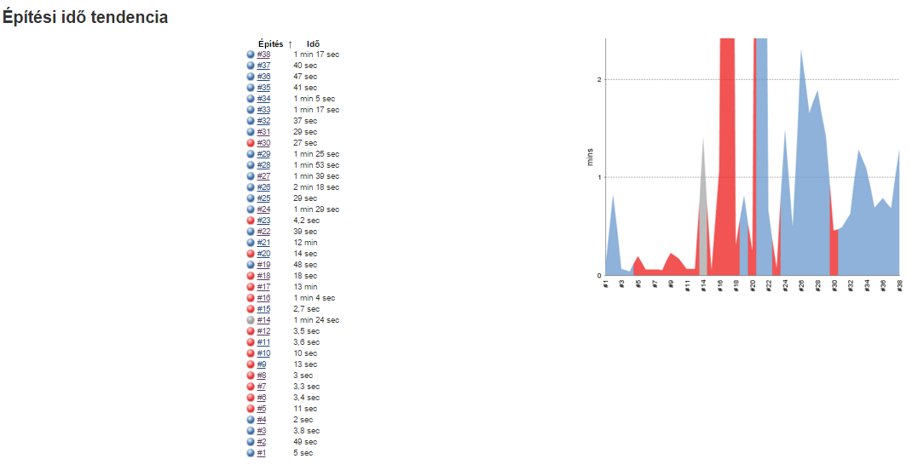

#Jenkins haladó

A snippetben megmutatom, hogyan lehet futtatni a unit teszteket Jenkins környezetben.

## Beállítások

Ha többmagos környezetben futtatjuk a Jenkins szervert, akkor észrevehető, hogy egy komolyabb fordítás alatt, milyen sokat kell várni a Konzol eredményére. A windows vezérlőpultjában látható, hogy a Jenkins csak egy magon / feldolgozóegységen fut, így nincs kihasználva az összes mag. „Jenkins Kezelése” -> „Rendszer Beállítások” -> „A végrehajtók száma” alatt lehet állítani a kihasználtságon. Ebben az esetben ne felejtsük el a ’–j A’ parancsot a shell scriptből sem (A db feldolgozó egység esetén).
Ahhoz hogy unit teszteket tudjunk futtatni, szükségünk van megfelelő plugin(ok)ra. Ilyenek például a „JUnit Plugin”, „qTest Plugin” vagy az „xUnit Plugin”. (Az xUnit Plugint fogjuk használni a snippet példában.) A szükséges pluginokat ezután telepíteni kell, és a jenkinst újraindítani a következő URL-el egyszerűen: http://localhost:8080/restart .

Fontos tudni, hogy a Jenkins létrehoz egy mappát a számítógépeden, ahova letölti az aktuális git working directoryt, ebben a mappában helyezi el a legenerált fájlokat és itt keresi a relatív URL-ben megadott paramétereket. Így fog kinézni az URL: „\Jenkins\jobs\Project_neve\workspace”. Úgy lehet leellenőrizni, hogy tényleg jó git repositoryn dolgozik a Jenkins, hogy megnézed milyen fájlok vannak a workspaceben. Ez leellenőrizhető a fájlrendszerben a megadott URL alatt, illetve a Jenkins kezelőfelületén is a „Munkaterület” gomb alatt.

 
 
## Build

A Build beállítások alatt megadható, hogy mikor töltse le a Jenkins a repository-t és futtassa a unit teszteket. Nekem célszerű volt éjfél utánra állítani ezt a paramétert. A kérdőjel alatt látható, milyen szintaktia szerint lehet paramétereket felvenni. 

Windows alatt célszerű „Execute Windows Batch command”-t választani így egyszerű shell parancsokkal futtatható a build. A commands.cmd fájlt az előbb említett workspace-be kell helyezni, ugyanis a Jenkins mindent a munkakönyvtárhoz képest relatívan keres

 
A példámban egy Qt-C++ alkalmazásnak a unit tesztjeit szeretném futtatni. A cmd fájlban három sor található. Először futtatom a Qt qmake.exe-jét. Persze meg kell a Jenkinsnek adni az elérési URL-t. Ezek után futtatom a mingw make.exe-jét. Ezután futtatható a generált UnitTests.exe fájl.
A parancsok a fejlesztőkörnyezet „Compile Output” részében látható, hogyan is futtatható a megírt program. Valahogy így néz ki a cmd fájl:

	qmake.exe Gitplugin.pro -r -spec win32-g++ "CONFIG+=debug" "CONFIG+=declarative_debug" "CONFIG+=qml_debug"
	mingw32-make.exe
	UnitTests.exe

A build legvégén a unit tesztek állapotai kiszínezhetők, hogy jobban láthatóak legyenek az eredmények. Ezenkívül az eredményeket érdemes kiírattatni egy XML fájlba, ami a munkaterületre lesz elmentve.
Ilyenkor a cmd fájlban a UnitTests.exe sor a következőre változik:

	UnitTests.exe -xml -o UnitTestResult.xml

 
Lehetőség van még Build utáni feldolgozásra. Például e-mailt küldeni, dokumentációt készíteni, vagy az eredményeket egyéb programmal tovább analizálni. Grafikonon is látható a build tendencia:

 

## Egyéb

Fontos még megemlíteni, hogy a buildeléshez szükséges rendszerváltozókat és rendszerútvonalakat nem a Felhasználó „Felhasználói változó”-i közé kell lementeni, hanem a „Rendszerváltozó”-k közé, ugyanis a Jenkins egy másik user nevében fut, így a saját felhasználó számára beállított környezeti változók rá nem lesznek érvényesek. E nélkül elérési hibára vagy jogosultsági problémára fut a Jenkins.

<small>Szerzők, verziók: Almási Péter</small>

 

