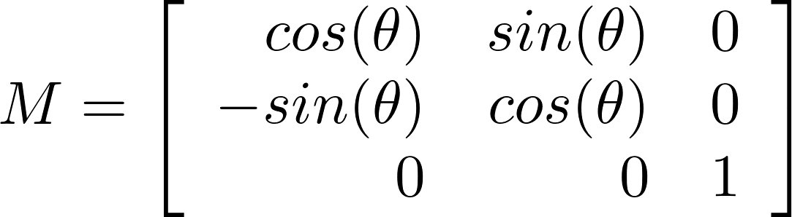
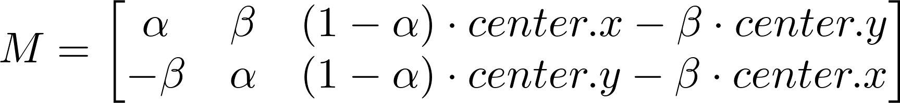
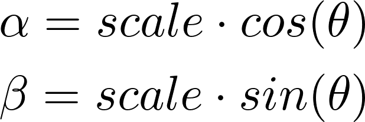
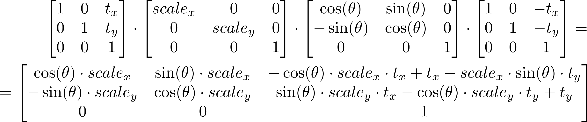
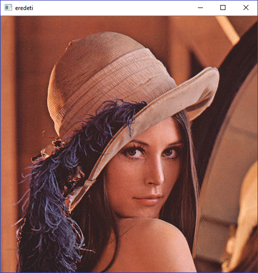
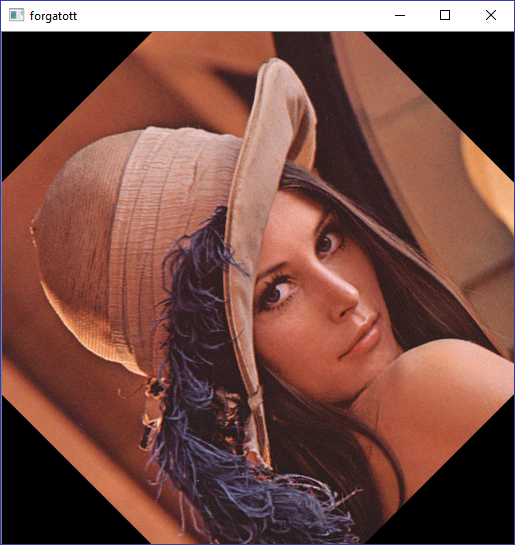
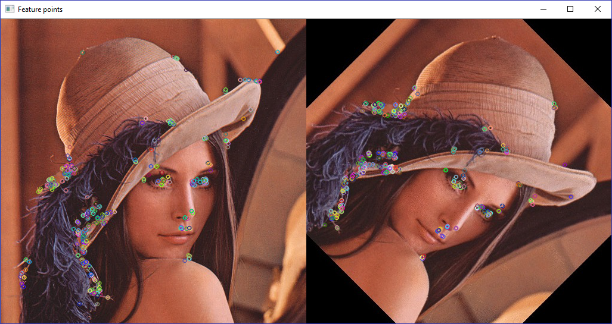
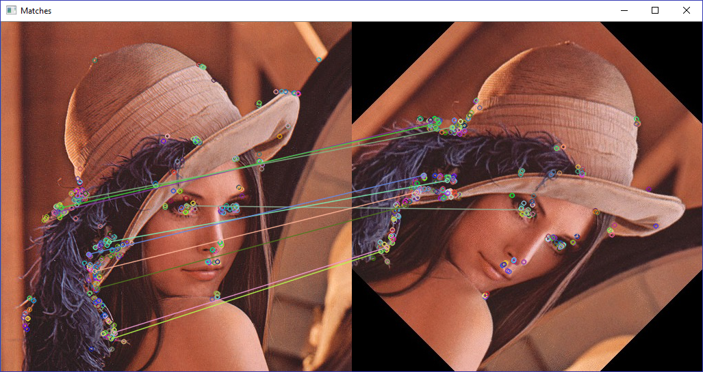
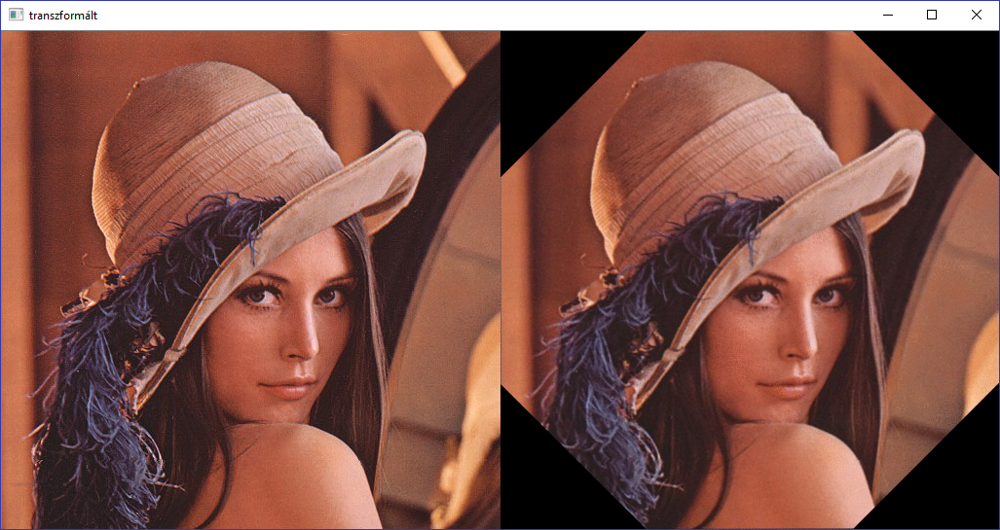

# Képek affin transzormációja OpenCvSharp segítségével

## [Affin transzformáció][1]
Bijektív párhuzamosság-tartó transzformáció (párhuzamos egyenesek képe is párhuzamos egyenesek). Affin transzformációk egymás után alkalmazása is affin transzformációt eredményez. Így tehát a transzformációk mátrixait összeszorozva szintén affin transzformációs mátrixot kapunk:

- forgatás
- skálázás
- eltolás
- tükrözés
- nyírás

A transzformációk síkban egy 3x3-as mátrixszal ábrázolhatók.
pl.:  szöggel origó (z tengely, ha lenne) körüli forgatás mátrixa:  




## A forgatás mátrix

```cs
Cv2.GetRotationMatrix2D(center, angle, scale)
```
Megadható a forgatás középpontja, a forgatási szög, és skálázás. Ennek megfelelően a visszaadott  `` Mat `` 2x3-as mátrix (az alsó [0 0 1] sort elhagyva).



, ahol



Az első két oszlop felelős a forgatásért és a skálázásért, a harmadik oszlop pedig a megadott forgatási középpont miatti eltolásért. A mátrixban semmi váratlan nincs, mindössze egy inverz eltolás, egy forgatás és skálázás, és ismét egy eltolás történik (ha valakinek nem világos miért, utánaolvashat akár [itt][5]):



Példaképp egy kép középpont körüli forgatása 45 fokkal:
```cs
var eredeti = new Mat("0.jpg", ImreadModes.Color);
var kepKozepPont = new Point2f(eredeti.Cols / 2f, eredeti.Rows / 2f);
var forgatasMatrix = Cv2.GetRotationMatrix2D(kepKozepPont, 45, 1.0);
Mat forgatott = Mat.Zeros(img.Rows, img.Cols, img.Type());
Cv2.WarpAffine(eredeti, forgatott, forgatasMatrix, forgatott.Size());
```
| eredeti | forgatott |
| :-----: | :---------: |
|  |  |


## Feature pontok keresése két képen


```cs
List<Point2f> img1Pts = new List<Point2f>();
List<Point2f> img2Pts = new List<Point2f>();
KeyPoint[] keypoints1;
KeyPoint[] keypoints2;

var descriptors1 = new Mat();
var descriptors2 = new Mat();

/* képleírókat keresünk a képeken ORB detector-ral */
var detector = ORB.Create();
detector.DetectAndCompute(img1, null, out keypoints1, descriptors1);
detector.DetectAndCompute(img2, null, out keypoints2, descriptors2);
```
A feature detector által talált pontok a képeken:    


A detector inicializálása sokat tud javítani a talált pontok mennyiségén és minőségén, így ha elégedetlenek vagyunk a kapott eredménnyel, nem szükségszerűen egy másik detector keresése (pl. BRISK) kell legyen a következő lépésünk, először játszhatunk az init parméterekkel (a példakódban ezek nem szerepelnek).
## Feature pontok összekötése/párosítása
```cs
/* megkeressük a párokat (descriptorok alapján) */
var matcher = new OpenCvSharp.BFMatcher(NormTypes.Hamming, true);
DMatch[] matches = matcher.Match(descriptors1, descriptors2);

/* a konkrét koordinátákra van szükségünk a transzformáció megállapításához,
 * nem pedig a descriptorokra */
foreach (var match in matches)
{
	img1Pts.Add(keypoints1.ElementAt(match.QueryIdx).Pt);
	img2Pts.Add(keypoints2.ElementAt(match.TrainIdx).Pt);
}
```
A matcher által talált párok közül az első 10 (hogy látszódjon mi mivel van összekötve, ne csak a vonalak):



A matcher inicializálásakor megadott NormType paraméter azért lett HAMMING, mert az előző mintakórban ORB-bal kerestük a feature pontokat. A crossCheck paraméter pedig azt jelenti, hogy csak azok a descriptorok ésvényes match-ek, amik egymás párjai, tehát ha **a** egy első kép descriptornak a párja egy **b** második képbeli descriptor, akkor **b** párja is **a** kell legyen, különben nem érvényes a match.    
A knnMatch metódust használva egy feature ponthoz több párt is ad a matcher. Ez olyankor hasznos, ha tudunk valami okos dolgot a konkrét felhasználási területről, és ki tudjuk választani a jobb párt a megtaláltak közül (például tudjuk, hogy milyen távolságban lehetnek a párok, akkor azt a match-et, ami ettől nagyon eltér kidobhatjuk).    
További matcher pl. FlannBasedMatcher.


## Két kép közti transzformáció meghatározása
Több lehetőségünk is van a feladat megoldására:

*   ``Cv2.GetAffineTransform(IEnumerable<Point2f> scrTri, IEnumerable<Point2f> dstTri)``

    Meg kell adnunk három pontpárt, amik megfelelnek egymásnak a két képen. (Ha nem tudunk pontosan meghatározni három ilyen pontot, nem vezet célra ez a metódus)
*   ``Cv2.EstimateRigidTransform(InputArray src, OutputArray dst, bool fullAffine)``

    Akkor hasznos, ha több (>3) egymásnak megfeleltetett pontpárt találtunk a két képen (match), de nem tudjuk kiválasztani a három legjobbat (a metódus kiválasztja a legjobbakat helyettünk [RANSAC][6] módszerrel). Amennyiben csak 3 párt adunk meg neki, az eredmény azonos lesz a GetAffineTransform metódus által nyerhető transzformációval.  

Az előző példakódbeli elnevezéseket megtartva tehát így folytatódik a történet:
```cs
Mat H = Cv2.EstimateRigidTransform(InputArray.Create<Point2f>(img1Pts), InputArray.Create<Point2f>(img2Pts), true);
/* vagy akár így */
H = Cv2.GetAffineTransform(img1Pts.Take(3), img2Pts.Take(3));
```

Affin transzformáció meghatározása RANSAC nélkül [itt][4] (least square matching).

## Transzformációs mátrix invertálása
Azzal, hogy megállapítottuk, milyen transzformáció van az első és második kép között, még nem oldottuk meg azt a feladatot, hogy a második képet visszaképezzük az elsőre. (persze, ha a második és az első közti transzformációt számítottuk volna ki elsőre, már készen lennénk a mátrix megállapításával)
```cs
Cv2.InvertAffineTransform(InputArray m, OutputArray mi)
```
A bemenet egy 2x3-as affin transzformációs mátrix ``Mat``. A kimenetnek pedig egy ugyanekkora ``Mat``-nak kell lennie.

## Affin transzformáció alkalmazása képen
```cs
OpenCvSharp.Cv2.WarpAffine(InputArray source, OutputArray destination, InputArray transformation, Size destinationSize)
```
A source a bemeneti kép, destination pedig amibe a transzformált kép kerül. A transformation a 2x3-as transzformációs mátrix, a destinationSize pedig a kimeneti kép mérete.

## Teljes példakód
Fogunk egy képet, és annak egy transzformáltját (itt állítjuk elő), majd a második képet visszatranszformáljuk az elsőre.
```cs
var img1 = new Mat("0.jpg", ImreadModes.Color);
var kepKozepPont = new Point2f(eredeti.Cols / 2f, eredeti.Rows / 2f);
var forgatasMatrix = Cv2.GetRotationMatrix2D(kepKozepPont, 45, 1.0);
Mat img2 = Mat.Zeros(img.Rows, img.Cols, img.Type());

Cv2.WarpAffine(img1, img2, forgatasMatrix, img2.Size());

List<Point2f> img1Pts = new List<Point2f>();
List<Point2f> img2Pts = new List<Point2f>();
KeyPoint[] keypoints1;
KeyPoint[] keypoints2;
var descriptors1 = new Mat();
var descriptors2 = new Mat();
var detector = ORB.Create();

detector.DetectAndCompute(img1, null, out keypoints1, descriptors1);
detector.DetectAndCompute(img2, null, out keypoints2, descriptors2);

var matcher = new OpenCvSharp.BFMatcher(NormTypes.Hamming, true);
DMatch[] matches = matcher.Match(descriptors1, descriptors2);

foreach (var match in matches)
{
	img1Pts.Add(keypoints1.ElementAt(match.QueryIdx).Pt);
	img2Pts.Add(keypoints2.ElementAt(match.TrainIdx).Pt);
}

Mat H = Cv2.EstimateRigidTransform(InputArray.Create<Point2f>(img1Pts), InputArray.Create<Point2f>(img2Pts), true);
Mat Hinv = Mat.Zeros(2, 3, H.Type());

Cv2.InvertAffineTransform(H, Hinv);

Mat repairedImg2 = Mat.Zeros(img2.Rows, img2.Cols, img2.Type());

OpenCvSharp.Cv2.WarpAffine(img2, repairedImg2, Hinv, repairedImg2.Size())
/* ezen a ponton az img1 a kép amiből kiindultunk, img2 ennek 45 fokos elforgatottja, repairedImg2 pedig a visszaforgatott */
```
Az eredeti és az oda-vissza transzformált kép:    



(debuggoláskor képeket megjeleníteni legegyszerűbben az alábbi módon lehet:
```cs
Mat enSzuperKepem = Mat(@"..\..\valamikep.png", ImreadModes.Color);
Cv2.ImShow("én kicsi ablakom címe", enSzuperKepem);
Cv2.WaitKey(0);
```
ez feldob egy ablakot, és megvárja, amíg be nem zárja a felhasználó. Jól jön pl. descriptor detektor inicializálásának beállításakor, vagy képek gyűjtéséhez snippet készítésekor.)

<small>Szerzők, verziók: Sümeghy Péter</small>

[1]:https://en.wikipedia.org/wiki/Affine_transformation
[2]:http://docs.opencv.org/trunk/da/d6e/tutorial_py_geometric_transformations.html

[4]:http://stackoverflow.com/questions/25375597/what-happens-if-i-give-more-inputs-in-estimaterigidtransform-or-getaffinetransfo
[5]:http://www.euclideanspace.com/maths/geometry/affine/aroundPoint/matrix2d/
[6]:https://en.wikipedia.org/wiki/Random_sample_consensus
