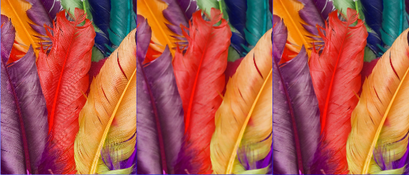
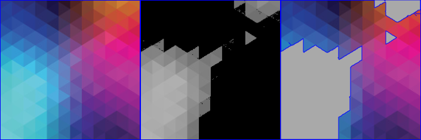
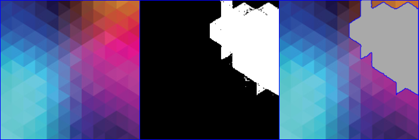

# Filterek és Thresholding alkalmazása

Képfeldolgozás során hasznos különböző filterek és szegmentációk alkalmazása az érintett kép számunkra lényeges részeinek kiemelése érdekében, vagy éppen a feleslegesnek mondható részek kiszűréséért. Az alábbiakban ezek bemutatására kerül sor, C#-ban írt példakódokkal, [OpenCv] segítségével. (Nyílt forráskódú gépilátás eszközkönyvtár)

## Filterek

A követkető filterek elsődleges célja a zaj csökkentés, vagyis a képek simítása. Ezeknél a filtereknél az adott pixel értékét a környezete befolyásolja, típustól függően változik azoknak hatásának mértéke.

### Median

A Median filter a kép összes elemén végigmenve kicseréli az éppen kiértékelendő pixelt a szomszédainak mediánjával. Itt az összes szomszéd egyenlő súllyal számítódik, befolyásol.
Paraméterek:
- src: A forráskép, amit filterezünk. (Mat)
- dst: Célként kijelölt kép, amibe kerül a filterezett forráskép. (Mat)
- i: Az ablak mérete, ami minden irányba i, ezt vesszük figyelembe. (int)

A függvény a képeket Mat típusként várja, ha RasterImage-el dolgozunk, akkor így érjük el és alkalmazzuk:

    RasterImage dst = new RasterImage();
    dst.Image = new Mat();
    Cv2.MedianBlur(src.Image, dst.Image, i);

## Bilateral

Képsimítás hatására elmosódhatnak számunkra fontos területek is, pl. a határvonalak. Ezek megtartására jó a Bilateral filter, ami a szomszédos pixeleknél figyelembe veszi azok tulajdonságát is, és az alapján különböző súllyal veszi őket figyelembe a saját értékének kiszámításához.
Paraméterek:
- src: A forráskép, amit filterezünk. (Mat)
- dst: Célként kijelölt kép, amibe kerül a módosított forráskép. (Mat)
- diameter: A kiértékelendő pixel szomszédságának átmérője. (int)
- sigmaColor: Annak a mértéke, hogy mennyire legyen a sigmaSpace-ben megadott nagyságú környezetben lévő pixelek értéke összemosva. Minnél nagyobb, annál inkább. pl. >150-nél már nagyon nagy a hatása. (double)
- sigmaSpace: Minnél nagyobb az értéke, annál távolabbi pixelekre igaz, hogy hatással vannak egymásra egészen addig, míg az értékük (~sigmaSpace) közel van egymáshoz. (double)

    Cv2.BilateralFilter(src, dst, diameter, sigmaColor, sigmaSpace);

Itt látható a szűrők alkalmazása: a bal oldali kép az eredeti, középen a median filterrel ellátott kép (i=7), jobb oldalon pedig a bilateral filteres változat (150, 150, 5) látható. A jobb oldali képen a kisebb rések a tollon jobban megmaradtak, erősebbek a határvonalak, míg a középső ezeket jobban összemosta.

## Thresholding

Feladata az azonos tulajdonságú pixelek homogén régiókba való csoportosítása. Ez a szegmentáció szürkeárnyalatos képeken működik, 1-1 pixel értéke [0-255] közötti. A 0 feketének felel meg, a 255 pedig fehérnek. Több típusú thresholding létezik, közös tulajdonságuk a thres értéke, ami egy küszöbérték. Ettől függően módosul a pixel, tekintve arra, hogy épp alatta vagy felette van-e a küszöbnek.
Paraméterek:
- src: A forráskép, amit filterezünk. (Mat)
- dst: Célként kijelölt kép, amibe kerül a módosított forráskép. (Mat)
- tresh: Küszöbérték, amihez viszonyítunk. (double)
- maxValue: Ez az érték lesz a pixel új értéke, ha nagyobb/kisebb a küszöbnél. Ez a típustól függ. (double)
- thresholdingType: A thresholding típusa. (OpenCvSharp.ThresholdType)

    Cv2.Threshold(src, dst, tresh, maxValue, thresholdingType);

### Thresholding típusok:

- *Binary*: Ha a küszöbnél nagyobb, akkor maxValue, egyébként 0 lesz a pixel értéke.
- *Binary inverted*: Ha a küszöbnél nagyobb, akkor 0, egyébként maxValue lesz a pixel értéke.
- *Truncate*: Ha a küszöbnél nagyobb, akkor a thres értékét kapja meg, egyébként marad az eredeti
- *Threshold to zero*: Ha a küszöbnél nagyobb, akkor megtartja értékét, egyébként pedig 0.
- *Threshold to zero inverted*: Ha a küszöbnél nagyobb, akkor 0, egyébként megtartja értékét.

Az előbb felsorolt sorrendben a szegmentációk végeredménye:

## Thresholding alkalmazása

A feladat a következő: Szürkeárnyalatos képeken a megadott intervallumon belüli területekből polygonok készítése. A felhasználó beállítja a minimum és a maximum értékét az intervallumnak. Pl. *min* = 100, *max* = 200. Így azokból a területekből lesz polygon, ahol az adott pixelértékek beleesnek a 100-200-as tartományba.
A feladat megoldása thresholding alkalmazásával:

    Cv2.Threshold(src, dst1, min, 255, ThresholdTypes.Tozero);
    Cv2.Threshold(dst1, dst2, max, 255, ThresholdTypes.TozeroInv);

A *maxValue* értéke itt most 255, de igazából mindegy, hogy mi van megadva, mert ezeknél a thresholding típusoknál nincsen hatása. Az első függvénynél a *min* tölti be a thres szerepét, így a nála kisebb értékű pixelek új értéke 0 lesz. Ezzel kifeketítettük az intervallum alatti területeket. Ezután ezt a képet felhasználva a következő függvénynél a *max* tölti be a thres szerepét, és a nála nagyobb értékú pixelek új értéke 0 lesz. Így az intervallum feletti részek is feketék lettek. Ezután a dst2-ként létrejött képet már használhatjuk élek detektálására, polygonok létrehozására, stb., hiszen a lényegi rész jelentősen eltér az ignorált részektől, a  képfeldolgozás további részét elősegítve.

Megvalósítva:

Bal oldalon látható a kiinduló állapot, középen a szegmentált kép, jobb oldalon pedig az ez alapján létrejött poligonokkal ellátott kép. Az egységes szürke területek alkotnak 1-1 poligont.

## Szín alapú szegmentálás

Lehetőség van a pixelek csoportosítására a színértékeik alapján is. OpenCv-vel az inRange függvénnyel lehet intervallum határokat megadni, és a módosult képen 255 lesz az intervallumba eső pixelek értéke, egyébként pedig 0.
Paraméterek:
- src: A forráskép. (Mat)
- min, max: Az alsó, illetve felső határ. (OpenCvSharp.Scalar/ OpenCvSharp.InputArray)
- dst: Célként kijelölt kép. (Mat)

       Cv2.InRange(src, min, max, dst);

A fenti képen a piros szerű részek behatárolása volt a cél. A küszöböket a HSV (hue, saturate, value) hármasa határozta meg. Jelen példában két intervallumra is szükség volt a kívánt szín elhelyezkedésének köszönhetően, így a [0,100,100]-[10,255,255] és a [155,100,100]-[180,255,255] közötti részekből alakult ki a poligon.

[OpenCv]: <http://opencv.org/>

<small>Szerzők, verziók: Kutasy Kitti</small>
