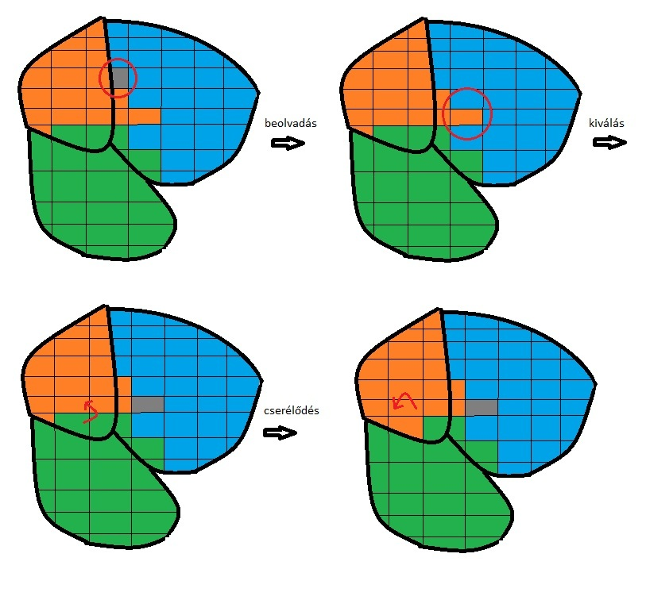
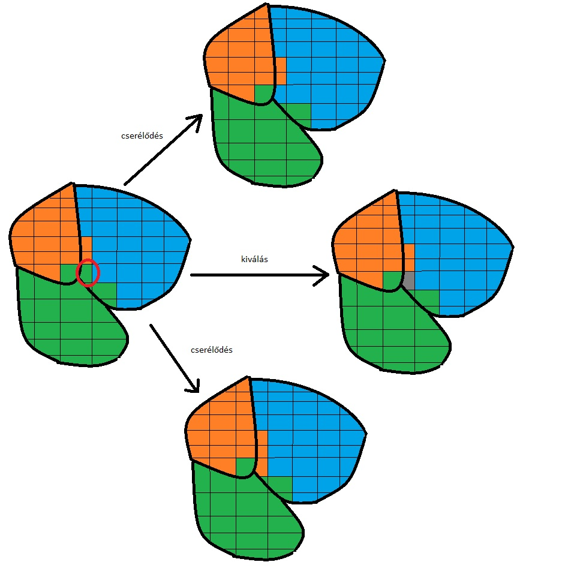
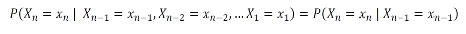

# Az RJMCMC algoritmus

Kezdjük a rövidítés feloldásával: Reversible Jump Markov Chain Monte Carlo. A fogalom megértéséhez 3 dolgot kell részletezni. Nevezetesen mit jelent a:

* Reverzible Jump
* Markov Chain
* Monte Carlo.

Ezeken fogunk végig menni sorra és egy példán keresztül illusztrálom az algoritmust. A GrainAutLine projekt keretén belül, szemcse felismerésre használjuk az RJMCMC-algoritmust, méghozzá egy bizonyos függvény minimalizálásán keresztül. Az utóbbit pontosabban energiafüggvénynek nevezik. Az energiafüggvény minimuma annál a konfigurációnál van, ahol a gép által felismert szemcsék megegyeznek az igazi fizikai szemcsékkel. A módszer alapja, hogy az eredeti képet túlszegmentálva, apró darabokra vágjuk a képet, majd újra összerakjuk úgy, hogy a kirajzolódó szemcsehatárok egyezzenek az igaziakkal. Az apró darabokat ugyebár rengeteg féleképpen lehet összerakni, pontosabban újra csoportosítani (a szomszédok minden darabra mindig ugyanazok). Az összerakást végző algoritmus az RJMCMC.
Most nézzük meg működés közben, végig követve az alábbi ábrákat.

A képen a vastag fekete vonal jelöli az igazi szemcsehatárokat. A kis cellák a túlszegmentálás során keletkeztek. Az egyes színek azt jelölik, hogy a program szerint mi alkot egy szemcsét jelenleg. A különböző színek különböző szemcséket jelölnek. Elsőként egy szürkével jelzett kis cella (nevezzük blobnak) beolvadt a kék foltba (nevezzük superblobnak). Ezt követően a kis cella kivált a kék superblobból és önálló superblobot alkot. Ez után a piros nyíllal jelölt átmenet megy végbe melynek során a zöld superblobból egy blob kivált és beolvadt a narancssárga superblobba. Végül olyan átmenet zajlik, ahol minden helyben marad. Az RJMCMC algoritmus ilyen lépések sorozatát hajtja végre, míg végül a vastag fekete vonalakon belül csak egy adott szín fog uralkodni. 

Az alábbi ábra azt mutatja, hogy mi történik egy adott lépésben. Egy lépés azt jelenti, hogy miközben az algoritmus végig iterál minden blobon (a képen a cellákon), minden blob esetén megvizsgálja, hogy annak összes szomszédjával milyen átmenetek lehetségesek. A lehetséges átmenetek: a beolvadás, a kiválás, átmehet egyik superblobból a másikba (cserélődés) és a nem történik átmenet. Jelen esetben három átmenet lehetséges, melynek típusa a nyilakhoz van írva.

Az algoritmus hozzárendel mindegyik átmenethez egy-egy valószínűségi értéket, hogy mekkora valószínűséggel mehet végbe az adott átmenet. Ez után sorsol, hogy melyik történjen meg. Az átmeneti valószínűségek kiszámításához van szükség az energiafüggvényre, ami a teljes elrendezéshez rendel energiát. Mikor egy lehetséges átmenet megváltoztatja ezt az elrendezést az energia is változik. Ehhez a változáshoz rendelődik egy átmeneti valószínűség. Mivel az energiaváltozás csak néhány blobot érint egyszerre, ezért nem kell minden superblob energiáját újra számolni. Elég csak az érintett blobokat és superblobokat vizsgálni. Ez jelentősen csökkenti a számítási igényt.

A folyamat konvergens kell, hogy legyen abból, a szempontból, hogy bizonyos iterációs szám után, már ne történjen semmi a kis fluktuációktól eltekintve. Ez az állapot egybeesik az energiafüggvény minimumával, vagyis az algoritmus lényegében optimalizál. Az alábbiakban az algoritmus elemeivel ismerkedünk.

## Monte Carlo

A folyamat véletlenszerűen választ a különböző lehetséges átmenetek közül. Azt, hogy melyik átmenetet választja, az átmeneti valószínűségtől függ. A Monte Carlo módszerek általánosabban egy mintavételezési eljárást takarnak. A mintavételezés egy valószínűségi eloszlásfüggvényből történik. Esetünkben ez az eloszlásfüggvény változik is. 

A gyakorlatban Monte Carlo módszerekről beszélhetünk, ami egy gyűjtőnév, és módszerek igen széles sorát jelöli. Általában ezen módszerekben a tetten érhető közös vonás a sorsolás bizonyos kimenetek közül, amikhez valószínűség van rendelve és ezt a sorsolást iteratívan többször ismétlik, mígnem a kívánt eredményt kapják. Például a kívánt eredmény lehet a kör területe, vagy egy gázkisülés során a gázrészecskék sebesség profilja a katódtól mért távolság és az idő függvényében.

A kör területes példa részletesebben kifejtve. Egy kört pontosan tartalmazó négyzetbe egyenletes eloszlással *dobunk* pontokat. Megszámoljuk, hogy mennyi esik a körbe és vesszük az összes pont számával a hányadost. Elegendően sok pont esetén elég közel lesz az arány a kör és a négyzet terület arányához. Így a terület meghatározható.

## Markov Chain

A Markov-láncok definíciójának lényege, hogy egy adott állapot (mondjuk a következő) valószínűsége csak a megelőző állapottól függ. Képlettel:

Az itt részletezett példában ez azt jelenti, hogy az átmeneti valószínűségek csak az aktuális elrendezéstől függnek, de az hogy mivolt az eddigi iterációknál az semmilyen kihatással nincs a következő lépésre. Ez érthető, hiszen az energia különbségeket csak közvetlenül az átmenet előtti állapot és az utána levő állapot határozza meg.

## Reversible Jump

A példában a blobok száma változatlan. Azonban az érdeklődés középpontját jelentő superbloboknak nemcsak az összetétele, hanem a száma is változik. Egy kiválás során például nő a számuk, míg egy beolvadás során csökken. Látható, hogy az egyes átmenetek között a rendszer dimenziója változhat oda-vissza. A reversible jump azt jelenti, hogy az algoritmus ezt képes megfelelően kezelni. 

## Megjegyzés
A  Monte Carlo (MC) tehát magában is több módszer gyűjtőelnevezése, de a Markov Chain Monte Carlo (MCMC) is egy gyűjtőfogalom, valamint az RJMCMC is.

### Felhasznált irodalom

*Reversible-jump Markov chain Monte Carlo*, Andrea Gesmundo, University of Geneva

Szerző: Budai Ádám

