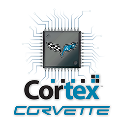

# Cortex Corvette összefoglaló

Ez a Snippet a Cortex Corvette RobonAUT csapat összefoglalója az autóhoz írt QT-s alkalmazásfejlesztésről.

[Facebook oldalunk](http://www.facebook.com/cortexcorvette/)

## Általános

A Qt-alapú vezérlőszoftver (`CSW`) megalkotásakor alapvető célunk volt, hogy a fejlesztés a lehető leggyorsabban menjen, a lehető legkevesebb rejtett hibát tartalmazza a kód, hogy a RobonAUT-tal kapcsolatos *firmware* fejlesztéstől ne vegyünk el feleslegesen időt. Ez indokolja a protokoll ilyen jellegű megvalósítását, a soros interfészek kezelését, a harmadik féltől származó elemek alkalmazását. Emellett igyekeztünk minden döntés közben észben tartani a platform sajátosságait, illetve a C++11 újdonságait. A szoftver rétegei többnyire szépen elkülönülnek, tehát nincs szükség például a főablak példányára, hogy az autó kormányát mozgathassuk stb. Ennek ellenére néhány korábbi tervezési megfontolás idővel kevésbé jó döntésnek bizonyult, a kezelőfelület például viszonylag erősen a `MainWindow` köré épült, hiába vannak azon belül jól elkülönített interfészek.

A szoftveren tehát még bőven van mit fejleszteni, és fogunk is, hiszen még hiányoznak a felületek néhány szenzor identifikációjához, illetve bizonyos nemlinearitási problémákhoz is szükség lesz mintagyűjtésre. Ez azonban nem komoly probléma, hiszen **napjainkban nem létezik kész szoftver**, kizárólag **kiadott** szoftverek találhatók a piacon. Ennek megfelelően elmondható, hogy bár a *CSW* jelen állapotában egészen kényelmesen használható, jelenleg fejlesztés alatt álló, mérsékelten végigtesztelt termék.

## Qt előnyei egyéb keretrendszerekhez viszonyítva

### Crossplatform rendszer

A **Qt** keretrendszer nagy előnye például egy *.net*-hez képest, hogy lényegében platformfüggetlen rendszer, a fejlesztők és felhasználók különböző platformokon dolgozhatnak. Ez a **java** környezetre is igaz persze, de a Qt alkalmazások natívak, virtuális gép és GC nélkül futnak az adott operációs rendszer felett.

Magas szintű absztrakciót tesz lehetővé, így például egységesen kezelhető a Windows-os és Linux-os grafikus felület az összes widgettel együtt, a soros portok, vagy a *folymatok* (QProcess). A projekt kapcsán persze a platformnak csupán kevés szolgáltatására volt szükségünk.

### Absztrakt interfészek

Az absztrakt interfészek használata nem kizárólag a platformfüggő különbségek kezelésekor hasznos. Már a beágyazott projekt elkezdése előtt érdemesnek tűnt a vezérlő protokoll fejlesztésével foglalkozni, ezt viszont hardver nélkül a legegyszerűbben valamiféle szimulátorral lehet megoldani. A szimulátor esetünkben a szabványos be- és kimeneteken kommunikál a közös protokoll szerint. A szimulátort a vezérlőszoftver képes *QProcess*ben futtatni, és ezáltal soros interfészként használni. Amikor már a beágyazott projekten dolgoztunk, jó ötletnek tűnt beépíteni az USB-VCP-t, mivel csak egy autónk (és egy BT modulunk)  van, de sok ezektől független feladaton lehet dolgozni az autó nélkül (ADC lábakkal megvalósított perifériák pl.). A QProcess-alapú soros interfész alapján percek alatt megvalósítható volt a QSerialPort-alapú, amely kezeli az USB-VCP-t, és a Bluetooth soror portját is.

Különösen hasznos volt a szimulátorral fenntartott teljes kompatibilitás a vonalkereső algoritmus hibakeresésénél. Az autóval felvettünk néhány mintát, amelyeken látványosan nem működött az algoritmus, majd ezeken az autó nélkül, a szimulátorban tudtunk tovább dolgozni, amihez kapcsolódva tudtuk elemezni a kimeneti grafikonokat.

### Signal-slot megoldás

Érdemes kihasználni a Qt-ben elérhető, a C++-hoz képes új nyelvi kiegészítéseket. Minden objektum, amely a *QObject*ből származik, tartalmazhat signalokat és slotokat, amelyeket futásidőben kapcsolhatunk össze más objektumokkal. Ez a megoldás lehetővé teszi azt is, hogy egy signalt több objektum slotjaira kapcsoljunk; ezt alkalmaztuk például a *Communication Log* felület és a protokollértelmezés között: mindkettő objektum megkap minden adatot az eszköz felől, az egyik egyszerűen kiírja egy konzolra, a másik értelmezi a bejövő információt. A két interfész egymástól, és minden más objektumtól független, a futásidőben létrehozott kapcsolat köti őket csupán egy soros interfész egy signaljához.

## Kommunikáció az eszközzel

Ha már tudjuk, hogy soros interfészeink lesznek, érdemes szót ejteni az interfészeken továbbított adatokról. Ez a téma komoly vitakérdés volt a csapaton belül, végül a következő megoldást választottuk:

* ASCII karaktereket használ, a könnyű hibakeresés végett
* kevés utasítást tartalmaz
* a beágyazott eszközön futó szerver tartalmazza a parancsokat, a leírásukat stb.
* maguk a parancsok és beállítható paraméterek egy fagráf csomópontjaiba vannak rendezve

Ez a fagráfos, dinamikusan felderíthető parancskészlet a fejlesztés során igen hasznosnak bizonyult. A legtöbb módosításhoz nem volt szükség a vezérlő szoftver módosítására. A protokoll kevés számú parancsával implementálható lekérdezéseket csak egyszer kellett megírni, a rendszer pedig lényegében korlátlanul bővíthető. A PC-oldali feldolgozás Qt alatt természetesen könnyen implementálható a különféle *stringmanipuláló* eszközökkel, *regular expression*-ökkel; a beágyazott szerver alkalmazás megvalósítása már valamivel bonyolultabb feladat.

## Nem célszerű újra feltalálni a kereket

A fejlesztést nagyban megkönnyíti (gyorsítja), ha nem kell mindent nekünk implementálni, mert léteznek elérhető IP (Intellectual Property) modulok. Ezek előnye a munkaidőn kívül gyakran a tesztelési idő csökkenése is, hiszen egy sok projektben használt modulban mások már észrevették  a lehetséges hibák jó részét (kisebb valószínűséggel kell nekünk javítanunk bármit bennük).

### QCustomPlot

Az egyik külső forrásból származó (third-party) felhasznált osztály a *QCustomPlot* volt. Segítségével, gyakorlatilag pár sorban tudunk létrehozni gyönyörű, végtelenül paraméterezhető és reszponzív diagrammokat.

Nem csak látványnak volt jó a megjelenítés, hanem segítségével a többfajta vonaldetektálási algoritmust is ki tudtunk próbálni, valamint láthattuk azt is közel valósidőben (egy 32 elemű tömb elemeinek, vagy a 32 teszt célú kék LED nézegetése helyett), hogy melyik szenzorunk "rosszalkodik", illetve hol van még hardveres problémánk (ebből akadt néhány).

Egyetlen komoly hiányosságot találtunk a *QCustomPlot*ban, a grafikus gyorsítás hiányát. A grafikon újrarajzolása 30-50 fps feletti sebességen komoly terhelést jelent a CPU számára. Ezzel a limitációval persze együtt lehet élni egy mai 4-8 magos gépen, de attól még bosszantó.

[QCustomPlot hivatalos weboldal](http://www.qcustomplot.com/)

## QTest használata

A QT-s Unit tesztek okoztak fejtörést az alkalmazásfejlesztés közben. A gondot az okozta, hogy nehezen találtunk jó leírást a használatukról és egy meglévő projektbe történő integrálásáról. Az egyszerű QT Unit Test új, független projektként való létrehozása nem tetszett nekünk, mivel akkor lett volna két független projektünk, amik pedig egymáshoz tartoznak szorosan. Sok kutakodás után rátaláltunk egy jó megoldásra: Ahogy a Microsoft Visual Studio is támogatja a Hierachikus projekteket, ez itt QT-ban sincs másként.

### Hierarchikus project létrehozása

A cél olyan projekt létrehozása, melyben több al-projekt is szerepel. Jelen esetben most 2: a szoftver maga, és egy unit tesztkörnyezet. Ehhez a következőt kellett tennünk:

0. Adott a létező szoftveres projektünk (*RobonAUT_CSW*)
1. Létrehozunk egy QTest projektet, tetszőleges osztály névvel (*RobonAUT_CSW_QTest*)
2. Létrehozunk egy könyvtárat, ami tartalmazni fogja mind a két projektet (*RobonAUT_CSWSolution*)
3. A két projektet közös mappába másoljuk, majd létrehozunk egy .pro kiterjesztésű fájlt, melyben definiáljuk, hogy ez a projekt bizony egy hierarchikus projekt lesz.

A *RobonAUT_CSWSolution.pro* tartalma:

    TEMPLATE = subdirs  
    SUBDIRS += RobonAUT_CSW \
               RobonAUT_CSW_QTest

Ebből a QT tudni fogja, hogy amennyiben megnyitjuk a *RobonAUT_CSWSolution* projektet, vizsgálja meg a két almappát is, mert abban alprojektek lesznek. Ekkor a QT Creatorban így néz ki a hierarchia:

### QTest használata

Ezek után, már nincs más dolgunk, mint:

1. a QTest alkalmazásban hivatkozni a fő projekt fájlraira úgy, hogy egyszerűen beszúrjuk őket a projektbe (a QT relatív útvonalon kezeli majd a fájlokat, de mivel mostmár egy "Solution"-ünk van, ez nem probléma).
2. Megírunk egy teszt osztályt adott funkció kipróbálásához
3. Majd a ``QTEST_APPLESS_MAIN(..)`` makróval létrehozunk egy main()-t és lefordítjuk a QTest alkalmazásunkat.

### Unit tesztek tanulsága

A Projekt részeként létrehoztunk két tesztelő osztályt, mely egy Polinomális regresziót számító osztályt, valamint egy egyszerű mátrix osztály implementációt tesztelnek. A tesztek során derült ki, hogy a mátrix osztály transzponáló függvénye csupán N*N-es mátrixokra működik. Ami bár a jelenlegi beállításokkal nem okozott hibát, de a későbbiekben, amennyiben más regressziós formát választunk, bajba kerültünk volna.

## Tárgy hasznosságga

Bár mindannyian használtunk már verziókövetést a tárgy előtt is, nem értjük, hogy ez miért nem került előbb tananyagba, hiszen sokaknak teljesen újdonság volt ez a téma. Javasolnánk a tárgy (legalább részeinek) bevitelét az alapképzés részébe.

Emellett zavaró az **állatorvosi ló** effektus. Adott egy lista, benne véges sok remek Qt-feature, C++11-feature és persze design pattern. Ezekből legyen 3 darab, amabból a másikból 2-2 stb. Ez így abszolút nem életszagú, a gyakorlatban a probléma jellege mozgatja a megoldás mechanizmusát, és soha nem az elvárt megoldási mód határozza meg az összes többi tényezőt. A projekt elejétől fogva a *jól használható debug eszköz a versenygéphez* volt a célja, a fejlesztés menetét optimális esetben előre definiált patternek helyett az alkalmazás tényleges igényei határoznák meg...

*True story: bejöttem előadásra, volt pár olyan rész a GIT-ben, amiről még nem hallottam, mivel nem kellett használnom (stash, cherry-pick). Majd két nap múlva elmentem állásinterjúra, ahol megkérdezték pont ezeket. :)*

<small>Szerzők: Major Péter, Nagy Balázs, Imre Dávid</small>
