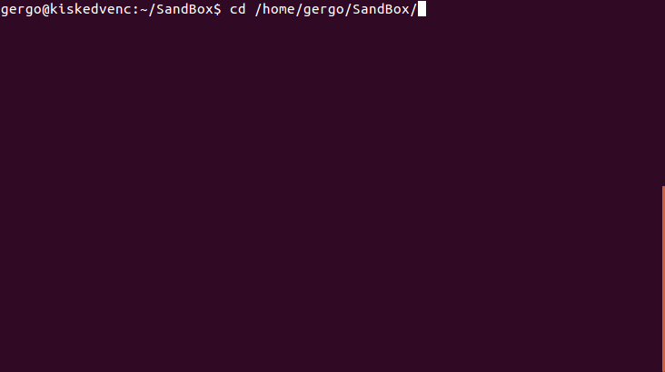
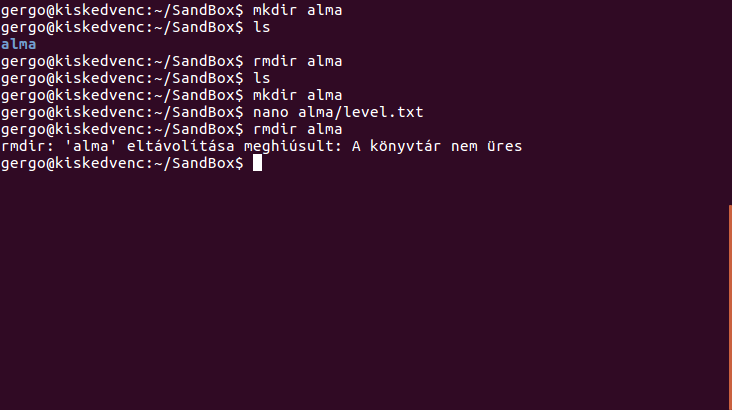
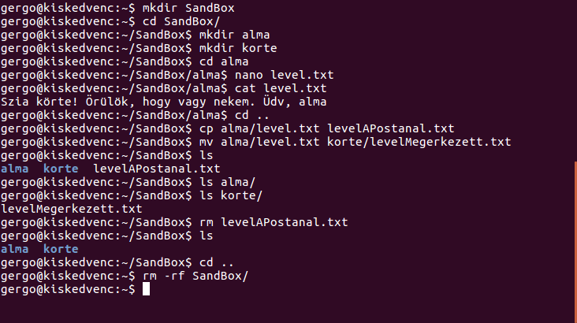

# Linux bevezető

Ennek a snippetnek a célja, hogy az alap linux teminálos parancsokat bemutassa.

## A terminál

Nyissunk meg egy terminált! A terminál alapból a saját *home* könyvtárunkban nyílik meg. Innen kiindulva relatív címzéssel, vagy a gyökér könyvtárból abszolút címzéssel elérhetjük a kívánt munkakönyvtárat.

## Könyvtár váltás (cd)

Könyvtárak között a ``cd`` paranccsal navigálhatunk.

 - ``cd <directory>`` beírásával a kívánt könyvtárba léphetünk.
 - A ``cd`` parancs önnálló beírásával a *home* könyvtárba kerülünk.
 - A ``cd ..`` parancs a könyvtárszerkezetben való gyors feljebblépésre szolgál. Pl. a ``alma/korte`` könyvtárban kiadva visszakerülünk az ``alma`` könyvtárba 

A ``pwd`` paranccsal az aktuális könyvtár abszolút címzését kaphatjuk meg.
 
## A könyvtár tartalmának megjelenítése (ls)

Az ``ls`` parancs beírásával az aktuális könyvtár tartalmát jeleníthetjük meg. Mint a legtöbb linuxos parancshoz, ehhez is tartoznak a működését befolyásoló argumentumok:

 - ``ls -a`` a rejtett fájlok megjelenítéséhez
 - ``ls -l`` a fájlokhoz tartozó információk részletes (hosszú, *long*) megjelenítése

## Könyvtárműveletek (mkdir, rmdir)

Könyvtárak létrehozására, törlésére szolgáló parancsok.

 - ``mkdir <directory>`` egy ``directory`` nevű könyvtárat hoz létre az aktuális mappában
 - ``rmdir <directory>`` a ``directory`` könyvtárat törli az állományból

A ``rmdir`` paranccsal csak üres könyvtárat lehet törölni.

Hozzunk létre egy új könyvtárat, majd töröljük azt!

## Fájlmanipuláció (cat, cp, mv, rm)

A fenti példában észrevehettünk egy sort: ``nanoalma/level.txt``. Ezzel a paranccsal az ``alma`` könyvtárban létrehoztunk egy ``level.txt`` nevű fájlt és a ``nano`` szerkesztővel megnyitottuk azt írásra. A szerkesztés végeztével a ``Ctrl+X`` megnyomásával zárhatjuk be a fájlt. Ekkor a szerkesztő megkérdezi, hogy elmentjük-e a változásokat, mentsük el (ha üresen hagyjuk a fájlt, nem kérdezi meg, hogy elmentse-e és létre se hozza a mappában).

Egyszerű szöveges fájlok szerkesztéséhez a ``nano``, ``vim`` (konzolosan), vagy a ``gedit`` (megnyitja az alkalmazást) kipróbálását javaslom.

### Fájl tartalmának kiírása (cat)

A ``cat <filename>`` paranccsal kiírathatjuk a fájl tartalmát a konzolra.

### Fájl másolás, mozgatás (cp, mv)

Fájl másolása a ``cp <honnan> <hova>`` paranccsal a ``honnan`` fájlt a ``hova`` néven (új helyre) menti, az eredeti fájl megtartásával.

Fájl mozgatása a ``mv <honnan> <hova>`` paranccsal történik.

 - A ``-R`` kapcsolóval megadható, hogy könyvárakat tartalmukkal együtt rekurzívan másolhassunk.

### Fálok törlése (rm)

Fájlok törlése a ``rm <filename>`` paranccsal történik.

 - a ``-d`` kapcsolóval könyvtárakat törölhetünk (kvázi a ``rmdir`` megfelelője)
 - a ``-rf`` paranccsal könyvtárunkból rekurzívan minden benne lévő fájlt kitörölhetünk
 
## Gyakorlás

Ismerkedjünk az alábbi paranccsokkal egy egyszerű példán!
 1. Hozzunk létre egy ``SandBox`` mappát a gyakorláshoz!
 2. Hozzunk létre a mappában egy ``alma`` és egy ``korte`` almappát!
 3. Lépjünk be az ``alma`` mappába és hozzunk létre egy ``level.txt`` nevű fájlt! A fájl tartalma legyen a következő:
 "Szia körte! Örülök, hogy vagy nekem. Üdv, alma"
 4. Irassuk ki a fájl tartalmát a konzolra!
 5. Lépjünk vissa a ``SandBox`` mappába! 
 6. A ``cp`` művelet segítségével az ``alma`` mappából másoljuk át a levelet a ``SandBox`` mappába!
 7. A ``mv`` művelet segítségével az ``alma`` mappából helyezzük át a levelet a ``korte`` mappába!
 8. Irassuk ki az ``alma``, a ``korte`` és a ``SandBox`` mappák tartalmát!
 9. Töröljük a levelet a ``SandBox`` mappából!
 10. Ha minden megfelelő, munkánk végeztével töröljük a ``SandBox`` mappát, minden tartalmával együtt!
 

 
## További lehetőségek

A ``man <parancs>`` utasítással a különböző parancsok használati utasításait nézhetjük meg. Pl. a ``man man`` utasítással megkapjuk a ``man`` parancs leírását.
