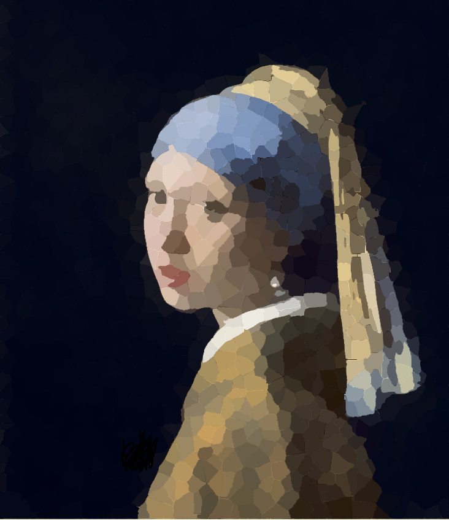

# Kép szegmentálása szuperpixelekre

## Bevezetés

A képünket sokféle módon szegmentálhatjuk, ezen módszerek közül az egyik a szuperpixelekre való felbontás.
A szuperpixel algoritmusok alapvető célja, hogy a pixeleket attól függően mennyire hasonlítanak egymásra összevonja, ezáltal
a képet atomi régiókra bontja, amikre lecserélhetjük a merev pixel struktúrát. Segítségével a képhez alkalmazkodó területekre
bontjuk a képet. Ezáltal csökkentjük
a képeken a redundanciát, egyszerűbb alakra hozzuk a képet aminek köszönhetően további információkat
nyerhetünk a képről. Ezenkívül az algoritmus más algoritmus alapjaként is szolgálhat.
Erre a célra több algoritmus is létezik az egyik ezek közül a SLIC algoritmus.

## SLIC algoritmus

Az algoritmus működésének alapja, hogy nem az egész képen keressük egy adott superpixelhez tartozó pixeleket, hanem
csak a létrejövő szuperpixel középpontjához képest egy megadott környezetben. Ahogy ezt a következő képen is láthatjuk, ahol az S
a létre jövő pixelek átlag szélessége.


Az algoritmus három fő fázisból áll:
* Inicializálás
* Hozzárendelés
* Frissítés

### Inicializálás

Ebben a szakaszban elhelyezzük egymástól közel egyforma távolságra a majdani szuperpixelek középpontjait, amihez később
rendelhetjük a pixeleinket. Az elhelyezésnél nem teljesen egyforma a távolság a közép pontok között, mivel szeretnénk
elkerülni, hogy a középpontok pont egy éles határra kerüljenek. Ezért a középpontok elhelyezésekor egy 3x3 mas négyzetben
megkeressük a legkisebb gradiensű pontot és oda helyezzük el a pixel középpontját.

### Hozzárendelés

Ebben a szakaszban a már kiválasztott pixel középpontokon végighaladva rendeljük hozzájuk a pixeleket. Mint ahogy már
írtam nem vizsgáljuk az egész képet, hanem csak a környező pixeleket vesszük figyelembe. Akkor rendeljük hozzá az adott pixelt
a középpontunkhoz, ha a távolsága kisebb mint a már a pixelhez rendelt távolság. A távolság az alapján számítjuk ki, hogy
mennyire egyezik a pixel szine a középpont színéhez, illetve hogy ténylegesen milyen távolságra van a két pixel egymástól.
Ezeknek az arányát egy paraméterrel súlyozzuk, ez határozza meg, hogy a letrejött pixeleink mennyire lesznek szabadok, mennyire
követhetik a színeket.

### Frissítés

A frissítés szakasz feladata, hogy a hozzárendelés során kialakult pixelterületeken belül áthelyezze arra a pontra a pixel
közepét ahol a legkisebb az átlagtól való eltérés. Miután sikeresen átraktuk a középpontokat újra futtatjuk a hozzárendelés 
szakaszt. Amikor áthelyezzük középpontokat a két pont különbsége alapján számolt hibákat összeszámoljuk. Addig ismételjük adott
hozzárendelést illetve a frissités szakaszt amíg ez a hiba egy köszöbérték alá nem esik.

### Szabad pixelek középponthoz rendelése

Végezetül azokat a pixeleket amiket egyik közepponthoz sem rendeltük hozzá, a hozzá legközelebb lévő középponthoz rendeljük.
Ezzel biztosítva, hogy ne maradjon szabadon pixel.

### Algoritmus pszeudokódja

```
/* Initialization */
Initialize cluster centers by sampling
pixels at regular grid steps S.
Move cluster centers to the lowest gradient
position in a 3 x 3 neighborhood.
Set label -1 for each pixel i.
Set distance infinit for each pixel i.

repeat
  /* Assignment */
  for each cluster center Ck do
    for each pixel i in a 2*S x 2*S region around Ck do
      Compute the distance D between Ck and i.
      if D<d(i) then
        set d(i) = D
        set l(i) = k
      end if
    end for
  end for
  /* Update */
  Compute new cluster centers.
  Compute residual error E.
until E <= threshold
```

## Algoritmus eredménye





## További információ az algoritmusról

[SLIC Algoritmusről bővebben](http://www.kev-smith.com/papers/SMITH_TPAMI12.pdf)
