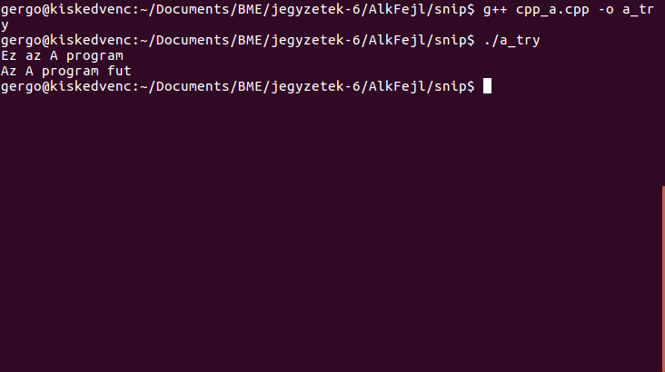
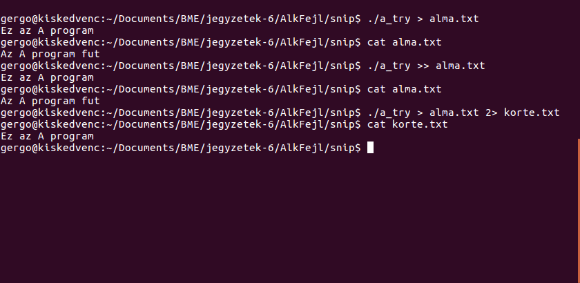
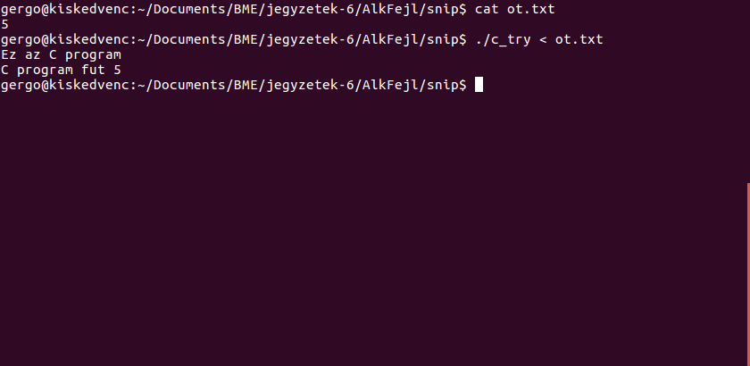
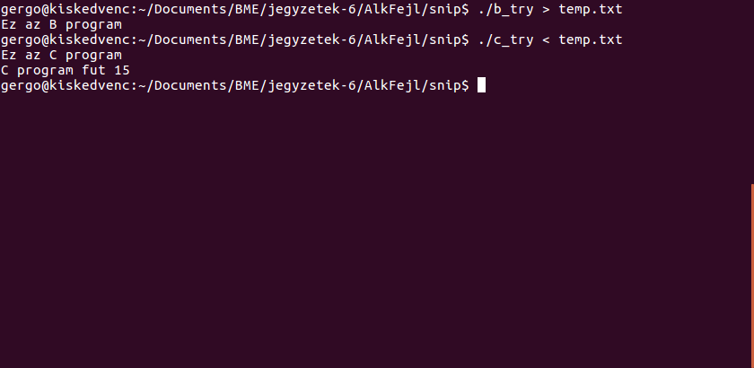
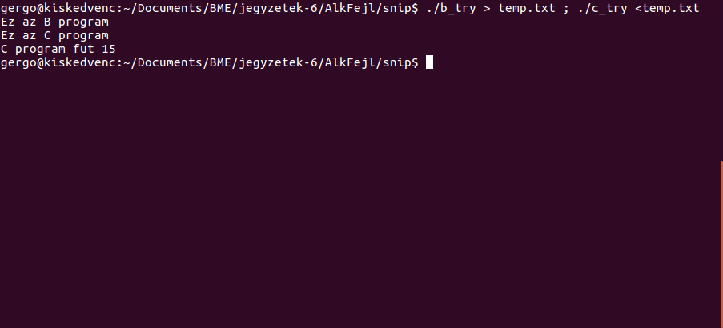
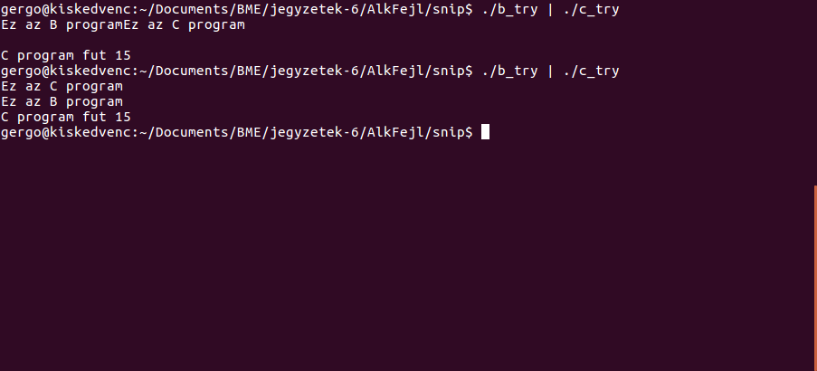
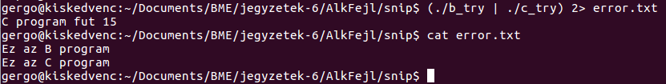

# Linux parancshívások

Ebben a snippetben egy-két példa c++ kód segítségével nézzük meg, hogy lehet parancsokat meghívni Linuxban.

### Példakód

Az alábbi példakódot fogjuk használni:

```cpp
include <iostream>

using namespace std;

int main()
{
        cerr << "Ez az A program"<<endl;
        cout << "Az A program fut"<<endl;
        return 0;
}
```

C++ fájlokat lehet fordítani például a g++ fordítóval:

``g++ cpp_a.cpp -o a_try``

Ha abból a könyvtárból akarunk egy fájlt futtatni, amiben állunk ``./`` használatával tehetjük meg: ``./a_try``. Ekkor a kimenet:



Amint láthatjuk, alapból mint az error mind a standard output kimenete a konzolra megy.

## Bemenet/kimenet átirányítás

Minden folyamat rendelkezik az alábbi be/kimenetekkel:

 - 0 – standard input
 - 1 – standard output
 - 2 – error output
 
### A kimenet átirányítása

 - ``parancs > fájl`` a kimeneti fájlt felülírjuk
 - ``parancs >> fájl`` a kimenet hozzáfűzzük a fájlhoz
 - ``parancs 2> fájl`` hibakimenet fájlba
 - ``parancs &> fájl`` kombinált

Nézzünk erre példát! Amint az utolsó esetben látjuk, lehet kombinálni is a fentieket.



### Bemenet átirányítása
 - ``parancs < fájl``
 
Létrehozunk egy új példakódot:

```cpp
#include <iostream>

using namespace std;

int main()
{
        cerr << "Ez az C program"<<endl;
        int i;
        cin >> i;
        cout << "C program fut "<<i<<endl;
        return 0;
}
```

Teszteljük a bemenet fáljból való olvasását!



## Parancsok egymás után

Jogosan felmerülhet a kérdés, hogy mi van akkor, ha én a B programmal írni szeretnék egy fájlba, majd a C programmal olvasni szeretném ezt.

A B program egyszerű kódja:

```cpp
#include <iostream>

using namespace std;

int main()
{
	cerr << "Ez az B program"<<endl;
	int b = 15;
	cout << b <<endl;
	return 0;
}
```
B > temp, majd C < temp:



### Parancssorozatok (;)

Nem lehetne ezt egyszerűbben, egy sorban? A válasz természetesen: igen. Ha két utasítást szeretnénk egymás után meghívni, a ``;`` használatával tehetjük meg: ``parancs1 ; parancs2``



### Csővezeték (|)

Nem lehetne még egyszerűbben? A köztes fájl kihagyásával a b program kimenetét a c program bemenetére irányítani? Természetesen megtehetjük. Erre (is) szolgál a csővezeték: ``parancs1 | parancs2``:



Nézzük csak meg egy kicsit jobban ezt a kimenetet! Kétszer futtatuk a parancsot, és az error kimentre mindkétszer más érkezett.

Az egyik esetben a B program írt előbb az error kimenetre, a másik esetben a C. Vagy mégsem? A két ``endl`` egymás után lett kiírva az első esetben.

A csővezeték párhuzamosan futtatja a két programot. Amíg teheti, fut egymás mellett a kettő, amikor pedig az egyik bemenetet vár, kénytelen addig várakozni, amíg a másik megadja azt neki.

### Parancscsoportosítás

A B és a C program error kimenetét is az ``error.txt``-be szeretném tenni. Mit tegyek? Csoportosíthatjuk a parancsokat a ``()`` segítségével, és együttesen megadhatjuk nekik az error kimenetre a már megismert utasítást.



