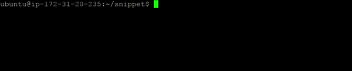
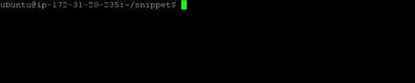
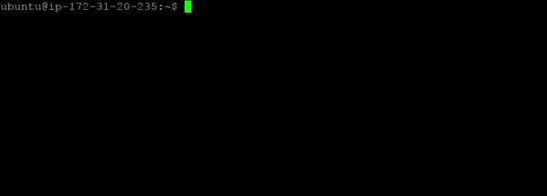
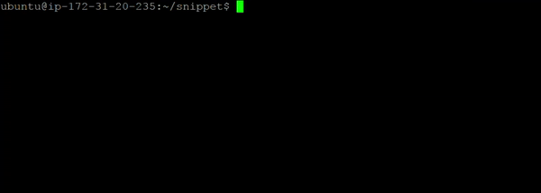
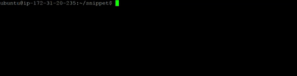

# Terminal shortcuts avagy tippek, trükkök, praktikák a linux parancssor hatékony használatára 

A következőkben olyan billentyűkombinációkat, parancsokat illetve rövidítéseket mutatok be GIF-ek formájában, amelyek remélhetőleg megkönnyítik az életed és hatékonyabbá teszik a munkafolyamatokat.

### Az előző parancsban létrehozott mappába lépés, majd onnan visszalépés

A - jelölés több helyen is működik, például ```git checkout - ``` esetén az előző branchre állunk vissza.

```cd !$```

```cd -```


### Gyors választás az aktuális mappában levő elemek közül

<kbd>tab</kbd> + <kbd>tab</kbd>, <kbd>tab</kbd>


### A parancs elejére ugrás

<kbd>ctrl</kbd> + <kbd>a</kbd> vagy <kbd>HOME</kbd>



### Visszafelé ugrás az előző elválasztó karakterig

<kbd>alt</kbd> + <kbd>b</kbd> (backwards)



### Törlés az előző szóközig

<kbd>ctrl</kbd> + <kbd>w</kbd>


### A korábbi parancsok közötti váltás

Az előzőleg lefuttatott parancsokat könnyen el lehet érni a <kbd>&uarr;</kbd> illetve a <kbd>&darr;</kbd> gombok segítségével.


### A legutóbb használt 10 parancs
```history 10```



### Reverse search: Az előző parancsok között keresés

<kbd>ctrl</kbd> + <kbd>r</kbd> (többször egymás után lenyomva az illeszkedő parancsok között vált)


### Az előzőleg futtatott parancs hivatkozása

Ugye még senki nem találkozott ezzel? :)

```sudo !!```


### Az előzőleg futtatott parancs kijavítása

A ^ karakterek közötti első találatot kicseréljük a parancsban a második ^ karakter utáni parancsra.

```^nanp^nano```


### Milyen paraméterekkel használtuk legutóbb az adott parancsot?

```!diff:p```


### Exit code-ok

Egy script sikeres futás esetén szabvány szerint 0-val tér vissza. Hiba esetén pedig egy ettől különböző 8 bites számmal. Bizonyos számoknak különleges jelentésük van: [Exit Codes With Special Meanings](http://tldp.org/LDP/abs/html/exitcodes.html)

```echo $?```


Sajnos van aki a szabványt nem tartja be és sikeres futás esetén nem 0-val tér vissza... Pl. a diff parancs 0-val tér vissza, ha nincs különbség két fájl/mappa között, illetve 1-gyel, hogyha van különbség. Érdemes mindig utánajárni annak, hogy egyes exit code-ok pontosan mit jelentenek.


### A parancs végének törlése

<kbd>alt</kbd> + <kbd>b</kbd>, <kbd>ctrl</kbd> + <kbd>k<kbd>  


### A parancs elejének törlése

<kbd>alt</kbd> + <kbd>b</kbd>, <kbd>ctrl</kbd> + <kbd>u<kbd>  


### NAGYBETŰSÍTÉS a következő elválasztó karakterig

<kbd>alt</kbd> + <kbd>u</kbd> (upper)


### kisbetűsítés a következő elválasztó karakterig

<kbd>alt</kbd> + <kbd>l</kbd> (lower)




### Egy hosszú parancs "elmentése" későbbre

A parancssorba is írhatunk kommenteket. Ennek hasznos felhasználási módja olyan parancsok elmentése, amelyeket csak később szeretnénk lefuttatni, viszont elég bonyolultak ahhoz, hogy ne akarjuk újra begépelni őket, ha már egyszer meg vannak. Ilyenkor elég csak egy #-et tennünk a parancs elejére és az nem fog lefutni, viszont a historyba bekerül.

```# hosszu_parancs```



