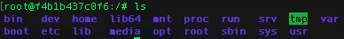
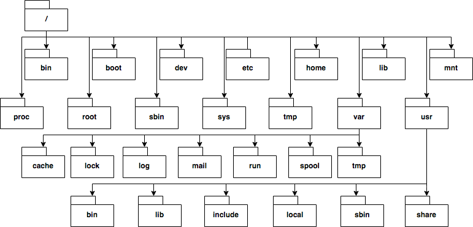

# Linux fájlrendszer

A linux disztribúciók nagyon hasonló fájlrendszerrel rendelkeznek. A főbb könyvtárak megismerésével átfogó képet kaphatunk a linux rendszerek fájlmenedzsmentjéről.

## Egy könyvtárstruktúra

A fenti képen egy fát láthatunk. Ez a felépítés konkrétan az Ubuntu disztribúció könyvtárstruktúrája, más linux OS-ek eltérhetnek tőle, sőt a felépítés kedv szerint megváltoztatható, a könyvtárelnevezések is csak konvenciók.

A gyakorlatban viszont nincs akkora eltérés a fájlrendszerek között. 

## File Hierarchy Standard (FHS)

A Linux Foundation által kiállított szabvány a Unix alapú operációs rendszerek könyvtárstruktúrájáról. A hivatalos leírást [itt](http://refspecs.linuxfoundation.org/fhs.shtml) találhatjuk.

A standard által felvázolt struktúrát nevezzük konvencionálisnak és az itt szereplő könyvtárak a főbb könyvtárak, amiket érdemes megismerni, ha átfogó képet szeretnénk kapni a linux rendszerek fájlrendszeréről. A továbbiakban ezeket a könyvtárakat részletezzük egy-két mondatban.

## A főbb könyvtárak

Könyvtár | Leírás
-------- | ------
/ | A fájlrendszer legfelső eleme, a gyökér könyvtár.
/bin | A rendszer, adminisztrátor és felhasználó által használt közös alapprogramok könyvtára.
/boot | Rendszer indításához szükséges fájlok és a kernel (vmlinuz) könyvtára.
/dev | Hivatkozást tárol az összes perifériára speciális tulajdonságokkal rendelkező fájlok formájában.
/etc | A rendszer legfontosabb konfigurációs fájljainak könyvtára.
/home | A rendes felhasználók könyvtára. Általában a shell az itt lévő könyvtárunkba lép be induláskor.
/lib | Rendszer és felhasználói programok által használt könyvtárak könyvtára. 
/mnt |  Standard mount könyvtár a külső fájlrendszereknek, pl. USB stick, digitális kamera.
/proc | Egy virtuális könyvtár, ami információt tárol a rendszer erőforrásairól.
/root | Adminisztrátor (root) könyvtára. Nem összekeverendő az angol terminológiában használt system root directoryval, ami a gyökér könyvtár.
/sbin | A rendszer és adminisztrátor által használt programok könyvtára.
/sys | Egy interfészt nyújt fájlrendszer formájában a kernel konfigurációkról és csatlakoztatott eszközökről. Ez egy linux-specifikus könyvtár, aminek a felépítéséről az FHS nem rendelkezik.
/tmp | A rendszer által használt ideiglenes fájlok könyvtára. A könyvtár minden rendszerindításkor kitörlődik.
/usr | Minden felhasználó specifikus programok, könyvtárak, dokumentációk stb. könyvtára.
/usr/bin | Hasonló a /bin könyvtárhoz, de az itt található programok már nem alapprogramok.
/usr/include | Standard include fájlok (pl. stdio.h) könyvtára.
/usr/lib | /usr/bin és /usr/sbin könyvtárakban található programok által használt könyvtárak könyvtára.
/usr/local | Hasonló a /usr könyvtárhoz, de az itt található programok garantáltan érintetlenek maradnak rendszerfrissítés után is.
/usr/sbin | Hasonló az /sbin könyvtárhoz, de az itt található programok már nem alapprogramok.
/usr/share | Architektúra független megosztott adatok könyvtára.
/var | Olyan fájlok könyvtára, amelyeknek a tartalma folyamatosan változhat a rendszer futása során.
/var/cache | Alkalmazások cachelt adatainak könyvtára. Ennek a könyvtárnak a tartalma adatvesztés veszélye nélkül kitörölhető.
/var/lock | Lock fájlok könyvtára. Ezek a fájlok tartják számon az aktuálisan lefoglalt erőforrásokat.
/var/log | Mindenféle log fájl könyvtára.
/var/mail | Mailbox fájlok könyvtára. Egyes disztribúciók az elavult /var/spool/mail könyvtárban tárolhatják ezeket a fájlokat.
/var/run | Rendszerindítás óta nyílvántartott információk a rendszerről.
/var/spool | Spool fájlok könyvtára. Itt tárolódnak azok a taszkok, amik jövőbeni elvégzésre várnak, mint pl. egy csatlakoztatott nyomtató számára fentartott nyomtatás parancsok listája.
/var/tmp | Olyan fájlok könyvtára, amikre egyes programoknak szüksége van a rendszer újraindítása után is.