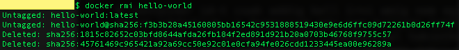

# Docker bevezető

Ez a snippet a konténer alapú virtualizáció de facto standardjáról, a Dockerről szól. Előnyei közt említhetjük a dinamikus erőforrás menedzsmentjét, a jó teljesítményét és a nagy sűríthetőségét.

## Felépítés

A Docker platform képes becsomagolni az alkalmazásunkat egy gyengén izolált környezetbe, amit konténernek hívunk. Ezt a konténert könnyen el tudjuk szállítani a velünk dolgozó mérnököknek, vagy akár éles környezetbe is felküldhetjük annak a veszélye nélkül, hogy az alkalmazás környezete megváltozik és ezáltal nem funkcionál rendesen. 

Az alapelemek Dockerben az image-ek és a konténerek. Az image-ek olyanok, mint egy objektum orientált nyelvben az osztályok. Leírják, hogy milyen egy konténer, tehát egy image példánya a konténer. De akár el tudnánk képzelni úgy is az image-eket, mint receptek, amik alapján a Docker képes konténereket létrehozni. Dockerfile-ba írjuk le az image felépítését, amiből az image-ek létrehozhatók. Az analógiát követve a Dockerfile leírás arról, hogy pontosan hogy kell megírni egy konkrét receptet. A snippet folytatásában, példákon keresztül jobban megérthetjük majd ezt.

Ahhoz, hogy a Docker működjön, szükségünk van egy hoszt gépre, amin egy docker daemon nevű program fut. Ennek a processznek köszönhetően futtathatóak a konténerek. Ezt a hoszt gépet tudjuk irányítani parancssoros klienssel, akár a hoszt gép termináljáról is és ezáltal fogjuk tudni kezelni a konténereket és az image-eket.

## Alap Konténer

Nézzünk egy konkrét példát! A mostani esetben a saját gépünk lesz a hoszt gép és a kliens. Amiután letöltöttük a dockert és már fut a daemon processz a gépünkön, nyissunk egy parancssort és futtassunk hozzunk létre egy konténert!

Ha ``docker -v`` parancsot érti a parancssorunk, akkor rendben vagyunk.

``$ docker run hello-world``

Kész vagyunk! A parancs során végbement lépéseket a konzolunkon olvashatjuk:
1. A docker daemon megkapta a parancsot, hogy indítson el egy hello-world image-et.
2. Lokálisan nem talált ilyen image-et, ezért letöltötte [Docker Hubról](https://hub.docker.com/) az [ott lévőt](https://hub.docker.com/_/hello-world/)
3. Az image-ből létrehozott egy konténert, aminek a kezdeti parancsa az, hogy kiírja a fent látottakat.
4. A docker daemon elküldte a kimenetet a mi kliensünkre.

A [Docker Hub](https://hub.docker.com/) a docker image-ek hivatalos tárhelye, ahonnan, mint fentebb láthattuk, elég egyszerűen letölthető és használhatók image-ek.

Az image egy read-only sablon, ami leírást tartalmaz arról, hogy hogyan kell létrehozni egy specifikus konténert. A ``docker run`` parancs egy read-write réteget rak az image-re, így életre keltve a konténert.

A saját parancssorunkban a ``docker ps`` paranccsal megnézhetjük a jelenleg futó konténereinket. Egy üres táblázatot kéne lássunk, mert a hello-world konténer már nem fut. Ekkor jön segítségünkre a ``docker ps -a`` parancs, ami a nem futó konténereket is listázza:

Amint láthatjuk a konténerünk nem törlődött ki, csak kilépett. A konténerünket az egyedi azonosítójával (CONTAINER ID) vagy a nevével (NAME) tudjuk egyértelműen azonosítani. Ha nem szeretnénk, hogy a docker találjon ki egy nevet a konténerünknek, akkor adjunk meg egy ``--name`` argumentumot a docker run parancsnak. 

Ha a konténerünket el szeretnénk újra indítani, akkor azt a ``docker start -a <CONTAINER ID | NAME>`` paranccsal megtehetjük. A -a opció mondja meg, hogy kössük hozzá a kimenetet a terminálunk kimenetével. Ha ezt nem rakjuk hozzá, nem fogjuk látni a konténer kimenetét.

A container id-t csak addig kell írni amíg nem egyértelmű, hogy melyik konténerről van szó!
Amint láthatjuk, a daemonnak már nem kellett letöltenie a hubról az image-et.

A lokálisan tárolt image-eket a ``docker images`` paranccsal tekinthetjük meg. Ha több konténert szeretnénk az image-ből, akkor csak ismételjük meg a ``docker run`` parancsunkat.

Letölthető parancssoros kiegészítés kliensre, amely során életre kel a jól szeretett tab funkció.

Töröljük ki a konténert és töröljük ki a letöltött hello-world image-et is!

``$ docker rm <CONTAINER ID | NAME>``

``$ docker rmi hello-world``

## Bölcs Bálna Konténerben

A fenti példában láthattuk, hogy indíthatunk el egy már meglévő image-et. Most viszont alkossunk mi magunk egyet! Hozzunk létre egy Dockerfile nevű fájlt, a következő tartalommal:

FROM docker/whalesay:latest  
RUN apt-get -y update && apt-get install -y fortunes  
CMD /usr/games/fortune -a | cowsay  

Minden image egy alap image-ből indul ki, a mi esetünkben ez most a Docker által fejlesztett [whalesay](https://hub.docker.com/r/docker/whalesay/) lesz. Ezek után egyszerű lépésekkel definiálva tovább építhetjük az image-ünket. 
Mivel az alap image valójában egy debian alapú linux disztribúció, apt-getelhetünk és letölthetjük a [fortunes](https://en.wikipedia.org/wiki/Fortune_(Unix)) nevű programot. Vegyük észre, hogy a RUN kulcsszó után írt utasítások shellbe írt parancsok. Ha lenne egyéb utasításunk, azt egy újabb RUN kulcsszóval kezdődő sorba írnánk.
Végső parancsként (CMD) meg átadjuk a fortunes kimenetét a cowsay programnak. Lássuk az eredményét!

``$ docker build -t docker-whale .``  
(A docker-whale a létrehozandó image neve, amit a -t argumentummal adunk meg, a pont a parancs végén a Dockerfile relatív útvonala)

Vegyük észre hogy a Dockerfile-ban leírt sorok lépésenként (step) elvégződnek.

Amiután az image elkészült:

``$ docker run --name bolcs-balna docker-whale``

A bálna egy random szöveget fog mondani minden hívás után hála a fortunes | cowsay kombinációnak. Ha nem szeretnénk, hogy egy csomó konténerünk legyen, de még kíváncsiak vagyunk bálnabölcsességekre, akkor a meglévőt indítsuk újra: 

``$ docker start -a bolcs-balna``

## Ubuntu

Zárásul indítsunk el egy ubuntu konténert és lépjünk be a shelljébe:

``$ docker run -it ubuntu``  
(A -i opcióval interaktív módban indítjuk a konténert)

További funkcionalitás felfedezéséhez az alábbi parancsok a barátaink:   
``$ docker --help``   
``$ docker <command> --help``    