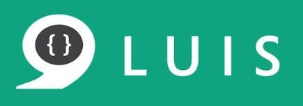
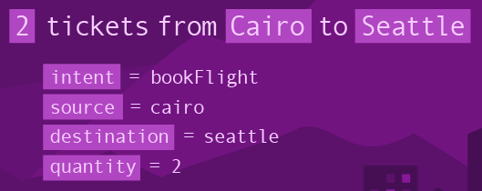
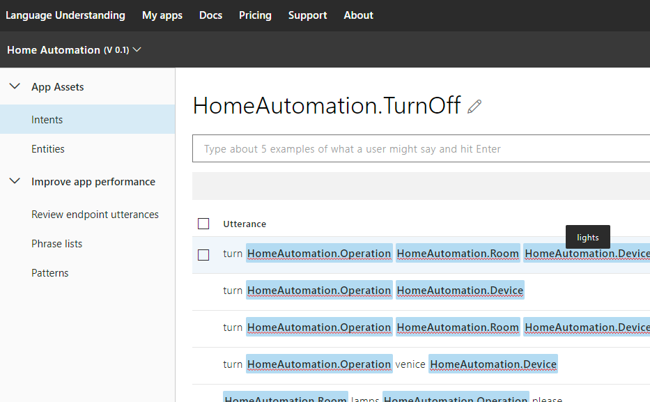
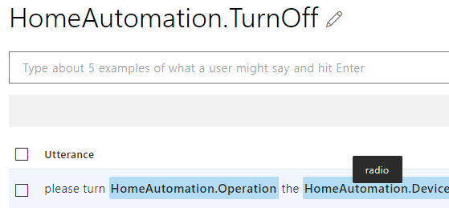
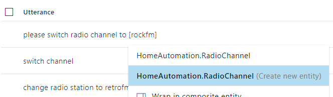
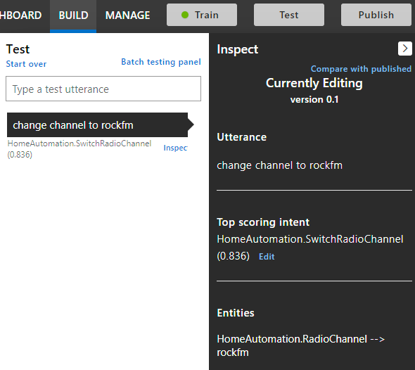

# Introduction to LUIS

## What is LUIS?
  
In this Snippet we’re going to learn about LUIS, Microsoft’s cloud-based Machine Learning service for language understanding. By the end of this tutorial, you’ll have learned about how LUIS works and how you can build and use your own LUIS app. A basic understanding of ML practices is assumed, but not necessary.



LUIS stands for *Language Understanding Intelligent Service*. As you may guess, it provides services to process natural language (NLP) - or more precisely – to understand the language (NLU).
  
## What is it used for?
  
LUIS has the main goal of recognizing the user’s intention by analyzing text or speech. Instead of strict voice commands, you can talk naturally. It is able to provide only the relevant information, which helps making user interactions a lot easier to develop.



On top of this, there’s an optional feature of LUIS called *Sentiment Analysis*. Basically, it can tell whether a sentence has a positive or negative attitude. This can be especially useful at your product’s customer reviews, as you can automatically tell whether he was satisfied or not.


## How does it work?

LUIS works by following well-known Machine Learning patterns, such as *Supervised Learning*. This means that in order to use LUIS, we must first train it by providing different examples.

Here’s an example: let’s say we want to teach LUIS to recognize the user’s *Intent* to read the news. How might he express this with natural language? A few example *Utterances* to start out with:

`„What’s on the news?”`, `„Please read the news for me”`, `„Open the News app”`

Ideally you should provide several different examples (15+) with varying properties to get better results. The better the training process goes, the more certain the predictions will be.

After the training process, the service is ready to be tested on further utterances. The true magic here is that these don’t need to have the exact structure as the examples you provided – LUIS will be able to recognize similar requests just as easily.

And there’s more to it: a useful feature called *Active Learning* helps LUIS further improve even after the initial training process. With each user interaction, the AI evaluates the prediction’s certainty and lets us later confirm it in order to consolidate the knowledge.

As LUIS is a webservice, it is easy to integrate into any existing software – be it a website, a desktop app, or a cloud bot service. Each LUIS app has its own HTTP endpoint url with associated API keys. It expects and provides data in JSON format.


## Setting up a new LUIS app

In the following sections you’ll learn how to create a new LUIS app and make API calls to it. Let’s imagine you own a home automation system, but it lacks any kind of speech-enabled control option. We’d like to use LUIS to implement the functionality.

Head over to [luis.ai](https://www.luis.ai/) and use your Microsoft account to log in. Don’t worry about pricing for now, as development and testing is free. (You’ll need an Azure subscription for use in production.)

Click on ‘**+ Create a new app**’ and name it e.g. Home Automation.

LUIS understands quite a few languages (but Hungarian is missing). Let’s pick English for the Culture setting. Done, and a new empty project is created.

Now we may start adding training data from scratch, which might take some time considering the complexity of the home automation system. Luckily, LUIS has so called *Prebuilt Domains* (bottom left corner) which really are just template projects to start out from. This is a great way to learn LUIS, as it gives a solid basis on how to provide further training examples. Find the HomeAutomation domain and add it to the project.

Let’s inspect what’s been added: on the Intents tab, select the TurnOff Intent to see it’s labeled Utterances. You can hover over the blue *Entities* to see the underlying example.




## Build & Test

Let’s suppose we want to control the radio through the home system with voice (turn on/off, switch channel). These are not included in the template, so we add them ourselves.

We may train LUIS before adding new training items. This is a good way to test whether it understands the existing Intent structures: it is expected that the word Radio is automatically recognized as a home automation device.



Similarly, type new example Utterances that relate to radio control, for both TurnOn and TurnOff Intents.

Lastly, we’d like to switch radio channels. This requires a **new Intent**, let’s call it *HomeAutomation.SwitchRadioChannel*. A few examples: (but remember, the more the better!)

`“Change radio station to RetroFM”`, `“Switch channel”`, `“Please switch radio channel to RockFM”`

As this is an untrained Intent, LUIS cannot figure out the meaning behind these just yet. Click on the RockFM word and **Create a new Entity** with with the name *HomeAutomation.RadioChannel* (Simple type). Add this to other examples where a station is present.



And we’re done, ready for testing! Almost – don’t forget to Train the AI before clicking on Test. Try to test on an Utterance that’s similar to but not exactly like the examples.



Clearly LUIS was able to understand the intent, but with only an 83.6% certainty. This will improve by further interactions.


## Usage

Our LUIS app is ready to be published, that is, opening an HTTP endpoint with the currently trained AI. Click on ‘**Publish’** (with Production environment). Go to the Manage tab and select the Keys and Endpoints menu to see the app URL.

Here’s an example C# code of how you can reach LUIS in .NET: (don't forget to replace url and key)

```csharp
using Newtonsoft.Json;
using System.Net.Http;
using System.Threading.Tasks;

public async Task<LuisResult> GetIntent(string query)
{
	HttpClient client = new HttpClient();
	client.DefaultRequestHeaders.Add("Ocp-Apim-Subscription-Key", "<YOUR-SUBSCRIPTION-KEY>");
	var response = await client.GetAsync("YOUR-ENDPOINT-URL" + query);
	var responseString = await response.Content.ReadAsStringAsync();
	var obj = JsonConvert.DeserializeObject<LuisResult>(responseString);
	return obj;
}

```

And the POCOs:
```csharp
public class LuisResult
{
	public  string Query { get; set; }
	public Topscoringintent TopScoringIntent { get; set; }
	public Entity[] Entities { get; set; }
}
public  class Topscoringintent
{
	public  string Intent { get; set; }
	public  float Score { get; set; }
}
public class Entity
{
	[JsonProperty(PropertyName = "entity")]
	public  string EntityName { get; set; }
	public  string Type { get; set; }
	public  int StartIndex { get; set; }
	public  int EndIndex { get; set; }
	public Resolution Resolution { get; set; }
	public  float Score { get; set; }
}
public class Resolution
{
	public string[] Values { get; set; }
}
```


## Learn More

And this concludes the introduction to LUIS. We only touched the basics, see the links below to learn more:

- [LUIS Docs](https://docs.microsoft.com/en-us/azure/cognitive-services/luis/)
- Microsoft’s [AI course](https://www.edx.org/course/introduction-to-artificial-intelligence-ai-2), including LUIS
- LUIS is part of the [MS Cognitive Services](https://azure.microsoft.com/en-us/services/cognitive-services/)

I hope this was a useful introduction to LUIS. Please let me know if you find a mistake, typo or something unclear. Cheers!
