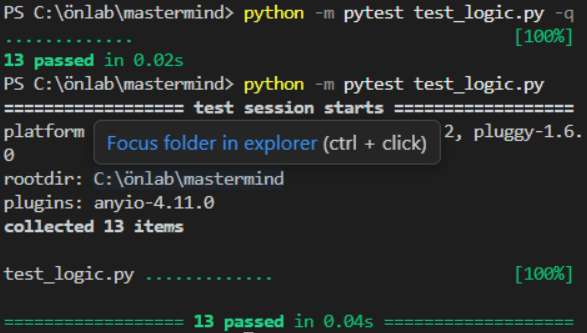
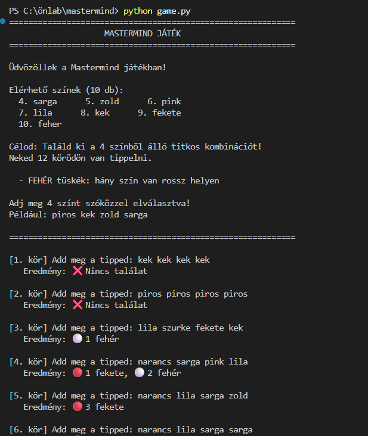

# Mastermind Esettanulmány

## Bevezetés
Ebben a projektben egy klasszikus Mastermind játék motorját készítettem el. A célom az volt, hogy megtanuljam a **Test First** módszertan folyamatát AI (GitHub Copilot és LLM modellek) támogatással, megvizsgálva, hogyan alakítja át az AI a tesztvezérelt megközelítést.

## Fejlesztési módszertan
A fejlesztés során nem a produkciós kódot írtam meg először, hanem a teljes tesztkészletet határoztam meg a `pytest` keretrendszerben. Ez a gyakorlatban tökéletes specifikációként szolgált az AI számára.

### Tesztek típusai:
* **Hibaágak:** Érvénytelen színek és rossz tipp-hossz kezelése.
* **Logikai ágak:** Fekete és fehér tüskék számolása, különös tekintettel a duplikált színekre.

## Algoritmus leírása
A `tipp_kiszamolasa` függvény két lépésben dolgozik:
1. Megkeresi a pontos egyezéseket (fekete tüskék).
2. A maradék színekből kiszámolja a benne lévő, de rossz helyen lévő színeket (fehér tüskék).

## Érdekes Promptok

A fejlesztés során az AI-t két lépcsőben irányítottam. Először megadtam neki a teljes tesztkészletet, hogy az alapján generálja le a logikát:

> "Szia! Kérlek, írd meg a `logic.py` tartalmát a `test_logic.py`-ban található tesztjeim alapján. A feladat a `tipp_kiszamolasa(felallas, tipp, szinek)` függvény megírása. Fontos, hogy a kód minden tesztesetnek megfeleljen."

Később, amikor az AI túl bonyolult algoritmust (felesleges feltételeket) próbált bevezetni, szükség volt egy pontosító, visszaterelő utasításra:

> "Térjünk vissza az alapokhoz: először egy ciklussal számoljuk össze az összes pontos egyezést, majd a maradékból határozzuk meg a rossz helyen lévő színeket. Ne bonyolítsd túl a logikát!"

## Eredmények
A tesztek lefuttatása után az alábbi eredményt kaptam:

Aztán kértem egy konzolon tesztelhető felületet is az AI-tól:

## Tanulságok: AI asszisztált Test First vs. TDD

A projekt legfőbb tanulsága a klasszikus **TDD (Test-Driven Development)** és az AI-jal támogatott **Test First** megközelítés közötti markáns különbség megtapasztalása volt. 

A klasszikus TDD kis lépésekben halad (Red-Green-Refactor): írunk egyetlen bukó tesztet, megírjuk hozzá a minimális kódót, ami átviszi, majd refaktorálunk és jöhet a következő teszt. Ezzel szemben az AI asszisztens bevonásakor sokkal hatékonyabbnak bizonyult a teljes tesztkészlet előzetes megírása. Az AI számára ez a tesztkészlet egy rendkívül egzakt specifikációként szolgált, amiből egyetlen nagy lépésben ("megkértem rá, megoldotta, kész") képes volt legenerálni a működő üzleti logikát.

Bár így a fejlesztés sebessége drasztikusan megnőtt, a módszer rávilágított egy veszélyre is: elvész a hagyományos TDD által biztosított inkrementális kontroll. Ha az AI elsőre rossz, túlbonyolított irányba indul el (ahogy ez a promptoknál is látható volt), sokkal nehezebb egy nagy blokknyi komplex logikát utólag kibogozni és refaktorálni, mint lépésről lépésre haladni. Mérnökként a feladat így a szintaxis írásáról áttevődött a nagyon precíz teszt-specifikációk elkészítésére és az AI által generált kód kritikus validálására.