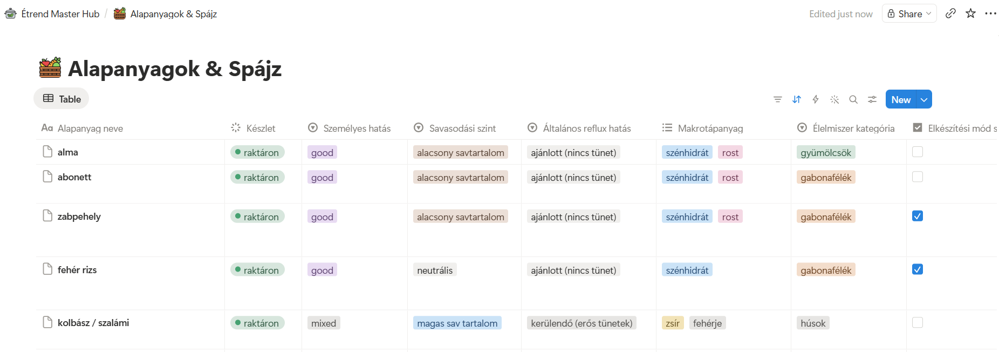
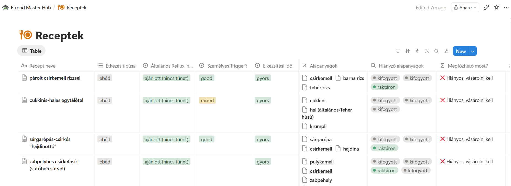
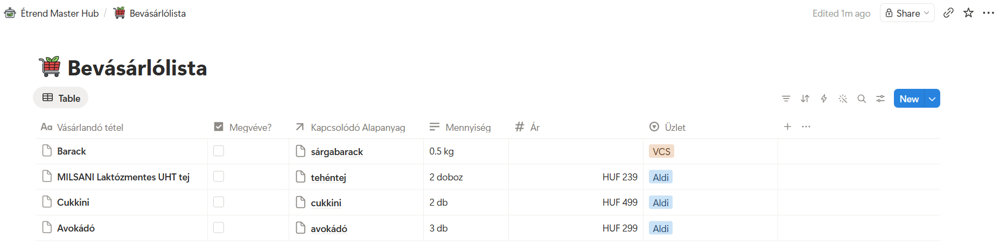
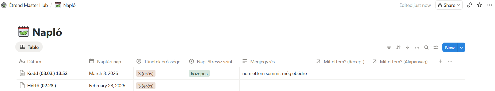
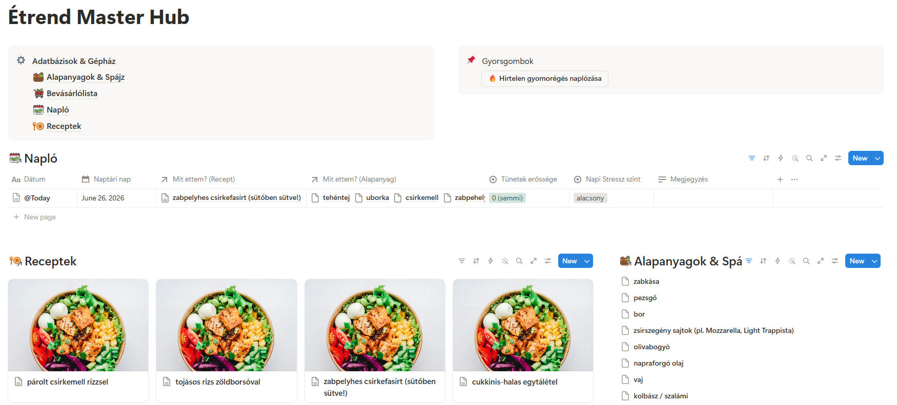
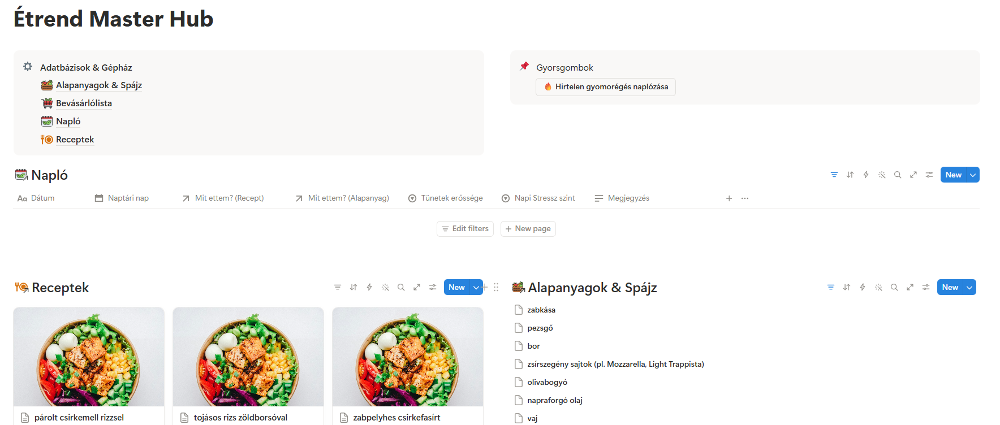
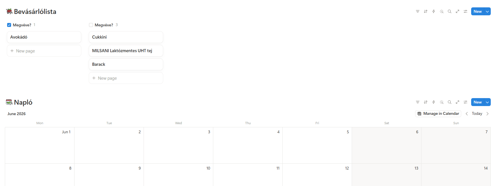

# Notion-alapú étrend-nyilvántartó hub felépítése
A Notion egy "all-in-one" workspace (munkaterület), amelyben adatbázisok, jegyzetek és feladatlisták egyetlen felületen kezelhetők. Alapfunkciói könnyen elsajátíthatók, és a platform kiterjedt sablonkönyvtárral rendelkezik, amelyet a felhasználói közösség tölt fel.
A komplexebb igényekhez azonban a Notion relációs adatbázis-logikát alkalmaz, azaz a Relation, Rollup és Formula tulajdonságok segítségével különböző adatbázisok kommunikálhatnak egymással. Ez az a pont, ahol az eszköz már nem magától értetődő, és ahol a mások által készített sablonok sem feltétlenül segítenek, hiszen érdemben módosítani csak azt lehet, aminek értjük a felépítését.
Ebbe a helyzetbe kerültem, amikor egy személyre szabott étrend- és tünetkövető rendszert, az Étrend Master Hubot szerettem volna felépíteni, amelyben nyomon tudom követni az egyes ételek hatását, a spájzom tartalmát, és az étkezési szokásaimat.
A feladat megoldásához egy statikus lista nem lett volna elegendő, mert az összefüggő adatokból automatikusan következő információk, mint például a spájz tartalma alapján szűrhető receptek listája, csak dinamikus, relációs adatmodellel valósíthatók meg.
Miután megterveztem a rendszer felépítését és kinézetét, a megvalósítás lépéseiben a Google Gemini segített interaktív oktatóként. 

## Tanulságok
1. A rendszertervezés nem delegálható teljes egészében az AI-nak: az igényeket pontosan meg kell tudni fogalmazni ahhoz, hogy az AI Notion-specifikus megoldást tudjon javasolni.
2. GUI-alapú eszközöknél az AI nem tud közvetlenül végrehajtani, de „türelmes oktató" szerepkörben hatékonyan bevonható.
3. Ha kikötjük, hogy az AI minden lépés után várjon visszajelzésre, az összetett, sok lépéses feladatok kezelhető adagokban hajthatók végre.
4. Az AI proaktív kiegészítő javaslatait érdemes megfontolni, de nem kell vakon elfogadni.
5. A Notion formulák case-sensitive módon kezelik a stringeket, így a státuszértékeket és a formulát egységesen kell megadni.
6. Ha az AI leírása és az applikáció felülete eltér, képernyőképpel pontosabb visszajelzés adható, mint szöveges leírással.


## Tervezett rendszer
Az Étrend Master Hub négy összekötött adatbázisból áll:
- **Alapanyagok & Spájz**: Alapanyagok nyilvántartása besorolással több kategória szerint (pl. makrotápanyag), és készletállapottal (raktáron / fogyóban / kifogyott). Itt az is látható, hogy melyik receptekhez szükséges egy alapanyag.
  {width=90%}

- **Receptek**: Az ételek adatbázisa, ahol automatikus formula alapján azonnal látható, hogy az adott étel a jelenlegi készletből megfőzhető-e. Itt külön megadható, hogy az adott ételnek milyen személyes hatása van, illetve az elkészítési időt és az étel típusát is be lehet állítani.
  {width=90%}

- **Bevásárlólista**: Az alapanyagokhoz kapcsolódó lista, árakkal és üzletinformációkkal. A vásárlandó tételhez megadható a bolt szerinti elnevezés, az ár, az üzlet, és az Alapanyagok adatbázisból hozzárendelhető a megfelelő alapanyag-bejegyzés.
  {width=90%}

- **Napló**: Étkezési és tünetnapló, amely visszacsatol a receptek és az alapanyagok adatbázisaira. A főoldalon egy gyorsgomb segítségével egyetlen kattintással hozható létre új bejegyzés.
  {width=90%}


A **főoldalon** (dashboard) szűrt Linked View-ok összesítik a legfontosabb adatokat egyetlen felületen: a mai naplóbejegyzést, az aktuálisan megfőzhető recepteket, bevásárlólistát és a spájz tartalmát. Az adatbázisok egy külön blokkban, a főoldal tetején is közvetlenül elérhetők, illetve egy gyorsgomb a gyors naplózáshoz.



<!---


--->

## A munkafolyamat tanulságos részletei

### (1. és 4. tanulsághoz) A rendszertervezés delegálása és az AI proaktivitása
A rendszer megépítéséhez az igényeket nekem kellett pontosan megfogalmaznom, hogy mit akarok mérni, mi legyen önálló adat és mi legyen belőle levezethető. Így a fejlesztést egy nagyon részletes specifikációval indítottam, amelyben a saját igényeimet fogalmaztam meg.  

Prompt (részlet):
```
Csinálj notionben nekem egy olyan oldalt, ahol az étrendemnek megfelelően tudok tárolni információkat az ételekről. Gyakorlatilag szeretném, ha ez egy master-hub jellegű dolog lenne, ahol több dolgot tudok összecsatolni (...). 
Szeretnék egy adatbázist, amelyben az alapanyagokat tudom tárolni, és azokról logolni, hogy mennyire savasak (...)
Ezt követően szeretnék recepeteket tárolni, amikhez alapanyagokat tudok hozzárendelni (...) Jó kiegészítés lenne, ha autómatikusan tudná kalkulálni, hogy a spájz (pantry) adatbázis alapján ez most megvalósítható (...).
Jó lenne ha valahogy számon tudnám tartani, hogy milyen alapanyagok állnak rendelkezésemre itthon (gyakorlatilag egy virtuális pantry). (...)
Ezen felül szeretném ha bevásárló listát is tudnék vezetni.(...) 
Jó lenne cross-referálni az egyes adatbázisok között, hogy ne kelljen duplán felvenni az egyes alapanyagokat.

```

Ebből az AI kiválóan ki tudott dolgozni egy teljes rendszertervet megvalósító, Notion-specifikus megoldást. Javasolta négy adatbázis struktúráját, a köztük lévő Relation-kapcsolatokat és azt, hogy hogyan kerülhető el a duplikáció. Továbbá a Gemini olyan funkciókat is javasolt, amikre én eredetileg nem is gondoltam (pl. a Napi Napló, gyorsgombok), ezek valóban javítottak a rendszeren. Az AI proaktív kiegészítő javaslatait érdemes megfontolni, de nem kell vakon elfogadni őket, mivel nem minden javaslat olyan, ami az adott esetben hasznos lenne.

MI  (részlet):
```
Készítettem neked egy átfogó rendszertervet (blueprintet). Ahhoz, hogy ne kelljen duplán felvinni az adatokat, a legjobb megoldás a Notionben, ha az "Alapanyagok", a "Spájz" és a "Bevásárlólista" szorosan egybefonódik...
A rendszer 4 fő adatbázisból áll, amelyek egymással relációban (Relation) állnak...
1. Napi Tünet- és Étkezésnapló (Daily Log DB) - ✨ Az én kiegészítő javaslatom. Hiába tudod, hogy egy étel milyen, ha nem látod a kontextust...
```


### (2. és 3. tanulsághoz) A "türelmes oktató" szerepkör és a feladatok darabolása (A Relation → Rollup → Formula láncolat)
A GUI alapú eszközöknél az AI nem tud közvetlenül végrehajtani lépéseket, illetve egyetlen promptból nem lehet egy komplett relációs hálózatot felépíteni. Az AI azonban interaktív oktatóként hatékonyan bevonható, ha a prompt erre a szerepkörre készíti fel. A "türelmes oktató" prompt kezelhetővé teszi az összetett, sok lépésen alapuló feladatokat. Ha kikötjük, hogy az AI minden lépés után várjon visszajelzésre, az instrukciók kezelhető adagokban érkeznek, sokkal kevesebb visszakereséssel és félreértéssel jár, mint egy egyszeri, hosszú instrukciólista.
A megfelelő instrukció megadásának érdekében megkértem a Geminit, hogy adja meg a megfelelő promptot a lépésenkénti oktatáshoz.

Prompt:
```
Hogy adjak megy egy promptot, hogy pontosan ez a rendszerterv valósuljon meg Notionben?
```

MI:
```
(...)
Készítettem neked egy dokumentumot a pontos prompttal, amit csak ki kell másolnod és beillesztened!
(...)

[Prompt:] Mivel kezdő vagyok, kérlek, NE add meg az egész megoldást és az összes lépést egyszerre, mert elveszek benne! A következő szabályok szerint haladjunk: (...) Pontosan, gombra/kattintásra pontosan írd le, mit kell csinálnom... Ha leírtál egy lépést, állj meg, és várj. Kérdezd meg, hogy sikerült-e.
(...)

Ha gondolod, ezt a promptot akár ide, nekem is beküldheted (kiegészítve a korábban megbeszélt tervekkel), és én magam foglak lépésről lépésre, kattintásról kattintásra végigvezetni a Notion adatbázisok létrehozásán, az oszlopok beállításán és az összekötéseken!
```

A feladatok darabolása a Relation → Rollup → Formula láncolat megépítésénél fizetődött ki igazán. Ahhoz, hogy a rendszer automatikusan kiírja, megfőzhető-e egy recept a spájz alapján, a Gemini külön lépésekben építtette fel velem az adatbázisok összekötését, a hiányzó elemek listázását, majd a kiértékelést, mindig megvárva a visszajelzésemet:

1. Relation: Összekötöttük a Receptek és az Alapanyagok adatbázist
2. Rollup: Behúztuk a Receptekhez a raktárkészlet állapotát az Alapanyagokból
3. Formula: Írtunk egy képletet, ami a Rollup eredményét kiértékeli. 

Ha az AI ezeket egyszerre adja át, a lépések között elvész a kontextus.

### (5. tanulsághoz) Case-sensitivity a Notion formuláknál
A legutolsó lépésnél, a Formula megírásakor egy tipikus programozói hibába futottunk bele. Az AI ezt a kódot generálta a spájz ellenőrzésére:

```
if(contains(prop("Hiányzó alapanyagok"), "Kifogyott"), "❌ Hiányos, vásárolni kell", "✅ Minden van itthon")
```
A kód azonban nem működött megfelelően, mert az adatbázisba a státuszokat én csupa kisbetűvel ("kifogyott") vittem fel. A Gemini rámutatott, hogy a Notion formulái kis- és nagybetű érzékenyek (case-sensitive). Ezt a buktatót a jövőben úgy lehet elkerülni, ha a stringek pontos formátumát (kis/nagybetű, szóközök) az AI-val előre egyeztetjük a kódgenerálás előtt.

Prompt:
```
az számít hogy kisbetűvel írtam azt, hogy kifogyott stb?
```

MI:
```
Igen, nagyon számít! A Notion képletei (formulái) kis- és nagybetű érzékenyek (case-sensitive). Ez azt jelenti, hogy a Kifogyott és a kifogyott a rendszer számára két teljesen különböző szó.
```


### (6. tanulsághoz) GUI eltérések kezelése képernyőképpel
Az AI nem minden esetben a jelenlegi applikáció verzió szerint dolgozik. A Notion frissítések miatt a Relation beállításánál (az adatbázisok összekötésekor) más opciók jelentek meg, mint amiket a Gemini leírt. A probléma feloldásához képernyőképpel pontosítottam a helyzetet, így egyértelműbb volt számára a különbség, mint amikor csak szövegesen próbáltam leírni azt.

Prompt:
```
ezek a beállítási lehetőségek vannak: [kép beküldése]
```

MI:

```
Szuper, hogy küldtél képet, ez nagyon sokat segít! A Notion folyamatosan frissíti a felületét, ezért egy picit máshogy hívják most ezt a beállítást... Kattints a Two-way relation (Kétirányú kapcsolat) melletti kis kapcsolóra...

```