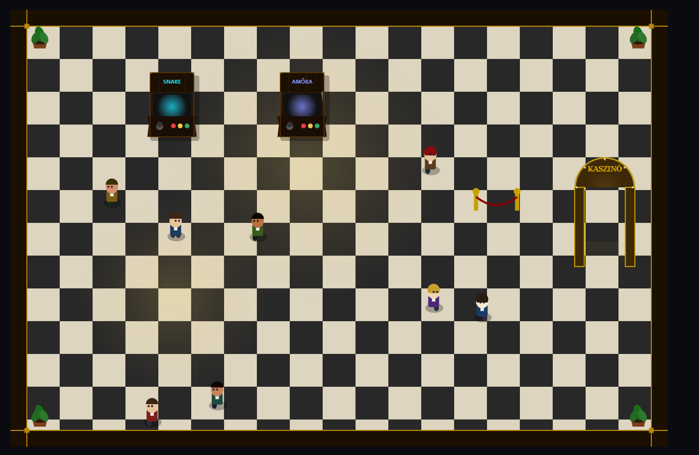
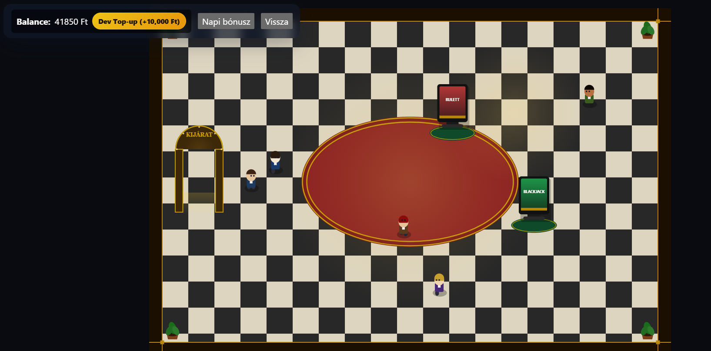
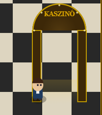
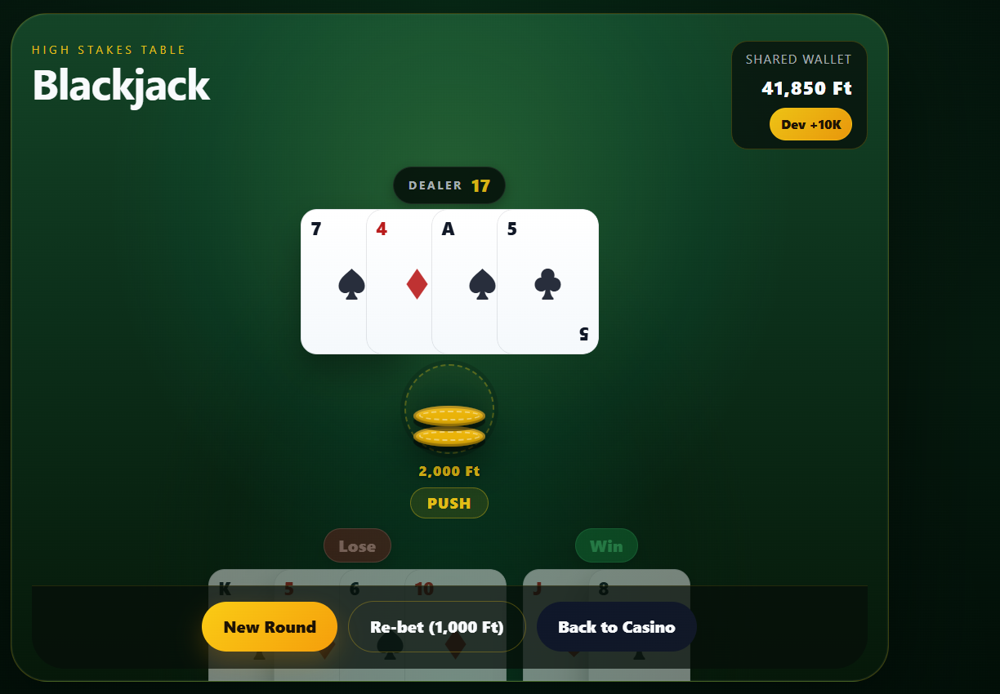
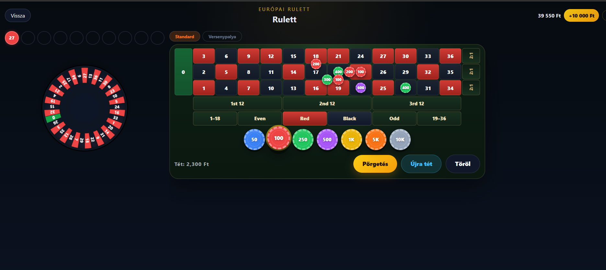

# Arcade Játékterem — Vibe Coding Önlaborban

> **Önálló laboratórium projekt** · TypeScript · React · Canvas 2D · GitHub Copilot · Claude Sonnet

---

## A projekt

Az **Arcade Játékterem** egy böngészőben futó mini-játékgyűjtemény, amelyet AI-asszisztált fejlesztéssel (vibe coding) készítettem. A projekt nagy részét **GitHub Copilot**tal kezdtem el, majd a komplexebb feature-öknél áttértem **Claude Sonnet**-re — a két eszköz összehasonlítása az önlabor egyik fő tanulsága lett. A projekt egy top-down 2D lobby szobából indul, ahonnan arkád gépeken keresztül indíthatók a játékok, valamint egy kaszinó szobába is be lehet lépni.

**Játékok:**
- **Snake** — portálos falakkal, különleges almákkal, kőakadályokkal
- **Amőba** — 3 nehézségi fokozatú AI-ellenféllel
- **Blackjack** — split, double down, természetes blackjack 3:2 kifizetéssel
- **Rulett** — európai keréken, versenypalya nézettel, racetrack fogadásokkal

**Technológia:** React 18, TypeScript, Vite, Canvas 2D API, localStorage wallet


*A lobby szoba sétáló NPC-kkel, márványpadlóval és portálkapuval*

---

## Mi az a vibe coding?

A *vibe coding* azt jelenti, hogy a fejlesztő **természetes nyelvű utasításokkal** dolgozik együtt egy AI-modellel (jelen esetben Claude Sonnet), és az AI generálja, módosítja, javítja a kódot. A fejlesztő szerepe megváltozik: nem kézzel ír minden sort, hanem:

1. **Elképzel** egy funkciót
2. **Leírja** mit szeretne (specifikáció, vagy akár csak pár mondat)
3. **Értékeli** az AI által javasolt megoldást
4. **Finomít** — kér módosítást, javítást, vagy maga is beavatkozik

A hatékonyság kulcsa: **mennyire pontosan tudod megfogalmazni, amit szeretnél.** Ez az önlabor ennek a kérdésnek a vizsgálata köré épül.

---

## Spec-vezérelt fejlesztés

### Miért fontos a spec?

Az AI-modell minden egyes kérésnél "hidegen indul" — nincs kontextusa arról, hogyan fog kinézni a kész funkció, milyen edge-case-ek fontosak, milyen architektúrával illeszkedjen a meglévő kódba. A **spec (specifikáció)** egy strukturált leírás (lásd még: [spec-kit](https://github.com/github/spec-kit)), amely:

- **User story-kba** szervezi a funkciókat (Mit lát a felhasználó? Mi történik ha...?)
- **Acceptance scenario-kat** ad (*Given / When / Then* formában)
- **Technikai tervet** tartalmaz: adatstruktúrák, algoritmusok, érintett fájlok
- **Prioritást** rendel a funkciókhoz (P1 = MVP, P2 = nice-to-have)

A spec a fejlesztő és az AI közötti **szerződés**: egyértelművé teszi, mikor számít egy funkció késznek.

### Hogyan néz ki egy jó spec?

Az alábbi részlet a lobby overhaul specifikációjából (`specs/009-lobby-overhaul/spec.md`) mutatja a portálkapu user story-ját:

```markdown
### User Story 2 — Portálkapu walk-through (Priority: P1)

A kaszinó bejárata egy nyitott, díszes ívkapu. Belé kell sétálni —
nem kell E-t nyomni, nincs felirat. Ha a karakter belép a küszöbzónába,
automatikusan indul a szobába lépés.

**Acceptance Scenarios**:

1. **Given** a karakter a kaputól 200px-re van, **When** nem lép be,
   **Then** semmi nem történik, nincs UI prompt.
2. **Given** a karakter befelé sétál a kapun, **When** a testének közepe
   átlépi a küszöbvonalat, **Then** a kaszinó szoba automatikusan betölt.
3. **Given** a karakter a kapu közelében van, **When** hátrafelé mozog,
   **Then** nem vált szobát.
```

A spec a **technikai tervet** is tartalmazza:

```markdown
**Trigger**: ha `playerCenter.x` ∈ [gateX, gateX+88] **és**
`playerCenter.y` >= `gateY+130`, átlép.
```

Ez az egyértelmű leírás lehetővé tette, hogy az AI az első próbára helyes implementációt generáljon — nem kellett iterálni azon, hogy "mit értett a fejlesztő portálkapu alatt".

---

## Technikai megvalósítás — kiemelt példák

### 1. Sétáló emberi karakter és NPC-k

#### A karakter rajzolása (Canvas 2D)

Az egyik legérdekesebb kihívás: hogyan néz ki egy ember felülnézetből, Canvas 2D API-val? A megoldás rétegelt ellipszisek és körök kombinációja, a sétálási animáció szinusz-hullámmal:

```typescript
function drawHumanFigure(
  ctx: CanvasRenderingContext2D,
  cx: number, cy: number,
  facing: HubDirection,
  isMoving: boolean,
  animTick: number,
  scale: number,
  appearance: NpcAppearance,
) {
  const s = scale;
  // Lábak ingamozgása: sin-hullám, ellentétes fázisban
  const legSwing = isMoving ? Math.sin(animTick * Math.PI * 2) * 5 * s : 0;
  const bodyBob  = isMoving ? Math.abs(Math.sin(animTick * Math.PI * 2)) * 0.8 * s : 0;

  // Árnyék
  ctx.fillStyle = 'rgba(0,0,0,0.28)';
  ctx.beginPath();
  ctx.ellipse(cx + 1*s, cy + 12*s, 13*s, 7*s, 0, 0, Math.PI * 2);
  ctx.fill();

  // Lábak (ellentétes fázis = természetes járás)
  ctx.fillStyle = appearance.pantsColor;
  ctx.beginPath();
  ctx.ellipse(cx - 4*s, cy + 9*s - bodyBob + legSwing, 3.5*s, 5*s, 0, 0, Math.PI*2);
  ctx.fill();
  ctx.beginPath();
  ctx.ellipse(cx + 4*s, cy + 9*s - bodyBob - legSwing, 3.5*s, 5*s, 0, 0, Math.PI*2);
  ctx.fill();

  // Haj: nőknél 240°-os ív (oldalra is lelóg), férfiaknál félkör
  ctx.fillStyle = appearance.hairColor;
  ctx.beginPath();
  if (appearance.isFemale) {
    ctx.arc(cx, cy - 14*s - bodyBob, 9*s, Math.PI * 5/6, Math.PI / 6, false);
  } else {
    ctx.arc(cx, cy - 14*s - bodyBob, 9*s, Math.PI, 0, false);
  }
  ctx.closePath();
  ctx.fill();

  // Szemek: az irányba tolódnak
  let eyeDx = 0, eyeDy = 0;
  if (facing === 'up')   eyeDy = -3.5 * s;
  else if (facing === 'down')  eyeDy = 1.5 * s;
  else if (facing === 'left')  eyeDx = -2.5 * s;
  else                         eyeDx = 2.5 * s;

  ctx.fillStyle = '#1a1a2e';
  ctx.beginPath();
  ctx.arc(cx - 2.5*s + eyeDx, cy - 11*s - bodyBob + eyeDy, 1.4*s, 0, Math.PI*2);
  ctx.fill();
  // ... (jobb szem ugyanígy)
}
```

#### NPC vándorló AI

Az NPC-k egy egyszerű véletlenszerű irányváltó algoritmust ("wander") használnak. Nincsen pathfinding — csak timer-alapú irányváltás és az ugyanolyan ütközési rendszer, ami a játékos mozgásánál is működik:

```typescript
const WANDER_DIRS: [number, number][] = [
  [1, 0], [-1, 0], [0, 1], [0, -1],   // kardinális irányok
  [1, 1], [-1, 1], [1, -1], [-1, -1], // átlók
  [0, 0], [0, 0],                      // megáll (2× súlyozva)
];

export function updateNpc(
  npc: NpcState,
  dt: number,
  bounds: RoomBounds,
  solidMachines: ArcadeMachineState[],
): NpcState {
  let { vx, vy, wanderTimer, animTick, facing } = npc;

  wanderTimer -= dt;
  if (wanderTimer <= 0) {
    const dir = WANDER_DIRS[Math.floor(Math.random() * WANDER_DIRS.length)];
    vx = dir[0];
    vy = dir[1];
    wanderTimer = (vx === 0 && vy === 0)
      ? 0.3 + Math.random() * 0.7   // rövid megállás
      : 0.7 + Math.random() * 2.2;  // járás 0.7–2.9 mp
  }

  // Mozgás — ugyanaz a wall-slide rendszer mint a játékosnál
  const moved = movePlayerWithSlide(asPlayer, ndx * npc.speed * dt, ndy * npc.speed * dt, bounds, solidMachines);

  // Ha elakadt (fal/gép), azonnal új irányt keres
  const stuck = isMoving && moved.x === npc.x && moved.y === npc.y;
  return { ...npc, x: moved.x, y: moved.y, vx: stuck ? 0 : vx, wanderTimer: stuck ? 0 : wanderTimer };
}
```


*A kaszinó szoba 4 NPC-vel, szőnyeggel és terminálokkal*

---

### 2. Portálkapu — walk-through trigger

A régi rendszerben az ajtóhoz közel kellett menni és E-t nyomni. Az új portálnál egyszerűen **bele kell sétálni**. A trigger egyetlen AABB-ellenőrzés:

```typescript
function playerInPortal(player: PlayerAvatarState, portal: ArcadeMachineState): boolean {
  const cx = player.x + player.width / 2;
  const cy = player.y + player.height / 2;
  return (
    cx >= portal.x + 10 && cx <= portal.x + portal.width - 10 &&
    cy >= portal.y && cy <= portal.y + portal.height
  );
}
```

A `+10` margó megakadályozza, hogy a pillérbe lépve triggerelődjön (csak a nyitott átjáróban). A `portalTriggeredRef` guard megelőzi, hogy ugyanaz az átlépés többször süljön el:

```typescript
// A rAF loop-ban, minden frame-ben:
if (!portalTriggeredRef.current && playerInPortal(playerRef.current, portal)) {
  portalTriggeredRef.current = true;
  onLaunchCasinoRef.current();
}
```

A vizuális portálkapu pulzáló küszöbglowja a `pulseTick` (eltelt másodpercek) alapján animált:

```typescript
const pulse = 0.13 + 0.07 * Math.sin(pulseTick * 2.5);
const tg = ctx.createLinearGradient(X, Y + H - 36*scale, X, Y + H + 4*scale);
tg.addColorStop(0, `rgba(255,210,60,${pulse})`);
tg.addColorStop(1, `rgba(255,210,60,0)`);
ctx.fillStyle = tg;
ctx.fillRect(X + pw, Y + H - 36*scale, W - pw * 2, 40*scale);
```


*A portálkapu pulzáló arany küszöbglowval — bele kell sétálni*

---

### 3. Folyamatos mozgás és wall-slide

Az eredeti rendszer `keydown` eseményenként 28px-t ugrott. Az új rendszer `requestAnimationFrame` loop-ban fut, `dt` (frame idő) alapján számolja a mozgást, és tengelyenként külön ellenőrzi az ütközést (**wall-slide**):

```typescript
export const movePlayerWithSlide = (
  player: PlayerAvatarState,
  dx: number,
  dy: number,
  bounds: RoomBounds,
  solidMachines: ArcadeMachineState[],
): PlayerAvatarState => {
  const { x, y, width, height } = player;

  // X tengely próba
  const nextX = x + dx;
  const xClamped = clamp(nextX, WALL, bounds.width - width - WALL);
  const xBlocked =
    xClamped !== nextX || // falnak ment
    solidMachines.some((m) => m.isSolid && overlapsRect(xClamped, y, width, height, m.x, m.y, m.width, m.height));
  const resolvedX = xBlocked ? x : xClamped;

  // Y tengely próba (az X eredményét használja)
  const nextY = y + dy;
  const yClamped = clamp(nextY, WALL, bounds.height - height - WALL);
  const yBlocked =
    yClamped !== nextY ||
    solidMachines.some((m) => m.isSolid && overlapsRect(resolvedX, yClamped, width, height, m.x, m.y, m.width, m.height));
  const resolvedY = yBlocked ? y : yClamped;

  return { ...player, x: resolvedX, y: resolvedY };
};
```

A wall-slide lényege: ha X-irányban ütközik, de Y-ban nem, a karakter "csúszik" a fal mentén. Ez a modern játékokban elvárt, természetes viselkedés.

---

### 4. Blackjack split kifizetési hiba javítása

A split (kézszétválasztás) kezelése számos edge-case-t rejt. Az egyik talált hiba: 1000 Ft-os tétből split után 2 × 1000 Ft-os tét lesz, és ha az egyik kéz nyert, a másik veszített, az eredményjelző **"You win!"**-t mutatott, holott a nettó profit 0 Ft.

A hiba oka: az eredmény meghatározása a bruttó kifizetésen alapult (`totalPayout > 0`), nem a nettó profitot nézte:

```typescript
// ELŐTTE (hibás):
function settleBlackjackHand(current: BlackjackState): BlackjackState {
  const evaluation = evaluateBets(current);
  let result: BlackjackState['result'] = 'dealer-win';
  if (evaluation.totalPayout > 0) {        // ← 2000 > 0, tehát "win"
    result = 'player-win';                 //   holott 2000 befizetve = 0 profit
  }
  return { ...current, status: 'settled', result };
}

// UTÁNA (javított):
function settleBlackjackHand(current: BlackjackState): BlackjackState {
  const evaluation = evaluateBets(current);
  const isSplit = current.playerHands.length > 1;
  let result: BlackjackState['result'] = 'dealer-win';

  if (isSplit) {
    const totalInvested = current.bet * current.playerHands.length; // = 2000
    const net = evaluation.totalPayout - totalInvested;
    if (net > 0) result = 'player-win';
    else if (net === 0) result = 'push'; // ← helyes: "Push" (döntetlen)
    else result = 'dealer-win';
  } else {
    // ... eredeti logika nem-split esetén
  }
  return { ...current, status: 'settled', result };
}
```

Ugyanehhez a funkcióhoz kapcsolódó másik bug: split után elért 21 (10+A) 3:2-es blackjack kifizetést kapott, holott a kaszinószabályok szerint **split utáni blackjack csak 1:1-et fizet**:

```typescript
// ELŐTTE:
const naturalBlackjack = isBlackjack(hand) && !splitAceHand;
// ↑ csak ász-split esetén blokkolta; 10-10 split után kapott A = 3:2 (hibás)

// UTÁNA:
const naturalBlackjack = isBlackjack(hand) && state.playerHands.length === 1;
// ↑ bármilyen split után a 21 sima 1:1-et kap
```


*Split után: bal kéz nyert (Win), jobb kéz veszített (Lose) — összesített eredmény: Push (0 profit)*

---

### 5. Rulett "Újra tét" funkció

A rulett utolsó fogadásait egy `lastBets` state tárolja:

```typescript
// Pörgetéskor elmentjük a téteket (payload deep copy-val):
setLastBets(bets.map((e) => ({
  ...e.bet,
  payload: Array.isArray(e.bet.payload) ? [...e.bet.payload] : e.bet.payload,
})));

// Újra tét gomb megnyomásakor visszatöltjük:
function handleReBet() {
  if (lastBets.length === 0 || spinning) return;
  setBets(lastBets.map((bet) => ({ bet })));
}
```


*A rulett fogadási tábla az "Újra tét" gombbal*

---

## Nehézségek és tapasztalt hibák

### 1. Kredit- és költségkorlátok

Az AI-asszisztált fejlesztés egyik leggyakorlatiasabb korlátja: **a modellek kreditje gyorsan elfogy**. Egy-egy hosszabb fejlesztési munkamenet — különösen ha a modellnek nagy kontextust kell áttekintenie (sok fájl, hosszú history) — meglepően hamar meríti a rendelkezésre álló keretet.

Ez azt jelenti, hogy egy valóban nagy projekt (pl. teljes produkciós webalkalmazás) vibe codinggal rövid idő alatt **aránytalanul drágává válhat**, ha az AI-t folyamatosan nagy kontextusban tartjuk. A megoldás: kisebb, fókuszált munkamenetek, ahol az AI pontosan körülhatárolt feladatot kap — pontosan erre valók a specek.

### 2. Ha az AI rossz irányba indul

Ritka, de előfordul: az AI egy bonyolultabb feladatnál hibás premisszából indul ki, és azt következetesen végigviszi. Ilyenkor nemcsak a generált kód rossz, hanem az AI által javasolt javítások is arra a hibás alapra épülnek — egyre mélyebbre ásva magát a tévúton. **Minnél több tokent tölt el egy modell egy rossz irányban, annál nehezebb visszaterelni.**

A Claude esetében ez ritkán fordult elő: jellemzően felismerte, ha zsákutcába jutott, és önállóan visszalépett. Copilot-nál ez problémásabb volt — ott inkább a fejlesztőnek kellett felismerni, hogy meg kell szakítani a sessiont és újrakezdeni.

### 3. Copilot vs. Claude — minőségbeli különbség

A projekt nagy része **GitHub Copilot Premium**mal indult: az alapstruktúra, az első játékok (Snake, Amőba), a hub alap-mechanikája mind Copilottal készült. A Copilot Premium több modellt is kínál, látja a teljes projektet, és valódi vibe coding munkamenetre képes — tehát az összehasonlítás alapja nem a kontextusablak mérete vagy a hozzáférés, hanem **kizárólag a generált kód minősége**.

Ezen a téren a különbség számottevő. A Copilot jellemzően gyorsabban ad választ, de a kimenet minősége rendszeresen elmarad a Claude-étól: ha az eredmény nem volt megfelelő, újra kellett generáltatni — egyre erősebb, részletesebb promptokkal. Bonyolultabb feladatoknál (egymásra épülő rendszerek, spec-alapú tervezés) ez több körös iterációt jelentett, mire a kimenet illeszkedett a meglévő kódbázishoz és az elvárt minőséget elérte.

A **Claude**-ra való áttérés után a különbség szembetűnő volt:

| | GitHub Copilot Premium | Claude Sonnet |
|---|---|---|
| Válasz sebessége | Gyorsabb | Lassabb |
| Generált kód minősége | Közepes, gyakran igényel javítást | Magas, első próbára működő |
| Többfájlos konzisztencia | Gyengébb | Erős |
| Spec alapján való tervezés | Felszínes | Önállóan tervez és implementál |
| Tévútra kerülés | Nehezebben ismeri fel | Jellemzően saját maga korrigálja |
| Rendszerszintű hibakeresés | Sorról sorra gondolkodik | Megérti az architektúrát |

A legszembetűnőbb példa a **lobby overhaul** volt: karakter, portál, márványpadló, arcade gépek, NPC-k, smooth mozgás — mindez egyetlen Claude-munkamenetben készült el, TypeScript-hibamentesen, az első próbára. A minőség volt az egyetlen valódi különbség — és az döntő bizonyult.

### 4. AI által téves hibajelzések

A kódfelülvizsgálat során az AI több "hibát" jelölt, amelyek valójában helyes működések voltak: az orphelins fogadásban a dupla 17-es lefedés szándékos kaszinószabály, a `dealerPlay()` függvény pedig dead code volt — soha nem futott le runtime-ban. Ez rámutat arra, hogy az AI-felülvizsgálat **nem helyettesíti a fejlesztő domain-tudását** — mindig a fejlesztő validálja, mit érdemes valóban javítani.

---

## Vibe coding tapasztalatok

### Mi működött kiemelkedően jól

**Nagy, összefüggő feature-ök** esetén a spec+implementáció ciklus rendkívül hatékony volt. A lobby overhaul (karakter, portál, padló, gépek, NPC-k, mozgás) egy összefüggő promptban valósult meg, és az első próbára TypeScript-hibamentes, futtatható kódot adott.

**Kódfelülvizsgálat és refaktorálás** terén az AI kiválóan teljesített: megtalálta a spawn-oldal bugot, eltávolította a dead code-ot, és konzisztensen alkalmazta a meglévő kódstílust.

**Iteratív finomítás** ("a kaszinó szobában legyen szőnyeg", "a gépek marquee felirata fehér legyen") gyorsan és pontosan ment végbe.

### Ahol emberi beavatkozás kellett

**Domain tudás:** kaszinószabályok (split utáni blackjack 1:1, orphelins bet szerkezete) ismerete nélkül az AI hibás implementációt fogadott volna el, vagy tévesen javított volna helyes kódot.

**Vizuális ítélet:** annak eldöntése, hogy "jól néz ki-e" a karakter vagy a szoba — ezt az AI nem tudja elvégezni, a fejlesztő futtatja és értékeli.

### A spec valódi értéke

A spec legfontosabb haszna nem az, hogy az AI-t vezérli — hanem az, hogy **a fejlesztőt arra kényszeríti, hogy átgondolja a funkciót** mielőtt implementálásra kerül sor. Az acceptance scenario-k megírása közben derültek ki az edge case-ek (pl.: mi történik ha a játékos visszafelé megy a portálban?), amelyeket máskülönben csak runtime derítettük volna fel.

---

## Összefoglalás

| | Hagyományos fejlesztés | Vibe coding + spec |
|---|---|---|
| Feature implementáció | Lassú, kézzel minden sor | Gyors, első próbára működő |
| Bugkeresés | Debugger, console.log | AI felülvizsgálat + kézi validáció |
| Domain-specifikus logika | Fejlesztő írja | Fejlesztő ellenőrzi |
| Vizuális döntések | Fejlesztő | Fejlesztő |
| Architektúra | Fejlesztő tervezi | Fejlesztő irányítja, AI javaslata alapján |
| Dokumentáció | Utólag, fáradtan | Spec formájában előre |

A vibe coding nem a fejlesztő helyett dolgozik — hanem a **rutinfeladatokon** (boilerplate, ismétlődő struktúrák, kódstílus-konzisztencia) való munkát veszi át, és felszabadítja a figyelmet a valóban gondolkodást igénylő részekre: az architektúrára, a domain logikára, és a felhasználói élményre.

