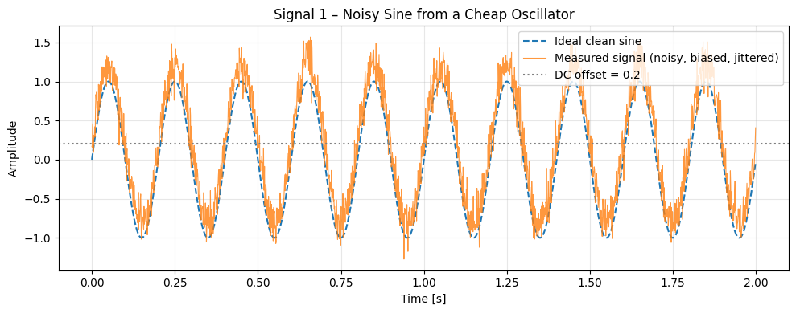
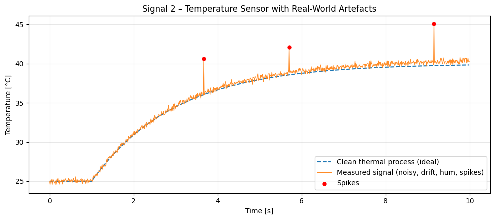
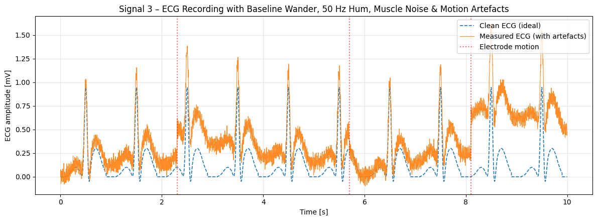
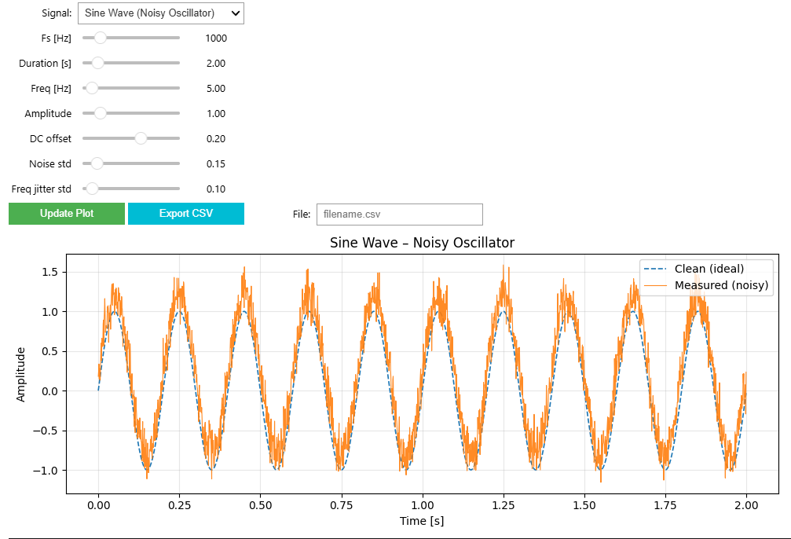
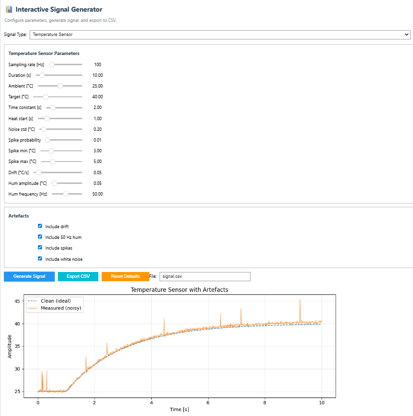
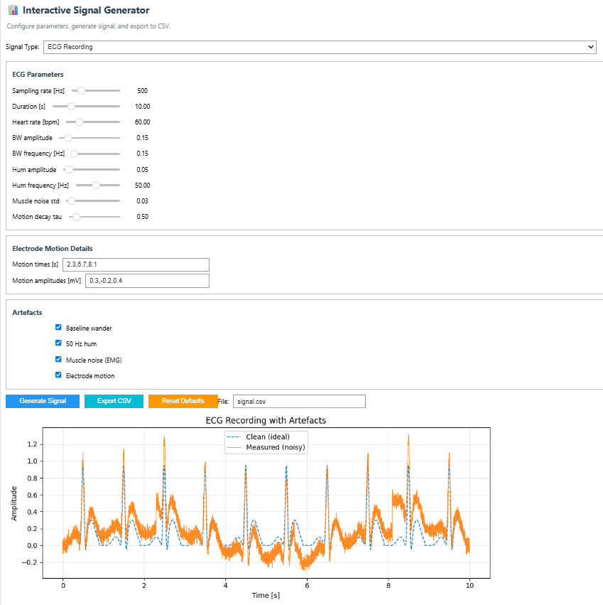

# Implementing Signal Generation in Python Using AI
## Problem Statement
In modern engineering, data serves as the fundamental resource that drives different professional fields, including applications like signal processing, measurement systems, and biomedical data analysis. The increasing demand for data requires alternative ways to obtain it. One methodology is signal synthesis: generating data with different complexity levels, depending on the application. Synthetic signal generation is the process of creating time-series data points for the purpose of modeling a specific user-defined waveform with configurable parameters. It is significant for creating mathematical models that simulate real-world data, such as sensor signals and electrocardiogram (ECG) data, which represent recorded heart rhythms. Practically, signal generation is important for prototyping, testing and validation of systems that traditionally require physical data acquisition. With the increase in usage and dependency on Large Language Models (LLMs) (e.g., Claude and DeepSeek) “vibecoding” – a term for iterative LLM-assisted coding where code generation is done by an AI Chatbot, and then the user pastes it into their program – allows unexperienced or beginner users to create simple, intermediate and/or complex programs. 
## Task Description
Develop synthetic signal generation programs, using the DeepSeek-V4-Pro model (Expert mode, with DeepThink and Search enabled), that are capable of producing 3 unique real-world waveform data with adjustable noise levels and artefacts, exporting this data in a standard CSV-formatted (Comma-Separated Values) file and plotting each of the signals. The core functionality of these programs was later integrated into a unified interactive UI, allowing users to tune parameters, visualize and export all three signals from a single interface. The generated signals should imitate real measurements and allow parameter modification for testing and validation purposes. I chose Python as the programming language to develop this program, since it is easy to understand and widely used in the field of data analysis. For modularity and independent testing of each signal, I used Jupyter Notebook within Visual Studio Code as the development environment. The 3 signals were chosen so that they evaluate the capabilities of the AI model at increasing complexity levels; however, I also chose them to emphasize the variety of signal data that can be synthesized. The realistic signals included are:

| Signal | Description | Source | Complexity |
|--------|-------------|--------|------------|
| Sine Wave | Basic periodic signal with configurable frequency, amplitude, and phase jitter | Low-cost oscillator or noisy analog device | Low |
| Temperature Sensor | Exponential heating curve with Gaussian noise, drift, spikes, and 50 Hz hum | NTC/PTC thermistor or thermocouple | Medium |
| ECG | Synthetic electrocardiogram with baseline wander, muscle noise, and electrode motion artefacts | Surface electrodes (e.g. Holter monitor) | High |

I used the DeepSeek-V4-Pro model, with "Expert" mode set for the session, and "DeepThink" and "Search" features were enabled. The model supported several phases of the development process, including creating an outline and basic plan for each signal, asking clarifying questions to ensure that the "vibecoded" programs aligned with the project goals, and debugging and troubleshooting issues as they came up.

---
## Lessons Learned
- **Expert mode has a cost** – the consequence of enabling the DeepThink feature and using the Expert mode simultaneously is long waiting times for prompts to be answered. These long times can be even longer if DeepSeek uses its Search feature.
- **Debugging is inconvenient** – the long waiting times limits the ability of DeepSeek to be used as a tool for debugging in this configuration.
- **Divide the workload** – using multiple AI tools to perform a task is key to efficient development. In this context, an AI coding assistant (e.g., Github Copilot) can be used for vibecoding, while the outlining of the project, which should usually take a longer time to create, can be a task for the DeepSeek-V4-Pro model. Another LLM can also be used to generate tests to validate functionality.
- **Complex tasks are managed well** – with this configuration of DeepSeek, the model had minimal issues to fix throughout the development process. It was able to develop increasingly difficult tasks mostly with no trouble.
- **Self-evaluations are key** – one of the evaluations, before implementing the interactive UI, acted as a synchronization point in the process, where the model was able to later fix a mistake it had done. The model was also able to perform honest and clear self-evaluations.
- **Setting ground rules is important** – to set a structured and identical framework that is easy to follow and use, the first prompt of the session must include instructions on how to carry the task.
- **DeepSeek continuously follows previous instructions** – throughout the whole session, the model did not deviate from the framework instructions set at the beginning of the session.
- **Iterative refinement works well** – targeted, and specific fix prompts produced clean, minimal corrections without breaking other parts
- **DeepSeek's UI generation ability is limited** - Although the model generated functional interactive UIs to test signals, configure them and export them, it lacked the polished and "professional" look. It should also be noted that the library used for the UI – ipywidgets – inherently has its limitations on visual polishing; however, a more experienced developer would have noticed this.
---
## Using the Result  
  
The results obtained are developed and gathered in a runnable Jupyter notebook file called "signals.ipynb". The easiest way to use it is as follows:  
1. Navigate to the [Jupyter.org](https://jupyter.org/) web page, scroll down to where you can find "Jupyter Notebook: The Classic Notebook Interface" and click "Try it in your browser".  
2. This will open up another page, where you can click on the "Jupyter Notebook" under the "Applications" section.  
3. After clicking on it, an introduction notebook file from Jupyter will be visible now. Navigate to "File" in the top left corner and click "Open...".  
4. After the list of Files open in a new page, you can upload the "signals.ipnyb" file from the top right corner, using the "Upload" button.  
5. After opening the file, make sure to select the "Python 3.13 (XPython)" kernel and press "Select".  
6. Each "cell" in the notebook has a short description that you can read beforehand to briefly understand what to expect as an output. After reading, you can run the cell by clicking on the code cell under the description and pressing the play button at the top of the page in the hot bar.  
7. Note that the last two cells gather all the functionality (generation, plotting and exporting of 3 distinct signals) of the previous ones into an interactive UI. The last cell contains a refined UI implementation based on the previous cell. There you can configure parameters for each signal, generate it, and export it into a CSV file with a configurable filename. The exported CSV file can be found in the same directory where you uploaded the "signals.ipynb" file.  
---
## Workflow Details
To make the outputs of the AI model more deterministic, I chose to start the session with a prompt that includes context on what the task is and simple ground rules for the model on how to proceed throughout developing the project. 

### Establishing Context and Constraints
#### ***User***
```
I need you to outline, plan and guide me through the following project: Signal Generation in Python. I want to implement 3 signals of different complexities.
We start one by one. Do not move forward with anything before asking me. Ask clarifying questions.
```
#### ***DeepSeek***
```
Absolutely, let's take this step by step. Before I propose any plan or outline, I need to understand your goals, context, and preferences. Here are my clarifying questions:
[...]
Once you answer these, I’ll propose a clear plan for the first (simplest) signal, and we’ll proceed one by one without jumping ahead.
```
The model responded – after 27 seconds – with a structured list of clarifying questions and options, covering 5 main areas of the task:  
1. **Project Purpose** (main goal of generating these signals): It asked whether this task is for learning digital signal processing basics, simulating communication systems, creating test signals for hardware or software, audio synthesis or music, or something else.  
2. **Signal types and "complexities"** – the model asked for an "example" or "hint" for the 3 signals of different complexities: It gave me 3 options including 3 different sine waves (basic sine, AM/FM modulated signal and QPSK or OFDM signal), real-world signals (basic sine, ECG-like waveform and radar chirp with noise) and as a last option it suggested periodic analog (sine, square), digital modulated (BPSK) and multi-carrier (OFDM).  
3. **Output expectations** (representation and usage of generated signals): the model asked whether I only want plotting (matplotlib library), exporting to a saved file (WAV, CSV, binary), played through speakers in real time, or passed to another algorithm for further processing.  
4. **Technical constraints** (i.e., preferences or limitations for tools and/or signal parameters): It suggested python libraries that I would want to stick to like NumPy, SciPy, Matplotlib, or sounddevice. Additionally, it asked for the preferred environment including Jupyter notebook or a plain script and some signal parameters such as sampling rate, signal duration, real-time requirements and whether we should include noise, filtering, or keeping signals pure.  
5. **Domain focus** (what field I want to explore): The options given were audio/acoustics, software-defined radio, biomedical signals, vibration analysis, or other fields.  
The model here is attempting to extract the specifications of the project to handle this complex task. 
#### ***User***
```
1. I was mainly thinking, simulate real world signals, by adding noise and some bias to them. We can also create them for test signals. I am open to suggestions to make things more practical.
2. For example, we can start with a basic sine wave, then sensor measurement signals, then ECG signals
3. Plotting + CSV export would be good. (You can suggest otherwise)
4. I was initially thinking that Numpy and Matplotlib would be good. Jupyter notebook is a good environment for others to be able to run blocks of the code.
5. It is a short multi-domain project.
```

### Outlining, Planning and Implementing the Scripts
From this point, the model followed an identical structure to develop each of the signal generation scripts. The general structure followed by the model was composed of a proposed plan, questions before proceeding, and after it received the answers, it created a short Markdown cell which included a description of the script and then a Code cell which included the runnable script itself, and then it ended by stating the expected output and a checkpoint to make sure whether what was generated was up to my expectation. The model only moved on to the next signal task if I prompted it to do so. The detailed structure composition can also be visualized as follows:
#### ***DeepSeek***
- Proposed Plan: 
    - Goal – Generating the signal that mimics what can be measured from the source of the signal:
        - Pure signal
        - Additive white noise
        - DC offset (bias)
        - Additional artefacts (unwanted interference) depending on signal complexity
    - Parameters: Sampling rate, Duration, Frequency, Noise Type, Frequency jitter, etc.
    - Outputs: Plot and CSV export.
- Questions:
    - Parameter choices (Sine)
    - Extra realism (Sine)
    - Sensor type (Temperature Sensor)
    - Heart rate (ECG)
    - etc.
#### ***User***
Here I included all answers to the clarifying questions that the model asked, I modified some choices that it made (e.g., using the NumPy library for exporting CSV file instead of Pandas), and I set rules on the structure of the Jupyter notebook file (e.g., not to decompose the notebook into too many cells).    
#### ***DeepSeek***   
After gathering all the necessary information, it generated the Markdown cell and Code cell. Then, it mentioned the expected results such as the plotting details and the exported CSV file.

### Evaluation
The model successfully generated, in separate cells, each signal with realistic interference and was able to implement plotting and CSV-file exporting to visualize and use the data respectively. Each of these signals included realistic components in their model; notably:  
1. The sine wave included artefacts like a DC offset, noise and frequency jitter. For example, the DC offset may come from sensor bias or ADC (Analog-to-Digital Converter) offset error, while the source of noise may be from the power supply or electromagnetic interference (EMI) and the frequency jitter comes from low-cost oscillators that show instability or from temperature variations. With this model, we represented the signal as follows:  
```math
x(t) = A \sin\left(2\pi \left(f_0 + f(t)\right) t + \phi\right) + C + \eta(t)
```
  
  
2. The thermal measurement contained interferences like noise, voltage spikes, slow sensor drift (baseline drift) and power-line interference. Their sources can be:
    - Noise: Thermal noise, ADC noise
    - Voltage spikes: Switching devices
    - Slow sensor drift: Calibration drift, Humidity
    - 50 Hz power-line interference: Coupling from mains wiring, inadequate shielding
    While the model successfully represented the step response of the device in the plot, the voltage spikes added were represented as 3-5 °C jumps, which is quite an exaggeration for an interference.

  
  
3. The ECG also included similar interferences as the other signals, in addition to Muscle noise and Electrode motion artefact which respectively originate from muscle contractions or patient movement and skin stretching under movement or electrode peeling slightly off skin. The plot generated is visually well-structured; however, the spikes coming from electrode motion – offsetting the whole signal upwards – has no decay, which is not realistic. The only reason a beat might decrease between electrode motions is that the ECG signal is modulated on a low frequency sine wave.  


  
The model also evaluated itself and highlighted the most imprecise features including the oversimplification of the oscillator phase noise for the sine wave, the exaggerated amplitude of the spikes in the temperature measurement and the electrode motion model in the ECG. The detailed response of this self-evaluation is found in the "self_evaluations.md" file.

### UI Implementation 
To further test the model, I decided to gather all the functionalities of the previous Code cells into one Code cell that creates an interactive user interface (UI) to plot and export signals, but I let the model choose the specifications, and I was vague about the of UI implementation details. My prompt included a simple instruction:
#### ***User***
```
Now create an interactive UI for all the signals.
```
#### ***DeepSeek***
DeepSeek listed the main features that should be included for the task, including a CSV file export button and a Plotting button. It also attempted to ask clarifying questions about what tool to use for the UI, how interactive the implementation should be, and whether the plot should continuously update or update on clicking the button.
#### ***User***
```
You decide, use your best judgment.
```
#### ***DeepSeek***
My response prompted the model to generate the Markdown cell containing a short description and the Code cell containing the implementation. The UI was primitive, but functional. It included configurable parameters, a drop-down list to switch between signals, a plotting (updated on button trigger) and exporting feature, and a configurable filename box. Notably, because of the previous self evaluation, it corrected the ECG motion artefact (large jump in the baseline of the ECG signal) by implementing an exponential decay. Although it had marked that the spikes in the temperature measurement are unrealistic, it did not attempt to fix the issue, but rather ignored it. 

#### ***User***
I attempted to push the model's limits by asking it to enhance the user interface.
```
Make the UI look more professional.
```
> From here, the model tried to improve the UI's appearance. The model debugged the UI implementation over several iterations.
##### **First Iteration**
The Code cell didn't run and generated an error. I presented the error to the model, and it fixed it in 12 seconds. The fixed UI included two new subsections: one containing the configurable parameters as before, and the other containing a list of checkboxes to remove/add the interference effect from the plot. The issue was, that in the ECG "Electrode Motion Details" section, the labels were truncated (cutoff) by the box that contains the parameter values.

##### **Second Iteration**
After presenting the truncation error to DeepSeek, it only provided the section that needed to be changed. The issue was fixed after I replaced that section in the appropriate place. But, after testing and validating the functionality, I realized that one of the artefact checkboxes for the temperature signal was missing. 
##### **Third Iteration**
In this iteration, instead of regenerating the whole code to fix the missing checkbox, DeepSeek presented steps to fix the issue. After following the steps, the checkbox for the noise was visible. The final version of the UI implementation:


> To end the session, I prompted DeepSeek to run a full second self evaluation of the whole session with the prompt below.
#### ***User***
```
Now that the full session is complete:  signal generation, UI implementation, and refinements (fixes),  perform a final self-evaluation of your overall performance. What were your strengths, weaknesses, and limitations throughout this entire session?
```
#### ***DeepSeek***
```
[...]
Overall assessment
I delivered exactly what you asked for: three progressively complex signals with realistic imperfections, a polished interactive UI, and all code in a Jupyter‑ready format. The mistakes (widget bug, truncated labels, missing toggle) were typical of rapid prototyping but were fixed quickly and clearly. My strongest point was the thorough upfront questioning and the step‑by‑step approval process; my weakest was an initial slip in the UI widget hierarchy and a lack of foresight for the white‑noise toggle. I maintained transparency by self‑critiquing the signal models early, which gave you a chance to refine them if desired.

The final result is a robust, educational, and extensible tool. I would rate my performance as 8.5/10 – very effective with a few avoidable but corrected errors.
```  
The detailed response can be found in the "self_evaluations.md" file.  
  
---
## Summary & Conclusion
Overall, DeepSeek – in Expert mode with DeepThink and Search enabled – performed the tasks given to it according to the specification provided: Implementing signal generation for 3 distinct signals of different complexities. And, when tested with its UI abilities, it was able to perform the task with minor UI inconsistencies. However, at the beginning, the model overlooked some interference implementation problems like the exaggerated spikes in the temperature signal and the permanent offset due to electrode motion in the ECG signal. Additionally, with response times being up to 70 seconds, a practical solution would be to use a dedicated coding assistant, like Claude Code or Github Copilot for implementation, while reserving DeepSeek for outlining and planning.   

**Author:** Charaf Mohamad
