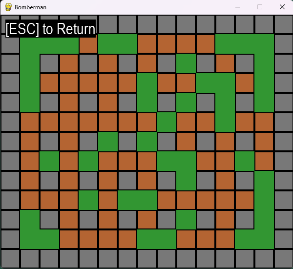
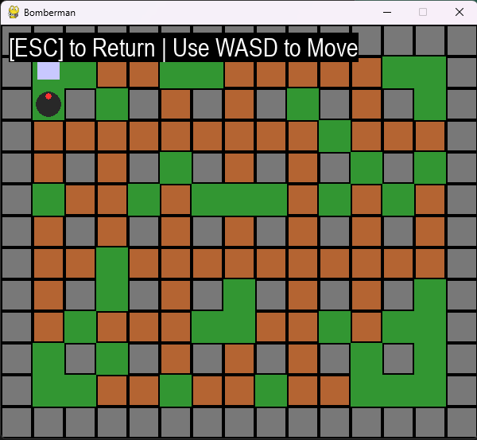
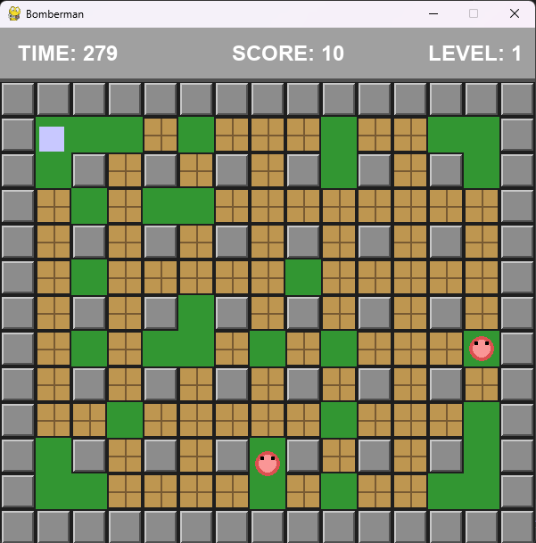

# Pygames Bomberman Játék Esettanulmány

A Pygame könyvtár használatával szerettem volna egy olyan játékot fejleszteni, amely felépítésében a Bomberman játékokhoz hasonlít. Ehhez GitHub Copilot integrációval, VS 2026-ban a Gemini 3.1 Pro MI-t használtam. Első lépésként az MI segítségével készítettem egy [specifikációt](Bomberman_Game_Spec.md), amely mérföldköveket is tartalmazott. Ezeket a mérföldköveket használva promptoltam az MI-t, amely így generálta a játékot.

## Tanulságok

- A specifikáció létrehozásánál fontos, hogy az MI számára is egyértelmű legyen, mit értesz az egyes osztályok és működési módok alatt.
- A specifikációban érdemes megadni az alapvető architektúrát és programozási elveket, amelyeket az MI kövessen a projekt felépítése során.
- A mérföldkövek létrehozásánál egyszerre csak kevés dolgot kérj az MI-től két mérföldkő között.

## A munkafolyamat tanulságos részletei


### Specifikáció létrehozása

```
Generate a specification for a Python Bomberman game using the Pygame library
```

MI: Legenerált egy kezdetleges specifikációt, amelyben néhány dolgot nekem kellett pontosítanom. Emellett felajánlotta a mérföldkövek használatát a projekt generálása során.

### Specifikáció mérföldkövek

Az ajánlása alapján létrehoztam a mérföldköveket a specifikációban, először az MI segítségével:

```
Generate milestones at the end of the specification for prompting
```

MI: Létrehozott 5 különböző mérföldkövet, amelyeket szintén kissé át kellett alakítanom, mert túlságosan általánosak voltak.

- **Milestone 1 (Setup)**: "Set up the Pygame boilerplate, the main application loop, state manager, and a basic interactive Main Menu."
- **Milestone 2 (The Grid)**: "Implement the Level Manager. Generate a static 15x13 grid with indestructible walls in a checkered pattern and place random destructible blocks."
- **Milestone 3 (The Character)**: "Create the unified Character sprite class with a generic Controller interface. Implement 4-directional movement with collision detection against the walls and blocks using a basic Keyboard Input Controller."
- **Milestone 4 (Bombs & Explosions)**: "Add the ability for the Character to place bombs on the grid tied to their specific Player ID. Implement a 3-second fuse, the cross-shaped blast radius, and logic to destroy destructible blocks without passing through indestructible walls."
- **Milestone 5 (Story Mode Monsters)**: "Add a basic Monster class strictly for Story Mode. Implement logic so the monster automatically wanders the grid, bounces off walls, and kills the player on touch. Ensure the monster can be killed by explosions."
- **Milestone 6 (Core Gameplay Loop)**: "Add the hidden Level Exit Door (spawns under a random block) and Power-Ups. Tie the Win/Lose conditions to the State Manager."
- **Milestone 7 (Polish)**: "Add sprite images/animations, sound effects, UI (score/lives/bombs available), and a pause menu."

Ezeken látszik, hogy kis lépésekben kerül létrehozásra a játék, először a környezet azután a mezők majd bele a karakterek.

### Mérföldkövek használata

Innentől egyszerű promptokkal lehetett generálni a játékot pl:

```
Do milestone x/Generate milestone y
```

Ezeket a promptokat használtam a játék generálása során, azonban nem voltak tökéletesek például:

- Az első mérföldkőnél nem tudta létrehozni a környezetet; hiába próbálkoztam különböző promptokkal, végül manuálisan kellett elkészítenem.
- Az egyes objektumok – például a Character, Bomb vagy Grid – létrehozása jól ment neki, azonban vizuálisan nem voltak túl igényesek.
- A specifikációban szereplő tesztelési követelményeket figyelmen kívül hagyta: nem tesztelte a programot, és külön prompt nélkül teszteket sem írt hozzá.
- Nem volt világos számára, mit jelent a Polish (7. mérföldkő), annak ellenére sem, hogy a specifikációban külön kiemeltem, hogy a Bombermanhez hasonló kinézetű és működésű játékot szeretnék.

### Képernyőképek az egyes mérföldkövek utáni eredményekről

Az első kép a 2. mérföldkő utáni állapotot tartalmazza, vagyis már van ablak azon belül pedig egy játéktér karakterek nélkül:



A második a 4. mérföldkő utánit, ahol már vannak bombák van karaketer ami le tud tenni bombát és azokkal fel lehet robbantani narancs színű falakat:



A harmadik a 7. mérföldkő, vagyis már a Polish utáni állapotot mutatja, látszik itt már van eredmény (score), idő, illetve high score is a szörnyek mellett:



### Összegzés

Összességében a specifikáció használatával egy jobban átlátható, az objektumorientált programozás elveit jobban követő, valamint a későbbiekben könnyebben bővíthető program készült, mint egyszerű promptolással. Emellett a játék funkcionalitását az MI a specifikáció segítségével szinte hibátlanul le tudta generálni. Csak bizonyos futtatási környezettel és design elemekkel kapcsolatos részleteket kellett külön promptokkal pontosítani.

A jövőbeni projektekhez érdekes megközelítés lehet, ha specifikáció helyett először egy designtervet készítek, és kíváncsi vagyok, hogy az alapján mennyire jól tudná legenerálni a programot az MI.