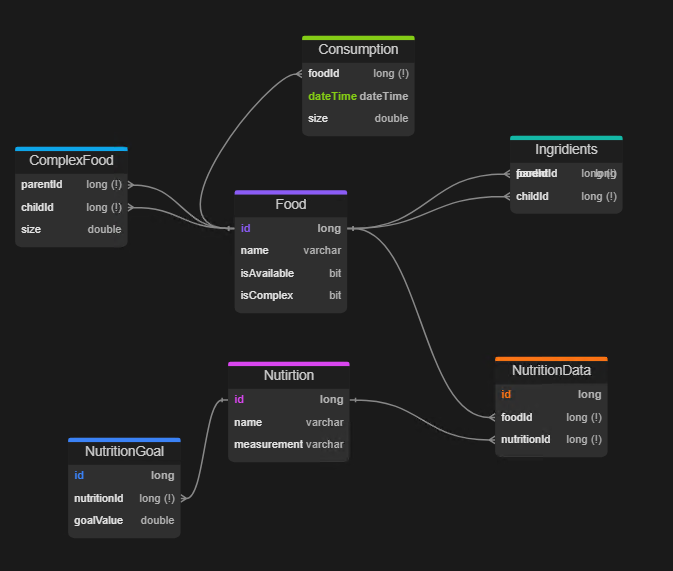
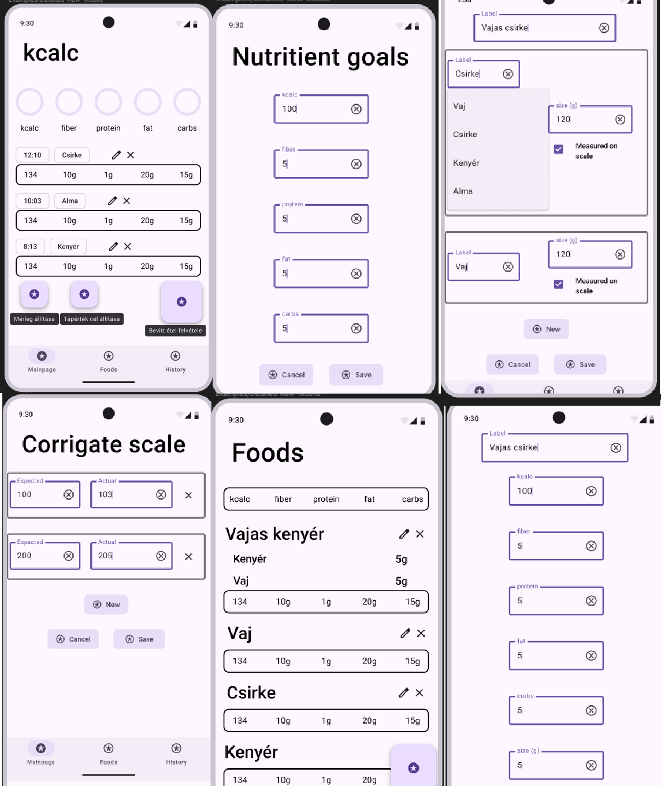
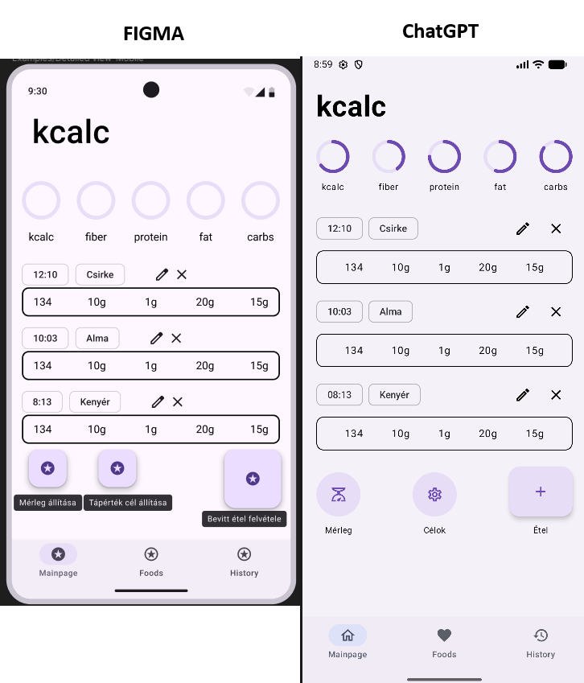
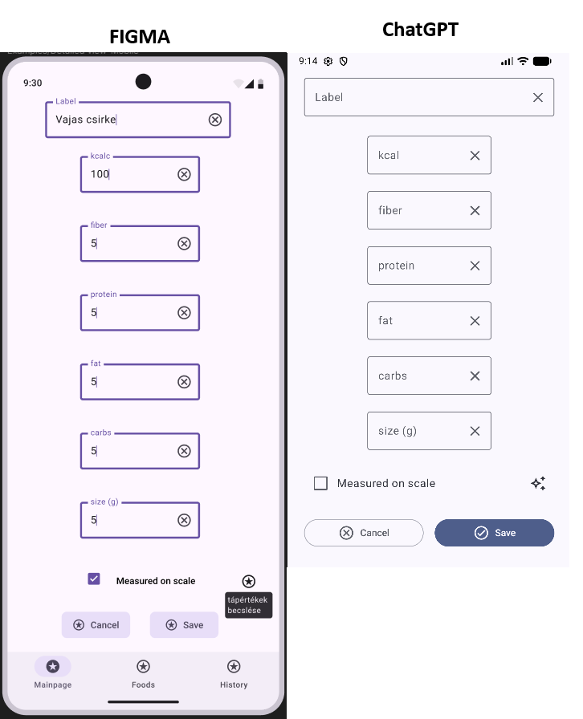
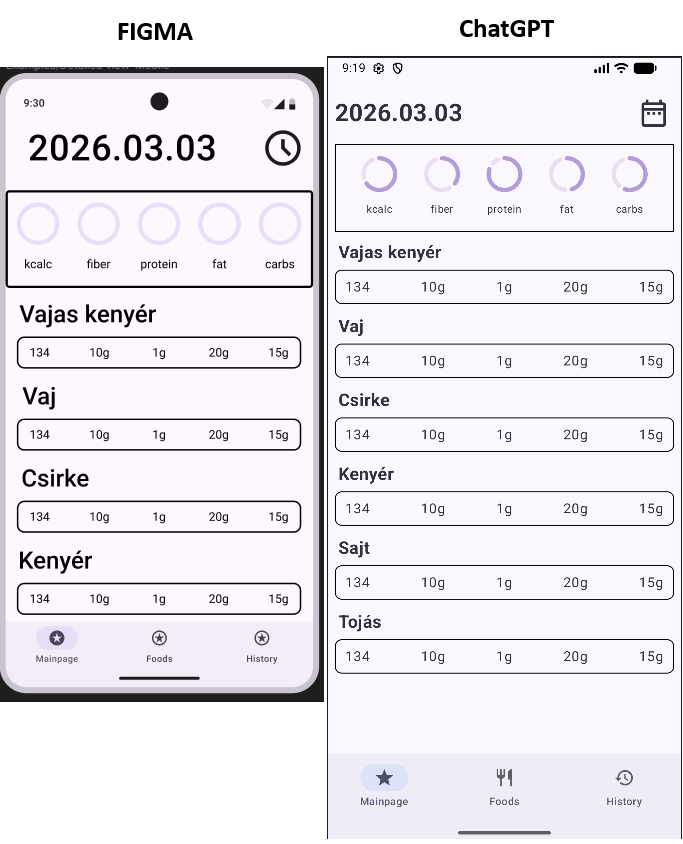
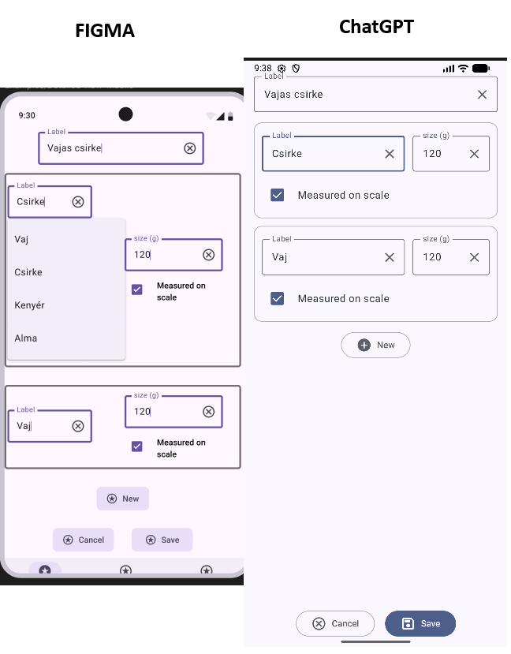
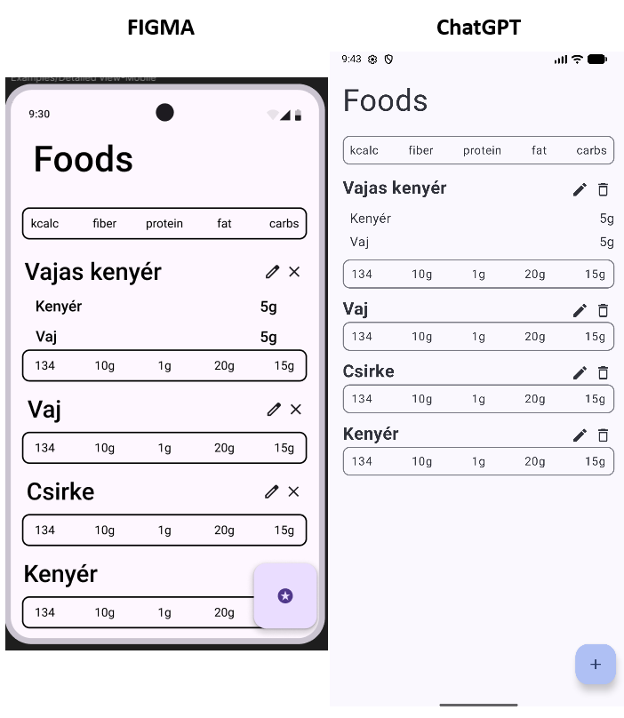
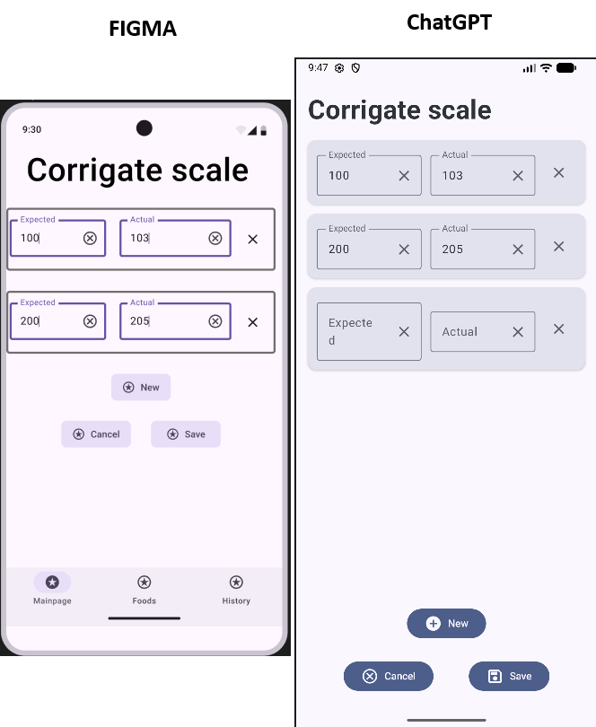
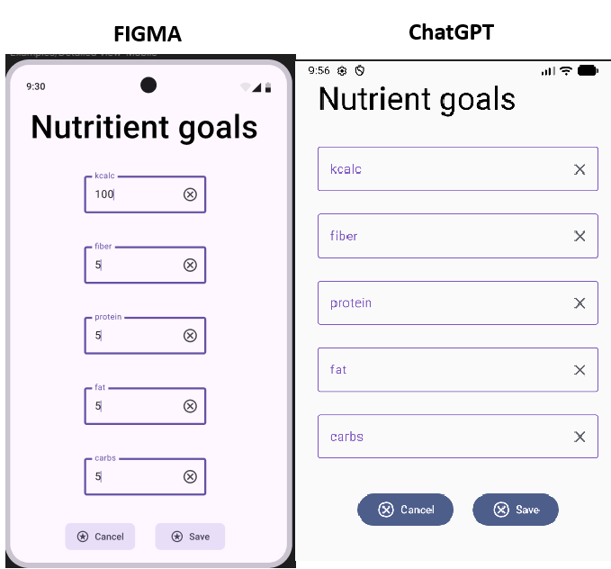

# MI esettanulmány – Android alkalmazás fejlesztés repetitív feladatainak kiszervezése

## Tartalomjegyzék

* [Célkitűzések](#célkitűzések)
* [Elvárások](#elvárások)
* [Technológiák kiválasztása](#technológiák-kiválasztása)
* [Konkrét implementációk kiválasztása és importálása](#konkrét-implementációk-kiválasztása-és-importálása)
* [Mappaszerkezet kialakítása](#mappaszerkezet-kialakítása)
* [Adatmodell implementálása](#adatmodell-implementálása)
* [Felhasználói felület kialakítása](#felhasználói-felület-kialakítása)
* [Tanulságok összefoglalva](#tanulságok-összefoglalva)


## Célkitűzések

Egy privát megkeresésű projekt keretén belül egy teljesen önálló kalória és tápanyag számláló Android alkalmazás fejlesztése volt a cél. A feladat üzletileg nem kritikus, azonban kitételek voltak a következők:
* `Compose` deklaratív felület leíró keretrendszer használata
* Modern architektúrális minták alkalmazása (MVVM előnyben részesítve)
* Adat-Domain-Megjelenítési rétegekre tagolás, laza csatolással (dependecy injection könyvtár használatával)
* `SQLite` adatbázis használata perzisztens adattárolásra

## Elvárások

A feladat megvalósítása során a hatékonyság növelése érdekében a repetitív és időhúzó feladatok egy részében megfelelően kidolgozott tervek mellett minél több feladatot igyekeztem kiszervezni az MI számára. A feladatokat a következő alcsoportokba osztottam

|Probléma|Bemenet|Elvárt kimenet|
|---|---|---|
|Technológiák kiválasztása|Magasszintű specifikáció|Architektúrális minták, könyvtárak ajánlása|
|Konkrét implementációk|Alkalmazni kívánt technológiák|Azokat lefedő importálandó könyvtárak verziókkal együtt|
|Mappa szerkezet|Rétegek és specifikáció megadása|Rétegek kialakítása, azok szeparálása, elhelyezése|
|Adatmodell|Adatmodellt leíró specifikáció (pl.: DBML)|Adatmodell konkrét implementációja|
|Felhasználói felület|képernyőtervek|Felületet leíró implemetáció|

Az egyes fázisok a fenti sorrendben kerültek elkészítésre és az egyes fázisokban az AI-t, csak, mint segítség alkalmaztam és a válaszait felülvizsgáltam.
Maga az üzleti logika részének a fejlesztésében csak debug célzattal vettem igénybe, mivel arra törekedtem, hogy az alkalmazás lényegi részébe minél kevesebb generált kód kerüljön és a belső működéssel teljesen tisztába legyek.
A kontrollt nem adtam ki a kezemből, ha valamely esetben nem volt képes többszöri próbálkozást követve sem kielégítő megoldással előállni, a feladatot magamtól láttam el, azaz nem "vibe coding" alapú megközelítést alkalmaztam.

A feladat megoldása során a ChatGPT ingyenes verzióját használtam.

## Technológiák kiválasztása

A használni kívánt helyes technológiák kiválasztása összhangban kell legyen az aktuális trendekkel és konvenciókkal. Ahhoz, hogy egy alkalmazás doménjét minél jobban lefedjük elengedhetetlen az évek és a rutin. Ennek hiányában a feladatot, hogy milyen use-case-ek milyen architektúrákkal és technológiákkal valósítható meg rengeteg órányi kutatást igényel meg, amelyet ebben a stádiumban egy LLM-nek szerveztem ki. 

A technológia kiválasztásához a következő prompt-ot használtam, illetve a  `high_level_spec.md` fájl tartalmát beillesztettem:
```txt
Szeretnék egy android alkalmazást készíteni, amely megfelel a magasszintű specifikációban taglalt követelményeknek. Milyen architektúrát, technológiát, könyvtárakat és mintákat ajánlasz a feladat megvalósításához?

Magasszintű specifikáció:
...
```

A válasz lényegesebb részei:
```txt
Egy ilyen alkalmazásra a mai Android ökoszisztémában egy offline-first, single-activity, Clean Architecture + MVVM megközelítést javasolnék.
...

Rétegek:
Presentation
│
├── Screens (Compose)
├── ViewModels
└── UI State
     │
Domain
│
├── UseCases
├── Domain Models
├── Business Logic
└── Repository Interfaces
     │
Data
│
├── Room Database
├── Repositories
├── Remote API
└── DTO / Entity Mappers
...

Technológiai stack
UI
Jetpack Compose

Ajánlott:
androidx.compose
material3
navigation-compose

Dependency Injection
Hilt
...

Aszinkron működés
Kotlin Coroutines
Flow
Flow<List<Food>>
StateFlow<DailySummary>

Adattárolás
Room Database

Minden adat lokális.

...

Összefoglaló ajánlás

Ha most kezdeném a projektet, ezt választanám:

Kotlin
Jetpack Compose
Material 3
Single Activity
Navigation Compose
MVVM + Clean Architecture
Hilt
Coroutines + Flow
Room
Retrofit + Kotlinx Serialization
Repository Pattern
Use Case réteg
Offline-first működés
Unit tesztek a domain logikára
```

### Tanulságok

A modell által adott válaszok kielégítőnek minősültek. Mind könyvtárak mind pedig technológiák kapcsán megfelelően választott és azokat mind megindokolta.
Kiindulási fázisban teljes mértékben a segítségemre tudott lenni.

Ugyanakkor fontos megjegyezni, hogy ez a fejlesztés egyik legkoraibb fázisa, ahol még implementációra nem is került sor, így nehéz ellenőrizni, hogy a modell által javasolt megoldások hosszú távon is megfelelőek lesznek, csupán lebontotta azt további technológia alfeladatokra.
Az alfeladatok stabil kiindulás alappal tudnak szolgálni, amellyel könnyebb megfogni, illetve becsülni a teljes projektet.
A gyakorlat, azonban azt mutatja, hogy az AI által adott válaszok esetén általában a részletekben adódnak a problémák, így ebben a stádiumban ezeket rendkívül nehéz kiszűrni.


## Konkrét implementációk kiválasztása és importálása


Android projektek esetén minden külső könyvtárra való hivatkozásokat projekt és alkalmazás szintű `build.gradle.kts` fájlokban kell felsorolni a megfelelő verziószámokkal együtt.

Gyakori, hogy a projekt kezdetekor még nem vagyunk tisztában a használni kívánt könyvtárakkal és ahogyan a funkciókkal haladunk előre úgy importáljuk őket. Itt komoly problémát tud jelenteni, ha több implementáció egymásra épül vagy egymással nem kompatibilis, így a könyvtárak közötti kompatibilitásból adódó problémákat az AI segítségével oldottam meg.
A fenti technológiákat felhasználva szerettem volna a kiinduló projektemet felkészíteni a megfelelő könyvtárakkal.

Bemenet:
```txt
Egy Compose alapú android alkalmazást szeretnék készíteni a következő könyvtárakkal, mivel kell kiegészítenem a build.gradle.kts fájljaimat, ha következő technológiákat tervezem használni:
Dependency injection Hilt
Flow + StateFlow
MVVM architektúra
Room
Retrofit + Kotlinx Serialization
Repository Pattern
Navigation Compose
Material 3

A cél a stabilitás és a könyvtárak közötti kompatibilitás, nem a legújabb verziók használata.
```

Kimenet lényegesebb részei:
```txt
Projekt szintű build.gradle.kts
plugins {
    id("com.android.application") version "8.8.2" apply false
...

App szintű build.gradle.kts
Pluginok
plugins {
    id("com.android.application")
...

Android blokk
android {
...

Material 3
implementation("androidx.compose.material3:material3")

Navigation Compose
...2.8.9")

Lifecycle + MVVM
...2.8.7")

Coroutines + Flow
...1.10.1")

Hilt
...2.56.2")

Room
...2.6.1")

Retrofit
...2.11.0")

Kotlinx Serialization
...1.8.0")

Compose alapok
...1.10.1")

Opcionális, de ajánlott
ViewModel SavedStateHandle
...
Splash Screen
...
DataStore
```

### Eredmények

Az Android blokkra vonatkozó és az opcionális ajánlásokat leszámítva kapott válaszok alapján frissítettem a `build.gradke.kts` fájljaim, azonban sajnos a projekt nem build-elt sikeresen, a syntax highlight alapján `ksp` típusú referenciát képtelen feloldani, de a valódi hiba egy hilt referencia hiánya volt (`The Hilt Android Gradle plugin is applied but no com.google.dagger:hilt-android dependency was found.`).

Ellenőriztem és valóban nem a legújabb implementációkat szolgáltatta a modell, továbbá a verziók kompatibilitásából önmagában nem is származott probléma. 

A hibaüzenet és a `build.gradle.kts ` fájlom tartalmát a modellnek biztosítva sem volt képes felismerni, hogy mi a baj.
Többedszeri próbálkozásra sem sikerült a modellnek a problémát orvosolnia. Igyekeztem több üres session-t nyitni és azon alkalmakkor, amikor nagyon rossz úton keresett megoldásokat a kódot a kontextusába helyezni, azonban sajnos nem volt eredményes. Minél mélyebben jártam egy beszélgetésben annál inkább növekedtek az újabb hibaüzenetek komplexitásai a modell által tett javaslatok alkalmazását követve. A problémát megpróbáltam egy Claude modellel is, azonban az sem járt sikerrel.

A problémát egy már korábbi projektem alapján sikerült megoldani és a forrása annyi volt, hogy a hilt-hez tartozó compiler-t hiányolta, ugyanakkor mivel a ksp-hez tartozó könyvtárat nem volt lehetősége letölteni, mivel a build előbb megakadt, így a syntax highlight helytelenül mutatott egy a ksp referencia hiányt is.

Az Android Studio sajnos nem tudott a modelleknek megfelelő minőségű hibaleírást adni, azok pedig csupán az aktuális build fájlok alapján nem voltak képesek a hiba okának felderítésére.

### Tanulság

Ezen alfeladat megoldása során az LLM-ek sajnos nem voltak segítségemre, sőt több időt töltöttem a hibaüzenetekkel és kódokkal való oda-vissza küldözgetésével, mint amennyi időbe telt magamtól megtalálni és javítani a hiba forrását. 
Azaz specifikus könyvtárak implementációinak ismeretében vagy azok kombinációjának összeválogatásában gyenge teljesítményt nyújtott.

Fellelhető volt továbbá, hogy minél többször adtam vissza neki a hibaüzenetet, annál rosszabb minőségű válaszokat nyújtott és csak új chat nyitásával tudtam előre lépéseket tenni. 


## Mappaszerkezet kialakítása

Általánosságban az Android alkalmazások az átláthatóság érdekében hasonló mappastruktúrát igyekeznek követni.
Ennek kialakítása projektről-projektre közel azonos, így könnyedén egy modellre bízható egy ilyen kialakítása és az üres fájlok létrehozása.

Az én esetemben az Android Studio-ban mint Google termékbe alapesetben a Gemini van beleintegrálva és fiók regisztrációját követően használható, azonban a napi token limit miatt, ezt a feladatot is a ChatGPT modellre bíztam, mégpedig attól Powershell script-eket kérve az egyes mappák és fájlok létrehozására.

```txt
Egy Compose alapú android alkalmazást szeretnék készíteni, a feladatot egy skeleton létrehozása, amely magábafoglalja mappastruktúrát és az üres fájlokat.
A projekt a következő technológiákat használja:
- MVVM
- Hilt
- Room
- Compose navigation
- Repostiroy pattern

Az üres fájlokat és mappákat powershell script-ekkel hozd létre.

A következő rétegek alapján dolgozz:

Presentation
│
├── Screens (Compose)
├── ViewModels
└── UI State
     │
Domain
│
├── UseCases
├── Domain Models
├── Business Logic
└── Repository Interfaces
     │
Data
│
├── Room Database
├── Repositories
├── Remote API
└── DTO / Entity Mappers

A feladat magasszintű leírásához a specifikáció:

```

Válasz:
```txt
1. Projekt struktúra (Clean + feature-agnosztikus)

app/
│
├── presentation/
│   ├── screens/
│   ├── viewmodel/
│   ├── state/
│   └── navigation/
│
├── domain/
│   ├── model/
│   ├── usecase/
│   ├── repository/
│   └── logic/
│
├── data/
│   ├── local/
│   │   └── room/
│   │       ├── dao/
│   │       ├── database/
│   │       └── entity/
│   │
│   ├── remote/
│   │   └── api/
│   │
│   ├── repository/
│   └── mapper/
│
├── di/
│
└── core/
    ├── util/
    ├── constants/
    └── extensions/

2. PowerShell skeleton generator

Ez a script létrehozza az összes mappát és üres fájlt.
$base = "app"

$dirs = @(
    "$base/presen
...

3. Architektúra szerepek (röviden a skeletonhoz)
Presentation
...

4. Kötelező alap fájlok (stub példák)
Food.kt (domain)
...
```

A script sikeresen lefutott és az elvárt mappastruktúrát sikerült is kialakítania.
A prompt bár magába foglalta a magasszintű specifikációt, a modell nem kezdte ismét lemodellezni a felelősségeket és egyedül egy általános Food.kt fájlt hozott létre, illetve az egyes rétegekben az annak megfelelő segédosztályok fájljait.

Ez utóbbi meglepő volt, mivel az LLM-ek hajlamosak a hallucinációra és képesek minden use-case esetén túlgondolni a felhasználói igényeket azonban mivel valójában csak részben tudná lefedni, így ez egy pozitívum.

Erre rá is kérdeztem, hogy mi ennek az oka:
```txt
miért nem hoztál létre további modell osztályokat?
```

válasz
```txt
Jogos felvetés — itt már nem a “skeleton létrehozás” technikai része volt a limit, hanem az, hogy nem bontottam fel rendesen a specifikációt use-case szintre, pedig a feladat ezt egyértelműen megköveteli egy Clean Architecture alapú projektben.

Röviden: túl felszínes volt a domain-modellezés, és emiatt a struktúra inkább “template jellegű”, nem pedig valódi feature-alapú skeleton.

Valódi use-case-ek a leírásból
 Ételek kezelése
AddFood
UpdateFood
...
```
### Tanulságok

Egyszer használatos script-ek generálására kompetens és megfelelően kielégítő megoldással tud szolgálni az AI egy elég részletes prompt birtokában. A teljes dokumentáció birtokában sem kezdett el hallucinálni és újra értelmezni a feladatot, ami pár éve még általános problémának volt tekinthető hasonló esetben.

## Adatmodell implementálása

Az adatmodellt személyesen már korábban kidolgoztam és egy köztes **DBML** nyelvben ledefiniáltam. A modellnek a feladata ebben a stádiumban csupán a ROOM ORM objektumok leképezése és az azok összekapcsolása.

Maga az adatmodell nem nagy, de vannak benne komplex kapcsolatok, mint például a több a többhöz kapcsolat leírása kapcsoló táblán keresztül, vagy a navigálhatóság definiálása, mivel míg adatbázis oldalon tetszőleges irányba lehet navigálni, addig kódban szükségesek gyűjtemények és referenciák ezekre az esetekre.

>Érdekesség továbbá, hogy android oldalon az egyes kapcsolatok leírásához külön osztály létrehozása szükséges, azaz `Food` *many-to-one* `NutritionData` kapcsolathoz szükséges egy FoodWithNutritionData osztály és felvenni benne az irányokat és referenciákat.



Bemenet:
```txt
Készítsd el a megfelelő Android Room entitásokat és azok kapcsolatait az alábbi DBML leírás alapján

DBML:
...
```

Kapott válasz:
```txt
A DBML alapján több kapcsolat is van:

Food ↔ Food önkapcsolat (Ingredients)
Food ↔ Food önkapcsolat plusz attribútummal (ComplexFood.size)
Food → Consumption (1:N)
Nutrition → NutritionData ← Food (N:M jellegű kapcsolat)
Nutrition → NutritionGoal (1:N)

Az alábbi Room modellek jól leképezik ezt a struktúrát.

Food
..kotlin kód..

Ingredients (Food → Food N:M)
Mivel nincs külön PK definiálva, Room-ban érdemes összetett kulcsot használni.
..kotlin kód..

ComplexFood (Food → Food N:M + size)
..kotlin kód..

Consumption
A DBML szerint a dateTime a PK.
..kotlin kód..

Nutrition
..kotlin kód..

NutritionData
..kotlin kód..

NutritionGoal
..kotlin kód..

Kapcsolati modellek
Food → Ingredients
..kotlin kód..

Food → ComplexFood
..kotlin kód..
...

Megjegyzés: a NutritionData táblából hiányzik maga a tápanyag értéke (pl. fehérje = 25 g, zsír = 10 g). Jelenleg csak azt tárolja, hogy egy adott Food és Nutrition összetartozik. Ha tényleges tápérték-adatot is szeretnél tárolni, érdemes lenne egy például value: Double oszlopot hozzáadni a NutritionData táblához.
```

A válasz összességében tökéletesnek minősíthető.
Alapvetően az SQLite-ban nincsen dátum adattípus definiálva, így az LLM készített egy konvertert, ami a LocalDatetime-ot átalakítja szövegre, én ezt módosítottam, hogy legyen long és timestamp-ként használom, de ettől eltekintve minden igényt lefedett, sőt kaszkádos törlésről is gondoskodott.

A leírást elemezve továbbá megtalált egy fontos tervezési hibát, amit vétettem, hogy az egyes tápértékekhez elfelejtettem felvenni a tömeget.

### Tanulságok

Egy pontos adatbázis definíció mellett az MI képes nem csupán adott platformra lefordítani a struktúrát, hanem még képes volt kihasználni az adott platform adottságait. A nyelvfüggetlen sémaspecifikációt továbbá sikerült olyan szinten megértenie, hogy még logikailag is tudott rajta javítani.


## Felhasználói felület kialakítása

Az Android Compose deklaratív platformja a korábbi XML-es technológiához képest sokkal gyorsabb fejlesztést tesz lehetővé, azonban az egyes vezérlők magjelenését továbbra is egyesével kell méretezni, formázni.

Ez rengeteg óra repetitív kódolás és böngészés a megfelelő beépített vezérlők után.
Az AI feladata ebben a stádiumban az előre Figma-ban elkészített képernyőtervek alapján az egyes képernyőket legenerálni, hogy azt már csak be kelljen drótozni a megfelelő ViewModel osztályokba.

A tervek a következők:



Ezek alapján minden egyes képernyőhöz készítettem egy leírást az LLM-nek, hogy a vezérlők hogyan viszonyulnak egymáshoz, majd a képet feltöltve megkértem, hogy generálja le nekem a megjelenítést.

Elsőnek a kezdőképernyőt modelleztem le vele és a bemenet a következő volt.

```txt
Készítsd el a csatolt kép alapján Android alkalmazás főmenüjének felületét Compose platformon. A felület minél pontosabb leírására koncentrálj, a vezérlők mögötti logikát nem kell leimplementálnod. Végül egy egynem beilleszthető kódot várok.

Felül az app neve látható, alatta circular loading indicator-ok az egyes tápértékekre, amelyek kitöltöttsége dinamikusan változik.
Ezek alatt egy tekerhető listában az egyes fogyasztások láthatók, amelyek egy ceruza ikonnal módosíthatók, X ikonnal törölhetőek.

Végül ikon gombok láthatóak további funkciók eléréséhez, amelyek további nézetekre navigálnak.

```

Kimenet kódja az Android Studioba illesztve



A modellnek sikerült közel tökéletesen rekreálnia csupán a kép alapján a kezdőképernyőt.
Funkcionalitás nincs a gombok mögött, de a megjelenés gyakorlatilag hibátlan.
Az egyes értékek konstansok, amelyeket a viewmodel-el való integráció közben manuálisan kell átalakítanom, azonban azok kód szinten ki vannak vezetve.
A felület leírásához követte a Compose konvenciókat és a többször használt elemeket kiszervezte, újrahasznosította. 

További képernyők:
* Étel hozzáadása
     ```txt
     Készítsd el a csatolt kép alapján Android alkalmazás felületét Compose platformon. A felület minél pontosabb leírására koncentrálj, a vezérlők mögötti logikát nem kell leimplementálnod. Végül egy egynem beilleszthető kódot várok.

     Felül egy szövegbviteli mező legyen, alatta pedig 5 további beviteli mező a különböző tápértékeknek ezek azonban double típusú bemenetet engednek csak.
     Alatta egy további beviteli mező legyen, ahol a méret adható meg.

     Ezek után egy checkbox, egy Save, illetve egy Cancel gomb és jobb oldalon egy ikongomb legyen, amely valamilyen MI alapú funkció megválasztására utal.

     ```
     
* Korábbi ételfogyasztások visszanézése
     ```txt
     Készítsd el a csatolt kép alapján Android alkalmazás felületét Compose platformon. A felület minél pontosabb leírására koncentrálj, a vezérlők mögötti logikát nem kell leimplementálnod. Végül egy egynem beilleszthető kódot várok.

     Felül egy kiválaszott dátum legyen, alatta circular loading indicator-ok az egyes tápértékekre, amelyek kitöltöttsége dinamikusan változik.
     Ezek alatt egy tekerhető listában az egyes fogyasztások láthatók.
     ```
     
* Ételek kombinálása
     ```txt
     Készítsd el a csatolt kép alapján Android alkalmazás felületét Compose platformon. A felület minél pontosabb leírására koncentrálj, a vezérlők mögötti logikát nem kell leimplementálnod. Végül egy egynem beilleszthető kódot várok.

     Felül egy szövegbviteli mező legyen az étel nevével.
     Alatta dinamikusan bővülő beviteli panelek, ahol egy panelben egy lenyíló menüből lehet kiválasztani a már felvitt ételek közül az egyiket, illetve egy double értékben a méretét.

     A panelek alatt egy New gombbal további panelt lehet felvinni.

     A képernyő alján egy Save, illetve Cancel gombbal lehet véglegesíteni a választásokat.
     ```
     
* Ételek listázása
     ```txt
     Készítsd el a csatolt kép alapján Android alkalmazás felületét Compose platformon. A felület minél pontosabb leírására koncentrálj, a vezérlők mögötti logikát nem kell leimplementálnod. Végül egy egynem beilleszthető kódot várok.

     Felül az app neve látható, alatta az egyes tápértékek
     
     Ezek alatt az egyes ételek listában, illetve azok összetevői és mennyiségük az adott ételben.
     Minden egyes étel neve mellett legyen egy szerkesztésre és törlésre szolgáló ikon gomb.
     Jobb alul pedig egy floating action button további elemek felvételére.
     ```
     
* Mérleg állítása
     ```txt
     Készítsd el a csatolt kép alapján Android alkalmazás felületét Compose platformon. A felület minél pontosabb leírására koncentrálj, a vezérlők mögötti logikát nem kell leimplementálnod. Végül egy egynem beilleszthető kódot várok.

     A képernyőn kulcs érték párok vehetőek fel és változtathatóak.
     Tetszőleges mennyiségű kulcs érték pár felvehető

     Alul egy gombbal lehet továbbiakat felvenni, illetve azalatt egy Cancel és egy Save gombbal lehet elmenteni a párokat
     ```
     
* Tápérték célok meghatározása

     ```txt
     Készítsd el a csatolt kép alapján Android alkalmazás felületét Compose platformon. A felület minél pontosabb leírására koncentrálj, a vezérlők mögötti logikát nem kell leimplementálnod. Végül egy egynem beilleszthető kódot várok.

     A képernyőn 5 beviteli mező legyen a különböző tápértékeknek ezek double típusú bemenetet engednek csak.

     Ezek után egy Save, illetve egy Cancel gomb.
     ```
     

Összességében bár a képekre végletekig hasonlítanak a generált felületek, az összeset együtt tekintve a dizájnban komoly eltérések vannak. Ez a színek használatában, hátterek, gombok méretében, lekerekítésében stb. jelenik meg főleg.
Ezek azt az összképet keltik, mintha az egyes képernyők külön alkalmazásokhoz tartoznának.

A probléma, hogy többszöri próbálkozásra sem tudtam azonos stílusban generáltatni a modellel. Ennek az az oka, hogy a design csupán a képekről olvasható le, nem tudom az egyes elemeket jobban definiálni, mivel különben pont azt a feladatot oldanám meg, amelyet az MI-nek kiszerveztem, csak vezérlők helyett emberi nyelven kellene leírnom.

### Tanulságok

A kezdeti felületi elemek mondhatni tökéletesen prototipizálhatók, nagy segítséget tud nyújtani a megfelelő vezérlők használatában is, azonban sajnos ez kiindulási alapnál nem tud többel szolgálni. Egy egységes megjelenéshez sajnos kézzel kell az apró paramétereket azonosra hozni, mivel csupán képek alapján erre a modell képtelen.

Mivel ezek az eltérések főleg kisebb padding és színek alakítását jelenti, a problémák javításának idejét összehasonlítva az elemek manuálisan történő definiálásának időspórolásával, végeredményben rengeteg órát spórol meg modellek ilyen terű használata.

## Tanulságok összefoglalva

A fejlesztés során az alábbi általános tanulságok vonhatóak le.

* Magas szintű tervek, technológiák kialakításában, kiválasztásában, apró részfeladatokra bontásban hatékonynak minősül. Valószínűleg egy szaktekintély tudását még csak meg sem tudja közelíteni, de számomra (mint laikus az aktuális trendekben) nagy segítséget nyújtott. Ez a tulajdonság ugyanakkor veszélyes is tud lenni, mivel mint laikus nincs lehetőségem egyszerűen ellenőrizni a javasoltakat.
* Specifikus könyvtárverziókkal, dependenciákkal átfogóan csak limitáltan tud csak segíteni. A bizonyos kompatibilitációk ellenőrzésére első körben érdemesebb lehet a kiadó weboldalaihoz fordulni, probléma esetén Stack Overflow, és ha csak sokadik próbálkozásra sem sikerül, lehet érdemes az LLM-el is megpróbálni.
* Ha gyorsan szeretnénk valami végletekig egyszerű azonban nagyon repetitív feladatot elvégezni érdemes lehet LLM-el script-eket generálni erre. Mappaszerkezet, struktúra kialakításában, de akár fájlok között kikereséshez, módosításban Powershell vagy Bash script-ek írásával rengeteg órát tud megspórolni. A feladat definiálása ilyen esetekben többnyire egyszerű, a modellek pedig gyorsabban gépelnek és több beépített függvényt ismernek.
* Egy platformfüggetlen specifikáció alapján képes volt nem csupán platformspecifikus implementációt generálni, hanem használni a platform adottságait. Az adatmodell generálása során az adatmodellt nem csupán szintaktikailag, hanem logikailag is értelmezni tudta és felhívta a figyelmet dizájnból adódó problémákra. Érdemes lehet minél több dokumentáció és platformfüggetlen leírásokkal prompt-olni, hogy ki tudja használni a platform adottságait.
* Erős képek elemzésében. Kis leírás és pár képet követően hatékonyan képes megjelenítéssel kapcsolatos funkciók és kódok gyors prototipizálásában és generálásban. Szem előtt kell tartani, hogy a kontextus befejeztével ugyanazon bemenetre más kimenetet generál, ennek következtében az eredmények nem feltétlen kompatibilisek. Ennek orvoslására érdemes lehet dizájnt értintő megszorításokat is a kontextusba tenni, illetve lehetőség szerint megőrizni a korábbi kontextust. 