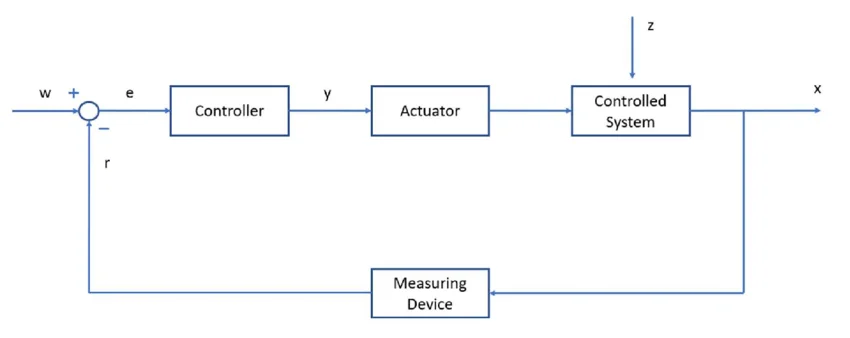
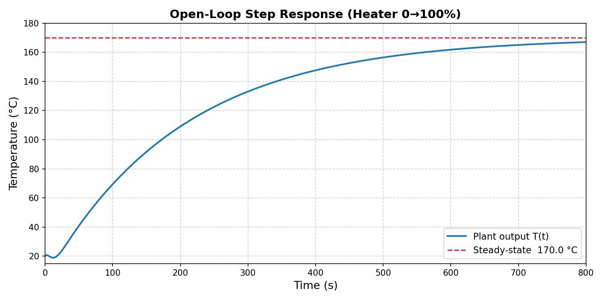
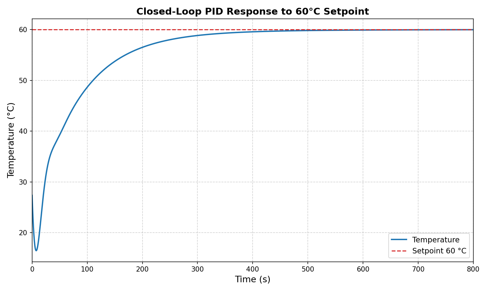
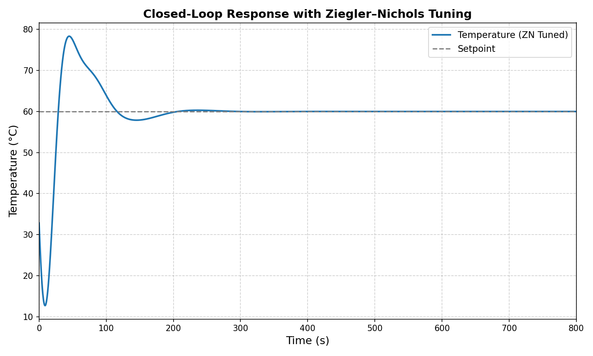
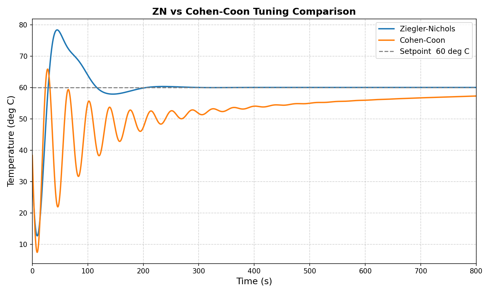
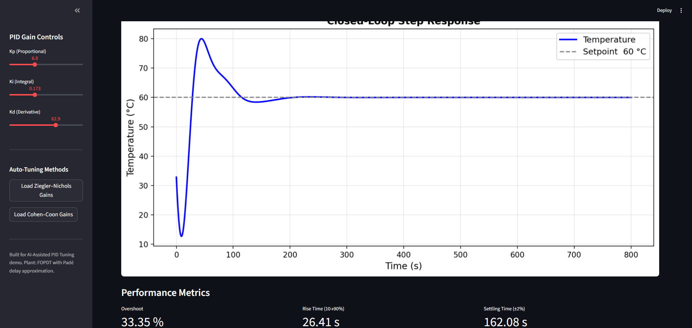

# AI-assisted PID Tuning for a Simple Plant
---
## Problem Statement
Generally speaking, Control Engineering is the discipline of making a system reach and hold a desired, safe state (e.g., making a thermal system reach and maintain a desired temperature). Typically, we refer to control loop diagrams to represent the whole control system, shown in the following image: 
  
  

The components of this diagram represent the following:
- The **"Actuator"**, such as heaters, valves or dampers, is the device that directly affects the state of the controlled system. It receives a controller output signal 'y' that changes the way the actuator behaves (e.g., increase heating of the heater, decrease speed of the motor).  
- The **"Controlled System"** – also known as the "Plant" – is the physical process that is being regulated (e.g., the air inside a house), and often, in the real world, an external disturbance signal 'z' interferes with the state of the system (e.g., opening the window while the heating system is activated, which allows cold air to enter the house).  
- The **"Measuring Device"** measures the actual output of the plant 'x' and feeds it back to the input as a signal 'r', so that it is compared to the ideal (desired) signal 'w' (e.g., a temperature sensor measures an output of 26°C, but the desired temperature is 25°C, so the error signal 'e' represents the 1°C difference).  
- The **"Controller"** is the device that takes the error signal 'e' and computes a corrective signal 'y' that is fed to the Actuator.  
  
The most used industrial controller is called a PID controller. They can be found in thermostats, ovens, factory processes, robotic arm positioning, cruise control, etc... PID is an acronym, and it is made up of three terms, each having their own role/contribution in producing the corrective signal. Each PID term carries its own adjustable weight, called a gain – $K_p$, $K_i$, and $K_d$ – which sets how strongly that term influences the final corrective signal. **Tuning** a PID controller means choosing the right values for these three gains. The following table generally explains this:  
| Term | Reacts To | Role | Gain | Effect if Too High | Effect if Too Low |
|------|-----------|------|------|---------------------|--------------------|
| **P** (Proportional) | Current error | Drives an immediate correction proportional to the present error | $K_p$ | Shaky, overcorrects, swings past the target | Sluggish, slow response |
| **I** (Integral) | Accumulated past error | Eliminates lingering steady-state error that P alone cannot remove | $K_i$ | Overcorrects, takes a long time to settle down | Never reaches the desired target precisely |
| **D** (Derivative) | Rate of change of error | Anticipates future error and dampens overshoot | $K_d$ | Too sensitive to small fluctuations, output gets jumpy | Little smoothing, more overshoot |
  
So how do control engineers pick the "correct" $K_p$, $K_i$, and $K_d$ gain values? Traditionally, this was done using manual trial and error based on the operator intuition and experience from observing system behavior. It later evolved into systematic heuristic methods like Ziegler–Nichols autotuning, and eventually into model-based, adaptive, and optimization-driven techniques supported by digital computation and modern control theory.  
Across all of these eras – manual, heuristic, model-based, or optimization-driven – the ***design*** of the tuning method itself has always required a human control engineer to derive, select, or implement it. So what happens when that role is handed to an AI coding assistant instead?

## Task Description
The end goal of this project is to have an interactive UI that allows users to configure the gain values of a PID controller for a ***thermal system*** (i.e., the temperature was controlled using the PID controller). The in-between checkpoints include modeling the plant using a transfer function, simulating the step response of the system with and without the controller and implementing controller autotuning methods using AI. To tackle this complex task, two AI models are used: DeepSeek-v4-Pro in Expert mode with DeepThink Enabled and Claude's Sonnet 4.6 model with Medium effort. The former (DeepSeek model) took the role of the planner, while the latter took that of the implementer. Before starting the task, I created a session with Claude's Sonnet 4.6 (Medium Effort) purely to brainstorm ideas and create an outline; the session resulted in a [brainstorm.md](brainstorm.md) file that explains the task, phases of implementation and extra notes. This file was then given to the DeepSeek model as the first prompt. One of the most important sections of the "brainstorm" file is the "Implementation Phases" which includes the following:  

| Phase | Description | AI Model |
|--------|-------------|--------|
| 1 | Model the thermal plant, define transfer function parameters | DeepSeek-v4-Pro |
| 2 | Plan the full implementation structure, ask clarifying questions | DeepSeek-v4-Pro |
| 3 | Simulate open-loop step response | Sonnet 4.6 |
| 4 | Implement closed-loop PID controller, plot response vs. setpoint reference line | Sonnet 4.6 |
| 5 | Implement automatic tuning algorithm | Sonnet 4.6 |
| 6 | Build interactive UI with configurable Kp, Ki, Kd and performance metrics display | Sonnet 4.6 |

> Initial Role of DeepSeek-v4-Pro (before generating markdown files): Choosing Plant/Simulation parameters, selecting performance metrics, choosing the suitable implementation language and libraries modeling the controlled system, selecting interactive UI framework and **choosing the automatic tuning method**.

After the initial prompts, the project was executed using the two models as follows:  
| Model | Role |
|--------|-------------|
| **DeepSeek-v4-Pro** | For each phase, generate a markdown file which is fed into Claude's Sonnet 4.6 and check the feedback from Sonnet 4.6 after it is done |
| **Sonnet 4.6** | Receive a markdown file for a phase of the project, implement the phase, summarize what was built and check acceptance criteria |  
  
> The markdown file generated by DeepSeek-v4-Pro included the phases' objective, implementation details, notes for Sonnet 4.6 and acceptance criteria.  
> My only role – other than fixes and extra features – was to hand off the markdown file generated by DeepSeek-v4-Pro to Sonnet 4.6 and return the feedback generated by Sonnet 4.6 to DeepSeek-v4-Pro. 
---
## Lessons Learned
- **DeepSeek-v4-Pro has trouble with markdown files** – throughout the whole session, every time I asked the model to proceed to the next phase and generate a markdown file, a lot of the content, which should be placed inside the copyable and downloadable markdown box (i.e., where the content should be), "leaks" outside the markdown box. To correct this, I had to explicitly mark which blocks of text where outside the markdown box, and the only time it was able to generate a markdown file correctly inside the markdown box, was when I explicitly stated:
```text
Stop having trouble with the text being placed in the md block. Most of the text is outside the md block.
```
- **Two-model architecture is powerful for complex tasks** – by assigning each model a job for the project completion, I increased autonomy and decreased the effort a person has to make throughout the whole process. By doing so, the progression of the project accelerated relative to using 1 model for everything. 
- **Understand what the model is good at** – my choice of the models is not arbitrary. Through experience, I have understood that models like DeepSeek-v4-Pro tend to be better at planning, outlining tasks and understanding what the user's needs are, especially in Expert mode and DeepThink enabled. On the other hand, Claude's Sonnet 4.6 model was sufficient for generating the necessary files and excels when provided with markdown files that include specifications on what task to complete.
- **Saving tokens through projects is key** – for Claude's Sonnet 4.6 model, instead of attaching the markdown files generated by DeepSeek-v4-Pro directly into the chat, I added the chat to a project and attached the markdown files there for the model to read. This way, I save more tokens compared to when files are dumped into the chat directly and especially for complex tasks like this one.
- **One role per model policy is efficient** – in total, I had 3 active sessions with 2 different models and each had a separate role. This ensured that each model strictly focused to a single goal, decreasing the chances of hallucination or general mistakes:  

| Session | Model | Role |
|---|-------------|-------------|
| 1 | Sonnet 4.6 | **Brainstorming** |
| 2 | Sonnet 4.6 | **Implementing** |
| 3 | DeepSeek-v4-Pro | **Planning** |  

- **Use markdown files with Claude models** – whatever the task is, Claude models work more efficiently when given a markdown file that includes directions and specifications on what the task is. This was evident when Sonnet 4.6 was able to follow markdown file directions accurately throughout the whole session. 
- **DeepSeek-v4-Pro doesn't accept attachments** – this is a significant limitation when it comes to complex tasks, since the model was able to supervise the implementation of Sonnet 4.6 only through text feedback generated by Sonnet.  
- **Sonnet 4.6 with "Medium" effort can miss specifications** – in one of the phases, the model accepted a result that explicitly contradicted an acceptance criterion in the markdown file it used as a reference. This might come from the fact that only "Medium" effort was set for the model to save tokens. 
---
## Using the Result  
  
Each of the four implementation phases implemented by Claude Sonnet 4.6 (i.e., phases 3-6 in the table above) can be run simply by following the "Setup" and "How to Run Each Phase" sections of the [README.md](thermal_pid_tuner/README.md) file generated by DeepSeek-v4-Pro, and the images outputted as a result of the first 3 phases can be accessed from the "[plots](./thermal_pid_tuner/plots/)" directory. 
The markdown files generated by the DeepSeek model for phases of implementation done by Sonnet 4.6 can be accessed in the "[implementation_phases](./implementation_phases/)" directory. 
   
---
## Workflow Details
The project began with the [brainstorm.md](brainstorm.md) outline being handed to DeepSeek as the first prompt. From there, to maintain a clear separation of responsibilities throughout the project, each phase followed a consistent loop: DeepSeek generated a markdown file outlining the phase's objective and implementation details, which was then handed off to Claude for implementation and acceptance checking.

### Establishing Context and Constraints
The DeepSeek-v4-Pro model session started with the following prompt:
#### ***User***
```text
Here is the outline for the project: 

... [Here is where the brainsotrm.md file was placed] ...

Your job is to decompose this project into detailed phases and for each phase produce a structured .md file that a separate AI coding assistant can use to implement the task. Do not move forward with anything before asking me. Ask clarifying questions.
````

#### ***DeepSeek***

```text
Before I break the project into implementation phases and produce the .md guides, I have several clarifying questions:
...
```  

Since the model proceeded by asking multiple technical clarifying questions about parameters, metrics, the programming language to be used etc..., I decided to leave the choice up to the model, and focus on ***why*** it made that choice to check whether it was suitable for this complex task.
Notably, it chose Python as the programming language, explaining that it's the "most natural fit" for AI-assisted coding. Also, the UI framework "Streamlit" was chosen since, according to the model, it's the quickest way to implement a "live-updating" dashboard with sliders and plots, it requires no front-end knowledge, integrates well with libraries like matplotlib(used for plotting), and produces a clean shareable web app which is ideal in the case of AI-assisted implementation. More importantly, it chose a well-established autotuning method called "Ziegler–Nichols closed‑loop method".

Before attaching any of the markdown files, I asked the DeepSeek model to generate an initial prompt that I can give to the Sonnet 4.6 model session.
#### ***User***
```text
What short introductory prompt should I give to the AI coding assistant before attaching the file in a place where it can read it.
```

#### ***DeepSeek***
```text
...
I'm working on a project to simulate a thermal plant and later tune a PID controller.

I'll paste the specification for Phase 1 below. Please read it carefully and generate all required Python files exactly as described.

Output each file's complete code in separate code blocks, clearly labeled with the filename (e.g., # plant.py). Follow the directory structure and acceptance criteria precisely.
...
```  
This simulates how a two-model approach can be powerful, since by generating an initial prompt for the second model using the first model, which already has context on what the project is and its specifications, we ensure synchronization between both ongoing sessions. So, along with the markdown files being sent to Sonnet 4.6 from DeepSeek and feedbacks being sent in the opposite direction, DeepSeek has an idea of how the implementation model is behaving.

### Phase-by-Phase Breakdown
In this subsection, we will emphasize on the phases of **implementation** by Sonnet 4.6 and how it connects to the planning model (DeepSeek-v4-Pro). These are the phases 3-5 mentioned in the table provided in the [Task Description](#task-description) section. Phase 4 of implementation (phase 6 in the table provided at the beginning) is discussed in the following [UI Implementation](#ui-implementation) section. In each of these phases, the structure of phase progression was identical:
1. Generating the specification markdown file using DeepSeek-v4-Pro.
2. Implementing the phase using Sonnet 4.6 based on the markdown file.
3. Evaluating the implementation using the summary of Sonnet 4.6 as feedback for DeepSeek-v4-Pro.
4. Manual checking of the functionality of the generated files.

#### **Phase 1 of Implementation**: Simulate open-loop step response
As mentioned, the phase starts with the DeepSeek-v4-Pro model generating a markdown file: [phase 1](implementation_phases/phase1_setup_and_openloop.md). It is worth noting that the model generated accurate specifications in the file, but struggled with placing all the contents in one markdown block, so it required multiple iterations to successfully generate it.

##### *First Iteration* 
###### ***DeepSeek***
```text
Here is the Phase 1 .md file content. Copy everything below into a file named phase1_setup_and_openloop.md.
... [first unsuccessful attempt to generate all content in one markdown block] ...
```
###### ***User***
```text
Some of the text you wrote is outside the md file box and it separated the content. Here is the text that is outside the box:
...
```
  
##### *Second Iteration*
###### ***DeepSeek***
```text
Here’s the corrected Phase 1 .md content, with all parts inside a single copyable code block. The nested triple backticks have been replaced with indented code blocks to prevent splitting.
... [second unsuccessful attempt to generate all content in one markdown block] ...
```
###### ***User***
```text
This part is still outside the md block:
thermal_pid_tuner/
├── plant.py # Thermal plant model
├── utils.py # Performance metric functions (for later phases)
├── main.py # Entry point for open-loop simulation
├── requirements.txt # Python dependencies
└── plots/ # Directory for saved figures
```

##### *Third Iteration*
###### ***DeepSeek***
```text
I apologize — the inner triple backticks were indeed breaking the outer code block. Here is the corrected Phase 1 .md content, with all code examples (directory tree, requirements) using indented code blocks so nothing escapes the outer fence.
... [Third successful attempt to generate all content in one markdown block] ...
```

##### *Implementation*
Now that the markdown file is ready, I created a Project and added the Sonnet 4.6 chat to it. The markdown file was then attached to the project for the model to read.

###### ***User***
```text
Read the phase1_setup_and_openloop.md file attached to the project
```
###### ***Sonnet***
Using the markdown file as a reference, the model was able to fulfill all the specifications accurately. Above all, it checked the acceptance criteria including running the main python file. After completion, Sonnet 4.6 created a short summary of what it had done, which was used as feedback for DeepSeek.
```text
All files generated, verified, and passing all acceptance criteria. Here's a summary of what was built:
Project structure — thermal_pid_tuner/
plant.py — ThermalPlant class with:

__init__ storing K=1.5, τ=200 s, θ=20 s, T_amb=20 °C
transfer_function() composing the first-order lag K/(τs+1) in series with a 2nd-order Padé approximation for dead time via control.pade(theta, n=2)
step_response() using control.forced_response() and returning absolute temperature T_amb + ΔT

main.py — Runs the simulation, plots the response with a dashed steady-state reference line, saves to plots/open_loop_response.png, and prints the summary.
utils.py — Stubbed with IAE, ISE, ITAE, overshoot, and settling-time functions ready for later phases.
requirements.txt — numpy, scipy, matplotlib, control pinned to spec versions.
Acceptance criteria check:

✅ python main.py runs with no errors
✅ Steady-state temperature = 170.0 °C (20 + 1.5×100)
✅ Plot shows a smooth, S-shaped delayed rise from 20 °C with visible ~20 s dead time and ~200 s time constant
✅ Dashed reference line at 170 °C
```
  
> At this point, DeepSeek mentioned that Claude's verification was strong, but recommended running the main.py file for further confirmation  
  
The first phase resulted in a clean plot representing the step response of system if there was no controller involved:

   
#### **Phase 2 of Implementation**: Implement closed-loop PID controller, plot response vs. setpoint reference line
In this phase, the goal was to introduce a PID controller to the system and simulated its step response. DeepSeek was able to generate the markdown file successfully in the second attempt. The phase was implemented successfully, and the result was generated:
  
 

It can be observed that at the beginning of the step response, there is a "dip", which is not realistic for real physical systems. DeepSeek-v4-Pro was not able to recognize the "anomaly" because the feedback it received is only through text (since it can't accept attachments). So, this issue was mentioned to the Sonnet 4.6 model:
###### ***User***
```text
Feedback: The result looks excellent.

I have a question: If you look back at the closed_loop_pid_response.png, we can see that at the beginning of the step response, there is an undershoot or a "dip" before the step response increases to the setpoint. Is that what you expected or is that what should happen?
```
###### ***Sonnet***
```text
Great observation! That "dip" is actually expected and physically correct — it's a well-known artifact of two things working together in this system:
...
...
```
The model explained that this comes from the mathematical representation of the "dead time" (i.e., time delay between input and output response) and the $K_d$ gain value, so it is not an issue and wouldn't appear in a real physical system.

#### **Phase 3 of Implementation**: Implement automatic tuning algorithm
The goal here was to introduce an autotuning method, which was chosen by DeepSeek to be "Ziegler-Nichols" and implemented by Claude's Sonnet model. DeepSeek was able to generate the markdown file successfully in the third attempt. The phase was implemented successfully, and the result was generated:
  


Comparing this result to the previous phase's closed-loop response, we can observe that using this autotuning method written by Sonnet 4.6, the time to reach the set point steady state was halved. On the other hand, we can observe an overshoot.
I introduced a "Phase 3.5" which implements a second autotuning method written by Sonnet 4.6 and called "Cohen-Coon" (a.k.a., the CC method). The results obtained shows a comparison of both methods:


The benefit of using this second method (highlighted in orange)is that it yields a much smaller overshoot relative to the ZN method. The issue here is that, using the CC method written by Sonnet 4.6, the response never truly reaches the set point value. After bringing up this issue to the model, it claimed that it had left it this way since the acceptance criteria only required:
- no errors
- two distinct curves
- CC typically yields lower overshoot than ZN

Looking back at the specification markdown file [phase 3.5](implementation_phases/phase3.5_cohen_coon.md), it also included an "All rise times and settling times ≤ 800 s." criterion, which means the model should have rejected the result. 

### UI Implementation (Phase 4 of Implementation)
For the UI implementation, the same steps were taken: DeepSeek successfully generated a markdown file in its second attempt. Sonnet implemented the app.py runnable file (check [README](thermal_pid_tuner/README.md) for how to run) and can be observed below:



On the first iteration, the gain values $K_p$, $K_i$ and $K_d$ were configurable using the sliders and every time a value was changed, the plot updates correctly. After using the UI, two issues could be observed:
  1. The sliders were buggy: sometimes when changing a gain value using the slider, it doesn't register the change and keeps the old value.
  2. The autotuning method buttons result in an error.

This time, the problems were presented to DeepSeek. The model generated another markdown file that was then read by Sonnet. In this second iteration, Sonnet successfully fixed the autotuning method buttons so that no error shows up, and the plots are updated accordingly, but the sliders, although improved, remained a little buggy.

## Summary & Conclusion
The two-model approach proved to be a suitable technique to tackle complex tasks such as this one. Evidently, the choice of the models is one of the more important aspects for this method, since as we saw, the performance of the models, especially Sonnet 4.6 with "Medium" Effort, was dependent on its ability to handle complex tasks. A practical solution could be to use a "stronger" model for implementation like Opus 4.8. Overall, the project showed that AI can take a control engineering task from modeling to a working tuned UI with minimal manual coding, but the Cohen-Coon and UI bugs are a reminder human verification is still necessary.

**Author:** Charaf Mohamad

