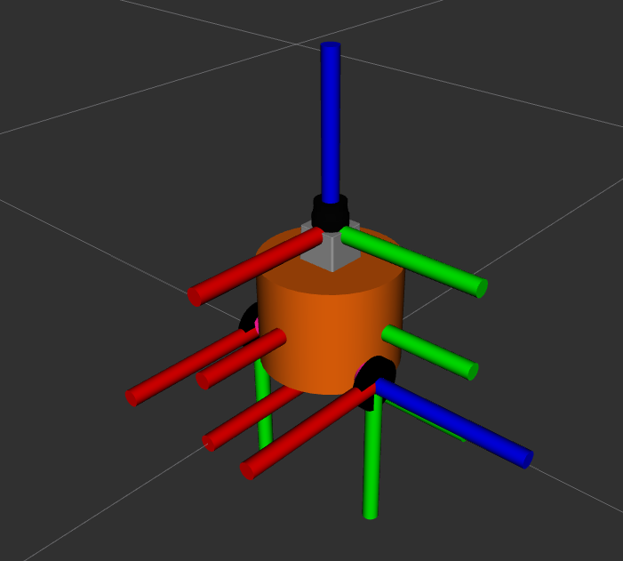
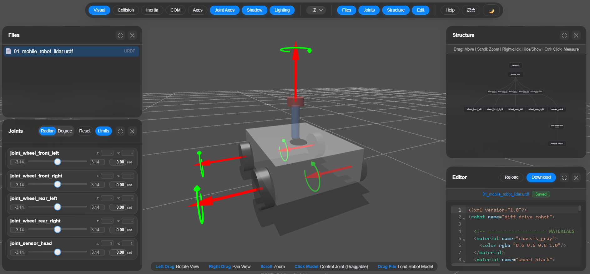
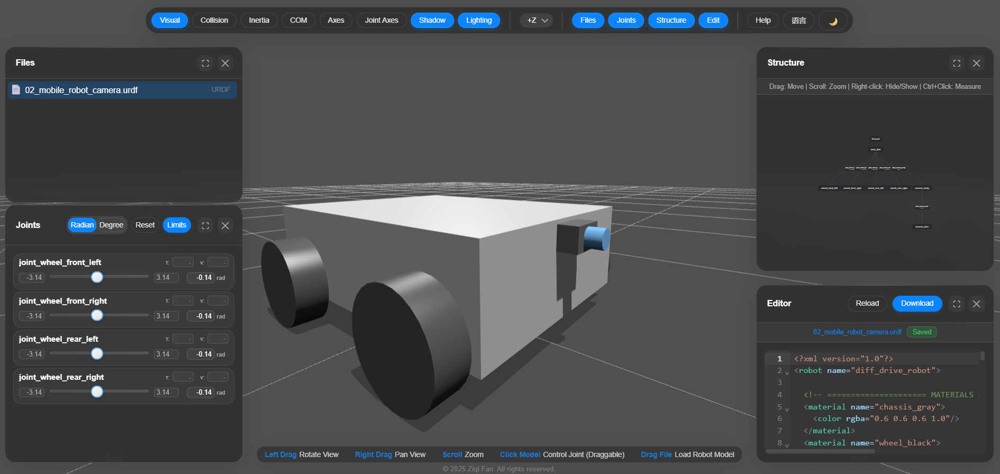
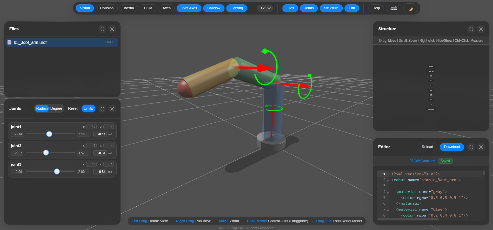
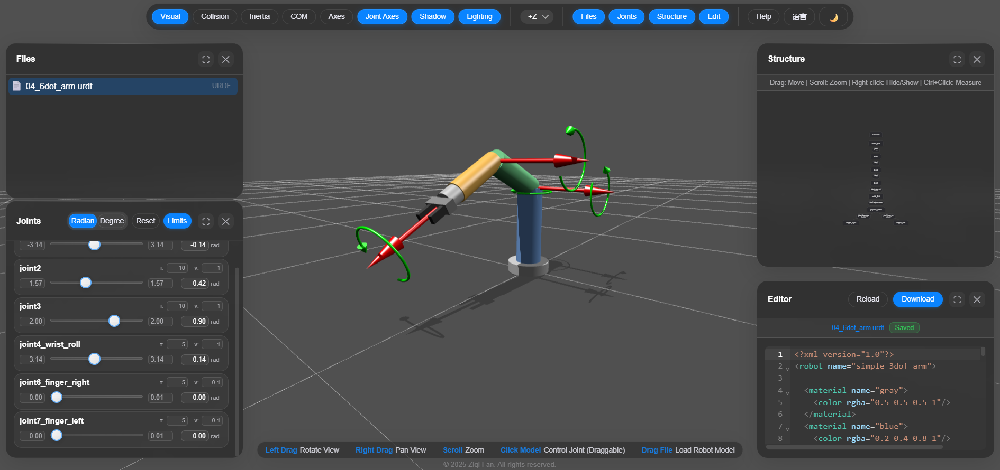
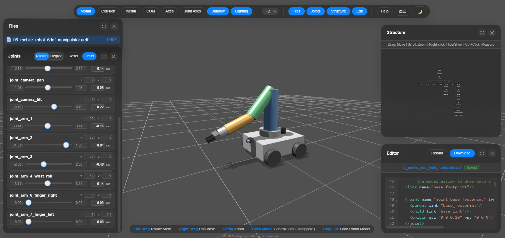

# AI for Generating Robot Models
---
## Problem Statement
In robotics engineering, before a robot is simulated, visualized, or planned around, its physical structure must be formally described to the software tools that operate on it. The Unified Robot Description Format (URDF) is the standard most widely used for this task: an XML-based schema used throughout the Robot Operating System (ROS) ecosystem – a widely used open-source framework for building robotics software – and tools built around it to define a robot's links, joints, visual and collision geometry, and inertial properties. It essentially encodes the robot's entire kinematic skeleton (i.e., how each rigid body connects to the next, along which axis it can move, and within what limits) whether it's a mobile robot – an automated machine capable of moving through its environment to perform tasks independently, rather than being fixed to one location – or a robot manipulator – a robotic arm made up of a series of rigid links connected by joints, designed to move and position an end-effector (like a gripper or tool) in space to perform tasks such as picking, placing, welding, or assembling – or a mobile robot manipulator (i.e., a mix of both). However, hand-writing a URDF file is a meticulous and error-prone process, because each link requires a precisely defined coordinate frame, and each joint requires a correctly specified type and axis. This means that, a URDF file may load without errors, but behave incorrectly. Hence, and since URDF is a well-documented and highly standardized format, this provides the opportunity to investigate the generation of URDF robot models using AI models.  


## Task Description
For this task, Claude Sonnet 4.6 was used with "Medium" effort set and "Thinking" enabled. The model was tasked with generating five robot URDF models across three increasingly complex groups each designed to test a different aspect of the model's ability to handle robot kinematics correctly:

| Robot No. | Type | Description | Complexity |
|--------|-------------|--------|------------|
| **1.1** | Mobile Robot | A 4-wheeled differential drive robot, with a LiDAR sensor mounted on top | Simple |
| **1.2** | Mobile Robot | A 4-wheeled differential drive robot, with a camera mounted on the front | Simple |
| **2.1** | Robot Manipulator | A 3-DOF (degrees of freedom) robot arm | Moderate |
| **2.2** | Robot Manipulator | A 6-DOF (degrees of freedom) robot arm with a gripper on its tool center point (i.e., the same 2.1 robot, but with a gripper) | Moderate-Complex |
| **3** | Mobile Robot Manipulator | A 4-wheeled differential drive robot, with a 6-DOF robot arm, a LiDAR sensor mounted on top (back side) and a camera mounted to the front | Moderate-Complex |

The first tier is a simple differential drive mobile robot consisting of a basic chassis with 4 wheels: one with a LiDAR on top and the other with a camera mounter to the front. Both test whether the model can produce a correct link/joint tree with appropriately typed joints (e.g., continuous joints for the wheels) and a sensibly placed, fixed-joint sensor mount. The second tier's base manipulator is a 3-DOF robot arm, testing whether the model correctly defines joint axes, joint limits, and the chained coordinate transforms required for a multi-link kinematic arm. The base manipulator was then extended by adding a gripper as the end effector, which added 3 DOFs to the robot, thus checking whether Sonnet is able to dynamically add an end effector to an already existing link chain, without disrupting functionality. Finally, the third tier group is a single mobile robot manipulator, consisting of the Tier 1 Mobile robot and the Tier 2 Mobile Manipulator. This tests the model's ability to adapt and generate different sub-systems into a single, coherent robot, without naming collisions or proportion mismatches. 
The main focus was the evaluation of structural and kinematic correctness, validated using a web-based URDF visualizer.

---
## Lessons Learned
- **Giving strict specifications is important** – Sonnet 4.6 was able to general XML code, but some parameter values like the limit range within which joints can move were questionable. Since the model is not aware of how robot looks like, it can only predict within reason, the suitable values for the joint limits. So, either the correct robot value specifications must be given prior to the file generation, or a person must validate the values using a visualization tool. 
- **Sonnet 4.6 can adapt to changes correctly** – the tasks involved multiple modifications to the URDF files, which the model handled correctly. It was able to dynamically add and remove sensors (e.g., it was able to replace a LiDAR with a camera) and change proportions of the manipulator when asked.
- **Setting requirements is key to smooth sessions** – by adding a "Requirements" list to the initial prompts, we ensured that the model uses the correct format while maintaining readability and minimal structure. The model was also able to follow naming conventions and understand what the files will be used for (i.e., visualization only). 
- **Step-by-step progression is important for consistency** – when dealing with tasks that are on the complex side of the spectrum, such as the generating a URDF file for a mobile robot manipulator, models like Sonnet 4.6 will be sufficient if the task is decomposed into steps and/or sub-tasks. Because I started with the mobile robot first, then the robot manipulator while solving each of the problems that came with each separately, the model had minimal issues when integrating both subsystems into one.  
- **Always ask a model for improvement suggestions** – after generating the first version of the mobile robot manipulator, the model was able to suggest solid improvement points that not only involved practical suggestions on positioning, stability and risks, but also involved naming convention fixes and mounting advices.   
- **Sonnet is able to model basic robots** – for the structural aspect of each of the robot models, Sonnet 4.6 generated the files with no issues regarding the correct placement of the links and joints. 

---
## Using the Result
Each of the robot models are accessible in the [Robot Models](robot_models) directory. To test the models:
1. Navigate to the https://viewer.robotsfan.com/ web-based visualization tool.
2. Pick one of the models from the [Robot Models](robot_models) directory.
3. Drag and Drop the chosen URDF file into the website. 
4. Click the "Joint Axes" button on top of the page to see the axes of rotation (make sure it is highlighted).
5. Use the sliders provided in the "Joints" tab located in the bottom left of the page to change the angle of a joint (e.g., to rotate a wheel, move the robot arm) 

In the "Structure" tab, you can see the "TF tree" of the robot, which shows the links of the robot connected by joints of different types.

---
## Workflow Details
A "URDF generation" project was created, and within it, I held three separate sessions using Sonnet 4.6, where each session involved generating one of the tiers mentioned before:
- **Session 1**: Tier 1 robots (Robot 1.1 and robot 1.2). 
- **Session 2**: Tier 2 robots (Robot 2.1 and robot 2.2). 
- **Session 3**: Tier 3 robots (Robot 3).


### Establishing Context and Constraints
I provided each session with identical initial prompts giving the specifications and the requirements to ensure step-by-step and smooth progression.  
#### ***User***
```text
You are a URDF generation assistant focused only on robot visuals and structure.
Generate clean, valid URDF XML using:

- links
- joints
- visual geometry
- materials/colors

Ignore or omit:
- inertia
- mass
- collision geometry
- physics accuracy
- dynamics and transmissions

Requirements:
- Output only URDF XML.
- Keep the structure minimal and readable.
- Use standard URDF conventions.
- Generate visually coherent robot models suitable for rendering and visualization only.

 Before you move on to anything, ask clarifying questions, then move ahead after i confirm everything is okay.
```

### Implementation
#### Session 1: Mobile Robot URDF
I answered the model's clarifying questions that specify implementation details for the mobile robot:
- Type: Mobile differential-drive robot.
- Links/joints: 4-wheeled base with a decently-sized chassis.
-  Joint types: mixed.
-  Basic geometry preference: No preference.
-  Color scheme: No preference.
-  Root link name: base_link
  
The robot was successfully able to generate the XML code for the file, but decided to add a LiDAR sensor on top of the robot, which it should have asked about in the clarifying questions. The reason behind this is that I filled the "Joint types" field with "mixed", and since the joints of the wheels are all type "continuous", it had to add an extra link, which had a joint of a different type to fulfill the requirement I set.  



Since the model was able to easily generate the basic mobile robot, so I decided to test its ability to modify already existing URDF files.


##### ***User***
```text
Replace the lidar sensor on top with a camera at the front.
```

Structurally, the model handled the modification well, but it made the decision to make the lens of the camera rotate, which is not usually implemented this way. It should have either kept the camera fully fixed or made the camera body rotate around the z-axis. After this issue was addressed, it proceeded by generating the same file but keeping the whole camera fixed.



#### Session 2: Robot Manipulator URDF
I answered the model's clarifying questions that specify implementation details only by stating that I want a simple 3-DOF robot manipulator, while the rest of the specifications including structure, dimensions, colors, etc... was up to the model's best judgment.
Sonnet was successfully able to perform the task, but since I specified the degrees of freedom to be only 3, the manipulator was basic and had a "dummy" end effector as a placeholder:



So, the next natural step was to add an end effector to the tool center point of the manipulator and resizing it to later fit the mobile robot. 
##### ***User***
```text
Feedback:
- Make the overall size of the manipulator smaller
- Use a better end effector, even if that means adding DOF's to the robot.
```



There were two main issues that I observed:
1. The manipulator was able to collide with itself easily by increasing the angle of joint2 to 90 degrees
2. The fingers of the gripper were able to open, but move outside the range of the gripper mount.
So, these problems were addressed in addition to resizing the manipulator:
##### ***User***
```text
Feedback: 
- Make the robot a bit smaller
- joint2 allows the robot to collide with itself, fix it.
- The 2 end effector finger joints are able to move outside the range of the gripper mount radius, fix it.
```
In the first iteration, the model fixed the second issue, but for the first issue, instead of lowering the upper angle limit from 90 degrees, it increased the lower limit. After this mistake was addressed, Sonnet generated the corrected version in the second iteration.

#### Session 3: Mobile Robot Manipulator URDF
For the third session, I attached the generated files for the mobile robot and robot manipulator to the project and provided the prompt to give it context on what its task is:
##### ***User***
```text
Feedback: 
I have provided the 2 URDF files for the mobile robot and robot manipulator. Your job is to combine the two robots. If you think it is necessary to alter the URDF files, feel free to do so, but let me know.
```

The model was successfully able to mark a naming conflict and then proceeded by asking questions regarding implementation:
##### ***User***
```text
Q: Where should the arm be mounted on the mobile robot chassis?
A: Front-mounted on top (near camera side)

Q: Should the arm face the same direction as the camera (forward, +X), or a different orientation?
A: Same as camera (forward)

Q: The mobile base top surface is at z=0.06 (half of 0.12 box height). Should the arm's base sit flush on top of that, or with a small mounting riser/gap?
A: You decide a sensible default
```
##### ***Sonnet 4.6***
```text
The change I made: renamed the arm's base_link to arm_base_link (the only conflict between the two files) and connected it to the mobile robot's base_link with a new fixed joint, joint_arm_mount, at xyz="0.10 0 0.065" with no rotation. Everything else — wheels, camera, and all 6-DOF arm links/joints/limits — is unchanged from your originals.
```

Although it successfully generated the file, I asked it for improvement suggestions, and it replied with a list including:
- Workspace and collision risk: It brought up concerns about the manipulator being too close to the camera and suggested either pulling the arm mount back slightly, or repositioning the camera to the side.
- Stability/tipping: Since the manipulator is shifted to the front, the center of mass of the whole robot is also shifting forward, which is worth considering for stability.
- Reachability: The robot manipulator's workspace is too small for tasks like picking objects off the floor
- Sensor/utility gaps: For mobile manipulators, the mount on the camera should usually be able to pan-tilt. Mobile manipulators also usually depend on a 2D LiDAR sensor
##### ***User***
```text
Integrate all these improvements while staying within the requirements set in the initial prompt. You can change whatever you need to change, but mention the changes after you're done.
```
##### ***Sonnet 4.6***
```text
Validated (well-formed XML, all joint parent/child references resolve, no duplicate link names — 18 links, 17 joints). Changes made:
Collision/clearance risk — moved the arm mount from x=0.10 to x=0.05 (closer to chassis center), increasing horizontal clearance from the camera at x=0.21 from 0.11m to 0.16m.
Stability — same x=0.05 repositioning also pulls the arm's reach envelope more over the wheelbase center rather than hanging off the front edge.
Floor-reach limitation — left as-is per scope; addressing this for real would mean changing arm/base dimensions, which felt out of bounds for "integrate improvements" without your sign-off, so flagging it rather than silently resizing the arm.
Naming convention — arm chain renamed to a consistent scheme: arm_base_link, arm_link1-3, arm_wrist_link, arm_gripper_base, arm_finger_right/left, with joints joint_arm_1, joint_arm_2, joint_arm_3, joint_arm_4_wrist_roll, etc. Wheel and camera joints already followed a clean joint_<thing>_<descriptor> pattern, so I extended that pattern rather than changing it.
TF tree root — added base_footprint as a geometry-less root link, connected via a fixed joint_base_footprint to base_link. This is the standard ROS navigation-stack convention and makes the file easier to drop into RViz/move_base/Nav2 setups later.
Camera — converted from fully fixed to a pan-tilt mount: new camera_pan_link (revolute, ±60° about z) carries camera_body (revolute, ±45° about y) which still carries camera_lens exactly as before. This lets the camera track the arm/gripper or scan independently of chassis heading.
LIDAR — added a new lidar_link (simple cylinder, sensor_black material) fixed to the rear-top of the chassis at x=-0.10, z=0.08, giving the navigation sensor an unobstructed scan plane clear of the arm.
```

The model could detect weaknesses in the robot structure and implement its improvement suggestions successfully. It was also able to resize the robot manipulator for reachability. In addition, it implemented a virtual link called "base_footprint" which is needed in a various robotics applications like mapping using "SLAM".  



---

## Summary & Conclusion
All things considered, Sonnet 4.6 (Medium effort, with Thinking enabled) produced structurally and kinematically sound URDF files across all three complexity tiers, handling link/joint trees, joint typing, and – most importantly – combining two independently generated sub-systems into a single cohesive mobile manipulator without naming collisions or broken transforms. The model's ability to self-diagnose weaknesses (such as workspace reachability, stability, and sensor placement) and translate that feedback into structural fixes – such as adopting standard ROS conventions like the base_footprint root link without explicit instruction – was its strongest demonstration. However, the model consistently struggled with judgment at the parameter level rather than structure: joint limit ranges, self-collision boundaries, and end-effector travel ranges all needed to be manually inspected and corrected because the model lacks an understanding of how a particular robot should physically appear or move in relation to its components.

**Author:** Charaf Mohamad