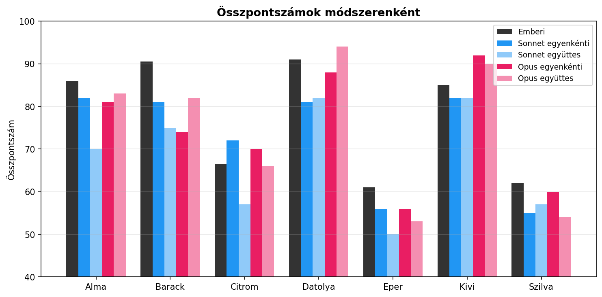
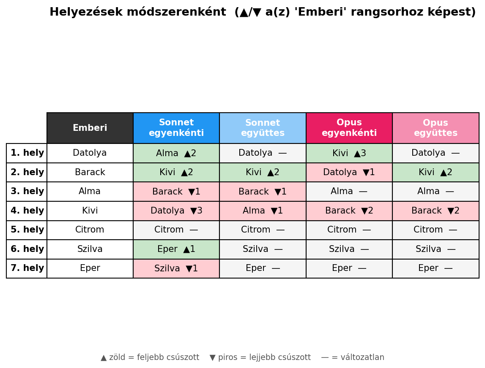
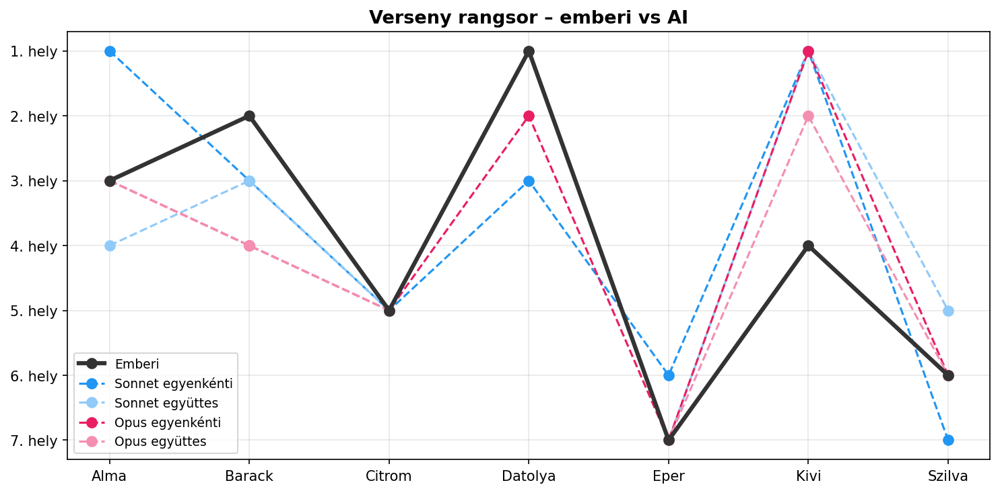
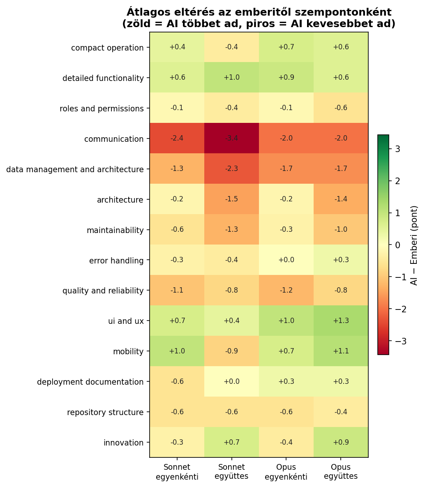
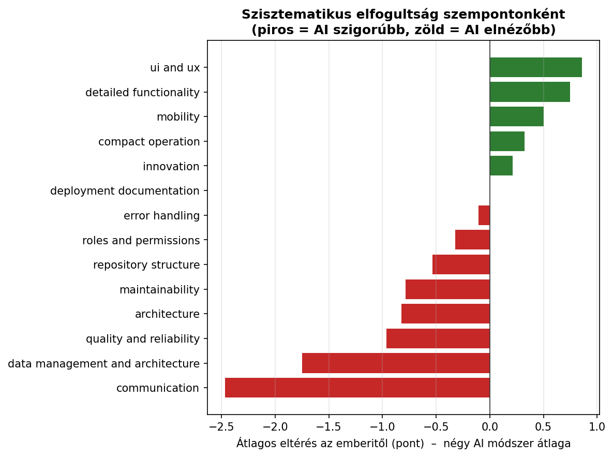
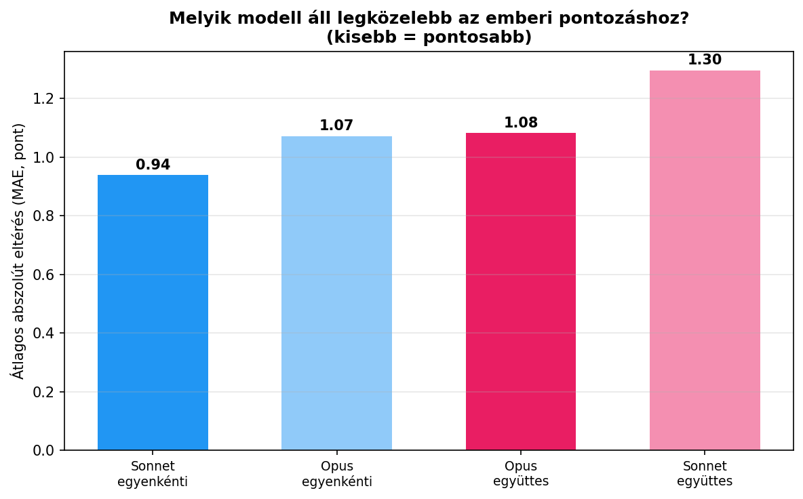
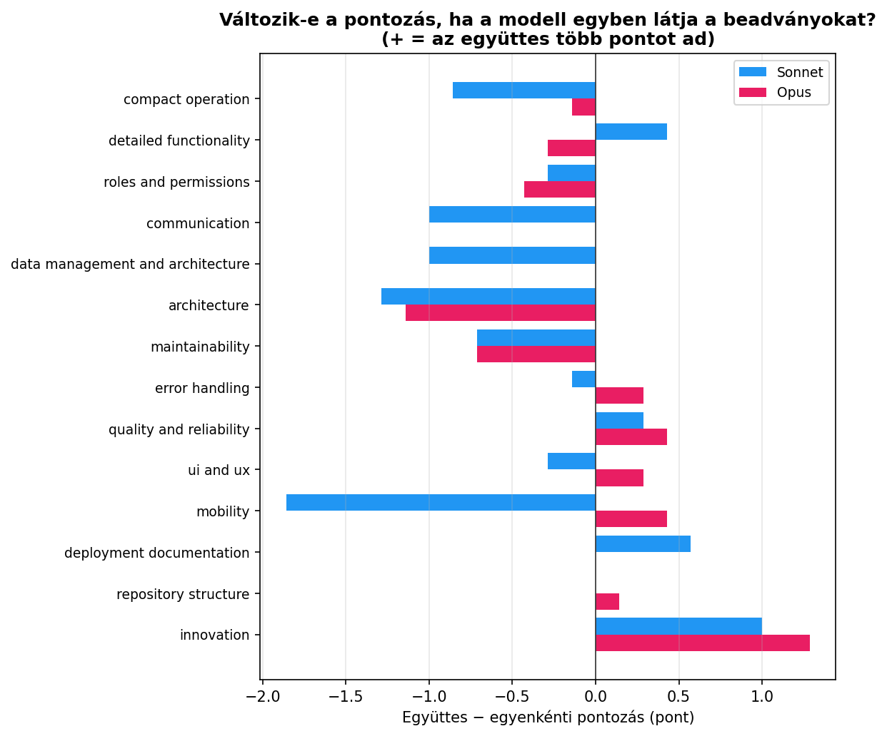

# AIGrader – Emberi vs. AI értékelés összehasonlítása

Ez az elemzés azt vizsgálja, mennyire jól reprodukálja az AI (Claude Sonnet és Opus) az emberi pontozást 7 diák beadványain, 14 szempont mentén.

## Vizsgált módszerek

| Módszer | Leírás |
|---|---|
| **Emberi** | A referencia – az oktatói pontozás |
| **Sonnet egyenkénti** | Sonnet, minden beadványt külön értékelve |
| **Sonnet együttes** | Sonnet, az összes beadványt egyben látva |
| **Opus egyenkénti** | Opus, minden beadványt külön értékelve |
| **Opus együttes** | Opus, az összes beadványt egyben látva |

A 14 szempontos pontozási rubrik és a pontos prompt: [`prompt_individual.md`](prompts/prompt_individual.md) (egyenkénti értékeléshez), [`prompt_combined.md`](prompts/prompt_combined.md) (együttes értékeléshez). Az elemzést és a diagramokat az [`analyze.py`](analyze.py) szkript generálja.

---

## 1. Összpontszámok és rangsor

A diákok helyezése módszerenként, hogy az **Emberi** rangsorhoz képest ki csúszott feljebb (▲ zöld) vagy lejjebb (▼ piros):

Ugyanez sávdiagramként, itt jól látszik, mennyire összekeveredik a rangsor:

A felső és alsó mezőny stabil: Citrom végig 5., Szilva és Eper az utolsó két hely között mozog minden módszernél. A középmezőnyt viszont összekeverik az AI-k: az Opus egyenkénti például 3 hellyel feljebb tolta Kivit (▲3), a Sonnet egyenkénti pedig 3 hellyel lejjebb Datolyát (▼3).

---

## 2. Rangsor-korreláció (Spearman)

Mennyire egyezik az AI **sorrendje** az emberivel (1.0 = tökéletes, 0 = független):

| Módszer | Spearman ρ | p |
|---|---|---|
| Sonnet együttes | **0.527** | 0.224 |
| Opus együttes | 0.500 | 0.253 |
| Opus egyenkénti | 0.429 | 0.337 |
| Sonnet egyenkénti | **0.055** | 0.908 |

A sorrend reprodukálásában az együttes értékelés jobb, mint az egyenkénti. A Sonnet egyenkénti gyakorlatilag nem találja el a diákok közti sorrendet. (A kis mintán, n=7, ez statisztikailag nem szignifikáns, inkább tendencia, mint bizonyíték.)

---

## 3. Hol tér el az AI az embertől? (kritérium-hőtérkép)

Átlagos eltérés szempontonként és módszerenként (zöld = AI többet ad, piros = AI kevesebbet ad):

A `communication` az egyetlen nagyon piros sor (−2.0…−3.4) minden módszernél, és a `data_management_and_architecture` is végig negatív. A `ui_and_ux`, `detailed_functionality` és `mobility` viszont jellemzően zöld.

Hallgatónkénti (nem átlagolt) bontásban, az egyenkénti értékelésekre: [`aigrader_results.png`](image/aigrader_results.png).

---

## 4. Szisztematikus elfogultság

A négy AI módszer átlaga szempontonként – mit pontoz az AI rendszeresen túl vagy alul:

| | Szempont | Átlagos eltérés |
|---|---|---|
| 🔴 **Legszigorúbb** (AI alulpontoz) | communication | **−2.46** |
| | data management and architecture | −1.75 |
| | quality and reliability | −0.96 |
| ⚪ **Egyetértés** | deployment documentation | ~0.00 |
| 🟢 **Legelnézőbb** (AI túlpontoz) | ui and ux | **+0.86** |
| | detailed functionality | +0.75 |
| | mobility | +0.50 |

Az AI-k szigorúbbak a „puha", szövegből nehezen ellenőrizhető szempontoknál (kommunikáció, adatkezelés, megbízhatóság), és elnézőbbek a felületi/funkcionális szempontoknál (UI/UX, funkcionalitás, mobilitás).

---

## 5. Melyik modell áll legközelebb az emberihez? (pontosság)

Cellánkénti átlagos abszolút eltérés (MAE) az emberi pontszámtól – kisebb = pontosabb:

| Módszer | MAE | RMSE |
|---|---|---|
| **Sonnet egyenkénti** | **0.94** | 1.38 |
| Opus egyenkénti | 1.07 | 1.52 |
| Opus együttes | 1.08 | 1.50 |
| Sonnet együttes | 1.30 | 1.80 |

Ez ellentmond a Spearman-eredménynek: a Sonnet egyenkénti abszolút értékben a legpontosabb (a konkrét pontszámokat találja el a legjobban), miközben a sorrendet reprodukálja a legrosszabbul (ρ=0.055). Jó pontszámokat ad, de a diákok közti finom sorrendet nem ragadja meg.

---

## 6. Számít-e, hogy a modell egyben látja-e a beadványokat?

Együttes mínusz egyenkénti pontozás szempontonként (+ = az együttes nézet többet ad):

| Modell | Átlagos változás (együttes − egyenkénti) |
|---|---|
| Sonnet | **−0.37** pont/szempont |
| Opus | +0.01 pont/szempont |

A Sonnet összességében szigorúbb lesz, ha egyben látja a beadványokat (legerősebben a `mobility`, `architecture` és `communication` szempontoknál). Valószínűleg az egymáshoz hasonlítás húzza le a pontokat. Az Opust ez gyakorlatilag nem befolyásolja, az `innovation`-nél viszont mindkét modell magasabbra értékel együttes nézetben.

---

## Összefoglaló tanulságok

1. **Az AI sorrendje csak közepesen egyezik az emberivel** (ρ ≈ 0.4–0.5), a felső/alsó mezőnyt eltalálja, a középmezőnyt keveri.
2. **Szempontfüggő elfogultság:** szigorú a kommunikáció/adatkezelés, elnéző az UI/funkcionalitás terén – ezt érdemes lehet a promptban korrigálni.
3. **Pontosság ≠ sorrend:** a legjobb abszolút pontosság (Sonnet egyenkénti) nem ugyanaz, mint a legjobb rangsor (együttes módszerek).
4. **Az „egyben látás" a Sonnetet szigorítja, az Opust nem** – fontos módszertani döntés, ha az AI-t osztályozásra használnánk.

> Kis minta (n=7): az eredmények **tendenciák**, nem statisztikailag bizonyított állítások.

## Nyers adatok

- AI-kimenetek (nyers pontszámok kritériumonként): [`sonet.json`](data/sonet.json) (egyenkénti), [`sonet_all.json`](data/sonet_all.json) (együttes), [`opus.json`](data/opus.json) (egyenkénti), [`opus_all.json`](data/opus_all.json) (együttes)
- Összesített eredménytáblák: [`results.csv`](data/results.csv), [`results_detailed.csv`](data/results_detailed.csv)
- Elemző szkript: [`analyze.py`](analyze.py)
