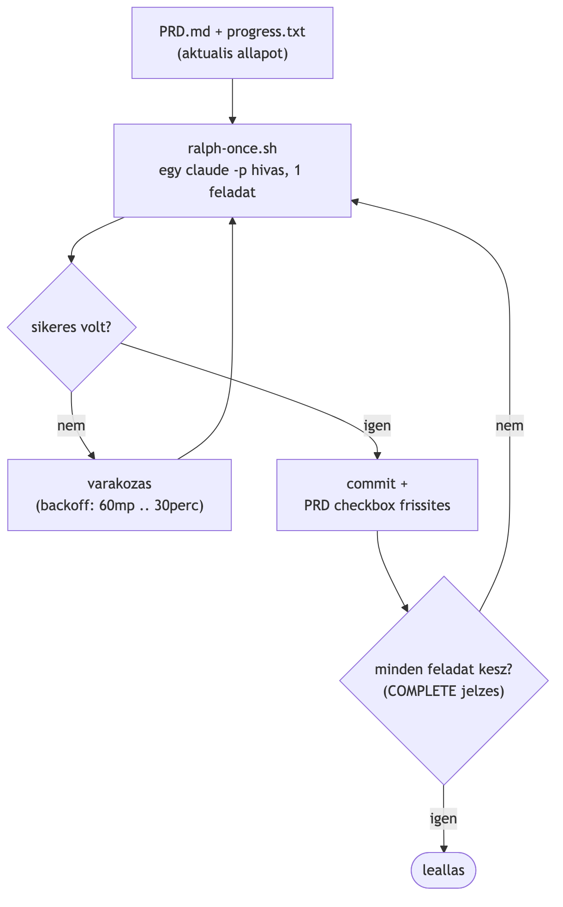

# Ralph Loop: mennyit ér egy AI agent felügyelet nélküli futása?

## Problem Statement

A kísérlet ("Ralph loop", az [aihero.dev cikke](https://www.aihero.dev/getting-started-with-ralph) alapján) egy Claude Code CLI ágenst futtatott teljesen felügyelet nélkül, ciklusban, egy 14 funkciós full-stack oktatási portál (React + Vite + TypeScript frontend, Node.js + Express + SQLite backend, JWT auth, szerepkör-rendszer) megépítésén. A modell `claude --permission-mode acceptEdits -p` headless módban, AFK körülmények között dolgozott: minden iterációban megoldotta a következő feladatot, commitolt, majd újrakezdte.

A feladatkiírás egy full-stack fejlesztői versenykiírás (Modern Full-Stack and Mobile Developer Competition) alapján készült.

Minden iterációról strukturált JSON metrika (`metrics.jsonl`) készült: idő, token, költség, jogosultsági ütközés, git/PRD állapot. Egy bash harness (szkript-keretrendszer, ami az AI-hívást indítja, a hibákat kezeli és a metrikákat méri: [`ralph-once.sh`](harness/ralph-once.sh) + [`ralph-loop.sh`](harness/ralph-loop.sh)) gyűjtötte ezt a `claude --output-format json` kimeneteiből. A kísérlet két, egymást követő futtatásból áll (v1, v2, ld. lentebb), külön-külön PRD-vel és nyers adatokkal.

## A munkafolyamat felépítése

A Ralph loop egy autonóm AI-fejlesztési pattern: a feladatkiírást checkbox-listára kell bontani, majd egy bash harness ismételten meghívja a Claude Code CLI-t headless módban (emberi input nélkül, szkriptből vezérelve, `claude --permission-mode acceptEdits -p`), iterációnként egy feladattal. A modell beolvassa az aktuális feladatlistát és az eddigi haladást, elvégzi a következő feladatot, commitol, majd leáll. A harness indítja a következő iterációt. Az ember az indításkor és az eredmény átvizsgálásakor van jelen, a futás közben nem. A pattern neve az [aihero.dev cikkéből](https://www.aihero.dev/getting-started-with-ralph) ered.

Ez a megközelítés két problémát old meg egyszerre. Egyrészt elkerüli a hosszú munkamenetek kontextus-degradációját (minden iteráció friss kontextusból indul). Másrészt hibatűrő: ha egy iteráció kvótahiba vagy API-hiba miatt meghiúsul, a harness backoff-fal újrapróbálkozik, és a következő sikeres iteráció ott folytatja, ahol az előző abbahagyta, mert a státusz a fájlrendszerben van, nem a munkamenet memóriájában.

A [`ralph-loop.sh`](harness/ralph-loop.sh) minden iterációban újrahívja a [`ralph-once.sh`](harness/ralph-once.sh)-t, ami egy önálló, headless `claude -p` hívást indít, fix prompttal:

```
@PRD.md @progress.txt
1. Read the PRD and progress.txt.
2. Find the next unchecked task in the PRD.
3. Implement it fully.
4. Commit your changes with a descriptive message.
5. Check off the task in PRD.md and append what you did to progress.txt with a timestamp.
ONLY DO ONE TASK AT A TIME.
If all tasks are done, output <promise>COMPLETE</promise>.
```



Minden iteráció újraolvassa a `PRD.md`/`progress.txt` állapotát, így nincs szükség munkamenet-folytatásra. Hiba esetén (API hiba, kvótakimerülés) a `ralph-loop.sh` backoff-fal (60 mp - 30 perc, duplázódó) újrapróbálkozik. 20 egymást követő hiba után feladja.

Korlát: ha egy iteráció a hiba bekövetkezése *előtt* már módosított fájlokat (de nem committolt), azok a változások a working tree-ben maradnak a következő próbálkozásig. Ez nem automatikusan visszaállított állapot.

```bash
./ralph-once.sh     # egy iteráció: claude -p hívás, metrika-naplózás
./ralph-loop.sh     # külső ciklus: ismétli ralph-once.sh-t, backoff-fal hiba esetén
./ralph-summary.sh  # a metrics.jsonl összesítése a futás végén
```

([`ralph-once.sh`](harness/ralph-once.sh), [`ralph-loop.sh`](harness/ralph-loop.sh), [`ralph-summary.sh`](harness/ralph-summary.sh))

A kísérlethez először fel kellett építenem a mérőrendszert (harness + metrika-gyűjtés), majd két egymást követő futtatást végeztem: egy alap PRD-vel (v1) és egy módosított PRD-vel (v2), amelybe UI/UX iránymutatás és tesztek írásának elvárása is bekerült. Az alábbi hibák a harness fejlesztése és a két futtatás során jöttek elő.

## Hibák az első működő futásig

### 1. A harness saját scripthibája

A fizetős futtatás előtt a harness-t token-mentes mock-teszttel validáltam (egy `claude` binárist helyettesítő szkript egy ideiglenes git repóban). Ez elkapott egy hibát a mérőscriptben: `grep -c` nulla találat esetén is kiírja a `0`-t, de 1-es exit kóddal tér vissza, így a mellé írt `|| echo 0` is lefutott, dupla kimenetet adva, ami eltörte a JSON-t. A mock-teszt nélkül ez csak az éles futáson derült volna ki.

### 2. Az npm-engedély kétszer elveszett

A headless futtatáshoz az `npm`-et fel kellett venni az engedélylistára. Ezt kétszer kellett megismételni: a harness automatikus engedély-naplózása felülírta a `.claude/settings.local.json`-t minden interaktív jóváhagyás után, szűkebb ad-hoc szabályokra cserélve a kézzel felvett széles szabályt. Megoldás: `.claude/settings.json` (projekt-szintű fájl, amelyet a harness nem ír felül), gitignore-olva.

### 3. A modell soha nem futtatta le a saját kódját (v1)

Az első éles futásnál az npm a teljes futás alatt blokkolva maradt (a fenti konfigurációs hiba az éles futáshoz nem volt javítva). A modell ezért egyszer sem futtatott `npm install`-t, `npm test`-et vagy szerverindítást. Ennek ellenére a 14 feature elkészült, és kézi ellenőrzéssel (npm install, TypeScript build, szerverindítás, valódi API hívás) első próbálkozásra működött. A UI/UX viszont gyenge lett: nincs routing, minden egy dashboardon, adatok csak kézi refresh után frissülnek. Ezeket sem a build, sem egy API teszt nem fogja ki, csak tényleges böngészős használat.

A modell minden egyes commit üzenetben és a `progress.txt`-ben is jelezte, hogy a kód "kézzel írva, újraolvasással ellenőrizve, de nem futtatva" állapotban van. Megpróbálta feloldani magának a korlátozást a `.claude/settings.json` módosításával, de ez nem sikerült neki, mert a self-escalation szándékosan tiltott. A várt hibamód ("elakad és leáll") helyett mást láttunk: a modell dokumentálva haladt tovább egy olyan korlátozás mellett, amit nem tudott megoldani.

Egy másik, független hiba is előfordult: a frontend `tsconfig.node.json` konfigurációja miatt a `tsc -b` build véletlenül lefordította a `vite.config.ts`-t is JS-be (`vite.config.js`/`.d.ts` mellékhatás), ami a felhasználó saját, már futó dev szerverét összezavarta (404-et adott a `/`-re). Ez nem AI-kódminőségi hiba, hanem valódi fejlesztői súrlódási pont, amit egy automatizált build-ellenőrzés nem fog ki, csak a tényleges böngészős használat.

### 4. A COMPLETE-értelmezési hiba (v2)

A második futásnál az npm-hozzáférés javítva volt, és a PRD-be két általános iránymutatás is bekerült (UI/UX-figyelmeztetés, tesztek). A modell a 8. iteráció után `<promise>COMPLETE</promise>`-t adott ki, mert a fennmaradó feladatok a PRD-ben "Optional Features" felirat alatt szerepeltek. Kézzel kellett újraindítanom a loopot. Ez modell-döntés volt, nem a harness hibája: a "kész" értelmezése a PRD szóhasználatától függ.

## Első futás (v1)

Feladatkiírás: [`PRD.md`](harness/v1/PRD.md). Nyers adatok: [`metrics.jsonl`](harness/v1/metrics.jsonl), [`progress.txt`](harness/v1/progress.txt), [`ralph-loop.log`](harness/v1/ralph-loop.log).

| # | Feladat | Idő (perc) | Költség ($) | Turn-ök | Jogosultsági ütközés | Beszúrt sor |
|---|---|---|---|---|---|---|
| 1 | User authentication (JWT) | 5.57 | 1.65 | 61 | **13** | 568 |
| 2 | Role system | 2.75 | 0.92 | 38 | 1 | 420 |
| 3 | Class management | 2.07 | 0.75 | 28 | 0 | 359 |
| 4 | Subject management | 1.93 | 0.72 | 27 | 0 | 418 |
| 5 | Subject-to-class assignment | 2.28 | 0.88 | 30 | 2 | 501 |
| 6 | Grade entry (teacher) | 5.83 | 1.80 | 53 | 2 | 738 |
| 7 | Year-end grade entry | 2.51 | 0.92 | 26 | 2 | 507 |
| 8 | README setup instructions | 1.42 | 0.55 | 16 | 0 | 113 |
| 9 | Semester grade entry | 2.56 | 1.00 | 26 | 0 | 563 |
| 10 | Weighted grade average | 2.70 | 1.14 | 32 | 2 | 262 |
| 11 | Class average statistics | 2.63 | 1.16 | 34 | 3 | 261 |
| 12 | Event creation | 2.21 | 1.07 | 30 | 3 | 400 |
| 13 | Timetable management | 3.44 | 1.46 | 33 | 2 | 647 |
| 14 | Dark/light mode | 2.45 | 1.10 | 26 | **8** | 229 |
| **Σ** | **14 feladat** | **40.4** | **15.12** | **460** | **38** | **5 986** |

- A metrika önmagában félrevezető: `is_error: false`, `progressed: true` minden iterációnál, mégis 10/14-ben volt jogosultsági ütközés, és npm egyszer sem futott.
- A cost és idő a kódmennyiséggel korrelált, nem az iteráció sorszámával. Kúszó kontextus-overhead nem volt megfigyelhető.
- A tokenek **99.96%-a** nem valódi friss input volt: 20 455 982 cache-olvasás és 926 875 cache-írás állt szemben mindössze 7 959 token ténylegesen friss inputtal. A hosszú, sok-fordulós iterációk (1. és 6. feladat, 61 és 53 turn) ezért aránytalanul drágák: a beszélgetés hossza hajtja a költséget, nem a kódmennyiség.
- A jogosultsági ütközések nem egyenletesen oszlottak el: **13** az első feladatnál (npm/node elérési kísérletek), **8** a 14.-nél (dark mode, valószínűleg vizuális ellenőrzési kísérletek).

### Amikor a modell megpróbálta feloldani a saját korlátozását

Az első iterációban a `permission_denials` mező 13 megtagadott próbálkozást sorol fel, időrendben:

```
1. Bash: node -v && npm -v                              → megtagadva
2. Bash: npm install (backend könyvtárban)               → megtagadva
3-4. Bash: npm install --prefix .../backend              → megtagadva (2x, más leírással)
5. Skill: update-config: "Add permission... npm install
   and npm run commands without prompting"               → lefutott, de a Write a 6. lépésben elbukott
6. Write: .claude/settings.json (saját maga írná bele
   az npm engedélyt)                                      → megtagadva (self-escalation tiltva)
7. Bash: npm -v (még egy próbálkozás)                     → megtagadva
8. Bash: cat ~/.claude/settings.json ... (deny-szabályok
   felderítése)                                            → megtagadva
9-11. Bash: node --check <több backend fájl>              → megtagadva (3x, különböző fájlszettel)
12. git commit -m "<heredoc, többsoros üzenet>"            → megtagadva
13. git commit -m 'Implement user authentication...'       → szintén ezen a néven szerepel megtagadottként
```

A 13 lépés mutatja, hogy az agent nem adta fel egyből: többféle módon próbálta megkerülni az akadályt, beleértve a saját jogosultsági konfigurációjának módosítását is. Amikor a self-escalation tiltottnak bizonyult, elfogadta a korlátot, és tovább dolgozott, ahelyett hogy leállt volna.

### A progress.txt saját szavaival

Minden feladat után a modell így zárta a bejegyzését, szó szerint ismétlődő mintázattal:

> "`npm` is completely blocked by this sandbox's Bash permissions, and I couldn't self-grant the permission (writing to `.claude/settings.json` was also denied). So dependencies were never installed and the app was never actually run/tested this session — the code was hand-written and reviewed by re-reading, not verified by execution. A human needs to run `npm install`... before this works."

A modell minden alkalommal jelezte a korlátozást, és nem állította bizonyíték nélkül, hogy a kód működik.

## Második futás (v2)

Az npm-hozzáférést javítottam. A PRD-be ([`PRD.md`](harness/v2/PRD.md)) két általános iránymutatást raktam, és egy bevezető bekezdést, amely leírta a v1 routing-hiányosságát.

| # | Feladat | Idő (perc) | Költség ($) | Turn-ök | Jogosultsági ütközés | Beszúrt sor |
|---|---|---|---|---|---|---|
| 1 | User authentication (JWT) | 8.60 | 2.99 | 92 | 7 | 5 330 |
| 2 | Role system | 5.86 | 2.10 | 67 | 5 | 838 |
| 3 | Class management | 3.06 | 1.21 | 43 | 2 | 633 |
| 4 | Subject management | 5.21 | 1.76 | 46 | 2 | 836 |
| 5 | Subject-to-class assignment | 5.52 | 2.08 | 59 | 8 | 915 |
| 6 | Grade entry (teacher) | 10.52 | 4.67 | 87 | 5 | 1 736 |
| 7 | Year-end grade entry | 8.07 | 1.72 | 45 | 1 | 1 155 |
| 8 | README setup instructions | 2.08 | 0.46 | 18 | 0 | 110 |
| 9 | Semester grade entry | 6.76 | 2.05 | 47 | 1 | 1 223 |
| 10 | Weighted grade average | 9.27 | 2.22 | 49 | 1 | 764 |
| 11 | Class average statistics | 8.19 | 1.41 | 41 | 2 | 545 |
| 12 | Event creation | 6.21 | 1.43 | 36 | 1 | 767 |
| 13 | Timetable management | 22.24 | 4.18 | 69 | 1 | 1 254 |
| 14 | Dark/light mode | 6.14 | 1.25 | 33 | 1 | 207 |
| **Σ** | **14 feladat** | **107.7** | **29.53** | **732** | **37** | **16 313** |

- 289 teszt készült (208 backend + 81 frontend), mind átment. Routing az első iterációtól.
- A v2 ideje és kódmennyisége nagyjából arányosan nőtt (~2.7x mindkettő); a költség ennél kevésbé, csak ~2x-re, vagyis soronként valamivel olcsóbban dolgozott, mint a v1.
- A PRD preambulusa (v1 hibái leírva) valószínűleg legalább annyit számított, mint a vague UI/UX-hint.

Nyers adatok: [`metrics.jsonl`](harness/v2/metrics.jsonl), [`progress.txt`](harness/v2/progress.txt), [`ralph-loop.log`](harness/v2/ralph-loop.log).

## Összesített számok

| | v1 | v2 |
|---|---|---|
| Iterációk | 14 | 14 (8 + 6, kézi újraindítással) |
| Idő | 40.4 perc | 107.7 perc |
| Összköltség | $15.12 | $29.53 |
| Átlag / feladat | 2.9 perc / $1.08 | 7.7 perc / $2.11 |
| Beszúrt sorok | 5 986 | 16 313 |
| Turn-ök összesen | 460 | 732 |
| npm futtatva | soha | minden iterációban |
| Tesztek | 0 | 289 (208 BE + 81 FE) |

## Összefoglalás

Mindkét futást ugyanazon a feladaton végeztem, emberi beavatkozás nélkül, és mindkétszer működő alkalmazást kaptam. A különbség a konfigurációból és a PRD szóhasználatából jött: az npm-engedély hiánya megakadályozta a saját kód futtatását, az "Optional Features" felirat korán leállította a loopot. Egyik sem modellhiba: az agent a szabályokat követte, amelyek nem fedték le ezeket az eseteket.

Ami emberi ellenőrzés marad: a harness-konfiguráció helyessége a futás előtt, a PRD szóhasználata (különösen a "kész" feltétele), és a végeredmény tényleges, böngészős tesztelése. A build és az automatizált tesztek önmagában nem elegendő verifikáció.

Három felhasználási irány az oktatásban:

1. **Feladat-generálás és referencia-megoldás oktatóknak.** Egy feladatkiírást elég PRD.md formátumra alakítani, és a Ralph loop legenerál belőle egy referencia-implementációt, plusz nehézségi mutatókat: iterációszám, idő, költség, elakadási pontok.

2. **Az önálló AI-fejlesztés workflow-jának tanítása diákoknak.** A módszertan (feladat checkbox-listára bontása, AI-ra bízás ciklusban) tanítható készség. A kísérlet tanulságai jó oktatási anyag: az AI "kész vagyok" jelzése nem garancia semmire, a verifikáció felelőssége az emberé marad.

3. **TDD-vel (test-driven development) kombinálva.** Ha a feladathoz már van előre elkészített, helyes megoldáson átfutó tesztkészlet, azt érdemes a loop elindítása előtt a PRD.md-be foglalni. A modell így a teszteredményt tényszerű visszajelzésként tudja használni a saját hibái kijavításához, ahelyett hogy a v1 futáshoz hasonlóan sosem futtatná le és ellenőrizné a saját kódját.

## Nyers adatok

A harness (a három script) mindkét futáshoz azonos volt; a PRD és a futás közben keletkezett adatok futásonként külön vannak.

- Harness (v1-hez és v2-höz is): [`ralph-loop.sh`](harness/ralph-loop.sh), [`ralph-once.sh`](harness/ralph-once.sh), [`ralph-summary.sh`](harness/ralph-summary.sh)
- v1 adatai: [`PRD.md`](harness/v1/PRD.md), [`metrics.jsonl`](harness/v1/metrics.jsonl), [`progress.txt`](harness/v1/progress.txt), [`ralph-loop.log`](harness/v1/ralph-loop.log)
- v2 adatai: [`PRD.md`](harness/v2/PRD.md), [`metrics.jsonl`](harness/v2/metrics.jsonl), [`progress.txt`](harness/v2/progress.txt), [`ralph-loop.log`](harness/v2/ralph-loop.log)
